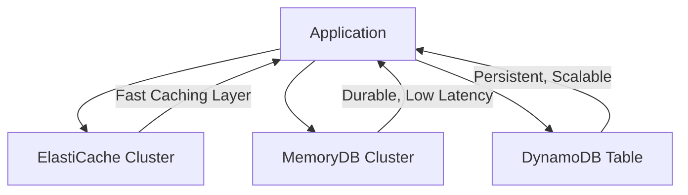
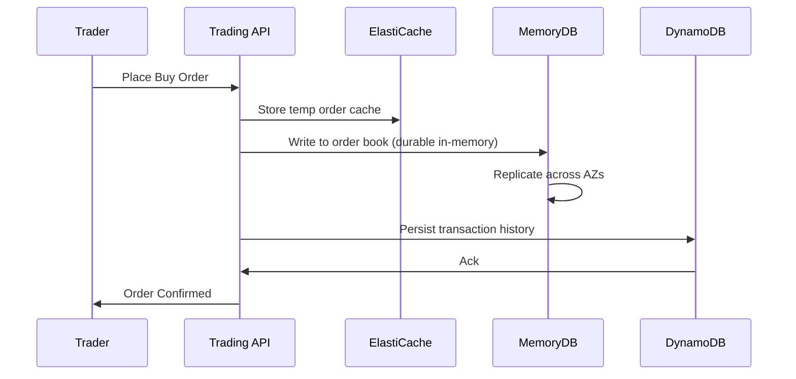

# Comparisons Of MemoryDB's

***

## ⚡ Amazon MemoryDB vs ElastiCache vs DynamoDB – Choosing the Right Real-Time Database

### 🌟 Overview

When building **modern, real-time applications**, AWS offers three main choices:

* **Amazon ElastiCache (Redis/Memcached)** → Primarily for **caching** to reduce database load.
* **Amazon MemoryDB for Redis (or Valkey)** → A **durable, Redis-compatible in-memory database** designed as a **primary DB**.
* **Amazon DynamoDB** → A **fully managed NoSQL database** optimized for **scale, availability, and cost-efficiency**.

Each service shines in different contexts:

* **ElastiCache** → Temporary, high-speed caching layer.
* **MemoryDB** → Ultra-low latency + durability for stateful apps.
* **DynamoDB** → Large-scale persistent storage with flexible querying.

🤖 **Innovation Spotlight (2025):**

* **MemoryDB with Valkey** → Future-proof, Redis-compatible open-source engine.
* **DynamoDB Vector Search** → Now supports **embeddings** for GenAI workloads.
* **ElastiCache Serverless** → Scales cache capacity **automatically** with pay-per-use pricing.

***

### ⚡ Problem Statement

A **fintech trading platform** requires:

* **Real-time trade matching (<1 ms latency)**
* **Durability of order book** (no data loss)
* **High availability across regions**
* **Cost-optimized long-term storage of trade history**

Which AWS service should be used for which component?

* Use **ElastiCache** → for temporary, ultra-fast caching of recent trades.
* Use **MemoryDB** → as the **real-time order book database** (persistent + fast).
* Use **DynamoDB** → for **long-term storage of trades** with audit compliance.

***

#### 🤝 Business Use Cases

* **ElastiCache**:
  * E-commerce session storage
  * Caching query results from RDS/Aurora
  * Leaderboards (non-critical durability)
* **MemoryDB**:
  * Gaming leaderboards that must survive restarts
  * Fintech order books
  * AI/ML feature store (durable + low latency)
* **DynamoDB**:
  * IoT telemetry storage
  * Serverless backend DB (Lambda + API Gateway)
  * Large-scale product catalog for e-commerce

***

### 🔥 Core Principles

* **ElastiCache** → In-memory cache, fast but volatile (data lost if cluster fails).
* **MemoryDB** → In-memory but durable (multi-AZ replication + AOF persistence).
* **DynamoDB** → Disk-based NoSQL store, designed for scale, not microsecond latency.

🔑 **Key Concepts**

* **ElastiCache** → Cache clusters, Redis/Memcached engines, TTL expiration
* **MemoryDB** → Shards, replicas, Valkey/Redis API, AOF logs, snapshots
* **DynamoDB** → Tables, partitions, items, indexes (LSI, GSI), streams

***

### 📋 Pre-Requirements

* 🛠️ **VPC** for ElastiCache/MemoryDB (private networking)
* 🛠️ **IAM Roles** for DynamoDB (fine-grained access)
* 🛠️ **Encryption Keys (KMS)** for all services
* 🛠️ **Monitoring** via CloudWatch + CloudTrail

***

### 👣 Implementation Steps

**ElastiCache (Cache Layer)**

1. Launch Redis cluster in private subnet
2. Connect application → Use as query cache
3. Configure TTL for eviction

**MemoryDB (Durable In-Memory DB)**

1. Create MemoryDB cluster (Valkey/Redis engine)
2. Configure replication across AZs
3. Integrate app via Redis SDK

**DynamoDB (Persistent Store)**

1. Create DynamoDB table with partition key
2. Enable on-demand or provisioned capacity
3. Add GSI for query flexibility
4. Stream changes to Lambda for event-driven workflows

***

### 🗺️ Data Flow Diagrams

#### 📊 Diagram 1 – Service Roles



***

#### 📊 Diagram 2 – Real-Time Fintech Platform



***

### 🔒 Security Measures

* **Encryption in Transit/At Rest** (KMS + TLS)
* **IAM RBAC** for DynamoDB
* **ACLs** for MemoryDB/ElastiCache
* **VPC Private Access Only**
* **Monitoring** → CloudWatch alarms + CloudTrail logs

***

### ⚖️ When to Use & When Not to Use

✅ **ElastiCache**

* Use: Temporary caches, session stores, ephemeral data
* Don’t use: As a primary DB

✅ **MemoryDB**

* Use: Durable real-time workloads, AI feature stores
* Don’t use: Long-term archival

✅ **DynamoDB**

* Use: Scalable, durable backend store, IoT, catalogs
* Don’t use: Sub-millisecond response required

***

### 💰 Costing Calculation

* **ElastiCache** → Pay per node hour + data transfer
* **MemoryDB** → Higher cost (durability overhead) + shards/replicas + storage
* **DynamoDB** → Pay per request (on-demand) or provisioned throughput

📊 **Sample Setup (Mid-size app)**

* ElastiCache: 3-node Redis cluster → \~$600/month
* MemoryDB: 2 shards (1 primary + 2 replicas) → \~$1,000/month
* DynamoDB: 100M requests/month (\~$1.25 per million) → \~$125/month

***

### 🧩 Alternatives

| Feature/Need         | AWS Service             | Azure Equivalent      | GCP Equivalent        | On-Premise Alternative    |
| -------------------- | ----------------------- | --------------------- | --------------------- | ------------------------- |
| Caching Only         | ElastiCache             | Azure Cache for Redis | Memorystore (Redis)   | Redis OSS / Memcached     |
| Durable In-Memory DB | MemoryDB (Redis/Valkey) | N/A (No equivalent)   | Memorystore (limited) | Redis Enterprise / Valkey |
| NoSQL Store          | DynamoDB                | Cosmos DB             | Firestore / Bigtable  | MongoDB / Cassandra       |

***

#### 🏠 On-Prem Alternative (Hybrid Setup)

```mermaid
flowchart TD
    A[App] --> B[Redis Cache (OSS)]
    A --> C[Valkey Cluster (Durable)]
    A --> D[MongoDB/Cassandra Persistent DB]
```

***

### ✅ Benefits

* **ElastiCache** → 🚀 Speed, 🛠️ Simple integration, 💲 Cost-effective for caching
* **MemoryDB** → ⚡ Sub-ms latency, 🔄 Durability, 🔓 Open-source Valkey support
* **DynamoDB** → 🌍 Global scale, 🔒 Fully managed, 💡 Pay-per-use

***

### 🤖 Emerging Trend – Polyglot Persistence in AWS

Modern architectures increasingly **combine all three**:

* **ElastiCache** for caching,
* **MemoryDB** for durable real-time state,
* **DynamoDB** for long-term persistence.

This hybrid model balances **speed, durability, and scale**.

***

### 📝 Summary

* **ElastiCache** → Best for **caching, fast reads, and temporary storage**
* **MemoryDB** → Best for **durable, real-time, stateful workloads**
* **DynamoDB** → Best for **scalable, durable, long-term storage**

#### Top 7 Takeaways

1. ElastiCache = cache; MemoryDB = DB; DynamoDB = scalable store
2. MemoryDB is Redis-compatible **with durability**, unlike ElastiCache
3. DynamoDB → NoSQL for long-term, cost-efficient storage
4. Combine them for **polyglot persistence**
5. Security → KMS + IAM + VPC
6. Cost varies: DynamoDB cheapest per request, MemoryDB most expensive
7. AI workloads increasingly combine **MemoryDB + DynamoDB**

👉 **In 5 lines:**\
ElastiCache is for **temporary caching**.\
MemoryDB is a **durable, Redis-compatible primary DB**.\
DynamoDB is a **massively scalable NoSQL store**.\
Each serves different real-time needs.\
For many workloads, the best approach is **using them together**.

***

### 🔗 Related Topics

* [Amazon MemoryDB](https://aws.amazon.com/memorydb/)
* [Amazon ElastiCache](https://aws.amazon.com/elasticache/)
* [Amazon DynamoDB](https://aws.amazon.com/dynamodb/)
* [Polyglot Persistence on AWS](https://aws.amazon.com/blogs/database/)

***
