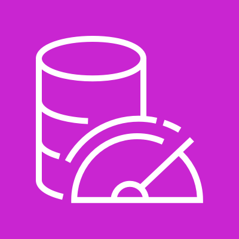
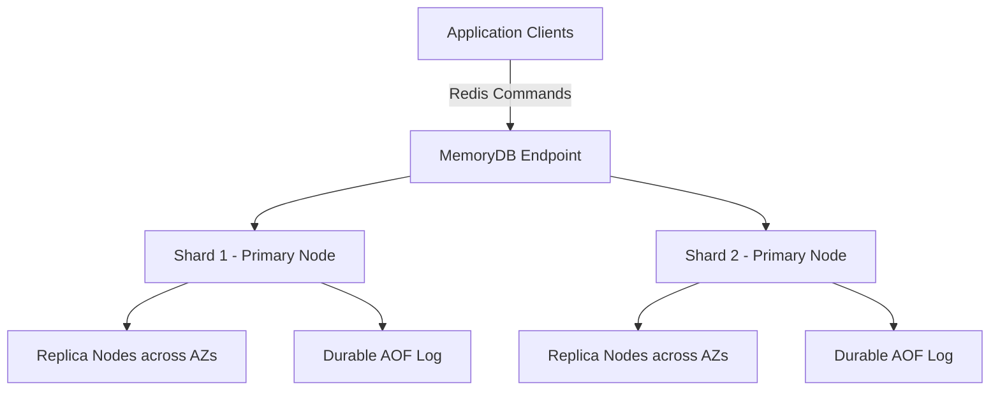
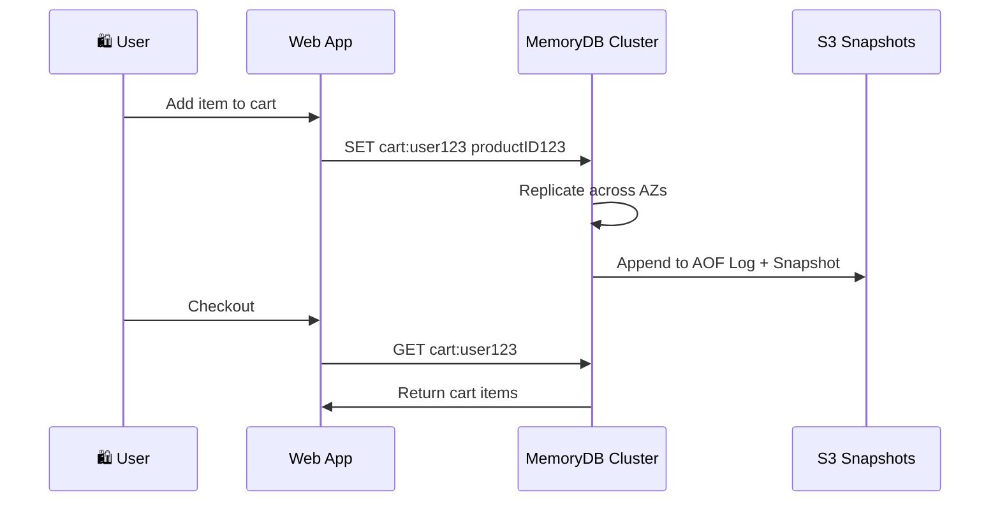
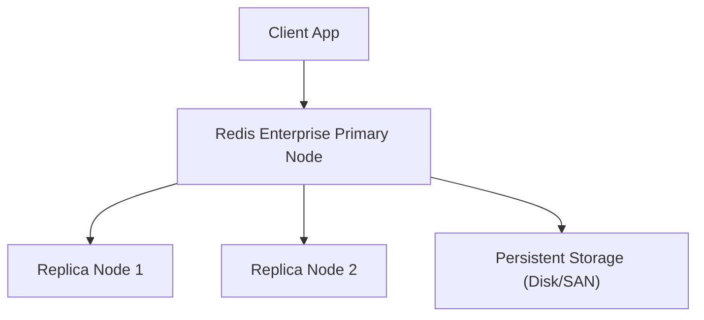

# MemoryDB - Redis

## 🧠 Amazon MemoryDB for Redis – The Next-Gen In-Memory Database

***

### 🌟 Overview

**Amazon MemoryDB for Redis** is a **fully managed, Redis-compatible, in-memory database service** built for **ultra-fast performance, durability, and high availability**. Unlike ElastiCache, which is optimized for caching, MemoryDB is designed as a **primary database** for real-time applications. It supports **multi-AZ durability** with data persistence, making it suitable for workloads requiring **both speed and reliability**.

<figure><figcaption></figcaption></figure>

🤖 **Innovation Spotlight (2025):**

* **Multi-Region Replication** (recent update) – enable globally distributed apps with cross-region data sync.
* **MemoryDB Role in AI/ML** – being used as a real-time **feature store** for **Amazon SageMaker** pipelines.
* **Amazon Bedrock & MemoryDB integration** – MemoryDB can serve as a **low-latency vector store** for generative AI apps.

***

### ⚡ Problem Statement

Modern applications (e.g., fintech, gaming, e-commerce, real-time analytics) need:

* **Microsecond response times**
* **High throughput**
* **Durable state management** (not just caching)
* **Scalable architecture** without managing Redis clusters manually

🔎 Example:\
A **stock trading platform** requires:

* Real-time order book updates (<1 ms latency)
* Fault tolerance across regions
* Persistent data for transaction history

Traditional relational DBs (RDS/SQL) cannot meet these **speed + durability** needs. MemoryDB solves this.

***

#### 🤝 Business Use Cases

* **FinTech**: Real-time fraud detection, order book systems
* **Gaming**: Leaderboards, matchmaking, in-game event processing
* **E-commerce**: Personalized recommendations, cart/session store
* **IoT**: Device state tracking and telemetry storage
* **AI/ML**: Real-time feature store for ML inference

***

### 🔥 Core Principles

Amazon MemoryDB is built on **Redis OSS** principles but extended for **enterprise-grade durability**:

* **In-Memory Storage** → Sub-millisecond latency
* **Multi-AZ Durability** → Replicates across AZs
* **Redis-Compatible API** → Drop-in replacement for existing Redis apps
* **Persistence with Journaling (AOF)** → Every write operation logged to durable storage
* **High Scalability** → Horizontally scalable with sharding

🔑 **Key Concepts & Components:**

* **Cluster**: Primary entity containing shards
* **Shards**: Partitioned dataset with primary + replicas
* **Replication Groups**: Provide high availability
* **Snapshots & Backups**: Persistent state recovery
* **ACLs & IAM**: Secure access control

***

### 📋 Pre-Requirements

Before using MemoryDB:

* 🛠️ **AWS VPC** (private subnets, security groups)
* 🛠️ **IAM Roles/Policies** (least privilege access)
* 🛠️ **Redis Client SDK** (Node.js, Python, Java, etc.)
* 🛠️ **CloudWatch** (monitor metrics & alerts)
* 🛠️ **KMS** (for encryption at rest)

***

### 👣 Implementation Steps

1. **Create a VPC** → Configure private subnets & security groups.
2. **Provision a MemoryDB Cluster** → Choose instance type, shard count, replication factor.
3. **Enable Encryption** → Use KMS for encryption at rest, TLS in transit.
4. **Set Up Access Control** → Configure IAM and Redis ACLs.
5. **Application Integration** → Use Redis SDK to connect & read/write data.
6. **Enable Backups & Snapshots** → For disaster recovery.
7. **Set Up Monitoring** → CloudWatch dashboards, alarms.
8. **Scale Horizontally** → Add shards as traffic grows.

***

### 🗺️ Data Flow Diagram

#### 📊 Diagram 1 – How MemoryDB Works

***

#### 📊 Diagram 2 – Use Case (E-commerce Cart System)

***

### 🔒 Security Measures

* **Encryption**: TLS in-transit, KMS at-rest
* **IAM + Redis ACLs**: Principle of least privilege
* **VPC Isolation**: No public access
* **Audit Logging**: Track who accessed what
* **Multi-AZ replication**: Fault tolerance
* **Rotate Secrets**: Use AWS Secrets Manager

***

### 🌍 Innovation: MemoryDB as Vector Store for AI

MemoryDB is now being explored as a **real-time vector database** for GenAI applications (chatbots, recommendation engines). Instead of relying on external vector DBs, AI workloads can directly query MemoryDB with **sub-millisecond embeddings lookup**.

***

### ⚖️ When to Use & When Not to Use

✅ **When to Use**

* Real-time, low-latency workloads
* Primary database with durability + in-memory speed
* High throughput ML inference pipelines
* Multi-AZ fault-tolerant apps

❌ **When Not to Use**

* Long-term archival (use S3/Glacier)
* Heavy relational queries/joins (use RDS/Aurora)
* Extremely large datasets beyond memory affordability

***

### 💰 Costing Calculation

**Pricing Components:**

* Compute (node hours) → depends on instance type
* Shards & Replicas → billed separately
* Data transfer → cross-AZ replication charges
* Snapshots (S3 storage)

💡 **Optimization Tips:**

* Use **right-sized nodes**
* Enable **auto-scaling**
* Schedule non-prod clusters to shut down
* Optimize replication factor

📊 **Sample Calculation:**

* 2 shards, each with 1 primary + 2 replicas
* Node type: db.r6g.large ($0.25/hr per node approx.)
* Total nodes = 6 → $0.25 × 6 × 730 hrs ≈ **$1,095/month**

***

### 🧩 Alternatives

| Feature/Need               | AWS (Alternative)    | Azure                 | GCP                     | On-Premise Equivalent |
| -------------------------- | -------------------- | --------------------- | ----------------------- | --------------------- |
| In-Memory Cache            | ElastiCache          | Azure Cache for Redis | Memorystore for Redis   | Redis OSS Cluster     |
| Durable In-Memory Database | MemoryDB             | N/A                   | Memorystore (Limited)   | Redis Enterprise      |
| SQL + Memory               | Aurora + ElastiCache | SQL MI + Cache        | Cloud SQL + Memorystore | PostgreSQL + Redis    |

#### 🏠 On-Premise Data Flow (Redis Enterprise)

***

### ✅ Benefits

* ⚡ Ultra-low latency
* 📈 Scalable with shards
* 🛡️ Multi-AZ durability
* 🔄 Fully Redis-compatible
* 🔐 Enterprise-grade security
* 🤖 AI-ready (vector store, real-time feature store)

***

### 🧭 Emerging Trend – MemoryDB + Event-Driven Architectures

MemoryDB is increasingly paired with **Amazon Kinesis** or **Amazon MSK (Kafka)** for **real-time streaming analytics**, making it the **fastest event store + durable state database** combo.

***

### 📝 Summary

Amazon MemoryDB is a **durable, Redis-compatible, in-memory database** built for **real-time, mission-critical workloads**. It combines **speed of cache + persistence of DB**, making it ideal for **fintech, gaming, e-commerce, and AI/ML applications**.

#### Top 5 Takeaways

1. Redis-compatible but **more durable** than ElastiCache
2. Best for **low-latency + persistent workloads**
3. Supports **multi-AZ & snapshots**
4. Useful in **AI, IoT, fintech, and gaming**
5. Cost optimization requires **right-sizing + replica planning**

👉 **In 5 lines:**\
Amazon MemoryDB is a fully managed, Redis-compatible, in-memory database. It offers durability across multi-AZs, unlike ElastiCache. Ideal for ultra-fast, real-time applications with high availability. Supports AI/ML feature stores, gaming, and fintech. It’s both a cache and a database replacement.

***

### 🔗 Related Topics

* [Amazon MemoryDB Official Docs](https://docs.aws.amazon.com/memorydb/)
* [Redis OSS](https://redis.io)
* [AWS ElastiCache](https://aws.amazon.com/elasticache/)
* [Amazon Kinesis](https://aws.amazon.com/kinesis/)
* [Amazon SageMaker Feature Store](https://docs.aws.amazon.com/sagemaker/latest/dg/feature-store.html)

***
