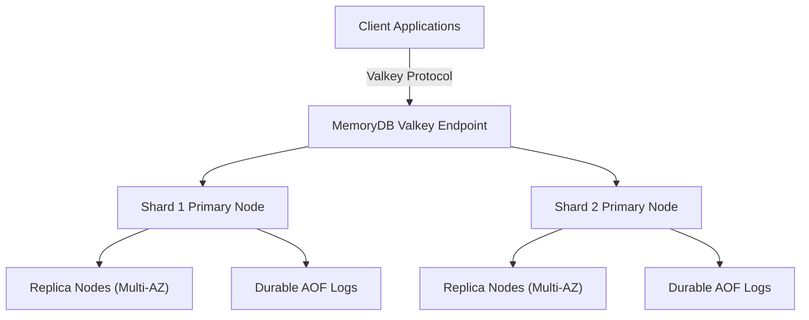
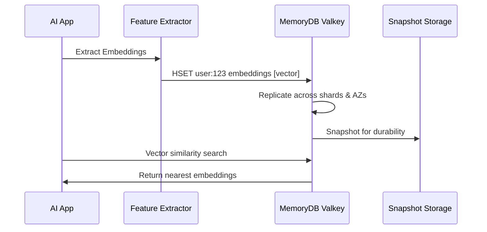
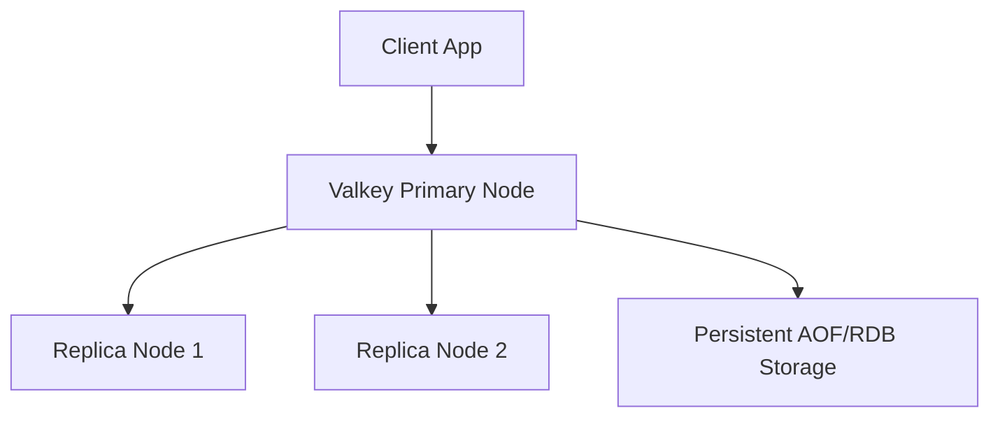

# MemoryDB - Valkey

## 🧠 Amazon MemoryDB with Valkey – Open Source Future of Redis

***

### 🌟 Overview

**Valkey** is the **open-source, community-driven fork of Redis** (born after Redis Labs changed its license). AWS is one of the founding contributors and has pledged long-term support for **Valkey as a Redis-compatible engine**.

**Amazon MemoryDB** now supports **Valkey** as a **drop-in engine option**, giving customers a future-proof path while staying fully compatible with their existing Redis workloads.

<figure><figcaption></figcaption></figure>

Why this matters:

* **No vendor lock-in** → Pure Apache 2.0 license
* **Same Redis API compatibility** → Existing applications work without code changes
* **AWS backing** → Production-ready Valkey at cloud scale
* **Performance parity** with Redis OSS, with new **community-driven innovation**

🤖 **Innovation Spotlight (2025):**

* **Valkey 8.0** released with **new indexing and vector operations** for AI workloads.
* **MemoryDB + Valkey Vector Store** → AWS positioning Valkey for **GenAI embeddings retrieval**.
* **Multi-region Valkey replication in MemoryDB** → powering **global-scale gaming leaderboards**.

***

### ⚡ Problem Statement

Redis licensing changes created uncertainty for businesses. Companies using Redis OSS for mission-critical apps needed:

* An **open-source alternative** without license restrictions
* A **cloud-native deployment model** with **durability + performance**
* A way to **avoid re-platforming** their Redis-compatible apps

**Scenario Example – Gaming Industry 🎮**\
A global multiplayer gaming platform used Redis for:

* Leaderboards
* Player matchmaking
* Session storage

With Redis licensing changes, they risked vendor lock-in. Migrating to **Amazon MemoryDB with Valkey** provided:

* Same **API compatibility**
* Multi-AZ durability
* Freedom from commercial licensing risk

***

#### 🤝 Business Use Cases

* **FinTech**: Session state + durable transactions without license risk
* **Gaming**: Low-latency matchmaking and leaderboard management
* **AI/ML**: Vector similarity search for embeddings
* **E-commerce**: Cart/session persistence at scale
* **Healthcare**: HIPAA-compliant patient state management (with durable logs)

***

### 🔥 Core Principles

MemoryDB + Valkey is built on:

* **In-Memory Architecture** → sub-millisecond responses
* **Valkey API Compatibility** → seamless migration from Redis OSS
* **Multi-AZ Durability** → Replicated across 3+ AZs
* **Durable Append-Only File (AOF) Logs** → Every operation persisted
* **Snapshotting** → Point-in-time recovery
* **Scalability** → Sharding for high throughput
* **Community-Driven** → Valkey backed by AWS, Google, Oracle, etc.

🔑 **Core Components in Valkey**

* **Data Structures**: Strings, Hashes, Lists, Sets, Sorted Sets, Streams
* **Modules Support**: Custom extensions (e.g., vector search, bloom filters)
* **Cluster Mode**: Sharded + replicated
* **Persistence**: RDB snapshots + AOF logs

***

### 📋 Pre-Requirements

* 🛠️ **AWS Account & VPC**
* 🛠️ **IAM Roles** (for access to cluster + KMS keys)
* 🛠️ **Valkey Client SDKs** (same as Redis SDKs – Node.js, Python, Go, Java)
* 🛠️ **CloudWatch & CloudTrail** (monitoring + auditing)
* 🛠️ **Secrets Manager** (manage connection passwords securely)

***

### 👣 Implementation Steps

1. **Create VPC & Subnets** → Deploy in private subnets
2. **Launch MemoryDB Cluster** → Choose “Valkey engine”
3. **Select Node Size & Shards** → Right-size for workload
4. **Enable Security** → TLS, KMS encryption
5. **Configure Access Control** → IAM policies + Redis ACLs
6. **Connect via Valkey SDK** → Drop-in replacement for Redis client
7. **Enable Backups & Snapshots** → Configure daily snapshots to S3
8. **Integrate with App** → Replace Redis endpoint with MemoryDB Valkey endpoint
9. **Scale Horizontally** → Add shards as workload grows

***

### 🗺️ Data Flow Diagram

#### 📊 Diagram 1 – How MemoryDB with Valkey Works

***

#### 📊 Diagram 2 – AI Vector Store with MemoryDB + Valkey

***

### 🔒 Security Measures

* **IAM Integration** → Access policies for users/services
* **Encryption** → TLS in-transit, KMS at-rest
* **ACLs** → Redis-style access control
* **Secrets Manager** → Store credentials securely
* **VPC Isolation** → Private subnets only
* **CloudTrail Auditing** → Track access logs

***

### 🌍 Innovation – Valkey Modules for AI

The Valkey community is actively building **vector search, JSON support, and probabilistic data structures**. With AWS backing, MemoryDB + Valkey is positioned as a **next-gen vector store for GenAI applications**.

***

### ⚖️ When to Use & When Not to Use

✅ **When to Use**

* Need Redis-compatible engine without licensing issues
* Require **durability + speed** (cache + DB in one)
* AI/ML vector store with real-time retrieval
* Global-scale apps needing multi-AZ replication

❌ **When Not to Use**

* Archival storage (use S3/Glacier)
* Heavy SQL queries & joins (use Aurora/RDS)
* Very large datasets that can’t fit in memory (use DynamoDB/S3)

***

### 💰 Costing Calculation

**Pricing = Node hours + Shards/Replicas + Snapshots + Data transfer**

💡 **Optimization Tips**

* Start with smaller instance types (e.g., db.r6g.large)
* Use snapshots for durability instead of too many replicas
* Shut down non-production clusters during off-hours

📊 **Sample Calculation**

* Cluster: 3 shards × (1 primary + 2 replicas)
* Instance: db.r6g.large ($0.25/hr)
* Nodes = 9 × $0.25 × 730 hrs ≈ **$1,642/month**

***

### 🧩 Alternatives

| Need/Feature        | AWS Alternative         | Azure Equivalent       | GCP Equivalent       | On-Premise Alternative    |
| ------------------- | ----------------------- | ---------------------- | -------------------- | ------------------------- |
| In-Memory DB        | MemoryDB (Redis/Valkey) | Azure Cache (Redis)    | Memorystore (Redis)  | Redis Enterprise / Valkey |
| Cache Only          | ElastiCache             | Azure Cache (Redis)    | Memorystore          | Redis OSS                 |
| Durable NoSQL       | DynamoDB                | Cosmos DB              | Firestore            | MongoDB                   |
| Vector Store for AI | MemoryDB (Valkey)       | Azure Cognitive Search | Vertex AI + Bigtable | Milvus / Weaviate         |

***

#### 🏠 On-Premise Valkey Flow

***

### ✅ Benefits

* 🚀 Sub-millisecond latency
* 🔓 Fully open-source (no license lock-in)
* 🔄 Redis API compatibility → zero migration pain
* 🛡️ Multi-AZ durable & fault tolerant
* 🤖 AI-ready with **vector search support**
* 🌍 Backed by AWS, Google, Oracle – strong community momentum

***

### 📡 Emerging Trend – “Valkey-first Architectures”

Cloud-native companies are beginning to **build new workloads directly on Valkey**, skipping Redis, to ensure **long-term open-source freedom**. AWS’s **MemoryDB with Valkey** is leading this movement in managed services.

***

### 📝 Summary

Amazon MemoryDB with Valkey delivers a **Redis-compatible, durable, in-memory database** built on **open-source freedom**. It combines the **performance of Redis** with the **durability of a primary DB** and avoids the Redis licensing trap. It’s a **future-proof choice** for AI, gaming, fintech, and real-time analytics.

#### Top 7 Takeaways

1. Valkey is the **open-source fork of Redis** backed by AWS & others
2. MemoryDB supports **Valkey as engine** – drop-in compatible
3. Ideal for **real-time + durable workloads**
4. Eliminates **Redis license risk**
5. Ready for **AI vector search & embeddings**
6. Secure with **multi-AZ + encryption**
7. Costs can be optimized via right-sizing

👉 **In 5 lines:**\
Amazon MemoryDB with Valkey is a **Redis-compatible, open-source, in-memory database**. It offers **durability + multi-AZ resilience**. Ideal for real-time workloads like **gaming, fintech, and AI**. Eliminates vendor lock-in risks. Future-ready for **vector search + ML workloads**.

***

### 🔗 Related Topics

* [Amazon MemoryDB with Valkey – AWS Blog](https://aws.amazon.com/blogs/opensource/introducing-valkey/)
* [Valkey Official Project](https://valkey.io/)
* [ElastiCache vs MemoryDB](https://aws.amazon.com/memorydb/faqs/)
* [Redis OSS vs Valkey](https://redis.io/docs/interact/clients/)

***
