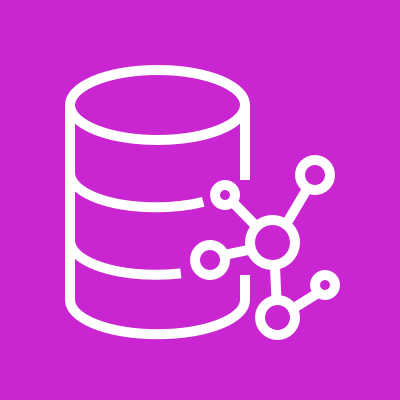
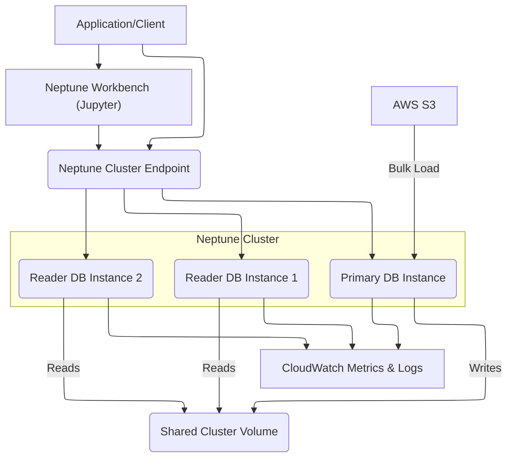
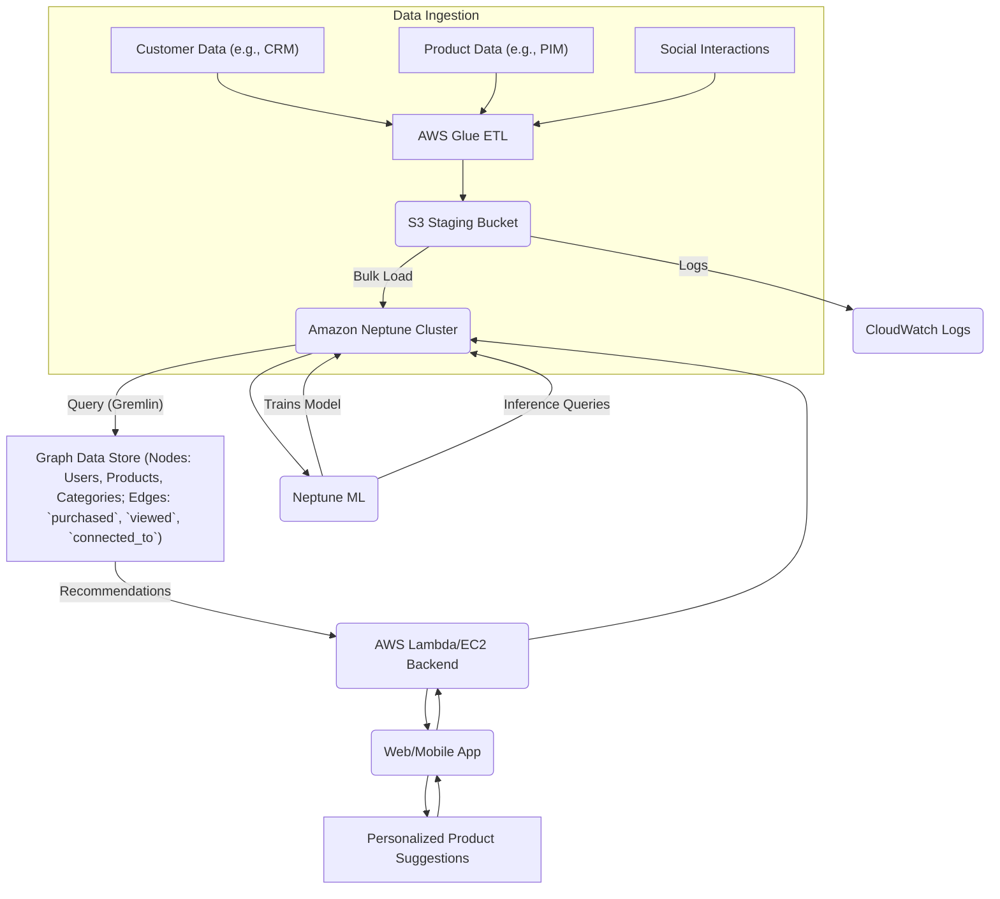
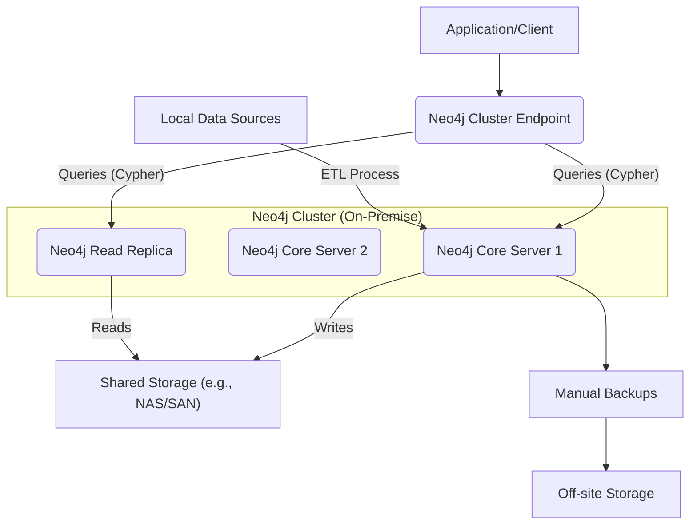

# Neptune

## Amazon Neptune

### 🌟 Overview: Amazon Neptune 🌐

Amazon Neptune is a fully managed, high-performance graph database service provided by AWS. Unlike traditional relational databases that are optimized for structured data in tables, Neptune is purpose-built for storing and querying highly connected datasets. It excels at modeling and navigating relationships between entities, making it an ideal choice for use cases where connections are as important as the data itself.

<figure><figcaption></figcaption></figure>

The core of Neptune lies in its support for two widely used graph data models:

* Property Graphs: This model represents data as a network of nodes (vertices) and edges (relationships), each of which can have properties (key-value pairs). It is ideal for social networks, recommendation engines, and fraud detection. The query languages for this model are Gremlin and openCypher.
* Resource Description Framework (RDF): An open standard for data interchange, this model uses a triple format (subject, predicate, object) to describe relationships. It is widely used for knowledge graphs and semantic data applications. The standard query language is SPARQL.

Neptune's architecture is highly scalable and durable. It separates compute from storage, allowing you to scale each independently. The underlying storage is fault-tolerant, self-healing, and replicated across multiple Availability Zones (AZs), offering high availability and durability.

#### Innovation Spotlight 🤖

The latest innovation in Amazon Neptune is Neptune Analytics, which is optimized for running fast graph analytics on large datasets.<sup>11</sup> While the core Neptune database is designed for online transaction processing (OLTP) and low-latency queries, Neptune Analytics is an in-memory graph database designed for analytical workloads like complex graph traversals and running graph algorithms (e.g., PageRank, community detection). This separation of concerns allows you to choose the right tool for the right job: Neptune for transactional, real-time lookups and Neptune Analytics for deep, batch-oriented analysis. This new service, often used with openCypher, makes it easier than ever to get deep insights from your connected data without impacting your transactional database performance.

***

### ⚡ Problem Statement

A major e-commerce company, "GlobalMart," wants to enhance its customer experience by providing highly personalized product recommendations. Their current system uses a traditional relational database, which struggles to efficiently query the complex, interconnected data of customer profiles, purchase history, product categories, and social interactions. For example, a query to find products "purchased by people who bought a similar item, and are connected to the customer through a friend on social media" becomes a series of complex, slow, and resource-intensive `JOIN` operations. This limits their ability to offer real-time, relevant suggestions, leading to a suboptimal user experience and lost sales opportunities.

#### 2.1 🤝 Business Use Cases

* Retail/E-commerce:
  * Recommendation Engines: Suggest products to users based on their browsing history, past purchases, and the behavior of similar customers.
  * Fraud Detection: Identify suspicious patterns in financial transactions, such as multiple accounts sharing the same email or IP address.
* Social Networking:
  * Friend Recommendations: Suggest new connections by analyzing shared friends, interests, and group memberships.
  * Personalized Feeds: Prioritize content in a user's feed based on their interactions with certain people or topics.
* Knowledge Management:
  * Knowledge Graphs: Build a comprehensive graph of an organization's internal data, enabling semantic search and AI-driven insights. For example, a pharmaceutical company could map disease-gene-drug interactions to accelerate drug discovery.
* IT and Network Management:
  * Network Monitoring: Analyze relationships between IT resources (servers, applications, users) to quickly trace the root cause of an outage or security incident.
* Financial Services:
  * Anti-Money Laundering (AML): Trace complex transaction networks and identify suspicious money flows.

***

### 🔥 Core Principles

* Graph Data Model: Neptune's foundational principle is the use of graph data structures (nodes and edges) to represent and store connected data. This native graph model makes querying relationships orders of magnitude faster and more intuitive than with relational databases.
* Scalability and Performance: Neptune is a high-performance graph database optimized for low-latency queries over large datasets. It uses a distributed, shared storage architecture that can automatically scale up to 128 TiB. It also supports up to 15 read replicas for high-throughput read operations.
* Serverless and Fully Managed: AWS handles all the heavy lifting, including hardware provisioning, software patching, backups, and monitoring. With Neptune Serverless, the database capacity automatically scales up and down based on your application's needs, optimizing costs.
* High Availability and Durability: Data is replicated six times across three Availability Zones. This fault-tolerant, self-healing storage protects against data loss and ensures high availability.
* Open APIs: Neptune supports open-source and open-standard query languages, including Gremlin, openCypher, and SPARQL. This prevents vendor lock-in and allows developers to use familiar tools.

#### Neptune Resources & Terms Explained:

* DB Cluster: The primary component of your Neptune deployment. It's the logical grouping of your database instances and a shared cluster volume.
* DB Instance: A compute instance within the cluster. You can have a primary instance for writes and up to 15 read replicas for reads.
* Cluster Volume: The shared, self-healing storage volume for the entire cluster. It automatically grows as you add more data.
* Endpoints:
  * Cluster Endpoint: A single endpoint for the entire cluster. It's used for read/write operations and automatically routes connections to the primary instance.
  * Reader Endpoint: A dedicated endpoint for all read replicas. Your applications can use this for read-intensive workloads.
  * Instance Endpoint: A specific endpoint for a single DB instance (primary or replica).
* Neptune Workbench: A fully managed, web-based Jupyter notebook environment for interacting with your Neptune database. It's a great place to run queries and visualize graph data.
* Neptune ML: A feature that allows you to train and use machine learning models on your graph data directly within Neptune, for tasks like link prediction and node classification.

***

### 📋 Pre-Requirements

* An AWS Account: With sufficient IAM permissions to create Neptune clusters, VPCs, and related services.
* Amazon VPC (Virtual Private Cloud): Neptune instances must be launched within a VPC for network isolation and security. You'll need at least two subnets in different Availability Zones.
* IAM Roles and Policies: To control access to the Neptune database and to other AWS services like S3 for data loading.
* Amazon S3 Bucket: A staging area to store data files (in CSV or RDF formats) for bulk loading into Neptune.
* AWS CLI or AWS Management Console: For provisioning and managing the services.

***

### 👣 Implementation Steps

1. Set up the VPC:
   * Create a new VPC with at least two subnets in different Availability Zones.
   * Create a VPC security group to act as a firewall for your Neptune cluster, allowing inbound traffic on the correct port (typically 8182).
2. Create an Amazon S3 Bucket:
   * Create an S3 bucket in the same region as your VPC to store the data you want to import.
   * Upload your graph data files (e.g., `nodes.csv`, `edges.csv`) into the S3 bucket.
3. Create an IAM Role for Neptune:
   * Create an IAM role with a trust relationship that allows the Neptune service (`neptune.amazonaws.com`) to assume the role.
   * Attach a policy to this role that grants `s3:GetObject` and `s3:ListBucket` permissions to your S3 bucket. This allows Neptune to read data from the bucket during the bulk import process.
4. Launch a Neptune DB Cluster:
   * Navigate to the Amazon Neptune service in the AWS Management Console.
   * Choose "Create database."
   * Select the engine type (e.g., Gremlin, SPARQL).
   * Choose the deployment option (e.g., Serverless or Provisioned).
   * Configure the VPC and select the subnets you created.
   * Associate the VPC security group and the IAM role for S3 access.
   * Set a database cluster identifier and an instance name.
   * Review and create the cluster.
5. Bulk Load Data from S3:
   * Once the cluster is "Available," get the cluster endpoint.
   * Use the `curl` command or a script to initiate a bulk load job. The `load` API endpoint will read the data from your S3 bucket and ingest it into the Neptune graph.
   *   Example `curl` command for a Gremlin/Property Graph:

       Bash

       ```
       curl -X POST \
       -H 'Content-Type: application/json' \
       https://<your-neptune-cluster-endpoint>:8182/loader \
       -d '{
       "source": "s3://<your-s3-bucket>/data/",
       "format": "csv",
       "iamRoleArn": "arn:aws:iam::<your-account-id>:role/<your-neptune-role>",
       "failOnError": true,
       "region": "us-east-1"
       }'
       ```
6. Query the Graph:
   * Connect to the Neptune cluster using the Neptune Workbench, the Gremlin Console, or a client application.
   * Execute your Gremlin, openCypher, or SPARQL queries to explore and analyze your graph data.<sup>52</sup>

***

### 🗺️ Data Flow Diagram

Diagram 1: How Amazon Neptune Works

Code snippet



Diagram 2: GlobalMart's Product Recommendation Engine

Code snippet



***

### 🔒 Security Measures

* VPC Isolation: Always deploy Neptune inside a VPC to ensure it is not publicly accessible. Use security groups to control inbound and outbound traffic to the cluster.
* IAM Authentication: Enable IAM database authentication to enforce fine-grained access control. This allows you to use IAM policies to grant specific users or services permissions to perform read/write operations on the graph.
* Encryption:
  * Encryption at Rest: Enable Amazon Neptune encryption at rest, which uses AWS Key Management Service (KMS) to encrypt your data in the cluster volume.
  * Encryption in Transit: Use Transport Layer Security (TLS) to encrypt all connections to the Neptune endpoint.
* Principle of Least Privilege: Grant only the necessary permissions.<sup>57</sup> For example, a Lambda function for a recommendation engine should only have read access to the graph, not write access.
* Audit Logging: Use AWS CloudTrail to log all API calls to Neptune for auditing and compliance purposes.<sup>58</sup> Enable Neptune audit logs to capture and analyze query-level activity.<sup>59</sup>

***

### ⚖️ When to use and when not to use

* ✅ When to use:
  * Your data has complex, interconnected relationships that are difficult to model and query with a relational database (e.g., many-to-many relationships).
  * You need to analyze the "connections" between data points (e.g., finding the shortest path, identifying influential nodes, or detecting communities).
  * Your queries are focused on traversals rather than simple lookups (e.g., "show me all products viewed by people who are friends with my friends").
  * You need a managed, scalable, and highly available solution without the operational overhead of managing a graph database yourself.
* ❌ When not to use:
  * Your data is simple, structured, and fits well into tables with clear schemas (e.g., customer details, product catalog with no complex relationships). A relational database (like Amazon RDS) or a document database (like DynamoDB) would be more cost-effective and appropriate.
  * You have high-volume, simple key-value lookups (e.g., retrieving a user profile by ID). A service like DynamoDB would be a better choice.
  * Your primary need is for analytical reporting and business intelligence on aggregated data. An analytics-optimized data warehouse like Amazon Redshift would be more suitable.
  * You require a non-standard graph query language or a specific graph engine not supported by Neptune (e.g., Neo4j's Cypher if you don't want to use openCypher).

***

### 💰 Costing Calculation

*   How it is calculated?

    Amazon Neptune's pricing is based on a few key components:

    * DB Instance Hours: You are charged for the provisioned capacity of each DB instance per hour. The cost depends on the instance type (e.g., `db.r5.large`).
    * Neptune Capacity Units (NCUs): For Neptune Serverless, you are charged per NCU hour, which is a unit of processing and memory consumption. This allows you to pay only for the capacity you use, with automatic scaling.
    * Storage: You pay for the storage consumed by your cluster volume per GB-month.
    * I/O Operations: For the Neptune Standard configuration, you are charged per million I/O requests. For I/O-intensive workloads, the Neptune I/O-Optimized configuration offers a different pricing model where I/O charges are included in the instance and storage costs.
    * Backup Storage: You get a certain amount of backup storage for free (equal to the size of your database), and then you pay for any additional storage used.
    * Data Transfer: Standard AWS data transfer costs apply for data moving out of the Neptune cluster.<sup>67</sup>
* Efficient way of handling this service:
  * Use Neptune Serverless: For unpredictable or spiky workloads, Serverless is the most cost-efficient option as it automatically scales capacity and you only pay for what you use.
  * Choose the Right Instance Size: For predictable workloads, choose an instance type that balances performance and cost. Start small and scale up if needed.
  * Utilize Read Replicas: Instead of using a single large instance for all queries, use multiple read replicas to distribute the read load. This can be more cost-effective.
  * Optimize Queries: Inefficient queries can consume a lot of I/O and CPU, driving up costs. Use `EXPLAIN` and `PROFILE` to analyze and optimize your queries.
  * Leverage I/O-Optimized Configuration: If your workload is I/O-intensive (I/O costs exceed 25% of your total spend), consider the I/O-Optimized option to potentially save money.
* Sample Calculations (Example based on `us-east-1` region, prices are for illustration and subject to change):
  * Scenario 1: Small, On-Demand Application
    * DB Instance: `db.r5.large` (2 vCPU, 16 GiB RAM)
    * Hourly Rate: \~$0.348/hour
    * Monthly Cost (730 hours): $0.348 \* 730 = \~$254
    * Storage: 50 GB \* $0.10/GB-month = $5
    * I/O: 100 million requests \* $0.20/million = $20
    * Total Monthly Cost: $254 + $5 + $20 = $279
  * Scenario 2: Spiky, Serverless Workload
    * Serverless Capacity: 10 NCU-hours/day on average
    * NCU-hour Rate: \~$0.1608
    * Monthly Cost: 10 NCU-hours/day \* 30 days \* $0.1608/NCU-hour = \~$48.24
    * Storage: 50 GB \* $0.10/GB-month = $5
    * Total Monthly Cost: $48.24 + $5 = $53.24 (plus any I/O costs)
    * _Note: Serverless pricing can fluctuate significantly based on actual usage._

***

### 🧩 Alternative services in AWS/Azure/GCP/On-Premise

| Provider   | Service                            | Key Comparison/Difference                                                                                                                                                                                                 |
| ---------- | ---------------------------------- | ------------------------------------------------------------------------------------------------------------------------------------------------------------------------------------------------------------------------- |
| AWS        | Amazon Neptune                     | A fully managed graph database service supporting Gremlin/openCypher and SPARQL. Integrated with the AWS ecosystem.                                                                                                       |
| Azure      | Azure Cosmos DB for Apache Gremlin | A multi-model, globally distributed database service. It offers a graph API compatible with Apache Gremlin, but it's part of a larger, multi-purpose database, not a dedicated graph database engine.                     |
| GCP        | Neo4j AuraDB on GCP Marketplace    | Google does not have a native, fully-managed graph database service. Instead, it partners with Neo4j, a popular open-source graph database provider, to offer its fully managed solution (AuraDB) on the GCP Marketplace. |
| On-Premise | Neo4j Community/Enterprise Edition | A popular open-source graph database. Provides full control over the infrastructure, but requires significant operational overhead for management, scaling, and high availability.                                        |
| On-Premise | JanusGraph                         | An open-source, distributed graph database. Requires a separate storage backend (like Cassandra or HBase) and is highly scalable but complex to set up and manage.                                                        |


### &#x20;:department\_store: On-Premise Alternative Data Flow (Neo4j)

Code snippet



***

### ✅ Benefits

* Managed & Serverless: Drastically reduces operational burden, allowing developers to focus on application logic, not database management.
* Scalability & Performance: High-throughput, low-latency graph queries with the ability to scale compute and storage independently.
* High Availability & Durability: Built-in fault tolerance with data replication across multiple AZs ensures business continuity.
* Cost-Efficiency: Pay-as-you-go pricing models (especially with Serverless) optimize costs for variable workloads.
* Developer-Friendly: Supports popular open-source graph query languages (Gremlin, openCypher, SPARQL), leveraging existing skills and tooling.
* Deep Integrations: Seamlessly integrates with other AWS services like S3, Lambda, and SageMaker to build comprehensive, data-driven applications.

***

### 📝 Summary

Amazon Neptune is a robust, fully managed graph database service that simplifies building applications that rely on highly connected data. By focusing on relationships as a first-class citizen, it enables powerful and efficient queries for use cases like social networks, recommendation engines, and fraud detection. Its serverless and scalable architecture, combined with high availability and security features, makes it a top choice for organizations looking to unlock deeper insights from their data without the operational overhead of a self-managed solution.

What to keep in mind about Amazon Neptune:

1. It's for Connected Data: Use it when the relationships between data points are a critical part of your application's value.
2. Pick Your Model: Understand the difference between Property Graphs (Gremlin/openCypher) and RDF (SPARQL) to choose the right model for your use case.
3. Managed Service: AWS handles all the difficult parts of database management, but you still need to optimize your queries.
4. Security is Key: Use VPC isolation, IAM authentication, and encryption to secure your data.
5. Cost Flexibility: Choose between provisioned instances for predictable loads and Serverless for spiky, cost-optimized workloads.
6. Neptune Analytics: Consider using this for complex, offline analytical workloads to complement your transactional Neptune database.

### In short, what is the service all about?

> Amazon Neptune is a fast, reliable, and fully managed graph database service. It is designed to store and query highly connected data, enabling applications like social networking, recommendation engines, and fraud detection.87 It supports open-standard graph models and query languages, and its managed nature simplifies operations while providing high availability and durability.

***

🔗 Related Topics

* [Amazon Neptune User Guide](https://www.google.com/search?q=https://docs.aws.amazon.com/neptune/latest/userguide/what-is-neptune.html)
* [AWS Blog: Getting Started with Neptune](https://www.google.com/search?q=https://aws.amazon.com/blogs/database/getting-started-with-amazon-neptune/)
* [Apache TinkerPop Gremlin Documentation](https://tinkerpop.apache.org/gremlin.html)
* [openCypher Project Page](https://opencypher.org/)
* [W3C SPARQL Documentation](https://www.w3.org/TR/rdf-sparql-query/)
* [AWS Neptune Pricing Page](https://aws.amazon.com/neptune/pricing/)
