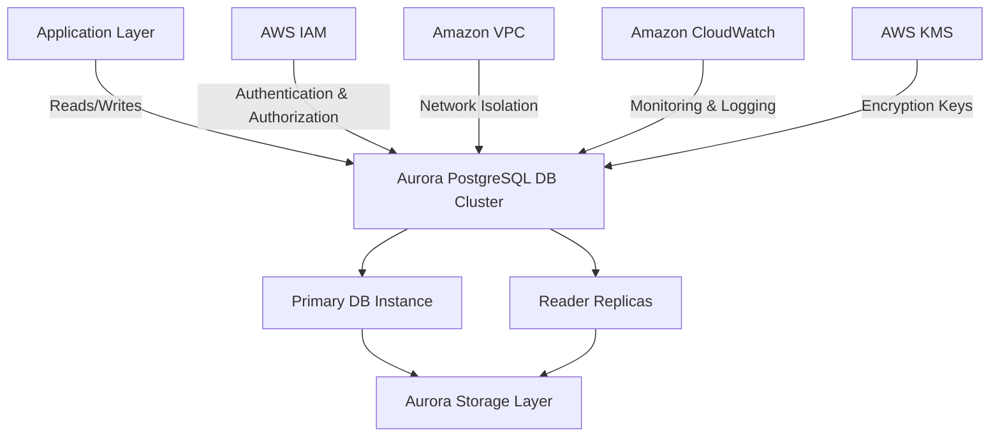
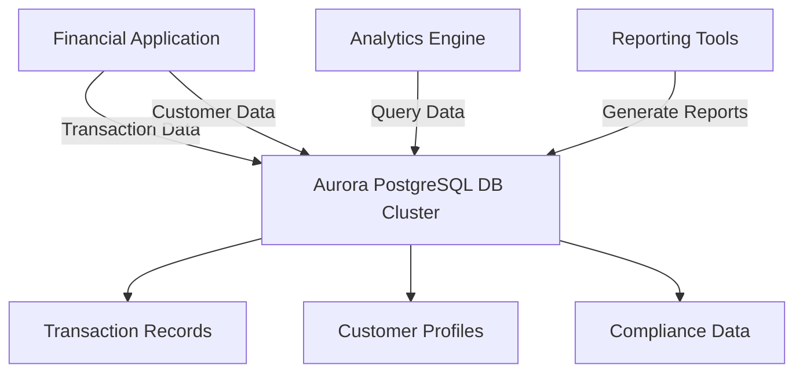
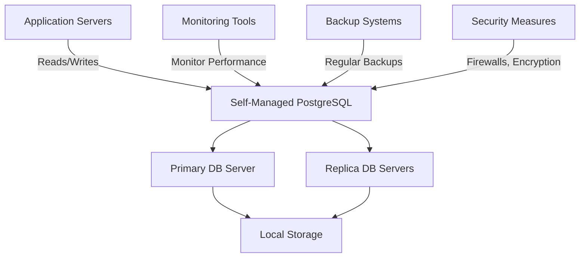

# Aurora PostgreSQL

## Amazon Aurora PostgreSQL: A Comprehensive Overview

### 1. 🌟 Overview

Amazon Aurora PostgreSQL is a PostgreSQL-compatible relational database engine that combines the performance and availability of high-end commercial databases with the simplicity and cost-effectiveness of open-source databases. Aurora PostgreSQL is a fully managed service that delivers up to 3x the throughput of standard PostgreSQL, enhanced scalability, and durability.

#### 🤖 Innovation Spotlight

Amazon Aurora PostgreSQL has recently introduced enhancements such as **Aurora Serverless v2**, allowing for automatic scaling of database capacity up and down based on application demands. Additionally, it now supports **machine learning integrations** for advanced analytics directly within the database environment.

### 2. ⚡ Problem Statement

**Real-World Scenario:** A financial services platform requires a highly available, scalable, and performant database solution capable of handling complex transactions and real-time analytics with high integrity and compliance requirements.

**Industries/Applications:**

* **Financial Services:** Managing transactions, customer data, and compliance.
* **Healthcare:** Storing patient records and facilitating complex data analysis.
* **Logistics:** Handling supply chain data and route optimization.

### 2.1 🤝 Business Use Cases

Amazon Aurora PostgreSQL is particularly beneficial for:

* **Complex Transaction Processing:** Ensuring high integrity and reliability of financial transactions.
* **Real-Time Analytics:** Enabling sophisticated data analysis and reporting.
* **High Availability Applications:** Providing continuous data availability and fault tolerance.

### 3. 🔥 Core Principles

Amazon Aurora PostgreSQL is built on several core principles that enhance its functionality and performance:

* **Architectural Design:** Separates storage and compute, enabling rapid scaling and fault tolerance.
* **Compatibility:** Fully compatible with PostgreSQL 9.6, 10, 11, 12, and 13, facilitating easy migration and integration.
* **Scalability and Performance:** Offers seamless scaling and up to 3x the performance of standard PostgreSQL.
* **High Availability:** Designed for 99.99% availability with data replication across multiple Availability Zones (AZs).

Key Resource Terms:

* **DB Instances:** The smallest unit of deployment, acting as virtual database servers.
* **DB Clusters:** A collection of DB instances managed as a single unit.
* **Endpoints:** Used to connect to your Aurora database, with separate endpoints for read and write operations.
* **Read Replicas:** Improve read scalability by replicating data from the primary DB instance.

### 4. 📋 Pre-Requirements

To implement Amazon Aurora PostgreSQL, you need the following AWS services and tools:

* **AWS Identity and Access Management (IAM):** For secure access management to AWS services.
* **Amazon Virtual Private Cloud (VPC):** To isolate your Aurora cluster within a private network.
* **AWS CloudFormation:** For defining and provisioning your infrastructure as code.
* **AWS Secrets Manager:** For securely managing database credentials.
* **Amazon CloudWatch:** For monitoring and logging database activities.

### 5. 👣 Implementation Steps

1. **Create an Aurora PostgreSQL DB Cluster:**
   * Log in to the AWS Management Console.
   * Navigate to Amazon RDS and select "Create database."
   * Choose Amazon Aurora with PostgreSQL compatibility.
   * Configure your DB cluster by specifying the DB engine version, instance class, and multi-AZ deployment options.
2. **Configure Network & Security:**
   * Set up a VPC to host your Aurora cluster.
   * Configure security groups to control traffic to and from the cluster.
   * Set up IAM roles and policies to manage access securely.
3. **Set Up Database Instances:**
   * Define the number of DB instances and their specifications.
   * Configure storage settings, including allocated storage and auto-scaling policies.
4. **Configure Database Settings:**
   * Define initial database configurations, such as parameters for memory and performance tuning.
   * Set up databases, tables, and users according to your application requirements.
5. **Connect to the Database:**
   * Use standard PostgreSQL drivers and connectors to connect to your Aurora PostgreSQL cluster.
   * Implement connection pooling in your application for efficient database connections.
6. **Monitor and Maintain:**
   * Use Amazon CloudWatch to set up monitoring for performance metrics, logs, and events.
   * Schedule regular backups and maintenance windows to ensure data integrity and availability.

### 6. 🗺️ Data Flow Diagram

Here is a Mermaid diagram illustrating the architecture of Amazon Aurora PostgreSQL:

The second Mermaid diagram below illustrates a specific use case of a financial services platform using Amazon Aurora PostgreSQL:

### 7. 🔒 Security Measures

To secure your Amazon Aurora PostgreSQL cluster, follow these best practices:

* **Encryption:** Enable encryption at rest and in transit, using AWS KMS to manage encryption keys.
* **IAM Roles and Policies:** Apply the principle of least privilege to manage access to your cluster.
* **VPC and Security Groups:** Isolate your cluster within a VPC and configure security groups to restrict traffic.
* **Backup and Recovery:** Implement regular backups and test recovery procedures to ensure data resilience.
* **Monitoring and Logging:** Use Amazon CloudWatch to monitor performance and set up alerts for suspicious activities.

### 8. 🏢 Integration with Other AWS Services

Amazon Aurora PostgreSQL integrates seamlessly with various AWS services to enhance its functionality:

* **AWS Lambda:** For serverless execution of code in response to database events.
* **Amazon S3:** For data backup and archival.
* **AWS Glue:** For ETL processes and data integration.
* **Amazon QuickSight:** For business intelligence and data visualization.
* **AWS Secrets Manager:** For managing database credentials securely.

These integrations allow for building comprehensive solutions leveraging Aurora PostgreSQL as the core database.

### 9. ⚖️ When to Use and When Not to Use

#### ✅ When to Use

Amazon Aurora PostgreSQL is ideal for:

* Applications requiring high availability and fault tolerance.
* Complex query and transaction processing with PostgreSQL compatibility.
* Scalable solutions for handling large volumes of data with demanding query requirements.

#### ❌ When Not to Use

Amazon Aurora PostgreSQL might not be suitable for:

* Applications requiring NoSQL capabilities or document data models.
* Use cases needing extensive custom database configurations that are not supported by PostgreSQL.
* Scenarios with tight budget constraints where manual management of standard PostgreSQL might be more cost-effective.

### 10. 💰 Costing Calculation

Amazon Aurora PostgreSQL pricing is based on several factors:

* **Instance Hours:** Costs depend on the number and size of DB instances in the cluster.
* **Storage:** Charges are based on the amount of data stored and I/O operations performed.
* **Data Transfer:** Costs for data transferred in and out of the cluster.

**Example Cost Calculation:**

Suppose you have a cluster with 2 DB instances of type `db.r5.large` (priced at $0.35 per hour per instance) and 100 GB of storage (priced at $0.10 per GB per month).

* **DB Instance Cost:** 2 instances \* $0.35/hour \* 730 hours/month = $511/month
* **Storage Cost:** 100 GB \* $0.10/GB/month = $10/month
* **Total Estimated Monthly Cost:** $521/month

_Note: Prices may vary by region and are subject to change. Always refer to the latest AWS pricing for accurate calculations._

### 11. 🧩 Alternative Services

Here’s a comparison table of Amazon Aurora PostgreSQL with alternative services:

| Feature/Service       | Amazon Aurora PostgreSQL | Amazon RDS for PostgreSQL | Azure Database for PostgreSQL | Google Cloud SQL for PostgreSQL | Self-Managed PostgreSQL |
| --------------------- | ------------------------ | ------------------------- | ----------------------------- | ------------------------------- | ----------------------- |
| **Managed Service**   | Yes                      | Yes                       | Yes                           | Yes                             | No                      |
| **High Availability** | Yes                      | Yes                       | Yes                           | Yes                             | Manual Setup            |
| **Scalability**       | Automatic                | Manual                    | Semi-Automatic                | Automatic                       | Manual                  |
| **Pricing Model**     | Pay-as-you-go            | Pay-as-you-go             | Pay-as-you-go                 | Pay-as-you-go                   | Capital Expenditure     |
| **Integration**       | AWS Services             | AWS Services              | Azure Services                | GCP Services                    | Custom                  |

Mermaid Diagram for an on-premise alternative (e.g., self-managed PostgreSQL):

### 12. ✅ Benefits

Amazon Aurora PostgreSQL offers several advantages:

* **High Availability:** Built-in fault tolerance with automatic failover.
* **Scalability:** Automatically scales with your application's needs without downtime.
* **Performance Optimization:** Enhanced performance compared to standard PostgreSQL databases.
* **Ease of Use:** Fully managed service reducing operational overhead.
* **Security and Compliance:** Built-in security features and compliance certifications to meet regulatory requirements.

### 13. 🏢 Enterprise Adoption

Amazon Aurora PostgreSQL is widely adopted by enterprises for its ability to handle large-scale, mission-critical workloads. It supports enterprise-grade features like:

* **Multi-Region Replication:** For disaster recovery and global data distribution.
* **Advanced Monitoring and Alerting:** Through integration with Amazon CloudWatch and AWS CloudTrail.
* **Enterprise Support:** Access to AWS support plans for mission-critical applications.

### 14. 📝 Summary

Amazon Aurora PostgreSQL is a powerful, scalable, and fully managed PostgreSQL-compatible relational database service that offers high availability, enhanced performance, and seamless integration with other AWS services.

* **Top 5 Points to Remember:**
  1. Fully managed and highly scalable PostgreSQL-compatible database.
  2. Provides enhanced performance and availability compared to standard PostgreSQL.
  3. Offers robust security features and compliance certifications.
  4. Seamless integration with other AWS services enhances functionality.
  5. Cost-effective for applications with variable workloads due to its pay-as-you-go pricing model.

In short, Amazon Aurora PostgreSQL is all about providing a managed, scalable, and high-performance database solution for modern applications, ensuring high availability and reducing operational overhead.

### 15. 🔗 Related Topics

* **Amazon RDS:** For managing relational databases on AWS.
* **Amazon Redshift:** For data warehousing and large-scale data analytics.
* **PostgreSQL Best Practices:** Guidelines for optimizing PostgreSQL performance and security.
* **AWS Database Migration Service:** For migrating databases to AWS with minimal downtime.
