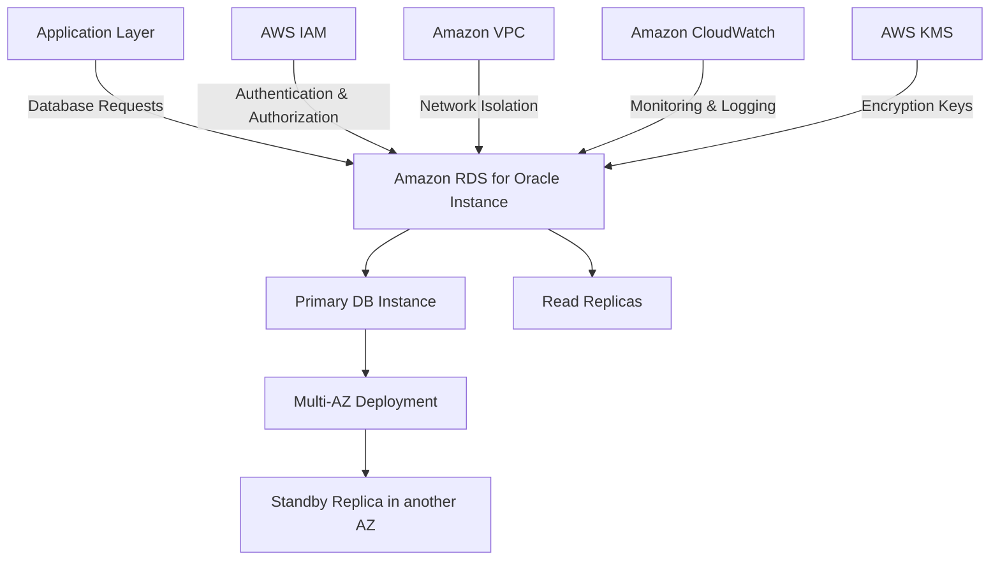
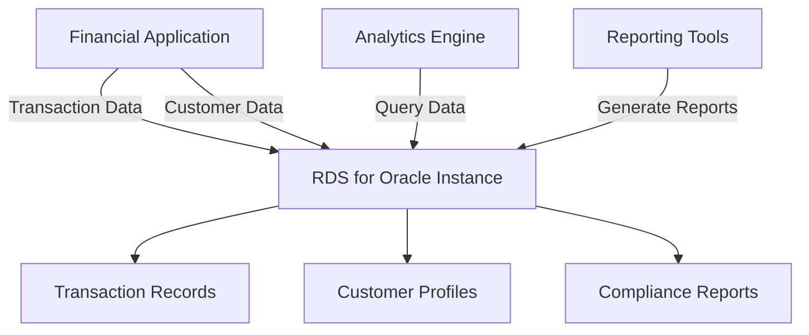
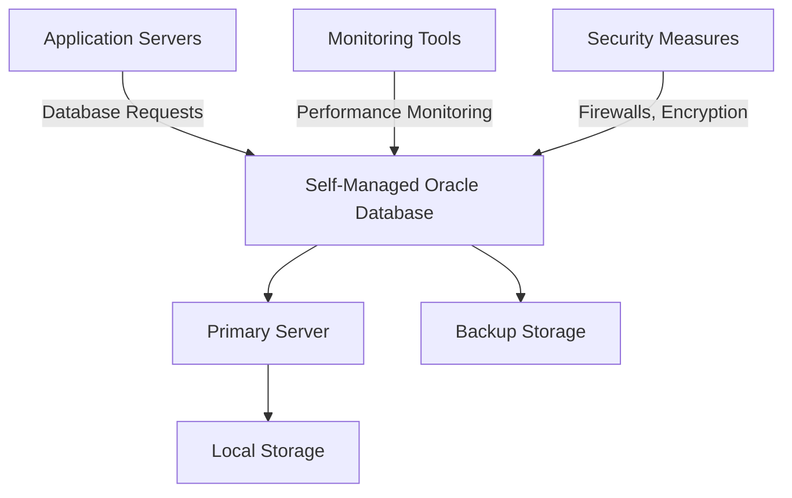

# Oracle DB

## Amazon RDS for Oracle: A Comprehensive Overview

### 1. 🌟 Overview

Amazon RDS for Oracle is a managed database service offered by AWS, enabling you to run Oracle database workloads in the cloud with ease. This service automates time-consuming administrative tasks such as hardware provisioning, database setup, patching, and backups, freeing you to focus on your application development and business growth.

#### 🤖 Innovation Spotlight

Amazon RDS for Oracle recently enhanced its capabilities with support for Oracle Database 19c, which includes features like improved performance, advanced security, and increased stability. Additionally, AWS has improved integration with other AWS services, such as Amazon S3 for data import/export and AWS Database Migration Service for seamless migration from on-premise databases to the cloud.

### 2. ⚡ Problem Statement

**Real-World Scenario:** A financial institution needs to migrate its on-premise Oracle database to the cloud to benefit from enhanced scalability and reduced operational overhead. The institution requires a solution that maintains high availability and supports complex transactions for financial record-keeping and reporting.

**Industries/Applications:**

* **Financial Services:** Managing transaction records and ensuring compliance with financial regulations.
* **Healthcare:** Storing patient records and facilitating secure and compliant data management.
* **Retail:** Handling inventory, customer information, and transaction records.

### 2.1 🤝 Business Use Cases

Amazon RDS for Oracle is particularly beneficial for:

* **Enterprise Resource Planning (ERP):** Managing business processes and data across the enterprise.
* **Customer Relationship Management (CRM):** Storing and managing customer interaction data.
* **Data Warehousing:** Consolidating data from various sources for analytics, reporting, and decision support.

### 3. 🔥 Core Principles

Amazon RDS for Oracle is built on several core principles that enhance its functionality and performance:

* **Managed Service:** Automates administrative tasks such as provisioning, patching, backup, recovery, and scaling.
* **High Availability:** Offers multi-AZ deployments to enhance database availability and fault tolerance.
* **Compatibility and Performance:** Fully compatible with Oracle Database, providing the same performance and capabilities expected from an on-premise Oracle deployment.
* **Scalability:** Supports vertical scaling by allowing you to increase compute resources easily and storage scaling for growing data needs.

Key Resource Terms:

* **DB Instances:** The primary building blocks of Amazon RDS for Oracle, acting as virtual servers running your Oracle database.
* **Multi-AZ Deployments:** Provides enhanced availability and durability for database instances by replicating data across multiple Availability Zones (AZs).
* **Read Replicas:** Allow you to scale out beyond the capacity of a single DB instance for read-heavy database workloads.
* **Automated Backups:** Enable point-in-time recovery and help maintain data integrity and availability.

### 4. 📋 Pre-Requirements

To implement Amazon RDS for Oracle, you need the following AWS services and tools:

* **AWS Identity and Access Management (IAM):** For securely managing access to AWS services.
* **Amazon Virtual Private Cloud (VPC):** To isolate your database instances within a private network.
* **AWS Database Migration Service:** For migrating Oracle databases to Amazon RDS with minimal downtime.
* **Amazon CloudWatch:** For monitoring your database instances and setting up alarms for operational events.
* **AWS Secrets Manager:** For managing database credentials securely.

### 5. 👣 Implementation Steps

1. **Set Up AWS Environment:**
   * Create an AWS account and set up IAM roles and policies for managing database access permissions.
   * Configure a VPC to host your RDS for Oracle instance.
2. **Create an RDS for Oracle Instance:**
   * Log in to the AWS Management Console and navigate to the Amazon RDS service.
   * Choose to create a new database and select Oracle as the engine type.
   * Specify DB instance details like engine version, DB instance class, storage allocation, and multi-AZ deployment options.
3. **Configure Database Settings:**
   * Define database-specific parameters such as DB name, master username, and password.
   * Set up automated backup and maintenance windows according to your operational requirements.
4. **Connect to the Database:**
   * Use standard Oracle connectivity tools, such as SQL Developer or Oracle Client, to connect to your RDS for Oracle instance.
   * Implement connection pooling in your application to optimize connection management.
5. **Monitor and Maintain:**
   * Use Amazon CloudWatch to monitor database performance and set alerts for potential issues.
   * Regularly review and update security and maintenance settings as needed.

### 6. 🗺️ Data Flow Diagram

Here is a Mermaid diagram illustrating the architecture of Amazon RDS for Oracle:

The second Mermaid diagram below illustrates a specific use case of a financial services platform using Amazon RDS for Oracle:

### 7. 🔒 Security Measures

To secure your Amazon RDS for Oracle instance, follow these best practices:

* **Encryption:** Enable encryption at rest using AWS KMS and ensure encryption in transit using SSL/TLS.
* **IAM Roles and Policies:** Apply the principle of least privilege to restrict access to your RDS instance.
* **VPC and Security Groups:** Isolate your database instance within a VPC and configure security groups to control inbound and outbound traffic.
* **Database Authentication:** Use AWS Secrets Manager to manage and rotate database credentials securely.
* **Monitoring and Alerts:** Set up monitoring with Amazon CloudWatch and AWS CloudTrail to detect and alert on suspicious activities.

### 8. 🤝 Integration with Other AWS Services

Amazon RDS for Oracle integrates seamlessly with various AWS services to enhance its functionality:

* **AWS Backup:** For automating backup and recovery processes.
* **AWS Lambda:** For executing serverless functions in response to database events.
* **Amazon S3:** For storing backups and archiving log data.
* **AWS Glue:** For ETL processes and integrating Oracle databases with data lakes.
* **Amazon QuickSight:** For business intelligence and data visualization.

These integrations allow for building comprehensive solutions leveraging RDS for Oracle as the core database.

### 9. ⚖️ When to Use and When Not to Use

#### ✅ When to Use

Amazon RDS for Oracle is ideal for:

* Enterprises seeking a managed cloud database solution that maintains Oracle compatibility.
* Applications requiring high availability and disaster recovery capabilities.
* Scenarios where reducing operational overhead is a priority, benefiting from automated backups and patching.

#### ❌ When Not to Use

Amazon RDS for Oracle might not be suitable for:

* Applications needing NoSQL capabilities or non-relational data models.
* Use cases that benefit more from serverless database options or that require extensive customization not supported by managed services.
* Situations with extremely tight budget constraints where a traditional unmanaged setup might be more cost-effective.

### 10. 💰 Costing Calculation

Amazon RDS for Oracle pricing is based on several factors:

* **Instance Hours:** Costs depend on the size and number of DB instances.
* **Storage:** Charges are based on the amount of allocated storage and I/O requests.
* **Data Transfer:** Costs for data transferred in and out of the RDS instance.

**Example Cost Calculation:**

Suppose you have a DB instance with:

* A `db.m5.large` instance type priced at $0.50 per hour.
* 100 GB of storage at $0.10 per GB per month.
* Data transfer of 10 GB out per month at $0.09 per GB.

**Monthly Costs:**

* DB Instance Cost: $0.50/hour × 730 hours/month = $365/month.
* Storage Cost: 100 GB × $0.10/GB ≈ $10/month.
* Data Transfer Cost: 10 GB × $0.09/GB = $0.90/month.

**Total Estimated Monthly Cost:** $365 + $10 + $0.90 = $375.90

_Note: Prices may vary by region and are subject to change. Always refer to the latest AWS pricing for accurate calculations._

### 11. 🧩 Alternative Services

Here’s a comparison table of Amazon RDS for Oracle with alternative services:

| Feature/Service       | Amazon RDS for Oracle | Oracle Cloud Database | Azure Database for PostgreSQL | Google Cloud SQL for PostgreSQL | Self-Managed Oracle |
| --------------------- | --------------------- | --------------------- | ----------------------------- | ------------------------------- | ------------------- |
| **Managed Service**   | Yes                   | Yes                   | Yes                           | Yes                             | No                  |
| **High Availability** | Yes                   | Yes                   | Yes                           | Yes                             | Manual Setup        |
| **Scalability**       | Vertical & Storage    | Vertical & Storage    | Vertical                      | Vertical                        | Manual              |
| **Pricing Model**     | Pay-as-you-go         | Subscription          | Pay-as-you-go                 | Pay-as-you-go                   | Capital Expenditure |
| **Integration**       | AWS Services          | Oracle Cloud Services | Azure Services                | GCP Services                    | Custom              |

Mermaid Diagram for an on-premise alternative (e.g., self-managed Oracle Database):

### 12. ✅ Benefits

Amazon RDS for Oracle offers several advantages:

* **Managed Service:** Reduces operational overhead with automated backups, patching, and scaling.
* **High Availability:** Provides built-in fault tolerance and disaster recovery with multi-AZ deployments.
* **Performance Optimization:** Optimized for performance with high-speed storage and network connectivity.
* **Ease of Use:** Simplifies setting up, operating, and scaling Oracle databases in the cloud.
* **Security and Compliance:** Offers robust security features and compliance certifications to meet regulatory requirements.

### 13. 🏢 Enterprise Adoption

Amazon RDS for Oracle is widely adopted by enterprises for its ability to handle large-scale, mission-critical applications. It supports enterprise-grade features like:

* **Multi-AZ Deployments:** For enhanced availability and disaster recovery.
* **Enterprise Support:** Access to AWS support plans for mission-critical applications.

### 14. 📝 Summary

Amazon RDS for Oracle is a fully managed database service that offers scalability, high availability, and seamless integration with other AWS services.

* **Top 5 Points to Remember:**
  1. Fully managed Oracle database service with automated backups and patching.
  2. Supports high availability with multi-AZ deployments and read replicas.
  3. Seamless integration with other AWS services for comprehensive solutions.
  4. Offers robust security features and compliance certifications.
  5. Cost-effective for enterprises needing to scale with pay-as-you-go pricing.

In short, Amazon RDS for Oracle is all about providing a managed, scalable, and high-performance database solution for enterprises needing the reliability and features of Oracle databases with reduced operational overhead.

### 15. 🔗 Related Topics

* **Oracle Database Best Practices:** Guidelines for optimizing Oracle database performance and security.
* **AWS Database Migration Service:** For migrating databases to AWS with minimal downtime.
* **Amazon Aurora PostgreSQL:** For applications needing PostgreSQL compatibility with enhanced performance and availability.
* **Amazon DynamoDB:** For applications requiring a NoSQL database with flexible schema and scalability.
