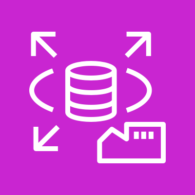
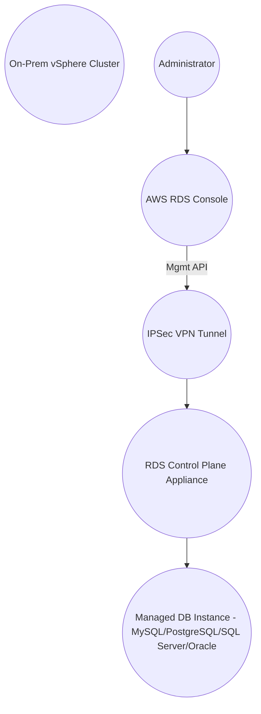
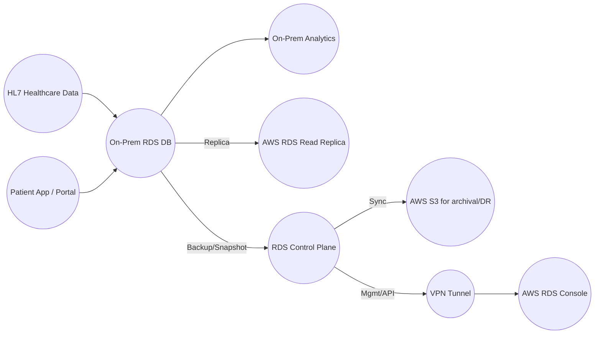
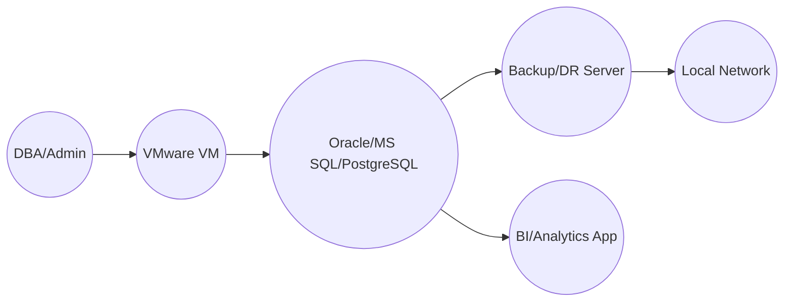

# RDS on VMware

## Amazon RDS on VMware

### 🛠️🚀 **Amazon RDS on VMware: Modernize On-Premises Databases**

Amazon RDS on VMware enables fully managed relational databases in **on-premises VMware environments** with the automation, usability, and operational benefits of AWS RDS, driving seamless hybrid database management and modernization.

***

### 🌟 Overview

Amazon RDS on VMware is an **innovative hybrid cloud service** that brings the power of AWS-managed relational databases (MySQL, PostgreSQL, SQL Server, Oracle, MariaDB) directly to VMware vSphere clusters in local data centers. It automates deployment, patching, backups, scaling, and monitoring regardless of data location, supporting compliance, data sovereignty, latency-sensitive workloads, and cloud migration journeys.

<figure><figcaption></figcaption></figure>

#### **🚩 Innovation Spotlight (2025)**

* **Custom Availability Zones**: Run managed DB directly in data center but manage via AWS RDS Console.
* **Cross-cloud DR and read replicas**: Hybrid recovery, replication, and bursting to AWS cloud.
* **Unified orchestration**: Centralized management and monitoring through AWS, even if data is local.

***

### ⚡ Problem Statement

Organizations with compliance, data residency, or latency requirements often cannot completely migrate databases to the cloud. Managing complex, on-prem RDBMS with traditional tools is costly, error-prone, and time-consuming, hindering innovation and scaling.

**Example Scenario**

A healthcare provider must store and process patient data locally due to **regulatory mandates**—but needs cloud-level automation for database patching and backups while avoiding operational bottlenecks.

#### **2.1 🤝 Business Use Cases**

* **Healthcare**: Onsite patient data, local analytics, hybrid DR.
* **Manufacturing**: Real-time equipment feeds, compliance, local DBs.
* **Financial Services**: Data sovereignty, high-security on-prem ledger databases.
* **E-commerce**: Latency-sensitive inventory, failover across sites.

***

### 🔥 Core Principles

* **Database-as-a-Service (DBaaS)**: Automates database lifecycle locally.
* **Hybrid Cloud Integration**: Seamlessly connects on-prem networks and AWS for hybrid use cases.
* **Event-driven Automation**: Handles patching, backups, scaling via control plane.
* **Resources & Terms Explainer**:
  * **Custom Availability Zone**: Logical mapping for on-prem deployment.
  * **RDS Control Plane Appliance**: Orchestrates automation locally.
  * **RDS Instance**: Managed DB instance (MySQL, PostgreSQL, SQL Server, Oracle).
  * **Read Replicas**: Synchronize local data with AWS for burst/scaling.

***

### 📋 Pre-Requirements

* **AWS Account**: Access to RDS and hybrid features.
* **VMware vSphere Cluster (≥6.5)**: Hosts for RDS deployments.
* **Internet Network, Firewall, VPN**: Secure link to AWS; ports 4500, 500 (IPSec).
* **DHCP Server**: Dynamic IP allocation locally.
* **Application/Cluster/Internet Networks**: Segmented port groups in vSphere.
* **RDS Installer OVA Appliance**: Deployed into vSphere.

***

### 👣 Implementation Steps

1. **Prepare vSphere Cluster**: Verify networking, storage, and version ≥6.5.
2. **Configure Firewall/VPN**: Allow outbound IPSec ports for AWS connectivity.
3. **Deploy RDS Installer (OVA)**: Download from AWS console, deploy to the cluster.
4. **Establish Custom Availability Zone**: Register in AWS RDS Console and configure local parameters.
5. **Enable DHCP, Portgroups**: Application, Control, Internet network setup.
6. **Deploy RDS Control Plane Appliance**: Automated by installer.
7. **Create Managed DB Instance**: Choose engine/version, configure DB details.
8. **Monitor & Operate**: Management via AWS Console, backups and patching handled automatically.

***

### 🗺️ Data Flow Diagram

**Diagram 1: Service Architecture**

**Diagram 2: Use-Case (Hybrid Healthcare Deployment)**

***

### 🔒 Security Measures

* **Network Isolation:** Only allow trusted IPs/subnets via Security Groups and NACLs.
* **Encryption:** Enable encryption for both data-at-rest and data-in-transit using KMS and SSL/TLS.
* **Least Privilege IAM:** Use IAM roles and policies to restrict access, never use root credentials.
* **VPC Integration:** Place appliances in private subnets for isolation.
* **Monitoring/Auditing:** Enable CloudWatch/RDS logging, audit regularly.
* **Patch Management:** Automated by RDS, but review patches for compliance.

***

### ⚖️ When to Use and When Not to Use

| Situation                                                   | Recommendation        |
| ----------------------------------------------------------- | --------------------- |
| ✅ Data sovereignty/local compliance required                | Use RDS on VMware     |
| ✅ Existing VMware investments, gradual migration            | Use RDS on VMware     |
| ✅ Hybrid DR, on-prem/cloud failover                         | Use RDS on VMware     |
| ❌ Pure cloud native workload, no local infra                | Use AWS RDS/Aurora    |
| ❌ Require unsupported DB engines or advanced local features | Consider alternatives |

***

### 💰 Costing Calculation

* **Pricing Factors**:
  * **Per DB Instance-hour**: Based on engine and instance size.
  * **Storage (GB/month)**: Local storage used by DBs.
  * **Backup/Replication Traffic**: Data transferred to AWS, typically via VPN.
* **Efficient Handling**:
  * Right-size instances; use Reserved Instances for predictable load.
  * Enable auto scaling and use cloud bursting for spikes.
  * Monitor with AWS Cost Explorer.

**Sample Calculation**

| Instance Type       | Hourly Rate | Storage | Monthly Cost Estimate                                             |
| ------------------- | ----------- | ------- | ----------------------------------------------------------------- |
| db.m5.large (MySQL) | $0.095/hr   | 100GB   | $0.095 \times 24 \times 30 + (100 \times 0.10)$ ≈ $70 + $10 = $80 |

***

### 🧩 Alternative Services

| AWS                 | Azure                      | GCP               | On-Premise                    | Key Differences          |
| ------------------- | -------------------------- | ----------------- | ----------------------------- | ------------------------ |
| RDS (native/cloud)  | Azure SQL Managed Instance | Cloud SQL         | Native VMware/SQL/Ora/Postgre | Cloud automation, hybrid |
| Aurora              | Hyperscale SQL             | Spanner           | Oracle RAC/MS SQL on VMware   | Scalability, automation  |
| EC2 self-managed DB | Azure VM DB                | Compute Engine DB | Physical HW or VM DBMS        | Self-management overhead |

#### **On-Premise Data Flow**

***

#### ✅ Benefits

* **Automated management**: Patching, backups, scaling handled centrally.
* **Hybrid deployment**: Seamless movement between cloud and on-prem.
* **Security/Compliance**: Keep data local but leverage AWS automation.
* **Reduced downtime**: vSphere HA, vMotion integration.
* **Cost optimization**: Use existing infra, pay only for what is used.
* **Scalability/Bursting**: Scale locally, replicate to cloud for spikes.

***

🚦 **Amazon RDS on VMware: Hybrid Database Modernization**

***

### 📝 Summary

Amazon RDS on VMware integrates AWS's managed database automation with on-premise VMware environments, allowing organizations to modernize database operations while keeping data locally for regulatory or performance reasons. Key points:

* Deploy, manage, and scale relational databases on-premise using AWS automation.
* Integrates with AWS for hybrid DR, cloud bursting, and unified monitoring.
* Designed for organizations needing compliance or data residency and hybrid strategies.
* Security, patching, and backups are automated via AWS.
* Bridges cloud-native automation and local control, streamlining hybrid modernization.

***

### 🔗 Related Topics

* AWS RDS (Cloud) Best Practices
* VMware Cloud on AWS]
* Hybrid Cloud Data Replication Patterns
* Azure SQL Managed Instance, GCP Cloud SQL documentation
* AWS Database Migration Service (DMS)
* Official AWS RDS on VMware Docs & Blog
