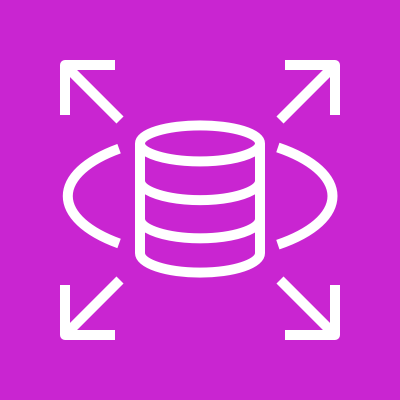
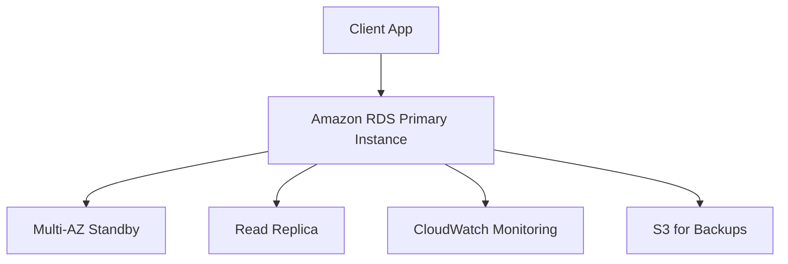
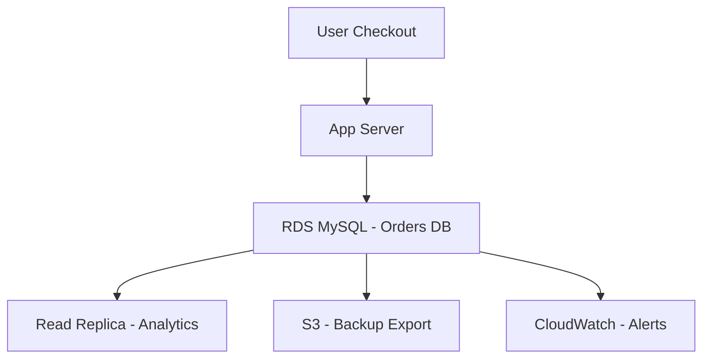
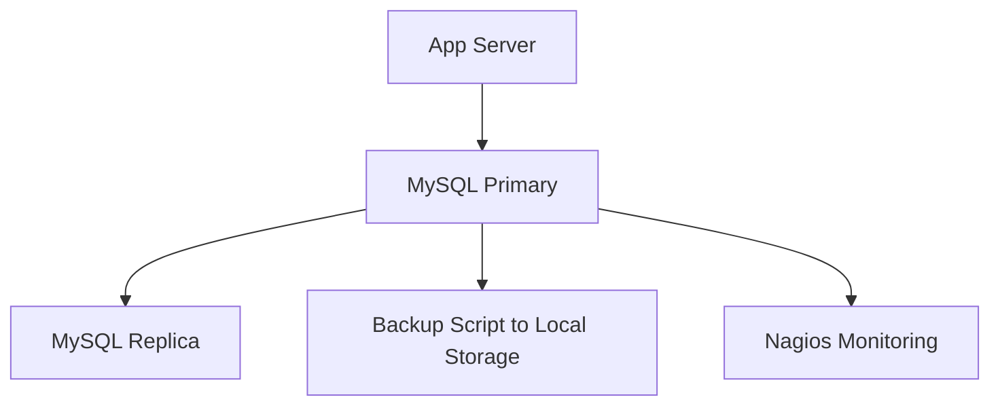

# RDS

🛠️ **Amazon RDS (Relational Database Service)** – _Innovation Spotlight: MySQL Innovation Release 9.3_

***

### 🌟 Overview

Amazon RDS is a fully managed relational database service that simplifies setup, operation, and scaling of databases in the cloud. It supports multiple engines including MySQL, PostgreSQL, MariaDB, Oracle, and SQL Server. The latest innovation—**MySQL 9.3 Innovation Release**—brings enhanced query performance, new JSON functions, and improved security.

<figure><figcaption></figcaption></figure>

#### 🚀 Innovation Spotlight:

* **Optimized Reads/Writes** for MySQL & MariaDB
* **Blue/Green Deployments** for safer upgrades
* **Support for GDR Updates** in SQL Server
* **MySQL 9.3 JSON Enhancements** for semi-structured data

***

### ⚡ Problem Statement

Imagine a fintech startup needing a scalable, secure, and highly available database for customer transactions. They want zero downtime during upgrades and automated backups.

#### Industries & Applications:

* **Fintech**: Transactional systems
* **Healthcare**: Patient record management
* **E-commerce**: Product catalog and order tracking
* **Education**: Learning management systems

***

### 🤝 Business Use Cases

| Industry   | Use Case                       |
| ---------- | ------------------------------ |
| Fintech    | Real-time transaction logging  |
| E-commerce | Inventory and order management |
| SaaS       | Multi-tenant app backend       |
| Healthcare | EMR systems with audit trails  |

***

### 🔥 Core Principles

* **Managed Service**: No need for manual patching or backups
* **Multi-AZ Deployment**: High availability via synchronous replication
* **Read Replicas**: Scale read-heavy workloads
* **Automated Backups**: Point-in-time recovery
* **Security**: IAM integration, encryption, VPC isolation

#### RDS Resources:

* **DB Instance**: The actual database server
* **DB Snapshot**: Backup image of your DB
* **Read Replica**: Asynchronous copy for read scaling
* **Parameter Group**: Configuration settings
* **Option Group**: Add-on features like Oracle’s OEM

***

### 📋 Pre-Requirements

| Service/Tool      | Purpose                 |
| ----------------- | ----------------------- |
| IAM Roles         | Access control          |
| VPC/Subnet Groups | Network isolation       |
| CloudWatch        | Monitoring and alerting |
| S3                | Backup export/import    |
| Secrets Manager   | Credential storage      |

***

### 👣 Implementation Steps

1. ✅ Go to AWS Console → RDS
2. ✅ Choose DB engine (e.g., MySQL 9.3)
3. ✅ Configure instance type, storage, and Multi-AZ
4. ✅ Set up VPC, subnet group, and security group
5. ✅ Enable backups and monitoring
6. ✅ Create read replicas (if needed)
7. ✅ Connect via endpoint using app or client

***

### 🗺️ Data Flow Diagram

#### Diagram 1 – RDS Architecture

#### Diagram 2 – E-commerce Use Case

***

### 🔒 Security Measures

* 🔐 Enable **encryption at rest and in transit**
* 🔐 Use **IAM roles** for access control
* 🔐 Restrict access via **Security Groups**
* 🔐 Store credentials in **Secrets Manager**
* 🔐 Enable **audit logging** for compliance

***

### ⚖️ When to Use vs. Not Use

#### ✅ Use When:

* You need a **managed relational DB**
* High availability and backups are critical
* You want **read replicas** for scaling

#### ❌ Don’t Use When:

* You need **NoSQL** or schema-less DB
* Real-time analytics (use Redshift instead)
* Extreme customization at OS level

***

### 💰 Costing Calculation

#### Pricing Factors:

* Instance type (e.g., db.t3.medium)
* Storage (GB/month)
* Backup retention
* Multi-AZ deployment
* Data transfer

#### Sample:

* db.t3.medium: \~$0.0416/hour
* 100 GB storage: \~$12/month
* Multi-AZ: \~2x instance cost
* Backup: \~$0.095/GB/month

#### Efficiency Tips:

* Use **reserved instances**
* Enable **storage autoscaling**
* Schedule **non-prod shutdowns**

***

### 🧩 Alternative Services

| Feature              | AWS RDS | Azure SQL DB | GCP Cloud SQL | On-Prem (MySQL) |
| -------------------- | ------- | ------------ | ------------- | --------------- |
| Managed Service      | ✅       | ✅            | ✅             | ❌               |
| Multi-AZ             | ✅       | ✅            | ✅             | ❌               |
| Read Replicas        | ✅       | ✅            | ✅             | Manual setup    |
| Auto Backup          | ✅       | ✅            | ✅             | Manual scripts  |
| Security Integration | IAM     | RBAC         | IAM           | OS-level only   |

#### On-Prem Diagram

***

### ✅ Benefits

* 🔄 Automated backups and patching
* 📈 Scalable storage and compute
* 🛡️ Built-in security and compliance
* 🧠 Reduced operational overhead
* 🔄 Easy integration with other AWS services
* 💸 Cost-effective with reserved pricing
* 🧩 Supports multiple DB engines
* 🚀 Fast provisioning and failover

***

### 📝 Summary

Amazon RDS is a powerful managed relational database service that simplifies deployment, scaling, and maintenance. With features like Multi-AZ, read replicas, and automated backups, it’s ideal for production-grade workloads.

#### Key Takeaways:

1. Fully managed relational DB service
2. Supports MySQL, PostgreSQL, Oracle, SQL Server, MariaDB
3. Multi-AZ and read replicas for HA and scaling
4. Integrated with IAM, CloudWatch, Secrets Manager
5. Latest MySQL 9.3 brings JSON and performance boosts
6. Ideal for web apps, SaaS, fintech, healthcare
7. Cost-effective with reserved instances
8. Easy to set up and monitor
9. Secure by design
10. Flexible engine and deployment options

***

### 🔗 Related Topics

* [Amazon RDS for MySQL Innovation Release 9.3 Overview](https://stackpioneers.com/2025/06/17/comprehensive-guide-to-amazon-rds-for-mysql-innovation-release-9-3/)
* [AWS RDS Optimized Reads/Writes](https://www.infoq.com/AmazonRDS/news/)
* [Amazon RDS GDR Updates for SQL Server](https://aws.amazon.com/about-aws/whats-new/2025/09/amazon-rds-latest-gdr-updates-microsoft-sql-server/)

***
