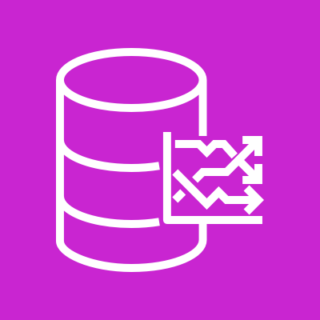
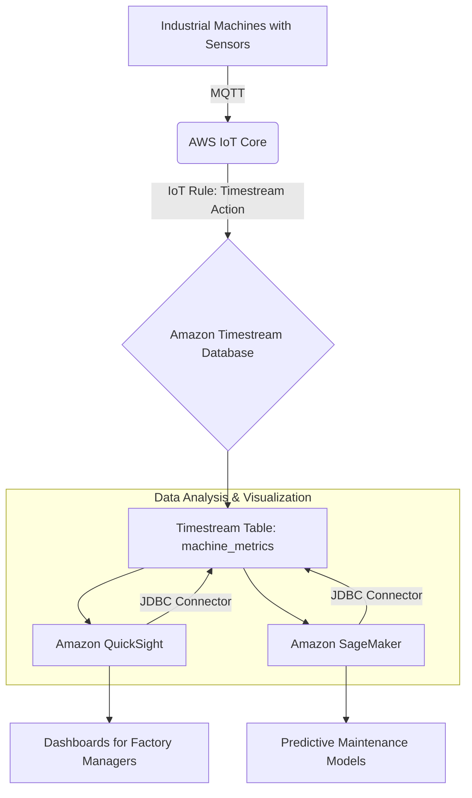

# Timesteam

## Amazon Timestream

### 🌟 Overview: Amazon Timestream 🚀

**Amazon Timestream** is a fast, scalable, and serverless time series database service designed for IoT and operational applications. It makes it easy to store and analyze time series data at scale, processing trillions of events per day. Unlike traditional databases that are not optimized for time series data, Timestream is purpose-built to handle high-volume, high-velocity data points, each with a timestamp. It separates data ingestion, storage, and query layers, allowing each to scale independently.

<figure><figcaption></figcaption></figure>

**Innovation Spotlight 💡:**

The core innovation of Amazon Timestream is its **two-tiered storage architecture**:

1. **Memory Store**: This hot tier is optimized for high-speed writes and low-latency queries on recent, frequently accessed data.
2. **Magnetic Store**: This cold tier is optimized for cost-effective storage of historical data.

Timestream automatically and transparently moves data from the Memory Store to the Magnetic Store based on user-defined retention policies. The query engine is also intelligent enough to access and combine data across both tiers with a single SQL statement, eliminating the need for a complex data archiving process. This streamlined lifecycle management and storage optimization drastically reduce costs and operational overhead.

***

### ⚡ Problem Statement: Industrial IoT Monitoring

A large-scale manufacturing company, **Global Manufacturing Inc.**, operates thousands of industrial machines across multiple factories worldwide. These machines are equipped with sensors that generate a continuous stream of time-series data, including temperature, pressure, vibration, and energy consumption, every few seconds.

The company needs to:

* Ingest and store petabytes of this sensor data efficiently and cost-effectively.
* Monitor machine health in near real-time to detect anomalies and predict failures.
* Analyze historical data to identify long-term trends, optimize maintenance schedules, and improve energy efficiency.
* Provide dashboards and reports to factory managers and maintenance teams.

Using a traditional relational database (like Amazon RDS) for this would be prohibitively expensive and complex. The constant high-volume writes would strain the database, and querying petabytes of historical data would be slow and require complex data partitioning and archiving strategies.

#### 🤝 Business Use Cases

* **IoT & Telemetry**: Collect, store, and analyze data from millions of IoT devices like smart home sensors, industrial equipment, and connected vehicles.
* **DevOps & Application Monitoring**: Monitor application performance, infrastructure metrics (CPU utilization, memory usage), and network logs to identify bottlenecks and ensure system health.
* **Financial Services**: Analyze stock market data, trade executions, and other financial metrics to detect trends and perform risk analysis.
* **E-commerce & User Analytics**: Track user behavior on websites and applications, such as clickstream data, page views, and session duration, to optimize user experience and marketing campaigns.
* **Media & Entertainment**: Monitor video streaming performance, buffering rates, and user engagement metrics in real-time.

***

### 🔥 Core Principles

* **Serverless**: No servers to provision, manage, or patch. Timestream automatically handles scaling of ingestion, storage, and query processing.
* **Purpose-Built**: Optimized specifically for time series data, which is different from typical relational data. This allows for superior performance, higher compression, and lower costs.
* **Two-Tiered Storage**:
  * **Memory Store**: For recent, "hot" data. High-performance, in-memory storage.
  * **Magnetic Store**: For historical, "cold" data. Cost-effective, durable storage.
* **Adaptive Query Engine**: The query engine can seamlessly query data across both storage tiers with a single SQL statement, making it easy to analyze both recent and historical data together.
* **High Availability and Durability**: Data is automatically replicated across at least three Availability Zones (AZs) within a region.
* **SQL Compatibility**: Supports a SQL-like query language with added time-series functions (e.g., `interpolate`, `timeseries`).

**Resources & Terms**:

* **Database**: The top-level resource in Timestream, a container for tables.
* **Table**: A collection of time series data. A table has a name, and a set of dimensions and measures.
* **Dimension**: An attribute that identifies a unique time series. For example, `device_id`, `factory_location`.
* **Measure**: The actual data point value that changes over time, like `temperature` or `pressure`.
* **Timestamp**: The time at which the measure was recorded. Timestream requires a timestamp for every data point.

***

### 📋 Pre-Requirements

1. **AWS Account**: An active AWS account.
2. **IAM Role**: An IAM role with permissions to create and manage Timestream databases and tables, and to write and query data. The permissions should be scoped down using the principle of least privilege.
3. **Data Source**: A mechanism to collect time series data, such as AWS IoT Core, a custom application, or an on-premise system.
4. **AWS CLI/SDK**: For programmatic access to Timestream APIs.

***

### 👣 Implementation Steps

1. **Create an IAM Role**: Create an IAM role with `AmazonTimestreamFullAccess` or a more restrictive policy for Timestream.
2. **Create a Timestream Database**:
   * Navigate to the Timestream console.
   * Click "Create database."
   * Provide a database name (e.g., `industrial_monitoring_db`).
3. **Create a Timestream Table**:
   * Inside your database, click "Create table."
   * Provide a table name (e.g., `machine_metrics`).
   * Configure **retention policies**. For example, keep data in the Memory Store for 12 hours and in the Magnetic Store for 10 years.
4. **Ingest Data**:
   * Use a data ingestion service like **AWS IoT Core** to collect data from machine sensors. IoT Core can route messages directly to a Timestream table using a rule action.
   * Alternatively, use the AWS SDK to write records from a Lambda function or an application. For high-volume writes, use the `WriteRecords` API call and batch records to improve performance and reduce cost.
5. **Query Data**:
   * Use the Timestream console's query editor or the AWS SDK to run SQL queries.
   * Query examples:
     * Get average temperature for a specific machine over the last hour: `SELECT avg(temperature) FROM machine_metrics WHERE time BETWEEN ago(1h) AND now()`
     * Find machines with abnormal pressure readings: `SELECT * FROM machine_metrics WHERE pressure > 100 AND time BETWEEN ago(5m) AND now()`
6. **Visualize and Analyze**:
   * Connect Timestream to a visualization tool like **Amazon QuickSight** or **Grafana** using the provided JDBC driver to create dashboards and charts for real-time monitoring and historical analysis.

***

### 🗺️ Data Flow Diagram

#### Diagram 1: How Amazon Timestream Works

```mermaid
graph TD
    A[Data Source: IoT Sensors, Applications] -->|High Volume Ingestion| B(Timestream Write API)
    B -->|Batch Records| C{Amazon Timestream}
    C -->|Memory Store (Hot data)| D[Recent Data]
    C -->|Magnetic Store (Cold data)| E[Historical Data]
    D -- automatic tiered migration --> E
    subgraph Query
    F[Timestream Query Engine] -- seamless access --> G(Single SQL Query)
    G --> D
    G --> E
    end
    F --> H[Analytics & Visualization]
    H --> I[Amazon QuickSight, Grafana]
```

#### Diagram 2: Industrial IoT Monitoring Use Case



***

### 🔒 Security Measures

* **IAM Least Privilege**: Create fine-grained IAM policies that grant only the necessary permissions to read and write to specific databases and tables.
* **Encryption**: Timestream encrypts all data at rest and in transit by default. You can use an AWS Key Management Service (KMS) customer-managed key for an extra layer of control.
* **VPC Endpoints**: Access Timestream from within your VPC using VPC endpoints to ensure all traffic stays on the AWS network and doesn't traverse the public internet.
* **Monitoring and Auditing**: Use **Amazon CloudWatch** to monitor Timestream metrics and **AWS CloudTrail** to log all API calls for auditing purposes.

***

### ⚖️ When to use and when not to use

* **✅ When to use**:
  * You have high-volume, time-stamped data from sources like IoT devices, application logs, or operational telemetry.
  * You need to perform fast, analytical queries over both recent and historical data.
  * You want a serverless, managed solution to avoid the operational overhead of managing database infrastructure.
  * Cost-effectiveness is a key consideration, especially for long-term data retention.
* **❌ When not to use**:
  * Your data is not time-series based (e.g., customer profiles, product catalogs).
  * You require a traditional relational database with complex joins, transactions, or multi-row updates.
  * You need a very low-latency, single-digit millisecond response for every single data point read, as the query engine is optimized for analytical queries over a range of data.

***

### 💰 Costing Calculation

Timestream pricing is based on a pay-as-you-go model with three main components:

1. **Writes**: Billed per GB of data ingested. This includes the size of the data point, plus metadata like column names and dimensions.
2. **Storage**: Billed per GB per month, tiered based on the storage type:
   * Memory Store: Higher cost per GB for high performance.
   * Magnetic Store: Significantly lower cost per GB for long-term retention.
3. **Queries**: Billed per GB of data scanned by your queries.

**Efficient Way of Handling Cost**:

* **Batch Writes**: Batching multiple records into a single `WriteRecords` API call reduces the number of API calls and is more efficient.
* **Data Modeling**: Use multi-measure records and condense dimension and measure names to reduce data size and lower write costs.
* **Query Optimization**: Write efficient queries with specific time ranges (`WHERE time BETWEEN ...`) and avoid `SELECT *` to minimize the amount of data scanned.
* **Retention Policies**: Tune your Memory Store retention period to only keep the data you need for real-time queries in the more expensive tier.

**Sample Calculation**: Let's assume a use case with 1000 devices, each sending a 1KB data point every 5 seconds.

* **Writes**:
  * Records per day: $(1000 \text{ devices}) \times (12 \text{ records/min}) \times (60 \text{ min/hr}) \times (24 \text{ hrs/day}) = 17,280,000 \text{ records/day}$
  * Data per day: $(17,280,000 \text{ records}) \times (1 \text{ KB/record}) \approx 17.28 \text{ GB/day}$
  * Monthly Write Cost (assuming $0.50/GB): (17.28 \text{ GB/day}) \times (30 \text{ days/month}) \times ($0.50/\text{GB}) = $259.20$
* **Storage**:
  * Memory Store: Keep 12 hours of data. $(17.28 \text{ GB/day}) \times (0.5 \text{ days}) = 8.64 \text{ GB}$. Monthly cost (at $0.05/GB): $8.64 \times $0.05 = $0.43$.
  * Magnetic Store: Keep 10 years of data. $(17.28 \text{ GB/day}) \times (30 \text{ days/month}) = 518.4 \text{ GB/month}$. Monthly cost (at $0.01/GB): $518.4 \times $0.01 = $5.18$.
* **Queries**: Assume you run 10 GB of query scans per day.
  * Monthly Query Cost (at $0.01/GB): (10 \text{ GB/day}) \times (30 \text{ days/month}) \times ($0.01/\text{GB}) = $3.00$
* **Total Estimated Monthly Cost**: \$$259.20 + $0.43 + $5.18 + $3.00 \approx $267.81$

***

### 🧩 Alternative services in AWS/Azure/GCP/On-Premise

| Service                        | Platform        | Key Comparison/Difference                                                                                                                                                                                                      |
| ------------------------------ | --------------- | ------------------------------------------------------------------------------------------------------------------------------------------------------------------------------------------------------------------------------ |
| **Amazon Timestream**          | AWS             | Serverless, purpose-built, and highly cost-effective for high-volume time-series data. Features a two-tiered storage model and an adaptive query engine.                                                                       |
| **AWS IoT Analytics**          | AWS             | A managed service for running complex analytics on IoT data. It's more of an end-to-end analytics platform rather than just a database, with features like channel, pipeline, and datastore.                                   |
| **Amazon DynamoDB**            | AWS             | A key-value and document NoSQL database. While it can store time-series data, it requires manual data modeling and can be more expensive and less efficient for large-scale time-based queries due to its architecture.        |
| **Azure Time Series Insights** | Azure           | A fully managed PaaS for collecting, processing, storing, and analyzing time-series data at scale. Similar to Timestream, but with different features and pricing models.                                                      |
| **Google Cloud Bigtable**      | GCP             | A fast, highly scalable NoSQL database service designed for large analytical and operational workloads, including time series. It's not a purpose-built time-series database but can be used for it with proper data modeling. |
| **InfluxDB**                   | On-Premise/SaaS | An open-source time series database. It requires manual setup, management, and scaling of servers, but offers more control and flexibility. AWS also offers a managed version of InfluxDB.                                     |

**On-Premise InfluxDB Data Flow Diagram**:

```mermaid
graph TD
    A[On-Premise Sensors] -->|Agent (e.g., Telegraf)| B(InfluxDB Instance)
    B -->|Storage| C[On-Premise Server/VM]
    B -->|Queries| D(Grafana/Dashboard)
    D --> E[Monitoring & Analytics]
```

***

### ✅ Benefits

* **Cost Savings**: The two-tiered storage model and pay-per-use pricing significantly reduce costs, especially for storing large volumes of historical data.
* **Scalability**: Automatically scales to handle trillions of events per day without any manual intervention.
* **Performance**: The purpose-built engine and tiered storage provide up to 1000x faster query performance than relational databases for time-series data.
* **Operational Simplicity**: Being a serverless, managed service, it eliminates the need for database administration, patching, and capacity planning.
* **Integrated Analytics**: Built-in time-series functions and integration with popular visualization tools simplify data analysis and insights.

***

### 📝 Summary

Amazon Timestream is a game-changer for anyone dealing with time-series data at scale. It's a fully managed, serverless database that is purpose-built to handle high-volume, time-stamped data from IoT, applications, and industrial environments. Its innovative two-tiered storage automatically manages the data lifecycle, and its adaptive query engine provides fast, cost-effective analytics over both recent and historical data. It simplifies a previously complex and costly problem, allowing developers and data scientists to focus on gaining insights rather than managing infrastructure.

**Top 5 Things to Keep in Mind**:

1. **Data Type**: Timestream is only for time-series data. Don't use it for general-purpose data.
2. **Data Model**: Properly model your data with dimensions and measures for optimal performance and cost.
3. **Cost Model**: Understand that you pay for writes, storage, and queries. Optimize your queries and data ingestion to keep costs down.
4. **No Joins**: The query engine does not support joins between tables, which is a key difference from relational databases.
5. **Serverless Simplicity**: Embrace the serverless nature and focus on your application logic, not on database management.

***

### 🔗 Related Topics

* [AWS IoT Core Documentation](https://aws.amazon.com/iot-core/)
* [Amazon QuickSight User Guide](https://www.google.com/search?q=https://docs.aws.amazon.com/quicksight/latest/userguide/welcome.html)
* [Using Amazon Timestream to Manage Your Analytics](https://www.gavant.com/library/using-amazon-timestream-to-manage-your-analytics)
