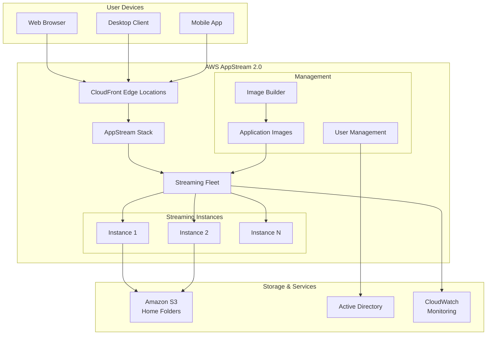
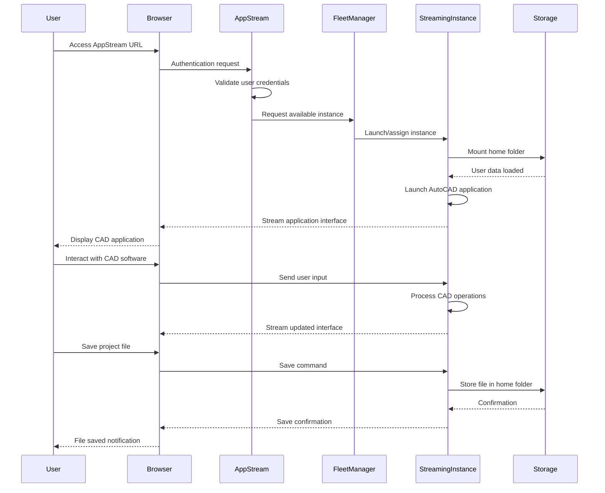
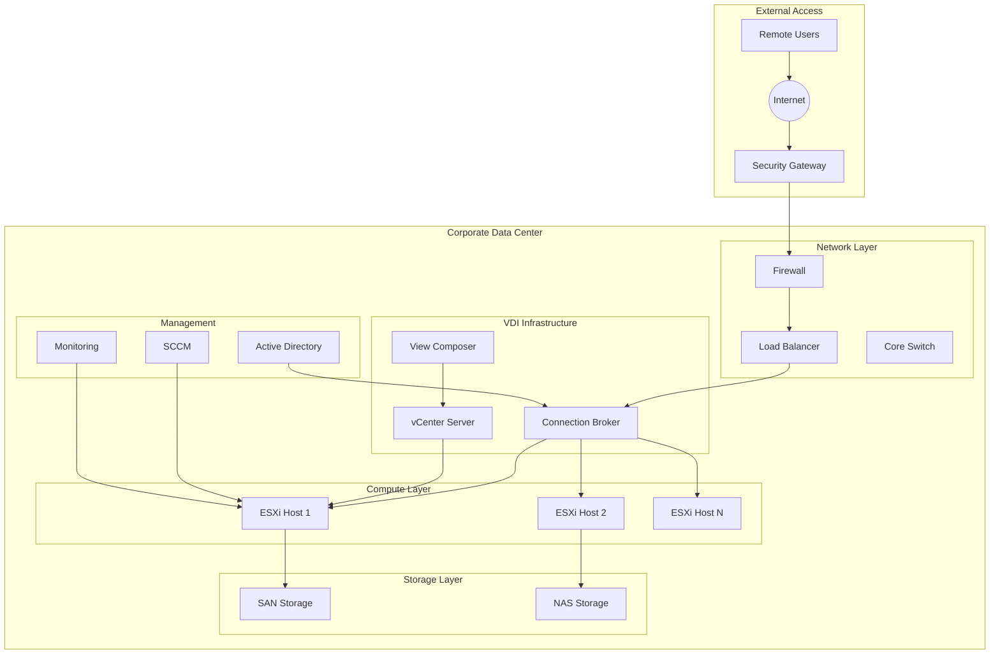

# AppStream

## 🖥️ **AWS Expert Blog: Amazon AppStream 2.0 - Revolutionizing Desktop-as-a-Service**

### 1. 🌟 **Overview**

**Amazon AppStream 2.0** is AWS's fully managed Desktop-as-a-Service (DaaS) and application streaming service that enables organizations to **securely deliver desktop applications and full Windows desktops** to users anywhere, on any device, without the need for local installation or complex VPN configurations.

<figure><figcaption></figcaption></figure>

#### Deep Dive into the Service

AppStream 2.0 represents AWS's strategic approach to **virtual desktop infrastructure (VDI)** and application virtualization. Unlike traditional VDI solutions that require significant infrastructure investment and management overhead, AppStream 2.0 provides:

* **Instant application delivery** through browser-based streaming
* **Elastic scaling** based on user demand
* **Global accessibility** with low-latency streaming
* **Enterprise-grade security** with built-in compliance
* **Cost-effective licensing** with pay-per-use models

The service streams applications from AWS data centers to users' devices using **advanced streaming protocols** optimized for various network conditions and device types.

#### 🚀 **Innovation Spotlight**

AppStream 2.0's latest 2025 innovations include:

1. **Enhanced GPU Streaming** - Support for NVIDIA A10G instances for graphics-intensive applications
2. **Multi-Session Windows 11** - Support for Windows 11 multi-session environments
3. **Advanced Image Builder** - AI-powered application packaging and optimization
4. **Smart Scaling** - ML-driven user demand prediction and auto-scaling
5. **Zero-Trust Integration** - Native integration with AWS Verified Access
6. **Edge Optimization** - CloudFront integration for ultra-low latency streaming

This represents a **paradigm shift from device-centric to cloud-centric computing**, enabling true location and device independence.

### 2. ⚡ **Problem Statement**

#### Real-World Scenario: Global Architecture Firm

**Scenario**: A multinational architecture firm with 2,500 employees across 15 countries needs to provide access to specialized CAD software (AutoCAD, Revit, 3ds Max) that:

* Requires high-end graphics processing capabilities
* Contains proprietary design templates and libraries
* Must comply with strict data sovereignty requirements
* Needs to support remote and hybrid workforce
* Requires seamless collaboration across time zones

**Challenge**: Traditional solutions involve:

* $15,000+ per high-end workstation for each designer
* Complex VPN infrastructure for remote access
* Software licensing complications across regions
* Data security risks with local file storage
* 2-3 week setup time for new employees
* Inconsistent performance across different locations

#### 2.1 🤝 **Business Use Cases**

**Industries & Applications:**

1. **Architecture, Engineering & Construction (AEC)**
   * CAD/CAM software streaming (AutoCAD, SolidWorks, Revit)
   * 3D rendering and visualization applications
   * Building Information Modeling (BIM) collaboration
2. **Financial Services**
   * Trading platforms and financial modeling software
   * Regulatory compliance applications
   * Secure document processing systems
3. **Healthcare & Life Sciences**
   * Medical imaging software (DICOM viewers)
   * Electronic Health Record (EHR) systems
   * Research and development applications
4. **Media & Entertainment**
   * Video editing software (Adobe Creative Suite, Avid)
   * 3D animation and rendering applications
   * Digital asset management systems
5. **Education**
   * Specialized academic software
   * Virtual computer labs
   * Remote learning environments

### 3. 🔥 **Core Principles**

#### Foundational Concepts

**Desktop-as-a-Service (DaaS)**: Delivers virtual desktops and applications as a cloud service, eliminating the need for local installation and maintenance.

**Application Streaming**: Real-time delivery of application interfaces over the internet while computation occurs in the cloud.

**Session-Based Computing**: Each user session runs in an isolated environment, ensuring security and performance consistency.

**Elastic Infrastructure**: Dynamically scales resources based on user demand and application requirements.

#### AppStream 2.0 Service Components Explained:

🖥️ **Fleet Management**

* **Streaming Instances**: Virtual machines that host applications and desktops
* **Fleet Types**: Always-On (persistent) vs On-Demand (elastic) configurations
* **Instance Families**: Optimized for different workloads (general purpose, compute, graphics)

📦 **Image Builder**

* **Base Images**: Pre-configured Windows environments
* **Application Installation**: Automated software packaging and configuration
* **Image Optimization**: Performance tuning and resource allocation
* **Version Management**: Image lifecycle and update management

👥 **User Management**

* **User Pools**: Internal directory integration (Active Directory, SAML)
* **Guest Access**: Temporary access for external users
* **Session Management**: User session policies and controls
* **Application Entitlements**: Granular access control per application

🌐 **Streaming Protocol**

* **NICE DCV**: AWS's proprietary high-performance streaming protocol
* **Adaptive Streaming**: Automatic quality adjustment based on network conditions
* **Multi-Platform Support**: Windows, Mac, Linux, iOS, Android clients
* **H.264 Optimization**: Hardware-accelerated video encoding

🔧 **Storage Options**

* **Home Folders**: Persistent user storage in Amazon S3
* **Application Data**: Temporary session storage
* **File System Integration**: Network drive mapping and file sharing
* **Backup and Versioning**: Automated data protection

### 4. 📋 **Pre-Requirements**

#### Essential Services & Tools:

| Service/Tool                | Purpose                              | Requirement Level |
| --------------------------- | ------------------------------------ | ----------------- |
| **AWS Account**             | Basic access to AWS services         | Mandatory         |
| **VPC Configuration**       | Network isolation and routing        | Mandatory         |
| **Internet Gateway**        | Internet connectivity for streaming  | Mandatory         |
| **IAM Roles & Policies**    | Access control and permissions       | Mandatory         |
| **Active Directory**        | User authentication (optional)       | Recommended       |
| **Amazon S3**               | Home folder storage                  | Recommended       |
| **AWS Certificate Manager** | SSL/TLS certificates                 | Recommended       |
| **CloudWatch**              | Monitoring and logging               | Recommended       |
| **Application Licenses**    | Software licensing for streamed apps | Mandatory         |

#### Technical Prerequisites:

* Network bandwidth: Minimum 1 Mbps per user (5+ Mbps recommended)
* Supported browsers: Chrome, Firefox, Safari, Edge
* Application compatibility with Windows Server environments
* Understanding of Windows administration
* Knowledge of networking and security concepts

### 5. 👣 **Implementation Steps**

#### Step-by-Step Setup Guide:

**Step 1: Network Configuration**

```bash
# Create VPC for AppStream 2.0
aws ec2 create-vpc --cidr-block 10.0.0.0/16
aws ec2 create-subnet --vpc-id vpc-xxx --cidr-block 10.0.1.0/24
aws ec2 create-internet-gateway
```

**Step 2: Create Image Builder**

* Launch Image Builder instance in AWS Console
* Connect to Image Builder via AppStream 2.0 client
* Install required applications and configurations
* Optimize performance settings
* Create and test application shortcuts

**Step 3: Create Application Image**

```bash
# Create image from Image Builder
aws appstream create-image \
    --name "CAD-Applications-v1.0" \
    --instance-arn "arn:aws:appstream:region:account:instance/builder-name" \
    --description "AutoCAD and Revit applications"
```

**Step 4: Configure Fleet**

```json
{
  "Name": "CAD-Fleet",
  "ImageName": "CAD-Applications-v1.0", 
  "InstanceType": "stream.graphics.g4dn.xlarge",
  "FleetType": "ON_DEMAND",
  "ComputeCapacity": {
    "DesiredInstances": 10
  },
  "MaxUserDurationInSeconds": 28800,
  "IdleDisconnectTimeoutInSeconds": 900
}
```

**Step 5: Create Stack**

* Define application access policies
* Configure user authentication method
* Set up storage and networking options
* Define session policies and restrictions

**Step 6: User Management Setup**

* Integrate with Active Directory or configure User Pool
* Define user groups and permissions
* Set up application entitlements
* Configure home folder storage

**Step 7: Testing and Deployment**

* Conduct user acceptance testing
* Performance optimization and tuning
* Security validation and compliance checks
* Production deployment and monitoring setup

### 6. 🗺️ **Data Flow Diagrams**

#### Diagram 1: AppStream 2.0 Architecture Overview



#### Diagram 2: CAD Application Streaming Use Case



### 7. 🔒 **Security Measures**

#### Best Practices for Secure Application Streaming:

🛡️ **Network Security**

* Deploy in private VPC subnets with NAT gateways
* Implement security groups with least privilege access
* Use AWS WAF for application-layer protection
* Enable VPC Flow Logs for network monitoring

🔐 **Authentication & Authorization**

* Integrate with Active Directory or SAML identity providers
* Implement multi-factor authentication (MFA)
* Use temporary credentials with AWS STS
* Apply principle of least privilege for user access

🖥️ **Session Security**

* Enable session encryption with TLS 1.2+
* Implement session timeouts and idle disconnection
* Use clipboard restrictions for sensitive data
* Enable session recording for compliance (optional)

📁 **Data Protection**

* Encrypt home folders in Amazon S3
* Use AWS KMS for key management
* Implement data loss prevention (DLP) policies
* Regular backup and disaster recovery procedures

🔍 **Monitoring & Compliance**

* Enable CloudTrail for API audit logging
* Use CloudWatch for real-time monitoring
* Implement automated compliance checks
* Regular security assessments and penetration testing

### 8. 🖥️ **Innovation Spotlight: Graphics-Intensive Workloads**

AppStream 2.0's breakthrough innovation for 2025 is **enhanced GPU streaming capabilities**:

* **NVIDIA A10G Support**: Hardware-accelerated graphics for CAD, 3D modeling, and ML workloads
* **GPU Partitioning**: Multiple users sharing single GPU instances cost-effectively
* **DirectX 12 & OpenGL Support**: Full compatibility with modern graphics APIs
* **Real-time Ray Tracing**: Support for advanced rendering techniques
* **ML Workload Integration**: GPU compute for AI/ML applications alongside traditional graphics

This enables **professional-grade graphics performance** in the cloud, rivaling local high-end workstations.

### 9. ⚖️ **When to Use and When Not to Use**

#### ✅ **When to Use AppStream 2.0:**

* **Specialized software** requiring expensive local hardware
* **Remote workforce** needing secure application access
* **Temporary projects** with short-term software needs
* **BYOD environments** requiring application standardization
* **Compliance requirements** for data residency and control
* **Graphics-intensive applications** needing GPU acceleration
* **Educational institutions** providing software access to students
* **Seasonal scaling** requirements (e.g., tax software during tax season)

#### ❌ **When Not to Use AppStream 2.0:**

* **Simple web applications** (use web hosting instead)
* **Real-time gaming** (latency sensitive applications)
* **Always-connected mobile apps** (use native mobile development)
* **Basic office productivity** (use Microsoft 365 or Google Workspace)
* **Ultra-low latency requirements** (<5ms response time needed)
* **Extremely bandwidth-constrained environments**
* **Applications requiring USB/hardware dongles**
* **Legacy applications incompatible with Windows Server**

### 10. 💰 **Costing Calculation**

#### How Pricing Works:

**Streaming Instance Hours**: $0.36 - $3.06 per hour (varies by instance type) **User Storage**: $0.023 per GB per month (Amazon S3 pricing) **Data Transfer**: $0.09 per GB (outbound data transfer)

#### Instance Types and Pricing:

| Instance Type               | vCPUs | Memory | Storage | GPU         | Price/Hour |
| --------------------------- | ----- | ------ | ------- | ----------- | ---------- |
| stream.standard.small       | 2     | 4 GB   | 80 GB   | -           | $0.36      |
| stream.standard.medium      | 2     | 4 GB   | 160 GB  | -           | $0.72      |
| stream.compute.large        | 4     | 8 GB   | 160 GB  | -           | $1.44      |
| stream.graphics.g4dn.xlarge | 4     | 16 GB  | 125 GB  | NVIDIA T4   | $1.93      |
| stream.graphics-pro.4xlarge | 16    | 64 GB  | 500 GB  | NVIDIA V100 | $3.06      |

#### Sample Calculations:

**Small Design Team (10 users, 8 hours/day, graphics workload):**

* Instance costs: 10 × 8 × 22 × $1.93 = $3,396.80/month
* Storage (50GB/user): 10 × 50 × $0.023 = $11.50/month
* Data transfer (10GB/user/day): 10 × 10 × 22 × $0.09 = $198/month
* **Total**: \~$3,606/month

**Large Enterprise (100 users, mixed usage patterns):**

* Always-On instances (20): 20 × 24 × 30 × $1.44 = $20,736/month
* On-Demand instances (80): 80 × 6 × 22 × $0.72 = $7,603.20/month
* Storage (100GB/user): 100 × 100 × $0.023 = $230/month
* Data transfer: 100 × 15 × 22 × $0.09 = $2,970/month
* **Total**: \~$31,539/month

#### Cost Optimization Tips:

* Use On-Demand fleets for variable usage patterns
* Implement auto-scaling policies based on user demand
* Optimize image sizes to reduce storage costs
* Use CloudFront for reduced data transfer costs
* Schedule instances for business hours only when appropriate

### 11. 🧩 **Alternative Services Comparison**

| Feature            | AWS AppStream 2.0 | Citrix Virtual Apps | VMware Horizon   | Azure Virtual Desktop | On-Premise VDI     |
| ------------------ | ----------------- | ------------------- | ---------------- | --------------------- | ------------------ |
| **Deployment**     | Fully Managed     | Hybrid/Cloud        | Hybrid/On-Prem   | Fully Managed         | Self-Managed       |
| **Scaling**        | Auto-scaling      | Manual/Limited Auto | Manual/Auto      | Auto-scaling          | Manual             |
| **GPU Support**    | Native NVIDIA     | Add-on Required     | Native Support   | Limited Support       | Hardware Dependent |
| **Browser Access** | Native HTML5      | Citrix Workspace    | VMware Client    | Native HTML5          | Various Clients    |
| **Licensing**      | Pay-per-use       | Subscription        | Perpetual/Sub    | Pay-per-user          | License + Hardware |
| **Management**     | Minimal           | Complex             | Complex          | Moderate              | High Complexity    |
| **Global Reach**   | 25+ Regions       | Limited             | Depends on Setup | Limited Regions       | Single Location    |
| **Integration**    | AWS Services      | Third-party         | VMware Ecosystem | Microsoft 365         | Custom             |

#### On-Premise VDI Alternative Architecture:



### 12. ✅ **Benefits**

#### Key Advantages:

🚀 **Instant Scalability**: Scale from 10 to 10,000 users in minutes without infrastructure planning 💰 **Cost Optimization**: Reduce CAPEX by up to 70% compared to traditional VDI deployments ⚡ **High Performance**: GPU-accelerated instances deliver workstation-class performance 🔒 **Enterprise Security**: Built-in encryption, compliance, and access controls 🌐 **Global Accessibility**: Access applications from anywhere with internet connectivity 📱 **Device Flexibility**: Support for any device - Windows, Mac, tablets, Chromebooks ⚙️ **Zero Maintenance**: No infrastructure management, updates, or hardware refresh cycles 🎯 **Application Consistency**: Identical experience across all user devices and locations 📊 **Usage Analytics**: Detailed insights into application usage and user behavior 🔄 **Rapid Deployment**: Deploy new applications to entire workforce in hours, not weeks

### 13. 🖥️ **Innovation Deep-Dive: Next-Generation Workspace**

AppStream 2.0 represents **the evolution of workspace computing**:

* **Hybrid Work Enablement**: Seamless transition between office and remote work
* **AI-Powered Optimization**: Machine learning for performance tuning and resource allocation
* **Edge Computing Integration**: CloudFront edge locations for ultra-low latency
* **Container-Based Applications**: Support for containerized application delivery
* **Voice and Collaboration**: Integration with Amazon Chime and collaboration platforms

### 14. 📝 **Summary**

**Amazon AppStream 2.0 transforms how organizations deliver desktop applications by providing a fully managed, scalable, and secure cloud-based streaming service that eliminates the complexity and cost of traditional VDI while enabling true workforce mobility.**

#### Key Takeaways to Remember:

1. **Fully managed service** eliminates VDI infrastructure complexity and maintenance
2. **GPU-accelerated instances** support graphics-intensive professional applications
3. **Browser-based access** requires no client software installation or VPN configuration
4. **Elastic scaling** automatically adjusts capacity based on user demand
5. **Pay-per-use pricing** eliminates upfront hardware investments and licensing complexity
6. **Enterprise security** includes encryption, compliance, and granular access controls
7. **Global deployment** leverages AWS's worldwide infrastructure for optimal performance
8. **Application streaming** delivers consistent experience across any device or location
9. **Integration capabilities** connect with existing identity and storage systems
10. **Rapid deployment** enables new application rollouts in hours instead of weeks

#### Service Essence:

Amazon AppStream 2.0 is AWS's fully managed Desktop-as-a-Service platform that streams Windows applications and desktops to any device through a web browser. It eliminates the need for complex VDI infrastructure while providing enterprise-grade security, GPU acceleration, and elastic scaling capabilities. The service enables organizations to deliver specialized software applications to remote workforces cost-effectively with consistent performance and zero client-side installation requirements. AppStream 2.0 transforms traditional desktop computing by moving applications to the cloud while maintaining native application functionality and user experience. This innovation enables true workspace mobility and significantly reduces the total cost of ownership for enterprise application delivery.

### 15. 🔗 **Related Topics**

#### Future Learning Path & References:

* [**AWS WorkSpaces**](https://aws.amazon.com/workspaces/) - Full virtual desktop solutions
* [**Amazon WorkSpaces Web**](https://aws.amazon.com/workspaces/web/) - Browser-based virtual desktops
* [**AWS Directory Service**](https://aws.amazon.com/directoryservice/) - Managed Active Directory
* [**Amazon FSx**](https://aws.amazon.com/fsx/) - High-performance file systems for VDI
* [**AWS Client VPN**](https://aws.amazon.com/vpn/client-vpn/) - Secure remote access solutions
* [**NICE DCV**](https://aws.amazon.com/hpc/dcv/) - High-performance remote display protocol
* [**AWS End User Computing**](https://aws.amazon.com/products/end-user-computing/) - Complete EUC portfolio
* [**VDI Migration Guide**](https://docs.aws.amazon.com/appstream2/) - Migration strategies and best practices

***
