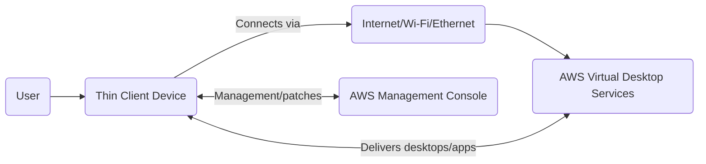
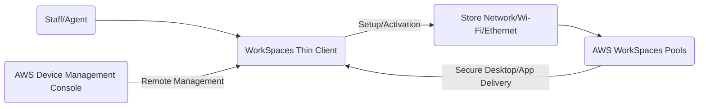
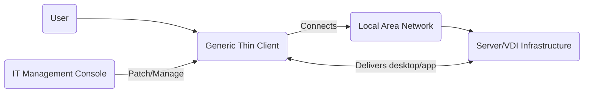

# Thin Client

## 🛠️💻 **Amazon WorkSpaces Thin Client: Next-Gen Cloud Desktop Device**

Amazon WorkSpaces Thin Client is a purpose-built, plug-and-play endpoint that enables secure, high-performance access to AWS virtual desktops and applications with minimal hardware and management overhead.

***

### 🌟 Overview

Amazon WorkSpaces Thin Client is a dedicated device optimized for connecting to AWS WorkSpaces, WorkSpaces Secure Browser, AppStream 2.0, and pools, with easy setup, centralized management, and robust security. The key innovation is leveraging the Amazon Fire TV Cube hardware for enterprise desktop experiences, combining efficient hardware with full AWS end-user computing security and management.

<figure><figcaption></figcaption></figure>

#### 🚩 Innovation Spotlight (2025)

* **Zero local storage/app installation:** Eliminates endpoint risk.
* **Centralized cloud-based fleet management:** Enables remote monitoring, patching, and inventory.
* **Dual monitor support, fast Wi-Fi 6E connectivity:** Raises productivity and compatibility.
* **Sustainability (Carbon Trust certified):** Eco-friendly lifecycle verification.

***

### ⚡ Problem Statement

Enterprises face costly, complex deployment and security issues with traditional desktops, especially for remote work, contact centers, and shift workers. Local data, device loss/theft, and patch management are ongoing challenges.

#### Example Scenario

A retail chain wants to deploy virtual desktops to thousands of part-time staff with minimal setup, logistics, and security footprint. WorkSpaces Thin Client ships directly to each location, is plugged in by staff, and instantly connects to AWS-managed desktops—no local IT needed.

#### 2.1 🤝 Business Use Cases

* **Contact centers:** Secure, centrally managed desktops for agents.
* **Remote workforces:** Simple, secure access with zero local risk.
* **Healthcare:** Compliance with data protection by preventing endpoint downloads.
* **Retail/Branch deployment:** Easy provisioning and remote support.
* **Education/Training:** Rapid classroom or lab setup.

***

### 🔥 Core Principles

* **Cloud-first endpoint:** Designed for AWS virtual desktop/cloud app delivery.
* **No data/application persistence:** All user data and application execution remain cloud-hosted.
* **Centralized cloud management:** Fleet visibility, patching, compliance, remote reset through AWS console.
* **Hardware authentication:** Secure, on-chip secrets for device trust.
* **Device features:** Dual-monitor capability, USB device support, sleep/reset toolbar, keyboard shortcuts.

#### Supported Services/Resources:

* **WorkSpaces Personal/Pool/Secure Browser**
* **Amazon AppStream 2.0**
* **Device Management Console**

***

### 📋 Pre-Requirements

* **AWS Account:** For WorkSpaces/AppStream & device management.
* **High-speed internet:** Wired Ethernet or Wi-Fi 6E router (recommended for full speed).
* **Monitor(s):** HDMI 2.1, 1080p resolution.
* **Keyboard, mouse, optional webcam/headset**
* **Power outlet**
* **Optional: USB hub for dual displays and peripherals.**

***

### 👣 Implementation Steps

1. **Procure Thin Clients:** Order from AWS or Amazon Business, ship to users/stores.
2. **Connect Device:** Plug in power, connect to router/Ethernet, and attach monitor, keyboard, mouse.
3. **Follow On-screen Setup:** Guided wizard completes network and AWS registration.
4. **Fleet Management:** IT admin uses AWS console for remote monitoring, patch updates, resets, and compliance.
5. **Access Virtual Desktop:** User logs in with credentials—desktop/app delivered from AWS cloud.
6. **Zero data/app download:** Device blocks all local storage and removable media.

***

### 🗺️ Data Flow Diagram

#### Diagram 1: How WorkSpaces Thin Client Works

#### Diagram 2: Retail Contact Center Deployment Example

***

### 🔒 Security Measures

* **No local data storage or app install:** Prevents data theft/exfiltration.
* **Centralized patching and lifecycle management:** Admin controls updates remotely.
* **Hardware-level authentication and secrets:** Prevents unauthorized device compromise.
* **Device locking/restart/reset:** Can be triggered locally or by admin.
* **Encrypted traffic:** Requires WPA3 for Wi-Fi 6E, supports SSL for AWS session.
* **Block removable media:** USB drives and external storage disabled.
* **IAM integration/MFA:** Supports user authentication via AWS IAM/Identity Center.

***

### ⚖️ When to Use and When Not to Use

| Situation                                              | Recommendation                      |
| ------------------------------------------------------ | ----------------------------------- |
| ✅ Secure endpoint, no local data allowed               | Use WorkSpaces Thin Client          |
| ✅ Large, distributed workforce, minimal setup          | Use WorkSpaces Thin Client          |
| ✅ Remote/contact center/retail/healthcare              | Use WorkSpaces Thin Client          |
| ❌ Need local application execution or persistent files | Use traditional desktop/thin client |
| ❌ Unsupported peripherals or complex local setups      | Use other device/endpoint options   |

***

### 💰 Costing Calculation

* **Device Cost:** Single upfront payment per device, priced similar to enterprise thin clients (\~$195-230 per device).
* **AWS Virtual Desktop Cost:** Pay-as-you-go for user licenses and cloud resources.
* **Efficient Handling:** Deploy only to task worker/contact center environments for maximum cost-to-value advantage.
* **Sample Calculation:**
  * Device = $200 (one-off)
  * AWS WorkSpaces = $25/user/month (billed separately)
  * For 500 users/year: $$500 \times 200 + 500 \times 25 \times 12 = \$100,000 + \$150,000 = \$250,000$$ (device + cloud service)

***

### 🧩 Alternative Services in AWS/Azure/GCP/On-Premise

| AWS                      | Azure                          | GCP               | On-Premise             | Key Differences                                                 |
| ------------------------ | ------------------------------ | ----------------- | ---------------------- | --------------------------------------------------------------- |
| WorkSpaces Thin Client   | Azure Virtual Desktop Endpoint | Chrome OS Devices | Standard Thin Clients  | AWS device has zero local storage, cloud management focus       |
| AppStream 2.0 Client     | Windows Terminal               | Chromebook w/ VDI | Linux/NComputing       | AWS control, eco-friendly, direct shipping                      |
| Third-party Thin Clients | Surface Endpoint               | Any VDI Endpoint  | Dell/Wyse, IGEL, 10ZiG | On-prem clients may allow local app install, higher IT overhead |

#### On-Premise Data Flow Diagram (Generic Thin Client)

***

### ✅ Benefits

* **Cost savings:** Zero local IT maintenance, reduced hardware and security costs.
* **Automatic setup:** Plug-and-play for rapid deployment.
* **Eco-friendly:** Low power, Carbon Trust certified.
* **Mitigates endpoint data risk:** No local data/app install.
* **Scalability:** Suits mass deployment and cloud-based management.
* **Productivity:** Dual monitors, peripheral support, PC keyboard shortcuts.

***

💻 **Amazon WorkSpaces Thin Client: Endpoint Security, Deployed Fast**

***

### 📝 Summary

Amazon WorkSpaces Thin Client provides a secure, cloud-managed endpoint for AWS virtual desktops. It eliminates local security risks, reduces IT overhead, and empowers large organizations to deploy managed desktops quickly—ideal for distributed, hybrid or regulated workforces.

* Fast setup for AWS desktops—no technical support needed.
* No local data/app install for high security.
* Central cloud console for fleet management, patching, and compliance.
* Suitable for remote/contact center/task worker environments.
* Reduces costs and boosts endpoint reliability.

***

### 🔗 Related Topics

* Amazon WorkSpaces Thin Client User Guide
* WorkSpaces & AppStream 2.0 documentation
* AWS End User Computing Blog and Fleet Management
* Carbon Trust sustainability programs
* Thin client device vendor comparisons

