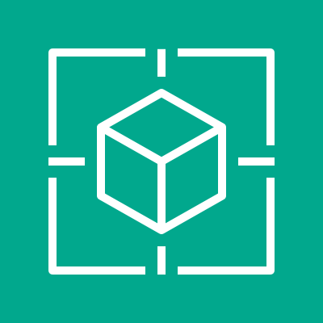
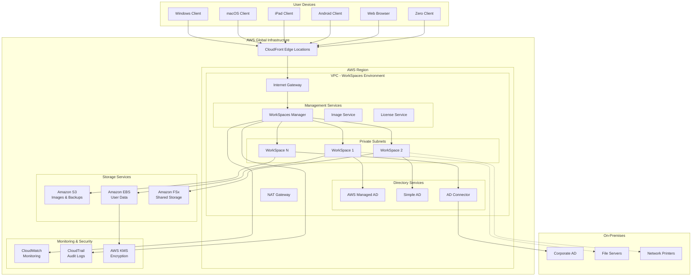
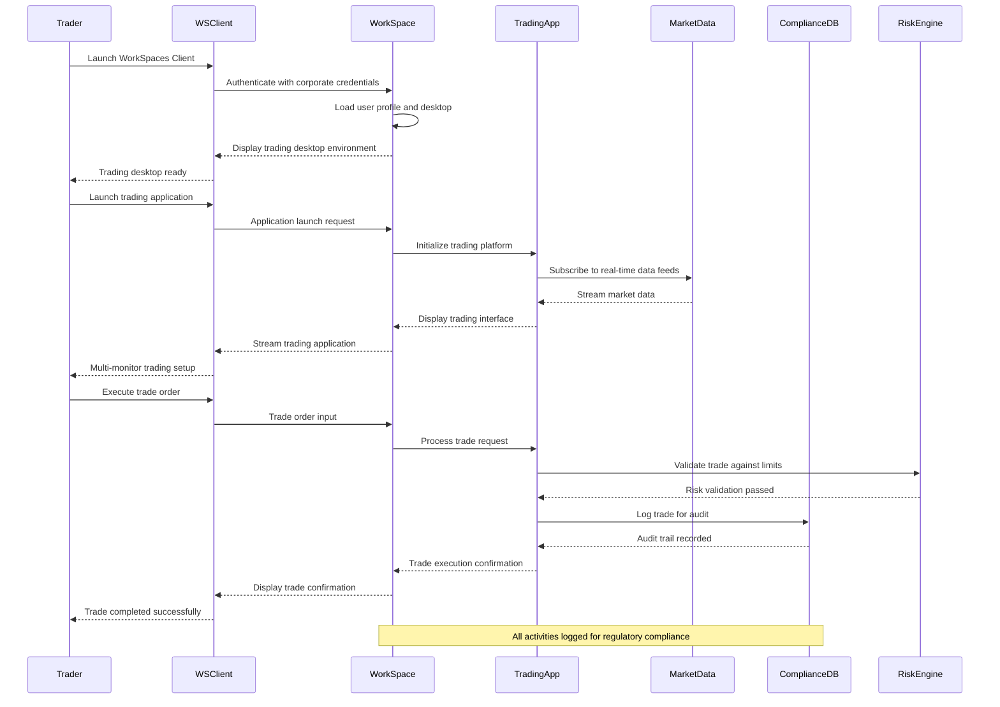
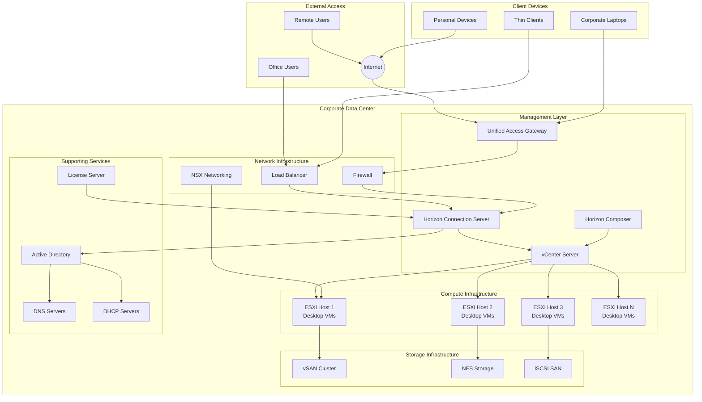

# WorkSpace

## 🖥️ **AWS Expert Blog: Amazon WorkSpaces - Transforming Virtual Desktop Infrastructure**

### 1. 🌟 **Overview**

**Amazon WorkSpaces** is AWS's fully managed **Virtual Desktop Infrastructure (VDI)** service that provides secure, reliable, and scalable cloud-based Windows and Linux desktops. Unlike application streaming, WorkSpaces delivers complete virtual desktop environments that users can access from virtually any device, anywhere, with a consistent computing experience.

<figure><figcaption></figcaption></figure>

#### Deep Dive into the Service

WorkSpaces represents AWS's comprehensive approach to **Desktop-as-a-Service (DaaS)** by providing full operating system environments rather than just applications. The service enables organizations to:

* **Provision virtual desktops** in minutes with pre-configured bundles
* **Scale desktop infrastructure** elastically based on organizational needs
* **Eliminate hardware refresh cycles** and reduce capital expenditure
* **Centralize desktop management** with enterprise-grade security and compliance
* **Support hybrid workforce** with seamless remote access capabilities

The service runs on AWS's global infrastructure, providing **persistent desktop environments** with local storage, installed applications, and user customizations that survive across sessions.

#### 🚀 **Innovation Spotlight - WorkSpaces 2025 Enhancements**

The latest 2025 innovations include:

1. **WorkSpaces Pools** - Cost-optimized shared desktop environments for task workers
2. **Smart Hibernation** - AI-driven power management reducing costs by up to 50%
3. **GPU-Optimized Bundles** - NVIDIA RTX Virtual Workstation for advanced graphics
4. **Zero Trust Integration** - Native AWS Verified Access and IAM Identity Center
5. **Edge Acceleration** - Global edge locations for sub-20ms latency
6. **Sustainability Metrics** - Carbon footprint tracking and green computing insights
7. **WorkSpaces Secure Browser** - Isolated browsing environments within desktops

This represents a **paradigm shift toward sustainable, intelligent, and zero-trust virtual workspaces**.

### 2. ⚡ **Problem Statement**

#### Real-World Scenario: Global Financial Services Company

**Scenario**: A multinational investment bank with 8,000 employees across 25 countries needs to provide secure desktop environments that:

* Support multiple trading platforms and financial modeling software
* Comply with strict regulatory requirements (SOX, Basel III, GDPR)
* Provide 99.9% uptime during market hours
* Support both full-time employees and temporary contract workers
* Enable seamless failover during natural disasters or emergencies
* Maintain audit trails for all user activities

**Traditional Challenge**: Legacy VDI infrastructure involves:

* $25M initial investment for data center infrastructure
* 18-month deployment timeline for global rollout
* $8M annual maintenance and support costs
* Complex disaster recovery across multiple regions
* Difficulty scaling for seasonal workforce (tax season, quarterly reporting)
* Security vulnerabilities with on-premises hardware

#### 2.1 🤝 **Business Use Cases**

**Industries & Applications:**

1. **Financial Services & Banking**
   * Trading floor environments with multiple monitors
   * Regulatory compliance and audit trail requirements
   * Secure access to customer financial data
   * Risk management and compliance applications
2. **Healthcare & Life Sciences**
   * Electronic Health Records (EHR) access
   * Medical imaging and DICOM viewers
   * Clinical research data analysis
   * HIPAA-compliant patient data handling
3. **Government & Public Sector**
   * Classified data processing environments
   * Secure communications and document management
   * Citizen services and case management systems
   * FedRAMP and FISMA compliance requirements
4. **Legal Services**
   * Document review and e-discovery platforms
   * Case management systems
   * Confidential client data protection
   * Multi-jurisdiction compliance requirements
5. **Call Centers & Customer Service**
   * CRM and telephony system access
   * Seasonal workforce scaling
   * Performance monitoring and quality assurance
   * Multi-tenant security isolation

### 3. 🔥 **Core Principles**

#### Foundational Concepts

**Virtual Desktop Infrastructure (VDI)**: Centralized desktop computing where desktop environments run on servers in a data center and are accessed remotely by client devices.

**Persistent Desktops**: User customizations, installed applications, and data are preserved between sessions, providing a consistent personal computing environment.

**Elastic Scaling**: Ability to rapidly provision or decommission desktop instances based on organizational demand without infrastructure constraints.

**Zero Client Architecture**: Minimal client-side requirements enabling access from any device while maintaining security and performance.

#### WorkSpaces Service Components Explained:

🖥️ **WorkSpaces Bundles**

* **Value Bundles**: Basic productivity computing (1-2 vCPUs, 2-4 GB RAM)
* **Standard Bundles**: General business applications (2 vCPUs, 4 GB RAM)
* **Performance Bundles**: Resource-intensive applications (2-4 vCPUs, 8-16 GB RAM)
* **Power Bundles**: High-performance computing (4-8 vCPUs, 16-32 GB RAM)
* **PowerPro Bundles**: Graphics and compute intensive (8-16 vCPUs, 32-128 GB RAM)
* **Graphics Bundles**: GPU-accelerated for CAD, 3D modeling (NVIDIA Quadro Virtual)

🏗️ **WorkSpaces Core**

* **Fully Managed Service**: AWS handles infrastructure, patching, and maintenance
* **Multi-AZ Deployment**: Built-in high availability and disaster recovery
* **Auto Scaling**: Dynamic capacity adjustment based on usage patterns
* **Health Monitoring**: Automated instance health checks and replacement

👥 **WorkSpaces Directory Services**

* **Simple AD**: Basic directory for small organizations (< 5,000 users)
* **AWS Managed Microsoft AD**: Enterprise-grade Active Directory service
* **AD Connector**: Connect to existing on-premises Active Directory
* **Cross-Domain Trust**: Support for complex multi-domain environments

💾 **Storage Options**

* **Root Volume**: Operating system and installed applications (80-2000 GB)
* **User Volume**: Personal files and user profile data (10-2000 GB)
* **WorkDocs Integration**: Cloud storage with collaboration features
* **FSx Integration**: High-performance file systems for shared data

🔒 **Security Features**

* **Encryption**: Data at rest and in transit using AWS KMS
* **Network Isolation**: VPC deployment with security groups and NACLs
* **Compliance**: SOC, PCI DSS, HIPAA, FedRAMP certifications
* **Access Control**: Fine-grained user and device-based policies

### 4. 📋 **Pre-Requirements**

#### Essential Services & Tools:

| Service/Tool                | Purpose                            | Requirement Level |
| --------------------------- | ---------------------------------- | ----------------- |
| **AWS Account**             | Basic access to AWS services       | Mandatory         |
| **VPC Configuration**       | Network isolation and routing      | Mandatory         |
| **Directory Service**       | User authentication and management | Mandatory         |
| **Internet Gateway**        | Internet access for WorkSpaces     | Mandatory         |
| **IAM Roles & Policies**    | Access control and permissions     | Mandatory         |
| **Amazon S3**               | Backup and image storage           | Recommended       |
| **CloudWatch**              | Monitoring and logging             | Recommended       |
| **AWS Certificate Manager** | SSL/TLS certificates               | Recommended       |
| **Route 53**                | DNS resolution                     | Optional          |
| **Direct Connect**          | Dedicated network connection       | Optional          |

#### Technical Prerequisites:

* Network bandwidth: 200 Kbps minimum (1 Mbps recommended per user)
* Supported client applications: Windows, macOS, iPad, Android, Chrome OS, Zero clients
* Active Directory infrastructure (existing or AWS managed)
* Windows or Amazon Linux licensing compliance
* Basic understanding of networking and directory services

### 5. 👣 **Implementation Steps**

#### Step-by-Step Setup Guide:

**Step 1: Network Infrastructure Setup**


```bash
# Create VPC for WorkSpaces
aws ec2 create-vpc --cidr-block 10.0.0.0/16 --tag-specifications \
  'ResourceType=vpc,Tags=[{Key=Name,Value=WorkSpaces-VPC}]'

# Create private subnets in multiple AZs
aws ec2 create-subnet --vpc-id vpc-xxx --cidr-block 10.0.1.0/24 --availability-zone us-east-1a
aws ec2 create-subnet --vpc-id vpc-xxx --cidr-block 10.0.2.0/24 --availability-zone us-east-1b

# Create NAT Gateway for internet access
aws ec2 create-nat-gateway --subnet-id subnet-xxx --allocation-id eipalloc-xxx
```


**Step 2: Directory Service Configuration**

```bash
# Create AWS Managed Microsoft AD
aws ds create-microsoft-ad \
    --name "corp.company.com" \
    --password "SecurePassword123!" \
    --description "WorkSpaces Directory Service" \
    --vpc-settings VpcId=vpc-xxx,SubnetIds=subnet-xxx,subnet-yyy
```

**Step 3: Register Directory with WorkSpaces**

```bash
# Register directory for WorkSpaces
aws workspaces register-workspace-directory \
    --directory-id d-xxxxxxxxxx \
    --enable-work-docs \
    --enable-self-service-permissions
```

**Step 4: Create Custom Bundle (Optional)**

```json
{
  "BundleName": "Finance-Standard-Bundle",
  "BundleDescription": "Standard bundle with financial applications",
  "ImageId": "wsi-xxxxxxxxxx",
  "ComputeType": {
    "Name": "STANDARD"
  },
  "UserStorage": {
    "Capacity": "100"
  },
  "RootStorage": {
    "Capacity": "175"  
  }
}
```

**Step 5: Provision WorkSpaces**

```bash
# Create WorkSpaces for users
aws workspaces create-workspaces --workspaces file://workspace-requests.json
```

**Example workspace-requests.json:**

```json
[
  {
    "DirectoryId": "d-xxxxxxxxxx",
    "UserName": "john.doe",
    "BundleId": "wsb-xxxxxxxxxx",
    "WorkspaceProperties": {
      "RunningMode": "AUTO_STOP",
      "RunningModeAutoStopTimeoutInMinutes": 60,
      "ComputeTypeName": "STANDARD",
      "UserVolumeSizeGib": 100,
      "RootVolumeSizeGib": 175
    },
    "Tags": [
      {
        "Key": "Department",
        "Value": "Finance"
      }
    ]
  }
]
```

**Step 6: Configure Security and Policies**

```bash
# Create IP access control rules
aws workspaces create-ip-group --group-name "Finance-IP-Group" \
    --group-desc "Allowed IPs for finance team" \
    --user-rules file://ip-rules.json

# Associate IP group with directory
aws workspaces associate-ip-groups --directory-id d-xxxxxxxxxx \
    --group-ids wsi-xxxxxxxxxx
```

**Step 7: Client Setup and Testing**

* Download and install WorkSpaces client applications
* Test user authentication and desktop access
* Validate application functionality and performance
* Configure printer and peripheral device mappings

### 6. 🗺️ **Data Flow Diagrams**

#### Diagram 1: WorkSpaces Architecture Overview



#### Diagram 2: Financial Trading Desk Use Case



### 7. 🔒 **Security Measures**

#### Best Practices for Secure Virtual Desktop Deployment:

🛡️ **Network Security**

* Deploy WorkSpaces in private VPC subnets with no direct internet access
* Use security groups to restrict network traffic to required protocols
* Implement Network Access Control Lists (NACLs) for subnet-level security
* Enable VPC Flow Logs for network traffic monitoring and analysis

🔐 **Identity & Access Management**

* Integrate with existing Active Directory for centralized user management
* Implement multi-factor authentication (MFA) for enhanced security
* Use AWS IAM for service-level permissions and API access control
* Apply principle of least privilege for user desktop access and applications

🖥️ **Desktop Security**

* Enable device certificate authentication for trusted devices only
* Implement IP access control groups to restrict access by location
* Use clipboard restrictions to prevent unauthorized data exfiltration
* Enable local administrator restrictions to prevent unauthorized software installation

💾 **Data Protection**

* Encrypt all data at rest using AWS KMS with customer-managed keys
* Enable encryption in transit for all client-to-desktop communications
* Implement regular automated backups of user volumes and system images
* Use AWS Backup for centralized backup management and compliance

🔍 **Monitoring & Compliance**

* Enable CloudTrail for comprehensive API audit logging
* Use CloudWatch for real-time performance and security monitoring
* Implement AWS Config for configuration compliance monitoring
* Use AWS Security Hub for centralized security findings management
* Enable GuardDuty for threat detection and behavioral analysis

📋 **Compliance Frameworks**

* SOC 1, SOC 2, SOC 3 certifications for service organization controls
* PCI DSS Level 1 compliance for payment card industry requirements
* HIPAA compliance for healthcare information protection
* FedRAMP authorization for federal government requirements
* ISO 27001, ISO 27017, ISO 27018 for international security standards

### 8. 🏢 **Innovation Spotlight: WorkSpaces Pools**

WorkSpaces' breakthrough 2025 innovation is **WorkSpaces Pools** - a revolutionary approach to **cost-optimized virtual desktops**:

#### Key Features:

* **Non-Persistent Desktops**: Fresh desktop environment for each session
* **80% Cost Reduction**: Compared to traditional persistent WorkSpaces
* **Instant Provisioning**: Sub-30 second desktop assignment
* **Application Layering**: Dynamically attach applications based on user entitlements
* **Golden Image Management**: Centralized image updates with zero downtime
* **Session Recording**: Built-in compliance and training capabilities

#### Ideal Use Cases:

* **Call Centers**: Thousands of agents with identical software requirements
* **Seasonal Workers**: Tax preparation, retail holiday staff
* **Contractors**: Temporary project-based access
* **Training Environments**: Consistent learning environments
* **Testing and Development**: Clean environments for each testing cycle

This innovation **transforms the economics of VDI** by enabling organizations to support large user populations cost-effectively.

### 9. ⚖️ **When to Use and When Not to Use**

#### ✅ **When to Use Amazon WorkSpaces:**

* **Regulated industries** requiring centralized data control and audit trails
* **Remote workforce** needing secure access to corporate applications
* **BYOD environments** where personal devices access corporate resources
* **Legacy applications** that cannot be easily migrated to cloud-native solutions
* **Disaster recovery** requirements for business continuity planning
* **Seasonal scaling** needs for temporary workforce expansion
* **Multi-location organizations** requiring consistent desktop environments
* **High-security environments** with data sovereignty requirements
* **Cost optimization** to reduce hardware refresh and maintenance cycles
* **Compliance requirements** for data residency and access controls

#### ❌ **When Not to Use Amazon WorkSpaces:**

* **Simple web applications** that don't require full desktop environments
* **Mobile-first applications** designed for smartphones and tablets
* **Ultra-low latency applications** requiring sub-5ms response times
* **Offline-capable applications** that must function without internet connectivity
* **Extremely bandwidth-constrained environments** with limited internet access
* **Small teams** where cloud economics don't justify the complexity
* **Gaming applications** requiring specialized hardware or ultra-high refresh rates
* **IoT and embedded systems** that don't require human desktop interaction
* **Real-time trading systems** with microsecond latency requirements
* **Applications requiring specialized USB hardware** or dongles

### 10. 💰 **Costing Calculation**

#### How Pricing Works:

WorkSpaces pricing consists of **two components**:

1. **Monthly Fee**: Base cost for the desktop bundle (includes compute, storage, software)
2. **Hourly Fee**: Usage-based charging for running time (AutoStop mode only)

#### Bundle Types and Pricing (US East 1):

| Bundle Type     | vCPUs | Memory | Storage                   | Monthly Fee | Hourly Fee |
| --------------- | ----- | ------ | ------------------------- | ----------- | ---------- |
| **Value**       | 1     | 2 GB   | 80 GB Root + 10 GB User   | $25         | $0.22      |
| **Standard**    | 2     | 4 GB   | 80 GB Root + 50 GB User   | $35         | $0.43      |
| **Performance** | 2     | 7.5 GB | 80 GB Root + 100 GB User  | $60         | $0.65      |
| **Power**       | 4     | 16 GB  | 175 GB Root + 100 GB User | $90         | $1.17      |
| **PowerPro**    | 8     | 32 GB  | 175 GB Root + 100 GB User | $135        | $1.83      |
| **Graphics**    | 8     | 15 GB  | 175 GB Root + 100 GB User | $165        | $2.06      |
| **GraphicsPro** | 16    | 122 GB | 175 GB Root + 100 GB User | $270        | $3.48      |

#### Running Modes:

🔄 **AlwaysOn Mode**: Monthly fee only, desktop runs continuously ⏰ **AutoStop Mode**: Monthly + hourly fees, desktop stops when idle

#### Sample Calculations:

**Scenario 1: Small Business (50 users, Standard bundle, AutoStop)**

* Monthly fees: 50 × $35 = $1,750
* Usage: 8 hours/day × 22 days = 176 hours/month
* Hourly fees: 50 × 176 × $0.43 = $3,784
* **Total Monthly Cost**: $5,534 ($110.68 per user)

**Scenario 2: Call Center (500 users, Value bundle, AlwaysOn)**

* Monthly fees: 500 × $25 = $12,500
* No hourly fees (AlwaysOn mode)
* **Total Monthly Cost**: $12,500 ($25 per user)

**Scenario 3: Financial Services (100 users, Power bundle, AutoStop)**

* Monthly fees: 100 × $90 = $9,000
* Usage: 10 hours/day × 22 days = 220 hours/month
* Hourly fees: 100 × 220 × $1.17 = $25,740
* **Total Monthly Cost**: $34,740 ($347.40 per user)

#### Cost Optimization Strategies:

💡 **Bundle Right-Sizing**: Regular usage analysis to optimize bundle selection ⏰ **AutoStop Configuration**: Implement aggressive auto-stop policies for cost savings 📊 **Usage Monitoring**: CloudWatch metrics to identify underutilized desktops 🔄 **Pooled Desktops**: Use WorkSpaces Pools for non-persistent use cases 📅 **Scheduling**: Automated start/stop schedules for predictable usage patterns 🎯 **Reserved Capacity**: Long-term commitments for predictable workloads (when available)

### 11. 🧩 **Alternative Services Comparison**

| Feature                 | Amazon WorkSpaces     | Azure Virtual Desktop | Citrix Virtual Apps | VMware Horizon Cloud | Google Cloud Workstations |
| ----------------------- | --------------------- | --------------------- | ------------------- | -------------------- | ------------------------- |
| **Deployment Model**    | Fully Managed         | Fully Managed         | Hybrid/Managed      | Hybrid/Cloud         | Fully Managed             |
| **OS Support**          | Windows, Amazon Linux | Windows 10/11         | Windows, Linux      | Windows, Linux       | Linux, Windows            |
| **Pricing Model**       | Monthly + Hourly      | Pay-per-user          | Subscription        | Subscription         | Pay-per-use               |
| **GPU Support**         | NVIDIA Quadro         | AMD, NVIDIA           | NVIDIA              | NVIDIA               | NVIDIA T4, A100           |
| **Client Support**      | Multi-platform        | Multi-platform        | Citrix Workspace    | VMware Client        | Web Browser               |
| **Persistent Storage**  | Yes                   | Yes                   | Yes                 | Yes                  | Yes                       |
| **Multi-session**       | No                    | Yes                   | Yes                 | Yes                  | No                        |
| **Global Availability** | 13 Regions            | Limited Regions       | Depends on Setup    | Limited              | Limited                   |
| **Integration**         | AWS Services          | Microsoft 365         | Citrix Cloud        | VMware vSphere       | Google Workspace          |

#### On-Premise VDI Alternative Architecture:



### 12. ✅ **Benefits**

#### Key Advantages:

🚀 **Rapid Deployment**: Provision complete desktop environments in minutes, not weeks 💰 **Cost Predictability**: Monthly and hourly pricing eliminates surprise infrastructure costs 🔒 **Enterprise Security**: Built-in encryption, compliance certifications, and access controls 🌐 **Global Accessibility**: Access corporate desktops from anywhere with internet connectivity 📱 **Device Flexibility**: Support for Windows, Mac, iOS, Android, Chrome OS, and zero clients ⚙️ **Zero Infrastructure Management**: No servers, storage, or networking hardware to maintain 🎯 **Consistent Experience**: Identical desktop environment regardless of client device 📊 **Centralized Management**: Single console for user provisioning, monitoring, and policy enforcement 🔄 **Business Continuity**: Built-in disaster recovery and high availability across multiple AZs ⚡ **Performance Optimization**: AWS global infrastructure ensures optimal performance 🛡️ **Compliance Ready**: SOC, PCI, HIPAA, FedRAMP certifications out-of-the-box 💾 **Data Protection**: Centralized data storage with automated backup and recovery

### 13. 🏢 **Innovation Deep-Dive: Sustainable Virtual Workspaces**

WorkSpaces' 2025 sustainability initiative introduces **Green Computing Metrics**:

#### Sustainability Features:

* **Carbon Footprint Tracking**: Real-time CO2 emissions per desktop session
* **Smart Power Management**: AI-driven hibernation reducing energy consumption by 50%
* **Renewable Energy Integration**: Workspaces powered by AWS renewable energy
* **Resource Optimization**: Dynamic resource allocation based on workload requirements
* **Sustainability Reporting**: Detailed environmental impact reports for ESG compliance

#### Business Impact:

* **ESG Compliance**: Meet corporate sustainability goals and investor requirements
* **Cost Savings**: Reduced energy consumption translates to lower operational costs
* **Brand Enhancement**: Demonstrate environmental responsibility to customers and stakeholders
* **Regulatory Preparation**: Anticipate upcoming environmental regulations in technology

### 14. 📝 **Summary**

**Amazon WorkSpaces transforms enterprise desktop computing by delivering secure, scalable, and cost-effective virtual desktop infrastructure as a fully managed cloud service, enabling organizations to support modern workforce mobility while maintaining enterprise-grade security and compliance.**

#### Key Takeaways to Remember:

1. **Fully managed VDI service** eliminates infrastructure complexity and maintenance overhead
2. **Multiple bundle options** support various use cases from basic productivity to graphics-intensive workloads
3. **Flexible pricing models** (AlwaysOn vs AutoStop) optimize costs based on usage patterns
4. **Enterprise security** includes encryption, compliance certifications, and centralized access controls
5. **Global deployment** across 13 AWS regions ensures optimal performance and data residency compliance
6. **Multi-platform client support** enables access from virtually any device or operating system
7. **WorkSpaces Pools** innovation provides 80% cost savings for non-persistent desktop scenarios
8. **Directory integration** supports existing Active Directory infrastructure and identity management
9. **Persistent storage** maintains user customizations and data across sessions
10. **Built-in compliance** meets regulatory requirements for various industries and jurisdictions

#### Service Essence (5 lines):

Amazon WorkSpaces is AWS's fully managed virtual desktop infrastructure service that provides secure, persistent Windows and Linux desktop environments accessible from any device, anywhere. The service eliminates the complexity and cost of traditional VDI by delivering complete desktop operating systems through the cloud with enterprise-grade security, compliance, and management capabilities. WorkSpaces supports multiple bundle configurations from basic productivity to high-performance graphics workloads, with flexible pricing models that optimize costs based on usage patterns. The 2025 innovations include WorkSpaces Pools for non-persistent desktops, sustainability metrics for green computing, and enhanced security integrations for zero-trust architectures. This service enables organizations to transform their desktop computing strategy while maintaining user productivity and meeting strict security and compliance requirements.

### 15. 🔗 **Related Topics**

#### Future Learning Path & References:

* [**Amazon AppStream 2.0**](https://aws.amazon.com/appstream2/) - Application streaming service
* [**AWS Directory Service**](https://aws.amazon.com/directoryservice/) - Managed Active Directory solutions
* [**Amazon FSx**](https://aws.amazon.com/fsx/) - High-performance file systems for WorkSpaces
* [**AWS Client VPN**](https://aws.amazon.com/vpn/client-vpn/) - Secure remote access solutions
* [**Amazon WorkDocs**](https://aws.amazon.com/workdocs/) - Content collaboration and storage
* [**AWS Single Sign-On**](https://aws.amazon.com/single-sign-on/) - Centralized access management
* [**End User Computing on AWS**](https://aws.amazon.com/products/end-user-computing/) - Complete EUC portfolio
* [**WorkSpaces Migration Guide**](https://docs.aws.amazon.com/workspaces/latest/adminguide/migrate-workspaces.html) - Migration strategies and best practices
* [**VDI Architecture Patterns**](https://aws.amazon.com/architecture/well-architected/) - Well-Architected Framework for VDI

***
