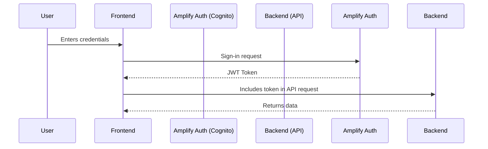
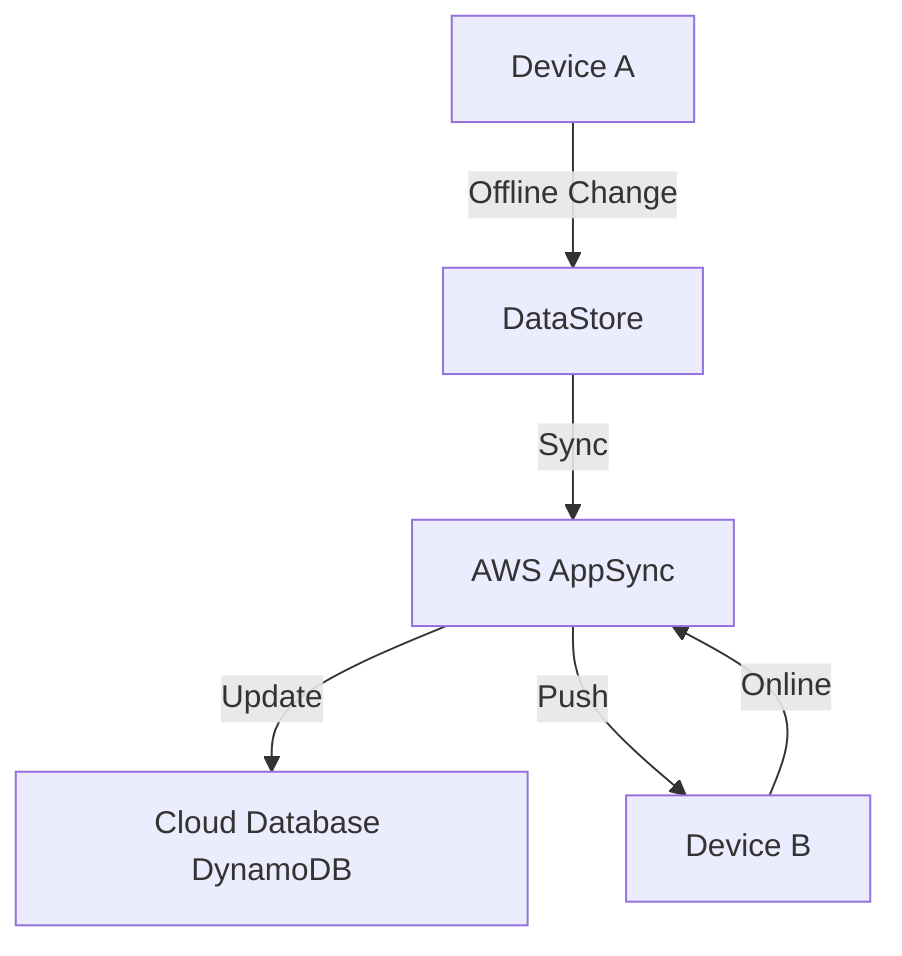
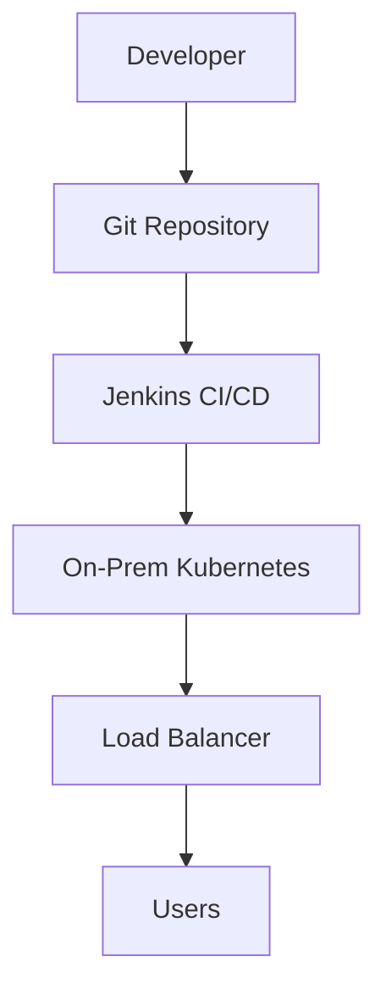

# Amplify

## Amazon Amplify

AWS Amplify is designed to accelerate full-stack application development by providing a suite of tools and services for both frontend and backend development.

AWS Amplify is a comprehensive development platform provided by Amazon Web Services (AWS) that simplifies the process of building, deploying, and scaling full-stack web and mobile applications. It integrates seamlessly with various AWS services, offering a unified workflow for developers. Below is a detailed analysis of AWS Amplify, covering its overview, problem statement, core principles, pre-requirements, implementation steps, data flow diagrams, security measures, use cases, costing, alternatives, benefits, and more.

<figure><figcaption></figcaption></figure>

### 🌟 Overview

AWS Amplify is designed to accelerate full-stack application development by providing a suite of tools and services for both frontend and backend development. It supports popular frameworks like React, Angular, Vue, Next.js, and mobile platforms like iOS, Android, Flutter, and React Native. Amplify abstracts the complexity of cloud infrastructure, allowing developers to focus on building features rather than managing servers.

**Innovation Spotlight**:

* **Gen 2 Developer Experience (2024)**: A code-first approach using TypeScript to define backend resources (data models, auth rules, functions) with type safety and automatic provisioning.
* **AI Integration (2024)**: Amplify AI Kit connects to Amazon Bedrock for generative AI use cases, enabling features like chat UI components and typed clients with minimal code.
* **Monorepo Support (2023)**: Efficiently handles monorepos (Nx, Turborepo) with diff builds and caching, ideal for micro-frontends.
* **Next.js SSR/ISR Support (2022)**: Production-ready server-side rendering (SSR) and incremental static regeneration (ISR) for improved SEO and performance.

### ⚡ Problem Statement

**Real-World Scenario**: A startup wants to build a scalable e-commerce platform with authentication, real-time inventory updates, and AI-powered product recommendations. Traditionally, this would require manual setup of cloud resources (e.g., Cognito for auth, AppSync for APIs, Lambda for functions), leading to prolonged development cycles, infrastructure management overhead, and high costs.

**Industries/Applications**:

* **E-commerce**: For building dynamic product catalogs, user authentication, and payment processing.
* **Healthcare**: Secure patient portals with real-time data synchronization and compliance (e.g., HIPAA).
* **Gaming**: Multiplayer games with real-time leaderboards and chat functionality using WebSockets and WebRTC.
* **FinTech**: Secure banking apps with encryption, fraud detection, and transactional analytics.

### # 🤝 Business Use Cases

* **Neiman Marcus**: Used Amplify to build a serverless retail app, reducing development costs by 90% and accelerating time-to-market.
* **Noom**: Leveraged Amplify's CI/CD for A/B testing, enabling 8-12 tests per week with automated deployments.
* **Amazon Music**: Scaled to handle 70,000 transactions per second for music syncing using AppSync and Amplify.

### 🔥 Core Principles

Amplify is built on serverless architecture, enabling event-driven computing, scalability, and pay-per-use pricing. Key services and terms:

* **Authentication**: Powered by Amazon Cognito, providing pre-built UI components for sign-up, sign-in, MFA, and social logins (e.g., Facebook, Google).
* **DataStore**: Offline-first data synchronization with GraphQL, automatically syncing data between devices and cloud (powered by AWS AppSync).
* **API**: REST and GraphQL endpoints powered by AWS AppSync and API Gateway, with real-time updates and offline support.
* **Storage**: Secure file storage (e.g., images, videos) using Amazon S3, with access controls (public, protected, private).
* **Hosting**: Global CDN deployment via Amazon CloudFront with built-in CI/CD, SSL certificates, and custom domains.
* **Analytics**: User behavior tracking powered by Amazon Pinpoint and Kinesis for insights and marketing campaigns.
* **Functions**: Serverless Lambda functions for custom business logic, integrable with APIs.
* **Predictions**: AI/ML capabilities (e.g., text translation, image recognition) via Amazon SageMaker and Bedrock.

### 📋 Pre-Requirements

* **AWS Account**: Required to access Amplify and related services.
* **Git Repository**: Code hosted on GitHub, Bitbucket, GitLab, or AWS CodeCommit for CI/CD.
* **Node.js and Amplify CLI**: Installed locally for project initialization and deployment.
* **Framework Knowledge**: Basic understanding of React, Angular, Vue, or mobile frameworks.
* **IAM Permissions**: Configured roles for least privilege access to AWS resources.

### 👣 Implementation Steps

1.  **Install Amplify CLI**:

    ```bash
    npm install -g @aws-amplify/cli
    amplify configure
    ```
2.  **Initialize Project**:

    ```bash
    amplify init
    ```
3. **Add Backend Services**:
   * Authentication: `amplify add auth`
   * API: `amplify add api` (GraphQL or REST)
   * Storage: `amplify add storage`
   * Functions: `amplify add function`
4.  **Deploy**:

    ```bash
    amplify push
    ```
5. **Host Frontend**:
   * Connect Git repository to Amplify Console for automatic deployments.
6. **Monitor**: Use Amplify Console to track builds, performance, and errors.

### 🗺️ Data Flow Diagram

Below Mermaid diagrams illustrate typical data flows in Amplify applications:

**Diagram 1: Authentication Flow**



**Diagram 2: Real-Time Data Sync with DataStore**



**Diagram 3: CI/CD Pipeline for Hosting**


### 🔒 Security Measures

* **Encryption**: Data encrypted at rest (AWS KMS) and in transit (SSL/TLS).
* **IAM Roles**: Least privilege access for functions and resources.
* **VPC Isolation**: Optional VPC deployment for sensitive workloads.
* **WAF Integration**: Protect against SQL injection and XSS attacks ($15/month per app).
* **Cognito Policies**: Fine-grained access control for users and groups.

### ⚖️ When to Use and When Not to Use

* **✅ When to Use**:
  * Rapid prototyping and MVP development.
  * Full-stack applications requiring authentication, APIs, and storage.
  * Teams needing built-in CI/CD and hosting.
  * Projects leveraging AI/ML or real-time data.
* **❌ When Not to Use**:
  * Highly customized infrastructure requiring low-level control.
  * On-premises deployments without cloud connectivity.
  * Applications with predictable, high traffic where reserved instances might be cheaper.

### 💰 Costing Calculation

Amplify uses pay-per-use pricing:

* **Build Minutes**: $0.01/min (Standard Instance), $0.025/min (Large), $0.10/min (XLarge).
* **Hosting**: $0.023/GB/month for storage, $0.15/GB for data transfer out.
* **SSR Requests**: $0.30/million requests after 500,000 free requests.
* **Example Calculation**:
  * 5 developers, 20 commits/month, 3 min/build: 5 \* 20 \* 3 \* $0.01 = $6.
  * 10,000 users, 1.5 MB/page, 30 days: 439.45 GB \* $0.15 = $65.92.
  * **Total**: \~$72/month.

### 🧩 Alternative Services

| Platform       | Service          | Key Differences                                                     |
| -------------- | ---------------- | ------------------------------------------------------------------- |
| **AWS**        | Amplify          | Integrated frontend/backend, serverless, pay-per-use                |
| **Azure**      | Static Web Apps  | Tight Azure integration, less backend flexibility                   |
| **GCP**        | Firebase         | Similar features (Auth, Firestore), but limited to Google ecosystem |
| **On-Premise** | Kubernetes + OSS | Full control but requires manual setup of CI/CD, auth, and scaling  |

**On-Premise Data Flow**:



### ✅ Benefits

* **Cost Savings**: Pay-per-use model; 90% reduction reported by Neiman Marcus.
* **Scalability**: Automatic scaling to millions of users with CloudFront CDN.
* **Automation**: CI/CD pipelines eliminate manual deployments.
* **Performance**: Global edge network for low latency.
* **Developer Experience**: Pre-built components and TypeScript support reduce code time.

### 📝 Summary

AWS Amplify is a powerful platform for building and deploying full-stack applications quickly, with built-in scalability, security, and AI capabilities. It ideal for startups and enterprises seeking to reduce development time and costs.

**Key Takeaways**:

1. Use Amplify for rapid prototyping and serverless applications.
2. Leverage Gen 2 for type-safe backend development.
3. Monitor build minutes and data transfer to control costs.
4. Implement least privilege IAM roles for security.
5. Integrate AI features easily with Bedrock.
6. Use DataStore for offline-first applications.
7. Utilize monorepo support for large projects.
8. Enable WAF for production apps.
9. Explore free tier for initial development.
10. Connect existing AWS resources for hybrid setups.

### 🔗 Related Topics

* [AWS Amplify Documentation](https://docs.amplify.aws/)
* [Amplify Gen 2 Workshop](https://docs.amplify.aws/gen2/workshop/)
* [Amazon Bedrock for Generative AI](https://docs.amplify.aws/android/build-a-backend/data/custom-business-logic/connect-bedrock/)
* [AWS Free Tier Details](https://aws.amazon.com/free/)

