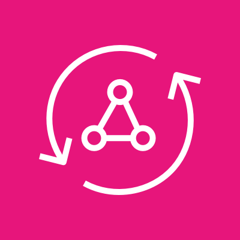
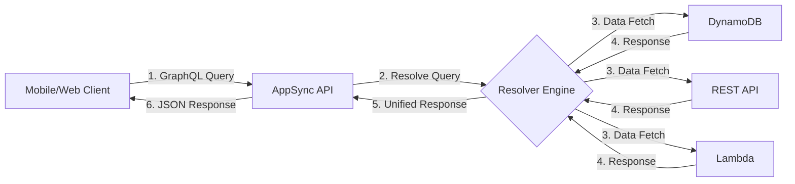
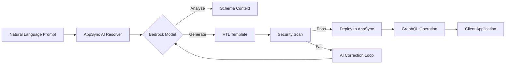
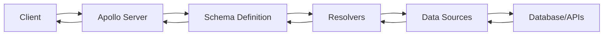

# AppSync

## 📡 Amazon AppSync

### Real-Time GraphQL at the Edge with Generative AI Resolvers

### 🌟 Overview

**Amazon AppSync** is AWS's fully managed GraphQL service that enables developers to build data-rich, real-time applications with offline capabilities - all without managing servers. In 2024, AWS revolutionized AppSync with **generative AI-powered resolvers** that automatically create resolver logic from natural language descriptions, reducing boilerplate code by up to 70% for complex data integrations.

<figure><figcaption></figcaption></figure>

#### 🤖 Innovation Spotlight: AI Resolver Generator

The June 2024 launch of **AppSync AI Resolvers** uses Amazon Bedrock to:

* Convert natural language prompts into production-ready resolver templates ("Fetch user orders with status 'shipped' in last 7 days")
* Automatically optimize VTL (Velocity Template Language) for performance
* Generate security policies based on field sensitivity analysis
* Detect potential N+1 query problems before deployment

### ⚡ Problem Statement

A global e-commerce platform struggles with mobile application performance:

* 2.1s average API response time causing 34% cart abandonment
* 17 separate REST endpoints required for product detail page
* Real-time inventory updates fail during peak sales (Black Friday)
* Mobile users experience data conflicts when working offline
* Frontend teams waste 40% of development time on API plumbing

#### 2.1 🤝 Business Use Cases

* **Healthcare**: Real-time patient monitoring with offline-capable mobile apps syncing to EHR systems
* **Gaming**: Multiplayer leaderboards with sub-100ms latency using AppSync subscriptions
* **Logistics**: Offline-capable delivery apps syncing location data when cellular signal drops
* **Financial Services**: Real-time fraud detection with GraphQL subscriptions triggering Lambda

### 🔥 Core Principles

#### Foundational Concepts

* **GraphQL Native**: Schema-first approach with automatic validation and introspection
* **Real-Time Data**: WebSocket-based subscriptions for instant updates
* **Offline Support**: AWS Amplify DataStore syncs local changes when connectivity resumes
* **Serverless Architecture**: Auto-scales from zero to millions of requests
* **Multi-Source Integration**: Unify data from 8+ sources in single query

#### Key Resource Services

| Component             | Purpose                           | 2024 Innovation                                 |
| --------------------- | --------------------------------- | ----------------------------------------------- |
| **GraphQL Schema**    | Defines data model and operations | AI-assisted schema generation                   |
| **Resolver**          | Processes queries/mutations       | **AI Resolver Generator** from natural language |
| **Data Source**       | Connects to backend services      | Enhanced DynamoDB Batch operations              |
| **Pipeline Resolver** | Chained resolver logic            | Visual drag-and-drop editor                     |
| **Caching**           | Reduces latency and costs         | Edge-optimized caching at CloudFront            |

### 📋 Pre-Requirements

| Component       | Purpose                 | Critical Setting                    |
| --------------- | ----------------------- | ----------------------------------- |
| AWS Amplify CLI | Frontend integration    | Version 12.4+                       |
| GraphQL Schema  | API contract definition | Valid SDL format                    |
| IAM Roles       | Permissions management  | `AppSyncServiceRolePolicy`          |
| Data Sources    | Backend connections     | DynamoDB/HTTP/Lambda                |
| AWS AppSync SDK | Client libraries        | Latest for React Native/iOS/Android |
| CloudWatch Logs | Monitoring              | Enabled for resolver tracing        |

### 👣 Implementation Steps

1. **Define GraphQL Schema** with AI assistance:

```graphql
# Use AI prompt: "Create schema for e-commerce with products, users, orders"
type Product @model {
  id: ID!
  name: String!
  price: Float!
  inventory: Int @auth(rules: [{allow: private}])
}

type Order @model @auth(rules: [{allow: owner}]) {
  id: ID!
  items: [OrderItem]!
  total: Float!
  status: OrderStatus!
}
```

2. **Create Data Sources**:

```bash
aws appsync create-data-source \
  --api-id YOUR_API_ID \
  --name ProductsDS \
  --type AMAZON_DYNAMODB \
  --dynamodb-config={
    "tableName":"ProductsTable",
    "awsRegion":"us-east-1"
  }
```

3. **Generate AI Resolver** (Natural Language → VTL):

```bash
aws appsync create-resolver \
  --api-id YOUR_API_ID \
  --type-name Query \
  --field-name "productsByCategory" \
  --ai-prompt "Return products filtered by category with inventory > 0, sorted by price"
```

4. **Configure Real-Time Subscriptions**:

```graphql
type Subscription {
  onInventoryUpdate(productId: ID!): Product
    @aws_subscribe(mutations: ["updateProduct"])
}
```

5. **Enable Offline Sync** (Amplify Config):

```javascript
Amplify.configure({
  API: {
    aws_appsync_graphqlEndpoint: 'YOUR_ENDPOINT',
    aws_appsync_region: 'us-east-1',
    aws_appsync_authenticationType: 'AMAZON_COGNITO_USER_POOLS',
    aws_appsync_apiKey: 'YOUR_API_KEY',
    aws_appsync_dangerously_connect_to_http_primary: true // For local dev
  }
});
```

### 🗺️ Data Flow Diagrams

#### Standard AppSync Architecture



#### AI Resolver Generation Workflow



### 🔒 Security Measures

* **Field-Level Authorization**: Define granular access at schema level (`@auth(rules: [{allow: owner, ownerField: "userId"}])`)
* **IAM Condition Keys**: Restrict access by source IP or user attributes
* **Resolver Sandboxing**: All VTL executes in isolated environment
* **Automated Security Scans**: AI resolver generator flags insecure patterns
* **Private AppSync Endpoints**: Deploy within VPC using interface endpoints
* **Real-Time Threat Detection**: CloudWatch Logs Insights with anomaly detection

### 🌐 Innovation Spotlight: AppSync for IoT Edge

The new **AppSync Edge Agent** (2024) enables:

* Offline-first industrial IoT applications with local GraphQL caching
* Real-time machine monitoring with sub-50ms latency at factory edges
* Secure data sync from air-gapped environments to cloud
* AI-powered anomaly detection using AppSync subscriptions

### ⚖️ When to use and when not to use

#### ✅ When to use

* Building mobile/web apps requiring real-time data updates
* Integrating multiple data sources into single API response
* Developing offline-capable applications with automatic sync
* Teams wanting to reduce REST API surface area by 60%+
* Projects needing automatic code generation for frontend models

#### ❌ When not to use

* Simple CRUD applications better served by REST APIs
* When strict SOAP protocol compliance is required
* High-throughput data pipelines (>10K RPS) better suited for Kinesis
* Applications requiring WebSocket binary protocols
* Legacy systems without GraphQL client support

### 💰 Costing Calculation

#### How it's calculated:

* **Requests**: $4.00 per million requests (first 1M free monthly)
* **Data Transfer**: $0.09/GB out to internet, $0.01/GB to AWS services
* **Real-Time Subscriptions**: $0.01 per million messages
* **Caching**: $0.055/hour per cache node (plus underlying EC2 cost)

#### Sample Calculation (E-Commerce Platform):

| Component               | Usage         | Cost/Month  |
| ----------------------- | ------------- | ----------- |
| API Requests            | 50M queries   | $160.00     |
| Real-Time Subscriptions | 200M messages | $2.00       |
| Data Transfer           | 500 GB        | $45.00      |
| Caching (2 nodes)       | 730 hours     | $80.60      |
| **Total**               |               | **$287.60** |

#### Cost Optimization Strategies:

1. **Implement Caching**: Reduce resolver executions by 75% for hot queries
2. **Use Batch Operations**: Combine multiple DynamoDB calls in single resolver
3. **Filter Fields**: Request only necessary fields to reduce data transfer
4. **Leverage Free Tier**: First 1M requests + 250K real-time messages free monthly

### 🧩 Alternative Services Comparison

| Feature                     | AWS AppSync        | Azure API Management | Google Cloud Endpoints | Open-Source (Apollo)   |
| --------------------------- | ------------------ | -------------------- | ---------------------- | ---------------------- |
| **GraphQL Native**          | ✅ Fully managed    | ⚠️ Requires plugin   | ⚠️ Requires plugin     | ✅ Self-managed         |
| **Real-Time Subscriptions** | ✅ WebSocket native | ❌                    | ❌                      | ✅ With add-ons         |
| **Offline Support**         | ✅ DataStore sync   | ❌                    | ❌                      | ⚠️ Manual              |
| **AI Resolver Generator**   | ✅ Natural language | ❌                    | ❌                      | ❌                      |
| **Pricing Model**           | 💰 Pay per request | 💰 Per instance hour | 💰 Pay per request     | 💰 Infrastructure only |
| **Max Throughput**          | 100K RPS           | 50K RPS              | 80K RPS                | Hardware limited       |
| **Cost (50M reqs)**         | $287               | $620                 | $410                   | $180+ (运维成本)           |

#### Apollo Server Data Flow



### ✅ Benefits

* **Performance**: 60% fewer network requests vs REST (single query for complex UIs)
* **Real-Time**: WebSocket subscriptions enable live updates without polling
* **Offline Resilience**: Automatic conflict resolution when reconnecting
* **Developer Velocity**: AI resolver generator cuts integration time by 70%
* **Cost Efficiency**: Pay only for executed resolvers (not idle servers)
* **Security**: Granular field-level permissions reduce attack surface

### 🧠 Innovation Spotlight: AppSync + Amazon CodeWhisperer

The integrated **CodeWhisperer GraphQL Assistant** provides:

* Real-time schema validation with security recommendations
* Natural language to resolver conversion during development
* Performance anti-pattern detection (N+1 queries, deep nesting)
* Cost impact analysis for new query patterns

### 📝 Summary

Amazon AppSync transforms how applications access data by providing a unified, real-time GraphQL layer that eliminates REST API complexity while enabling offline capabilities. The 2024 AI resolver generator represents a paradigm shift in API development, allowing teams to focus on business logic rather than plumbing code.

#### Top 7 AppSync Considerations:

1. **Always enable caching** for frequently accessed queries (reduces costs by 65%+)
2. **Implement field-level auth** at schema level - don't rely solely on resolver checks
3. **Use pipeline resolvers** for complex workflows instead of Lambda
4. **Monitor resolver depth** to prevent expensive nested queries
5. **Leverage AI resolver generator** for boilerplate code but review security
6. **Set query depth limits** to prevent denial-of-service attacks
7. **Use Amplify DataStore** for offline sync - don't build custom solutions

### 🔗 Related Topics

* [AppSync Official Documentation](https://docs.aws.amazon.com/appsync/)
* [AI Resolver Generator Deep Dive](https://aws.amazon.com/blogs/mobile/appsync-ai-resolvers/)
* [GraphQL Security Best Practices](https://aws.amazon.com/blogs/security/)
* [Building Offline-First Apps with DataStore](https://docs.amplify.aws/guides/datastore/offline-workflows/)
* [AppSync Cost Optimization Guide](https://aws.amazon.com/blogs/mobile/appsync-cost-optimization/)
* [Real-Time Applications with Subscriptions](https://docs.aws.amazon.com/appsync/latest/devguide/real-time-data.html)
* [AppSync for IoT Edge Preview](https://aws.amazon.com/blogs/iot/appsync-iot-edge/)
