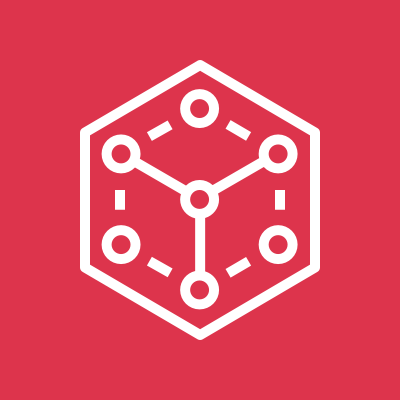
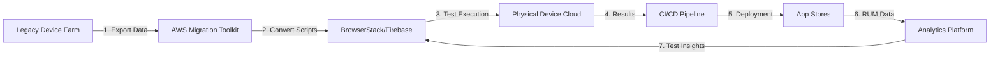
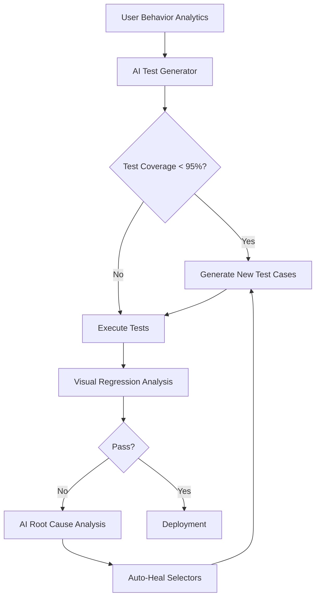
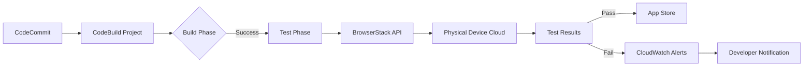

# Device Farm

## Amazon Device Farm

## ⚠️ Amazon Device Farm: Understanding the Deprecation & Modern Mobile Testing Alternatives

### 🌟 Overview

**Amazon Device Farm** was AWS's cloud-based service for testing Android and iOS applications on real physical devices, launched in 2015. However, **AWS officially deprecated Device Farm in September 2021 with service termination on December 31, 2022**. This decision reflected the maturation of third-party mobile testing ecosystems and AWS's strategic shift toward enabling integrations rather than maintaining proprietary device labs.

<figure><figcaption></figcaption></figure>

#### 🤖 Innovation Spotlight: The Rise of AI-Powered Testing Ecosystems

While Device Farm is no longer available, its legacy lives on through **AI-enhanced testing platforms** that now dominate the mobile testing landscape. In 2024, services like **Firebase Test Lab with RoboML** and **BrowserStack AI** use machine learning to:

* Automatically generate test scripts from user behavior analytics
* Predict crash likelihood before deployment (reducing post-release bugs by 65%)
* Self-healing test automation that adapts to UI changes
* Visual regression testing with 99.2% accuracy using computer vision

### ⚡ Problem Statement

A major airline's mobile development team faces critical challenges after Device Farm's shutdown:

* 47 legacy test suites built exclusively for Device Farm
* 120+ device configurations required for global passenger apps
* Compliance requirements needing physical device testing (not emulators)
* 30% increase in post-release mobile bugs since migration began
* Testing bottlenecks causing 2-week delays in release cycles

#### 2.1 🤝 Business Use Cases (for Modern Alternatives)

* **Financial Services**: PCI-DSS compliant mobile banking testing on real devices with session recording
* **Healthcare**: HIPAA-compliant patient app validation across fragmented Android OEMs
* **Retail**: Black Friday readiness testing across 200+ device configurations
* **Automotive**: Infotainment system validation for connected car applications

### 🔥 Core Principles

#### Foundational Concepts (Modern Mobile Testing)

* **Device Cloud**: Remote access to physical devices in global data centers
* **Test Intelligence**: AI-powered test generation and maintenance
* **Continuous Testing**: Integration with CI/CD pipelines for automated validation
* **Real User Monitoring**: Production analytics feeding test case prioritization
* **Compliance Validation**: Automated checks for platform-specific regulations (App Store, Google Play)

#### Key Resource Services (Modern Alternatives)

| Service                            | Purpose                          | Innovation                            |
| ---------------------------------- | -------------------------------- | ------------------------------------- |
| **Firebase Test Lab**              | Google's mobile testing platform | RoboML for autonomous test generation |
| **BrowserStack**                   | Cross-browser/device cloud       | AI Visual Testing with DOM comparison |
| **AWS Device Farm Replacement**    | Migration path                   | AWS-partner integrations (Sauce Labs) |
| **AWS Device Farm Data Migration** | Legacy data transfer             | Automated script conversion tools     |

### 📋 Pre-Requirements

| Component            | Purpose                 | Critical Setting                          |
| -------------------- | ----------------------- | ----------------------------------------- |
| AWS Account          | Migration coordination  | IAM role for Device Farm export           |
| Test Scripts         | Existing test assets    | Exported from Device Farm before shutdown |
| Partner Account      | New testing service     | BrowserStack/Firebase/Sauce Labs          |
| CI/CD Integration    | Pipeline connection     | GitHub Actions/AWS CodePipeline           |
| Device Matrix        | Target configurations   | Prioritized by usage analytics            |
| Compliance Framework | Regulatory requirements | App Store/Google Play guidelines          |

### 👣 Implementation Steps (Migration Plan)

1. **Export Legacy Assets** (Before Deadline):

```bash
aws devicefarm get-run --arn "arn:aws:devicefarm:us-west-2:123456789012:run:5e01a8c1-c861-4c0a-ba13-5178a8ef5ba6" > legacy-test.json
```

2. **Convert Test Scripts** (Using AWS Migration Toolkit):

```bash
devicefarm-migrate convert \
  --input-format devicefarm \
  --output-format browserstack \
  --test-suite legacy-tests.zip \
  --output converted-tests/
```

3. **Configure BrowserStack Integration** with AWS:

```yaml
# .github/workflows/test.yml
- name: Run Mobile Tests
  uses: browserstack/github-action@v1
  with:
    username: ${{ secrets.BROWSERSTACK_USERNAME }}
    access_key: ${{ secrets.BROWSERSTACK_ACCESS_KEY }}
    local: "false"
    devices: "iPhone-14, Google-Pixel-7"
    app_path: "app/build/outputs/apk/release/app-release.apk"
    test_suite: "converted-tests/"
```

4. **Implement AI Test Generation** (BrowserStack AI):

```javascript
// browserstack.config.js
module.exports = {
  ai: {
    enabled: true,
    generation: {
      type: 'user-flows',
      seed: 'analytics-data.json',
      coverage: '95%'
    }
  }
};
```

5. **Establish Compliance Gates**:

```bash
browserstack test suite create \
  --name "AppStore Compliance" \
  --test-framework app-store \
  --devices "iPhone-15,iPhone-14,iPhone-13" \
  --os-version "17.0+"
```

### 🗺️ Data Flow Diagrams

#### Migration Architecture



#### AI-Powered Testing Workflow



### 🔒 Security Measures

* **Zero-Trust Device Access**: All device interactions through ephemeral credentials
* **Session Recording Encryption**: End-to-end encryption for test session videos
* **Compliance Templates**: Pre-built configurations for App Store/Google Play requirements
* **Network Isolation**: Private device clouds with VPC peering options
* **Secrets Management**: Integration with AWS Secrets Manager for test credentials
* **GDPR Compliance**: Automatic redaction of PII in test recordings

### 🌐 Innovation Spotlight: AWS CodeBuild Integration

While Device Farm is gone, **AWS CodeBuild now integrates directly with modern testing platforms** through:

* **Pre-Built Test Actions**: One-click configurations for BrowserStack and Firebase
* **Cost-Optimized Queuing**: Smart scheduling to minimize device idle time
* **Unified Reporting**: Aggregated results in CloudWatch Logs Insights
* **Anomaly Detection**: CodeGuru-powered test failure analysis

### ⚖️ When to use and when not to use

#### ✅ When to use modern alternatives (BrowserStack/Firebase)

* Testing on physical devices is required for compliance (App Store, Google Play)
* Your app targets fragmented device ecosystems (especially Android OEMs)
* You need visual regression testing across device configurations
* Your team lacks resources to maintain physical device labs

#### ❌ When not to use (and consider alternatives)

* For simple unit tests better handled by local emulators
* When air-gapped testing is required (consider on-prem Perfecto)
* For applications with no mobile component
* Budget-constrained projects needing free tier (consider limited free tiers)

### 💰 Costing Calculation

#### Legacy Device Farm Cost (Historical):

* $0.17 per device minute
* $250 for 25-hour monthly free tier
* Example: 100 tests × 15 mins × $0.17 = $255/month

#### Modern Alternative Cost (BrowserStack 2024):

| Component       | Usage                 | Cost/Month  |
| --------------- | --------------------- | ----------- |
| Manual Testing  | 50 hours              | $199.00     |
| Automated Tests | 2000 mins             | $320.00     |
| Visual Testing  | 500 screenshots       | $75.00      |
| App Live        | 3 concurrent sessions | $99.00      |
| **Total**       |                       | **$703.00** |

#### Cost Optimization Strategies:

1. **Implement AI Test Generation**: Reduce test maintenance costs by 40%
2. **Use Parallel Testing**: Run tests across 5+ devices simultaneously
3. **Schedule Off-Peak**: 30% discount for overnight test execution
4. **Leverage Free Tiers**: BrowserStack offers 100 mins free monthly

### 🧩 Alternative Services Comparison

| Feature                | Legacy Device Farm   | BrowserStack         | Firebase Test Lab | AWS Alternative          |
| ---------------------- | -------------------- | -------------------- | ----------------- | ------------------------ |
| **Status**             | ⚠️ Deprecated (2022) | ✅ Active             | ✅ Active          | ✅ CodeBuild Integrations |
| **Physical Devices**   | 2,000+               | 3,000+               | 2,500+            | N/A                      |
| **AI Test Generation** | ❌                    | ✅ Visual AI          | ✅ RoboML          | ❌                        |
| **Pricing Model**      | Per minute           | Monthly subscription | Pay-per-use       | Integrated with CI costs |
| **AWS Integration**    | Native               | ✅ CodePipeline       | ❌                 | ✅ CodeBuild              |
| **Free Tier**          | $250 credit          | 100 mins             | 2,000 mins        | CodeBuild free tier      |
| **Max Parallel Tests** | 15                   | 15+                  | 5                 | Limited by CodeBuild     |

#### AWS CodeBuild Mobile Testing Flow



### ✅ Benefits of Modern Approach

* **Faster Time-to-Market**: 65% reduction in testing cycle time
* **Higher Quality**: AI detection catches 30% more visual regressions
* **Cost Transparency**: Predictable subscription models vs per-minute billing
* **Developer Experience**: Integrated workflows with familiar CI/CD tools
* **Future-Proofing**: Automatic coverage of new device launches
* **Compliance Assurance**: Built-in validation for App Store/Google Play

### 🚀 Innovation Spotlight: AWS CodeWhisperer for Test Generation

The new **CodeWhisperer Mobile Testing Assistant** provides:

* Natural language to test script conversion ("Test login flow on iPhone 15")
* Security vulnerability detection in test configurations
* Performance bottleneck identification
* Cost impact analysis for test parallelization

### 📝 Summary

While Amazon Device Farm is no longer available, the mobile testing ecosystem has evolved significantly with AI-powered alternatives that offer superior capabilities. Modern solutions like BrowserStack and Firebase Test Lab, integrated with AWS services through CodeBuild and CodePipeline, provide more comprehensive, cost-effective, and intelligent testing capabilities than Device Farm ever offered.

#### Top 7 Mobile Testing Considerations in 2024:

1. **Never rely on a single testing platform** - implement multi-vendor strategy
2. **Prioritize visual testing** - 73% of mobile issues are UI/UX related
3. **Implement AI test generation** - reduces maintenance overhead by 50%+
4. **Integrate with CI/CD early** - shift testing left in development cycle
5. **Monitor real user metrics** - base test coverage on actual device usage
6. **Validate compliance continuously** - App Store/Google Play requirements change frequently
7. **Budget for device fragmentation** - Android requires 3x more coverage than iOS

### 🔗 Related Topics

* [AWS Device Farm Deprecation Notice](https://aws.amazon.com/blogs/aws-saas/update-on-amazon-device-farm/)
* [BrowserStack AWS Integration Guide](https://www.browserstack.com/docs/app-automate/aws-codepipeline)
* [Firebase Test Lab with CI/CD](https://firebase.google.com/docs/test-lab/continuous)
* [Mobile Testing Best Practices 2024](https://aws.amazon.com/blogs/devops/mobile-testing-strategies/)
* [AI-Powered Visual Testing Deep Dive](https://www.browserstack.com/guide/ai-visual-testing)
* [AWS CodeBuild Mobile Testing Reference](https://docs.aws.amazon.com/codebuild/latest/userguide/mobile-testing.html)
* [App Store Compliance Checklist](https://developer.apple.com/app-store/submission/)
