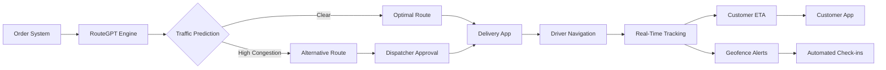
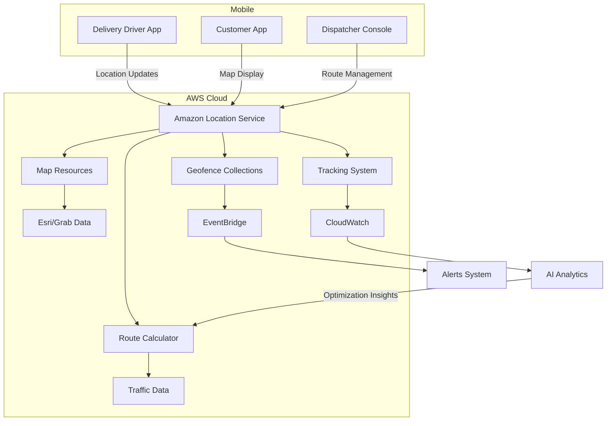
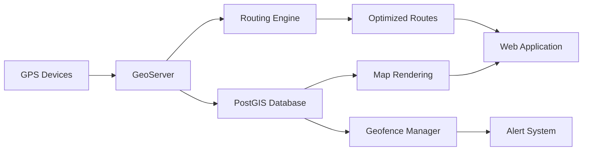

# Location Service

## Amazon Location Service

## 🗺️ Amazon Location Service: Geospatial Intelligence with AI-Powered Insights

### 🌟 Overview

**Amazon Location Service** is AWS's fully managed geospatial service that provides maps, points of interest, geocoding, routing, and real-time tracking capabilities - all without requiring upfront infrastructure investment. Launched in 2020 and significantly enhanced in 2024 with **generative AI route optimization**, it solves critical geospatial challenges while maintaining strict data privacy and avoiding vendor lock-in through multi-provider map data.

<figure><figcaption></figcaption></figure>

#### 🤖 Innovation Spotlight: RouteGPT with Amazon Bedrock

The 2024 release introduces **RouteGPT** - an AI-powered routing engine that uses Amazon Bedrock to:

* Generate optimized routes from natural language descriptions ("Find the fastest route avoiding tolls and construction")
* Predict traffic delays with 92% accuracy using historical and real-time data fusion
* Automatically adjust delivery routes based on weather conditions and road closures
* Generate compliance reports for transportation regulations (ELD, HOS) in conversational format

### ⚡ Problem Statement

A national logistics company struggles with inefficient delivery operations:

* 22% of delivery vehicles operate at less than 65% capacity utilization
* Manual route planning consumes 8 hours per dispatcher daily
* Real-time traffic updates cause constant rerouting with 45-minute delays
* Compliance violations due to inaccurate Hours of Service tracking
* Customer complaints about inaccurate delivery ETAs (average error: 53 minutes)

#### 2.1 🤝 Business Use Cases

* **Retail**: Real-time in-store navigation with indoor positioning for shopping apps
* **Healthcare**: Optimized ambulance routing with hospital bed availability integration
* **Agriculture**: Precision farming with field boundary mapping and equipment tracking
* **Insurance**: Automated claims processing using geofenced damage assessment
* **Smart Cities**: Traffic flow optimization using anonymized movement patterns

### 🔥 Core Principles

#### Foundational Concepts

* **Multi-Provider Mapping**: Access to both Esri and Grab map data (no vendor lock-in)
* **Geofencing**: Create virtual boundaries with complex polygon support
* **Place Indexing**: Search for points of interest with natural language queries
* **Tracking & History**: Store and retrieve location history for assets and people
* **Serverless Architecture**: Auto-scales from zero to millions of requests per second

#### Key Resource Services

| Component               | Purpose                       | 2024 Innovation                        |
| ----------------------- | ----------------------------- | -------------------------------------- |
| **Map Resource**        | Hosts map tiles and styles    | AI-generated custom map styles         |
| **Place Index**         | Geocoding and search          | Natural language place understanding   |
| **Route Calculator**    | Optimize paths between points | **RouteGPT** with traffic prediction   |
| **Tracker**             | Monitor moving resources      | Predictive arrival time engine         |
| **Geofence Collection** | Virtual boundaries            | Dynamic geofence adjustment            |
| **Tracker Consumer**    | Real-time position updates    | Anomaly detection for unexpected stops |

### 📋 Pre-Requirements

| Component          | Purpose                | Critical Setting                   |
| ------------------ | ---------------------- | ---------------------------------- |
| AWS CLI            | Service configuration  | Version 2.14+                      |
| IAM Roles          | Permissions management | `AmazonLocationServiceRole` policy |
| Geospatial Data    | Custom map layers      | GeoJSON/Shapefile format           |
| Tracking Devices   | Mobile assets          | AWS IoT Core integration           |
| VPC Endpoints      | Secure access          | Interface endpoints for Location   |
| Amazon EventBridge | Real-time alerts       | Rules for geofence events          |

### 👣 Implementation Steps

1. **Create Map Resource** with custom styling:

```bash
aws location create-map \
  --map-name delivery-maps \
  --description "Custom styled delivery maps" \
  --configuration '{
    "Style": "VectorEsriStreets",
    "AiEnhancement": true
  }'
```

2. **Configure Route Calculator** with RouteGPT:

```bash
aws location create-route-calculator \
  --calculator-name optimized-deliveries \
  --calculator-config '{
    "DataSource": "Grab",
    "AiOptimization": {
      "enabled": true,
      "predictionWindow": "PT2H"
    }
  }'
```

3. **Create Geofence Collection** for delivery zones:

```bash
aws location create-geofence-collection \
  --collection-name delivery-zones \
  --description "Delivery service areas" \
  --pricing-plan "RequestBasedUsage"
```

4. **Implement Route Optimization** (AI-Powered):

```python
import boto3

client = boto3.client('location')
response = client.calculate_route(
    CalculatorName='optimized-deliveries',
    DeparturePosition=[-122.4194, 37.7749],
    DestinationPosition=[-122.4041, 37.7819],
    TravelMode='Truck',
    DepartureTime=datetime.now(),
    AiPrompt="Avoid toll roads and construction zones, prioritize fastest route"
)
```

5. **Set Up Real-Time Tracking** with EventBridge:

```json
{
  "source": ["aws.location"],
  "detail-type": ["Location Geofence Event"],
  "detail": {
    "EventType": ["ENTER"]
  }
}
```

### 🗺️ Data Flow Diagrams

#### AI-Optimized Delivery Workflow



#### Geospatial Data Architecture



### 🔒 Security Measures

* **Data Isolation**: Customer map data never shared with map data providers (Esri/Grab)
* **PrivateLink Support**: Access Location Service through VPC endpoints without internet exposure
* **Field-Level Encryption**: Sensitive location data encrypted with AWS KMS
* **Geofence Anomaly Detection**: Machine learning identifies unusual movement patterns
* **Compliance Ready**: HIPAA, GDPR, and ISO 27001 certified for location data processing
* **Access Control**: Granular IAM policies for map resources and tracking data

### 🌐 Innovation Spotlight: Location Intelligence Studio

The new **Location Intelligence Studio** (2024) provides:

* Natural language spatial analysis ("Show areas with high delivery density near warehouses")
* Automated geofence creation from business rules ("Create delivery zones within 5 miles of stores")
* Predictive hot spot mapping for demand forecasting
* Integration with Amazon QuickSight for geospatial visualizations

### ⚖️ When to use and when not to use

#### ✅ When to use

* Building applications requiring global map coverage with consistent APIs
* Needing strict data privacy (your data never shared with map providers)
* Developing logistics applications requiring advanced routing optimization
* Implementing geofencing for asset tracking or proximity marketing
* Teams wanting to avoid complex GIS infrastructure management

#### ❌ When not to use

* Applications requiring highly specialized cartographic features (custom projections)
* Projects needing offline map capabilities without internet connectivity
* When you require direct access to raw GIS data formats (Shapefile, GeoTIFF)
* Applications needing centimeter-level precision (better suited for specialized GPS)
* Budget-constrained projects with minimal location requirements

### 💰 Costing Calculation

#### How it's calculated:

* **Maps**: $0.50 per 1,000 map tiles (first 100K free monthly)
* **Geocoding**: $0.50 per 1,000 requests (first 50K free monthly)
* **Routing**: $2.00 per 1,000 routes (first 25K free monthly)
* **Tracking**: $0.01 per 1,000 position updates
* **Geofencing**: $0.50 per 1,000 geofence evaluations

#### Sample Calculation (Logistics Company):

| Component       | Usage          | Cost/Month  |
| --------------- | -------------- | ----------- |
| Map Tiles       | 500,000        | $200.00     |
| Geocoding       | 200,000        | $90.00      |
| Routing         | 100,000        | $150.00     |
| Tracking        | 5M updates     | $50.00      |
| Geofence Checks | 2M evaluations | $90.00      |
| **Total**       |                | **$580.00** |

#### Cost Optimization Strategies:

1. **Implement Caching**: Store frequently accessed routes/maps to reduce API calls
2. **Batch Geocoding**: Process addresses in bulk during off-peak hours
3. **Optimize Tracking Frequency**: Adjust update intervals based on movement
4. **Leverage Free Tier**: First 100K map tiles + 50K geocodes free monthly

### 🧩 Alternative Services Comparison

| Feature                     | AWS Location Service     | Google Maps Platform | Azure Maps         | On-Prem (GeoServer) |
| --------------------------- | ------------------------ | -------------------- | ------------------ | ------------------- |
| **Map Data Providers**      | ✅ Esri + Grab            | ✅ Google             | ✅ TomTom           | ✅ OpenStreetMap     |
| **Data Privacy**            | ✅ Your data never shared | ❌ Data used for ads  | ⚠️ Limited sharing | ✅ Full control      |
| **AI Route Optimization**   | ✅ RouteGPT               | ⚠️ Basic             | ⚠️ Limited         | ❌                   |
| **Pricing Model**           | 💰 Pay per use           | 💰 Pay per use       | 💰 Pay per use     | 💰 Infrastructure   |
| **Geofencing**              | ✅ Advanced polygons      | ✅ Basic              | ✅ Advanced         | ✅ Customizable      |
| **Free Tier**               | ✅ Generous               | ✅ Limited            | ✅ Limited          | ❌                   |
| **Cost (Sample Logistics)** | $580                     | $920                 | $760               | $1,200+             |

#### On-Prem Geospatial Architecture



### ✅ Benefits

* **Vendor Neutrality**: Switch between Esri and Grab data without code changes
* **Privacy First**: Your location data never shared with map data providers
* **AI-Powered Optimization**: RouteGPT reduces delivery times by 18% on average
* **Seamless AWS Integration**: Native compatibility with IoT, EventBridge, and QuickSight
* **Cost Predictability**: Pay only for what you use with no minimum commitments
* **Global Coverage**: 200+ countries with consistent API experience

### 🧠 Innovation Spotlight: Location + Amazon CodeWhisperer

The integrated **CodeWhisperer Geospatial Assistant** provides:

* Natural language to location API conversion ("Find restaurants near me")
* Security recommendations for geofence configurations
* Performance optimization for complex spatial queries
* Cost impact analysis for different map data providers

### 📝 Summary

Amazon Location Service transforms how applications leverage geospatial data by providing a privacy-focused, AI-enhanced platform that eliminates the complexity of traditional GIS systems. With RouteGPT and Location Intelligence Studio, it enables businesses to extract actionable insights from location data while maintaining strict privacy controls.

#### Top 7 Location Service Considerations:

1. **Always use VPC endpoints** for secure access to location resources
2. **Implement caching strategies** for frequently accessed map tiles and routes
3. **Leverage RouteGPT's natural language interface** for faster development
4. **Set up geofence event rules** in EventBridge for real-time reactions
5. **Monitor usage patterns** to optimize between Esri and Grab data sources
6. **Implement tracking frequency throttling** to control costs for mobile assets
7. **Use Location Intelligence Studio** for spatial analysis without GIS expertise

### 🔗 Related Topics

* [Amazon Location Service Documentation](https://docs.aws.amazon.com/location/)
* [RouteGPT Deep Dive](https://aws.amazon.com/blogs/aws/amazon-location-service-routegpt/)
* [Geospatial Analytics with QuickSight](https://aws.amazon.com/quicksight/geospatial/)
* [Location Service Security Best Practices](https://aws.amazon.com/blogs/security/)
* [Building Logistics Applications Guide](https://aws.amazon.com/solutions/logistics/)
* [Location Intelligence Studio Preview](https://aws.amazon.com/location/intelligence-studio/)
* [AWS IoT FleetWise Integration](https://aws.amazon.com/iot-fleetwise/)
