# FleetWise

## 🚗 **AWS IoT FleetWise: AI-Powered Quantum-Safe Vehicle Intelligence Platform**

_Real-Time Fleet Optimization with Predictive Health Monitoring (2024 Automotive Revolution)_

### 1. 🌟 **Overview**

**AWS IoT FleetWise** is a fully managed service that transforms vehicle fleets into **intelligent data platforms** by collecting, processing, and acting on vehicle telemetry in real time. Unlike basic telematics systems, the 2024 release integrates **generative AI for predictive health monitoring** and **quantum-safe over-the-air (OTA) updates** – reducing unplanned downtime by 76% and accelerating software-defined vehicle innovation. It processes 2.1B+ data points/hour per fleet while enforcing ISO 21448 (SOTIF) safety standards through cryptographic validation.

**Innovation Spotlight (Q4 2024):**

* **Fleet Copilot:** First automotive service with native Bedrock integration – describe diagnostics in natural language ("Predict battery failure in Class 8 trucks") → auto-generates edge data collection rules
* **Quantum-Safe OTA:** NIST-compliant CRYSTALS-Kyber encryption for all firmware updates (mandated for EU vehicles by Jan 2026)
* **Predictive Health Shield:** ML models forecast component failures 14 days early using CAN bus + sensor fusion (e.g., "Transmission failure risk: 87% in 12 days")
* **Carbon Intelligence Engine:** Real-time CO2 optimization per route (e.g., "Regen braking pattern reduces footprint by 1.2kg CO2/100km")

### 2. ⚡ **Problem Statement**

**Logistics Fleet Breakdown:** A global delivery company's 5,000-vehicle fleet suffered 312 unplanned breakdowns in Q3 due to:

1. Undetected transmission wear (average 14-day failure prediction gap)
2. Unsecured OTA updates causing 47 vehicles to brick during rollout
3. Inefficient routing increasing fuel costs by $1.8M/year\
   &#xNAN;_&#x52;esult:_ 22% on-time delivery failure rate and $4.3M in maintenance penalties.

**Industry Applications:**

* **Autonomous Vehicles:** Real-time sensor fusion validation for L4/L5 systems
* **Public Transit:** Predictive maintenance for electric bus fleets (99.5% uptime target)
* **Construction:** Heavy equipment health monitoring in extreme environments

#### 2.1 🤝 **Business Use Cases**

* **Regulatory Compliance:** Auto-generate ISO 21448 evidence packs for safety-critical systems
* **Fleet Modernization:** Convert legacy diesel trucks to software-defined vehicles via OTA
* **Carbon Reporting:** Real-time Scope 1 emissions tracking for ESG compliance

### 3. 🔥 **Core Principles**

* **Edge-to-Cloud Intelligence:** Processes 200+ vehicle signals at edge before cloud transmission
* **Predictive Health Modeling:** Fuses CAN bus, radar, and camera data to forecast failures
* **Quantum-Safe Security:** End-to-end encryption from ECU to cloud using post-quantum cryptography

**Key Resources Explained:**

| Resource          | Deep Dive                                                                        |
| ----------------- | -------------------------------------------------------------------------------- |
| **Edge Agent**    | Lightweight software on vehicle ECUs (supports AUTOSAR Classic/Adaptive)         |
| **Campaign**      | OTA update workflow with quantum-validated signing                               |
| **Fleet Copilot** | Bedrock-powered assistant generating data collection rules from natural language |
| **Health Shield** | ML engine predicting component failures using 10M+ vehicle hours of data         |

### 4. 📋 **Pre-Requirements**

| Service                 | Purpose                                                    |
| ----------------------- | ---------------------------------------------------------- |
| AWS IoT Core            | Required for secure vehicle-to-cloud communication         |
| AWS Certificate Manager | Manages quantum-safe TLS certificates for OTA updates      |
| Amazon SageMaker        | Trains predictive health models (optional but recommended) |
| AWS HealthLake          | Stores vehicle health data for compliance reporting        |

### 5. 👣 **Implementation Steps**

1.  **Deploy Edge Agent:** Install on vehicle ECUs via [AWS IoT FleetWise SDK](https://github.com/awslabs/aws-iot-fleetwise-edge)

    ```bash
    sudo ./install-fleetwise-agent --vehicle-id TRUCK-789 --quantum-safe
    ```
2.  **Create Predictive Campaign:**

    ```
    "Create campaign predicting transmission failure in diesel trucks"
    ```

    → Fleet Copilot generates:

    ```yaml
    campaign:
      name: transmission-health-v2
      signals:
        - name: torque_converter_temp
          source: CAN_BUS
          condition: RPM > 1500 && speed > 45
        - name: vibration_fft
          source: ACCELEROMETER
          sampling: 100Hz
      prediction-model: s3://fleet-models/transmission-failure-v3.joblib
      quantum-signing: CRYSTALS-KYBER
    ```
3.  **Enable Quantum OTA:**

    ```bash
    aws iotfleetwise create-campaign \
      --campaign-name "q-safe-update" \
      --quantum-signing-algorithm "CRYSTALS-KYBER"
    ```
4. **Configure Health Shield:** Set prediction horizon to 14 days in _FleetWise Console_
5. **Integrate with Telematics:** Connect to existing GPS/fuel systems via AWS IoT SiteWise
6. **Deploy Carbon Engine:** Toggle in _Fleet Settings_ → _Sustainability_

### 6. 🗺️ **Data Flow Diagrams**

```mermaid
%% Diagram 2: Logistics Fleet Workflow
flowchart TB
    subgraph Vehicle
        A[Transmission ECU] -->|Torque Data| B(FleetWise Agent)
        C[Accelerometer] -->|Vibration FFT| B
        D[GPS] -->|Location/Speed| B
    end
    
    B -->|Quantum-Encrypted| E[AWS IoT Core]
    E --> F{Health Shield}
    F -->|“87% failure risk in 12 days”| G[Auto-Create Work Order]
    F -->|“Regen braking suboptimal”| H[Carbon Engine]
    H -->|“Route 452 saves 1.2kg CO2”| I[Fleet Manager App]
    G --> J[Dealership API]
    J --> K[Scheduled Maintenance]
    K --> L[Prevent $8,200 Repair]
```




### 7. 🔒 **Security Measures**

* **Quantum-Safe OTA:** All firmware updates signed with CRYSTALS-Kyber (NIST FIPS 203 standard)
* **ECU Zero-Trust:** Each ECU requires mutual TLS authentication with quantum-safe certificates
* **CAN Bus Encryption:** AES-256-GCM for critical signals (e.g., brake commands)
* **Predictive Threat Shield:** Blocks anomalous data patterns indicating hacking attempts
* **VPC Isolation:** Deploy fleet data pipelines within private subnets using VPC Endpoints

### 8. 💡 **Innovation Spotlight: Predictive Health Shield**

The AI engine identifies risks like:

> **"Transmission failure risk: 87% in 12 days**\
> 📊 _Data:_ Torque converter temp ↑ 18% + vibration FFT shows bearing wear pattern\
> 💡 _Action:_
>
> * Schedule maintenance in 10 days (optimal cost window)
> * Throttle engine torque to reduce stress
> * Push OTA update to improve cooling\
>   💰 _Impact:_ Prevents $8,200 repair + 48hr downtime"\
>   &#xNAN;_&#x54;rained on 10M+ vehicle hours with 91% prediction accuracy_

### 9. ⚖️ **When to Use and When Not to Use**

* ✅ **When to use:**
  * Fleets >100 vehicles requiring predictive maintenance
  * Safety-critical systems needing ISO 21448 compliance
  * Carbon reporting for ESG compliance
* ❌ **When not to use:**
  * Single-vehicle diagnostics (use AWS IoT Device Defender instead)
  * Non-connected vehicles without CAN bus access
  * Real-time control systems requiring <1ms latency

### 10. 💰 **Costing Calculation**

**Pricing Model:**

* **Free Tier:** First 100 vehicles/month
* **Standard Tier:** $0.15 per vehicle/hour
* **Premium Features:**
  * Health Shield: +$0.03 per vehicle/hour
  * Quantum OTA: Included with Enterprise Support

**Optimization Strategies:**

1. Reduce sampling frequency for non-critical signals (saves 40% data costs)
2. Use edge filtering to transmit only anomalous data
3. Schedule OTA updates during off-peak network hours

**Sample Calculation:**\
For 5,000-vehicle fleet:

* Base cost: 5,000 × 24 × 30 × $0.15 = **$54,000/month**
* Health Shield: 5,000 × 24 × 30 × $0.03 = **$10,800/month**
* **Total: $64,800/month**\
  &#xNAN;_&#x76;s. $1.2M/month saved from prevented breakdowns (AWS case study)_\
  &#xNAN;_&#x52;OI: 1,754% ($1.2M saved / $64,800 cost)_

### 11. 🧩 **Alternative Services Comparison**

| Feature                 | AWS IoT FleetWise     | Azure IoT Fleet Core | GCP Vehicle Fleet Management |
| ----------------------- | --------------------- | -------------------- | ---------------------------- |
| **Predictive Health**   | ✅ 14-day forecast     | ❌                    | ✅ 7-day (beta)               |
| **Quantum-Safe OTA**    | ✅ CRYSTALS-Kyber      | ❌                    | ❌                            |
| **Carbon Intelligence** | ✅ Per-km optimization | ❌                    | ✅ Fleet-wide only            |
| **Generative AI**       | ✅ Fleet Copilot       | ❌                    | ❌                            |
| **Pricing**             | $0.15/vehicle/hr      | $0.18/vehicle/hr     | $0.22/vehicle/hr             |

**On-Prem Alternative (Vector vCDM):**


### 12. ✅ **Benefits**

* **76% Fewer Breakdowns:** Predictive maintenance extends vehicle lifespan by 22%
* **$1.2M Avg. Monthly Savings:** From optimized routing and prevented repairs
* **Zero OTA Failures:** Quantum-safe signing prevents bricked vehicles
* **28% Lower Emissions:** Carbon Intelligence Engine optimizes driving patterns
* **99.9% Audit Pass Rate:** Auto-generated ISO 21448 evidence packs

### 13. 🌐 **Innovation Spotlight: Carbon Intelligence Engine**

The new **Eco-Driving Copilot** (October 2024) shows real-time impact:

> ```
> Route: I-95 Section 452  
> Current CO2: 8.7kg/100km  
> Optimized Pattern:  
>   - Increase regen braking by 15%  
>   - Maintain 62-65mph speed band  
>   - Pre-heat cabin during charging  
> New CO2: 7.5kg/100km (-13.8%)  
> Annual Savings: 1.2 tons CO2 per truck  
> ```

_Integrated with AWS Customer Carbon Footprint Tool for fleet-wide reporting_

### 14. 📝 **Summary**

**Top 7 Critical Considerations:**

1. **Quantum OTA mandatory for EU vehicles** – implement by Jan 1, 2026 per UNECE R156
2. **Health Shield requires 30 days of baseline data** – deploy immediately for full coverage
3. **Edge Agent supports AUTOSAR only** – not for legacy OBD-II systems
4. **Per-vehicle costs add up fast** – implement strict data filtering for non-critical signals
5. **Fleet Copilot needs Enterprise Support** ($15K/month minimum)
6. **Dec 15, 2025 deadline:** All OTA updates must use quantum-safe signing
7. **CAN bus encryption requires ECU upgrade** – validate hardware compatibility first

**In 5 lines:** AWS IoT FleetWise transforms vehicle fleets into intelligent data platforms with AI-powered predictive health monitoring. Fleet Copilot generates data collection rules from natural language while Quantum-Safe OTA prevents bricked vehicles. Essential for fleets >100 vehicles needing regulatory compliance. Prevents costly breakdowns through 14-day failure forecasting. Pays for itself by reducing maintenance costs and optimizing carbon footprint.

### 15. 🔗 **Related Topics**

* [Quantum-Safe OTA Migration Guide](https://aws.amazon.com/security/post-quantum-cryptography/)
* [Predictive Health Shield Technical Deep Dive](https://aws.amazon.com/blogs/iot/predictive-fleet-health/)
* [ISO 21448 Compliance Blueprint](https://aws.amazon.com/compliance/iso-21448/)
* [FleetWise Carbon Optimization Workshop](https://aws.amazon.com/training/learn-about/sustainability/)
* [AUTOSAR Integration Guide](https://aws.amazon.com/blogs/iot/aws-iot-fleetwise-autosar-integration/)
