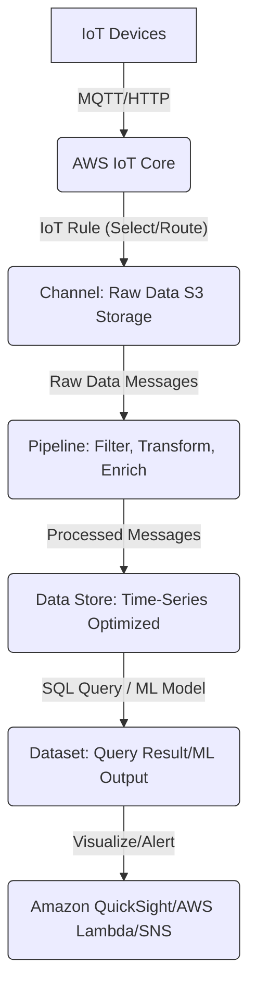
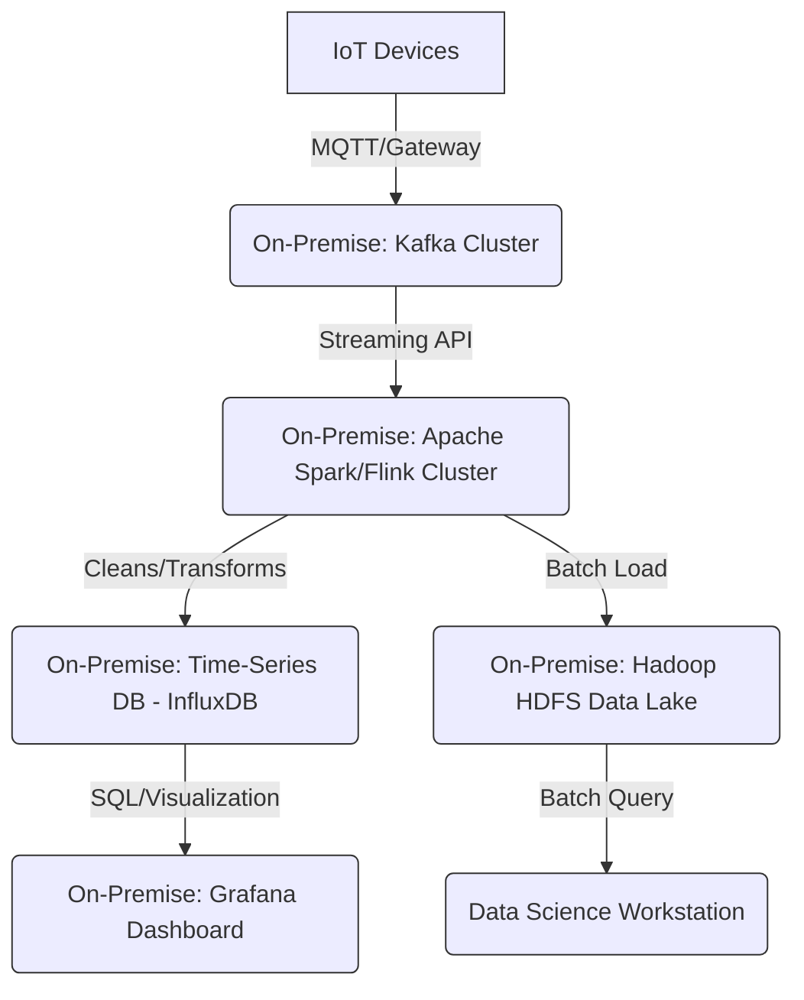

# IoT Analytics

## AWS IoT Analytics 📊

### 🌟 Overview

**AWS IoT Analytics** is a fully managed service that makes it easy to run sophisticated analytics on massive volumes of messy, unstructured Internet of Things (IoT) data. It automates all the difficult steps required to analyze data from IoT devices, including cleaning, transforming, and enriching the data before storing it in a time-series data store for analysis.

It is purpose-built to handle the unique challenges of IoT data, such as:

1. **Massive Scale:** Dealing with millions of devices sending messages constantly.
2. **Noisy Data:** Handling incomplete, corrupted, or non-standardized messages.
3. **Time-Series Nature:** Optimizing storage and queries for data that is time-stamped and continuously arriving.

**AWS IoT Analytics components work together in a structured pipeline:**

1. **Collect:** Ingest data from sources like AWS IoT Core or the `BatchPutMessage` API.
2. **Process:** Clean, filter, transform, and enrich the data using a **Pipeline**.
3. **Store:** Save the processed data in a time-series optimized **Data Store** and retain the raw data in an S3-based **Channel**.
4. **Analyze:** Run ad-hoc SQL queries or use hosted Jupyter Notebooks for advanced analysis and machine learning (ML) against the curated data in a **Dataset**.

#### 🤖 Innovation Spotlight: Focus on Managed Service for Scale and ML

The current innovation focus is the seamless integration with **Amazon SageMaker** through **Containerized Datasets**. This feature allows data scientists to bring their own analysis tools (e.g., custom machine learning models, specialized libraries like TensorFlow, PyTorch, or Scikit-learn) packaged in a Docker container and run them directly against the processed IoT data within AWS IoT Analytics. This is a game-changer because it eliminates the overhead of managing the underlying infrastructure for ML workflows, allowing for rapid deployment of predictive maintenance or anomaly detection models directly on the curated IoT data.

***

### ⚡ Problem Statement: Predictive Maintenance in Industrial IoT (IIoT)

A large **manufacturing company** operates thousands of industrial machines (CNC machines, presses, conveyors) across multiple factories. Each machine is fitted with various sensors (temperature, vibration, power consumption) that generate millions of data points per minute.

The **problem** is that maintenance is currently reactive (machines break) or time-based (scheduled, regardless of machine condition), leading to costly, unpredictable downtime and inefficient resource use. They need a system to:

1. Ingest and standardize the high-volume, disparate sensor data in real-time.
2. Cleanse the noisy data, remove outliers, and enrich it with contextual metadata (e.g., machine ID, location, model).
3. Build and run predictive models to determine the **Remaining Useful Life (RUL)** of critical machine components.
4. Visualize machine health for proactive intervention.

#### 🤝 Business Use Cases

| Industry                 | Application Example                                                                                                                                                                                   |
| ------------------------ | ----------------------------------------------------------------------------------------------------------------------------------------------------------------------------------------------------- |
| **Manufacturing**        | **Predictive Quality/Maintenance:** Analyzing sensor data (vibration, temperature) to predict equipment failure or product defects before they happen, maximizing uptime and reducing scrap.          |
| **Smart Energy/Utility** | **Grid Optimization:** Analyzing real-time data from smart meters and grid sensors (voltage, current) to predict demand spikes, identify anomalies, and optimize energy distribution.                 |
| **Automotive/Fleet**     | **Telematics & Asset Tracking:** Tracking vehicle diagnostics (engine heat, tire pressure, fuel level) and location data to optimize routes, schedule proactive service, and monitor driver behavior. |
| **Healthcare**           | **Remote Patient Monitoring (RPM):** Processing data from wearable devices (heart rate, blood oxygen) to detect deviations from baseline and trigger early alerts for medical intervention.           |

***

### 🔥 Core Principles

The foundational concept is a **managed, structured data pipeline** specifically optimized for time-series IoT data.

| Resource/Service Term       | Explanation                                                                                                                                                                                                               |
| --------------------------- | ------------------------------------------------------------------------------------------------------------------------------------------------------------------------------------------------------------------------- |
| 🛠️ **Channel**             | The entry point for raw IoT data. It collects and stores incoming messages (usually from AWS IoT Core) and archives the data in an S3-managed storage bucket. It's the immutable record of all raw messages.              |
| 🛠️ **Pipeline**            | The processing engine. It consumes messages from a Channel and applies **Pipeline Activities** to clean, filter, transform, and enrich the data.                                                                          |
| 🛠️ **Pipeline Activities** | The steps within a Pipeline: `Filter`, `RemoveAttribute`, `AddAttribute`, `SelectAttributes`, `Math` (transformation), and `Lambda` (for custom processing/enrichment).                                                   |
| 🛠️ **Data Store**          | The destination for the processed data from the Pipeline. It is a time-series optimized storage solution that enables fast and efficient queries. It also stores the raw data automatically for reprocessing.             |
| 🛠️ **Dataset**             | A view or query result against the processed data in the Data Store. **SQL Datasets** use standard SQL. **Container Datasets** use custom code (e.g., ML algorithms in a Jupyter Notebook container) to analyze the data. |
| 🛠️ **AWS IoT Core**        | The primary message broker that connects IoT devices to the AWS Cloud. It publishes messages to an IoT Analytics Channel via an **AWS IoT Rule**.                                                                         |
| 🛠️ **Jupyter Notebooks**   | Hosted, managed development environments for data scientists to run advanced analysis, create visualizations, and build ML models using popular libraries.                                                                |

***

### 📋 Pre-Requirements

| Service/Tool                     | Purpose                                                                                                                                                                                                               |
| -------------------------------- | --------------------------------------------------------------------------------------------------------------------------------------------------------------------------------------------------------------------- |
| **AWS IoT Core**                 | **Message Ingestion:** To establish secure connectivity with devices and route device messages into an IoT Analytics Channel via an IoT Rule.                                                                         |
| **AWS IAM**                      | **Security & Access Control:** To create a specific **IAM Role** with permissions for AWS IoT Core to write to the IoT Analytics Channel and for IoT Analytics to access AWS resources (e.g., Lambda for enrichment). |
| **AWS S3**                       | **Data Archival & Source:** Channels use S3 to store raw data. Can also be a source for data ingestion via `BatchPutMessage` API.                                                                                     |
| **AWS Lambda (Optional)**        | **Custom Processing/Enrichment:** To run custom code (e.g., calling an external API for weather data) as a **Pipeline Activity** to enrich the data.                                                                  |
| **Amazon QuickSight (Optional)** | **Visualization:** To create interactive dashboards and business intelligence reports from the final Datasets.                                                                                                        |

***

### 👣 Implementation Steps: Predictive Maintenance Pipeline

1. **Set up the AWS IoT Analytics Channel (Data Collection):**
   * Navigate to the AWS IoT Analytics console and create a new **Channel** (e.g., `factory_sensor_channel`). This sets up the raw data storage in S3.
2. **Configure AWS IoT Core Rule (Data Routing):**
   * In the AWS IoT Core console, create a new **Rule**.
   * Define a SQL query to select device data (e.g., `SELECT temperature, vibration, machine_id, timestamp FROM 'iot/factory/#'`).
   * Set the **Action** to send a message to the newly created **IoT Analytics Channel**.
3. **Define the Pipeline (Data Processing/Enrichment):**
   * Create a **Pipeline** that uses the `factory_sensor_channel` as its source.
   * Add a **Filter Activity** to remove null or clearly erroneous readings (e.g., `vibration > 0`).
   * Add an **Add Attribute Activity** to enrich the data with contextual metadata (e.g., look up `machine_id` in a DynamoDB table to add `model_type` and `location`).
   * Add a **Math Activity** to convert temperature from Celsius to Fahrenheit (`(temperature * 9/5) + 32`).
4. **Create the Data Store (Processed Storage):**
   * Create a **Data Store** (e.g., `factory_processed_datastore`) and link it as the destination for the Pipeline. This stores the clean, enriched data.
5. **Generate a Dataset (Analysis):**
   * Create a **Dataset** (e.g., `factory_health_dataset`) that runs a scheduled SQL query against the Data Store (e.g., `SELECT machine_id, AVG(vibration) AS avg_vibration_24hr FROM factory_processed_datastore WHERE time > NOW() - INTERVAL '1' DAY GROUP BY machine_id`).
   * Alternatively, create a **Container Dataset** to run a scheduled Python script (in a Jupyter Notebook/SageMaker container) to execute a predictive maintenance ML model.
6. **Visualize/Integrate:**
   * Connect Amazon QuickSight to the `factory_health_dataset` to build a dashboard displaying the current machine health score or average vibration.

***

### 🗺️ Data Flow Diagram

#### Diagram 1: AWS IoT Analytics Component Flow

#### Diagram 2: Predictive Maintenance Usecase Flow

```mermaid
graph LR
    subgraph Edge
        D[Vibration Sensor] --> C(IoT Gateway/Greengrass)
    end
    subgraph Cloud
        C --> A(AWS IoT Core: MQTT Broker)
        A -- IoT Rule --> B(IoT Analytics Channel: Store Raw Data)
        B --> P(Pipeline: Cleanse & Enrich with Machine Metadata)
        P --> E(Data Store: Processed Data)
        E -- Scheduled Query --> F(Container Dataset: SageMaker ML Model)
        F -- ML Output (RUL/Health Score) --> G(Amazon DynamoDB: Alerts Table)
        G -- Alert Trigger --> H(Amazon SNS/Email/Dashboard)
    end

    style D stroke:#f9f,stroke:#333
    style C stroke:#ADD8E6,stroke:#333
    style A stroke:#bbf,stroke:#333
    style B stroke:#ccf,stroke:#333
    style P stroke:#ddf,stroke:#333
    style E stroke:#eef,stroke:#333
    style F stroke:#ff9,stroke:#333
    style G stroke:#fcc,stroke:#333
    style H stroke:#9f9,stroke:#333
```

***

### 🔒 Security Measures

| Security Measure           | Recommendation                                                                                                                                                                                                                                                                                    |
| -------------------------- | ------------------------------------------------------------------------------------------------------------------------------------------------------------------------------------------------------------------------------------------------------------------------------------------------- |
| **IAM Roles & Policies**   | **Least Privilege:** Ensure the IAM role used by the IoT Rule to send data to the Channel and the role used by IoT Analytics to process data only have the _minimum_ necessary permissions (e.g., `iotanalytics:BatchPutMessage` on the specific Channel).                                        |
| **Data Encryption**        | **Encryption at Rest:** Data in the Channel (S3) and Data Store is encrypted by default using **AWS managed keys** or can be configured to use **Customer Managed Keys (CMKs)** in AWS KMS. **Encryption in Transit:** All communication between IoT Core and IoT Analytics uses **TLS 1.2**.     |
| **VPC Integration**        | **Private Connectivity:** Use **VPC Endpoints** (Interface Endpoints for the service API, Gateway Endpoints for S3 access if storing raw data in your own S3 bucket) to ensure traffic between your resources and AWS IoT Analytics stays within the AWS network, improving security and latency. |
| **Logging and Monitoring** | **AWS CloudTrail:** Enable logging of all API calls to monitor management activities within IoT Analytics. **Amazon CloudWatch:** Monitor metrics for Channel, Pipeline, and Dataset execution for operational security and performance.                                                          |

***

### ⚖️ When to use and when not to use

| ✅ When to use                                                                                                                                                                                                     | ❌ When not to use                                                                                                                                                                                                            |
| ----------------------------------------------------------------------------------------------------------------------------------------------------------------------------------------------------------------- | ---------------------------------------------------------------------------------------------------------------------------------------------------------------------------------------------------------------------------- |
| **High-Volume, Messy IoT Data:** When you have billions of messages that need automatic cleaning, filtering, and standardizing before analysis.                                                                   | **Primarily Non-IoT Data:** When your data source is mainly transactional, application logs, or non-time-series data. Use Amazon Kinesis, Amazon S3, or Amazon Redshift instead.                                             |
| **Time-Series Focus:** When your core requirement is performing historical and time-series analysis (e.g., trends over time, anomaly detection, predictive models) on device telemetry.                           | **Ultra Low-Latency, Real-Time Processing (Sub-second):** While near real-time, it's a batch-processing engine for analytics. For _immediate_ device control/reaction, use AWS IoT Core Rules with Lambda or AWS IoT Events. |
| **Need for Advanced ML on IoT Data:** When you need a managed environment (Jupyter Notebooks, Container Datasets) to run sophisticated ML models against curated IoT data without managing the ML infrastructure. | **Simple Data Storage/Query:** If all you need is raw data storage and basic querying, S3 + Amazon Athena or Amazon Timestream might be simpler and more cost-effective.                                                     |

***

### 💰 Costing Calculation

#### How it is calculated?

AWS IoT Analytics pricing is based on a **pay-as-you-go** model across four main dimensions:

1. **Data Processing in Pipelines:** Charged per GB of data processed as it flows through the Pipeline activities (e.g., filtering, math, Lambda).
2. **Processed Data Storage:** Charged per GB/month for the data stored in the time-series optimized Data Store.
3. **Raw Data Storage:** Charged at standard Amazon S3 rates for the raw messages stored in the Channel.
4. **Query Execution:** Charged per TB of data scanned when running SQL queries against the Data Store for a Dataset.
5. **Custom Analysis Execution:** Charged per **Analytics Compute Unit (ACU)-Hour** for running complex analysis (e.g., Jupyter Notebooks, Container Datasets). An ACU is a unit of compute capacity (4 vCPU and 16 GB of memory).

#### Efficient Way of Handling This Service

* **Filter Early, Filter Smart:** Use the IoT Core Rule and Pipeline Filter activity to drop unnecessary or noisy data _before_ it is processed and stored. This directly reduces Data Processing costs and Storage costs.
* **Optimize Queries:** Use time-constrained queries (`WHERE time > NOW() - INTERVAL '1' DAY`) and efficient SQL in your Datasets to minimize the amount of data scanned, reducing Query Execution costs.
* **Schedule Datasets:** Generate Datasets on a schedule (e.g., hourly) rather than running ad-hoc queries constantly, especially for routine analysis.
* **Use the Right Storage:** Leverage the **Raw Data Storage** (S3) for compliance and potential reprocessing, but focus your **Processed Data Storage** on the data attributes needed for immediate analysis.

#### Sample Calculations (Conceptual Example)

Assume **1,000 devices** sending **1 MB of data per device per month** (Total 1,000 MB $\approx$ **1 GB/month**).

| Component                        | Usage                                          | Unit Cost (US East - N. Virginia - **Hypothetical Rates for Example**) | Monthly Cost                                             |
| -------------------------------- | ---------------------------------------------- | ---------------------------------------------------------------------- | -------------------------------------------------------- |
| **Data Processing (Pipeline)**   | 1 GB processed                                 | $0.20 per GB                                                           | 1 GB $\times$ $0.20 = \*\*$0.20\*\*                      |
| **Processed Data Storage**       | 1 GB stored                                    | $0.03 per GB/month                                                     | 1 GB $\times$ $0.03 = \*\*$0.03\*\*                      |
| **Raw Data Storage (S3)**        | 1 GB stored                                    | $0.023 per GB/month                                                    | 1 GB $\times$ $0.023 $\approx$ **$0.02**                 |
| **Query Execution**              | 5 queries/month, each scanning 1 GB (0.001 TB) | $6.50 per TB scanned                                                   | (5 $\times$ 0.001 TB) $\times$ $6.50 $\approx$ **$0.03** |
| **Custom Analysis (Container)**  | 1 ACU $\times$ 5 hours/month                   | $0.36 per ACU-Hour                                                     | 5 hours $\times$ $0.36 = \*\*$1.80\*\*                   |
| **Total Estimated Monthly Cost** |                                                |                                                                        | $\approx$ **$2.08**                                      |

_(Note: These are sample calculations and simplified costs. Refer to the official AWS Pricing page for up-to-date and regional rates.)_

***

### 🧩 Alternative Services in AWS/Azure/GCP/On-Premise

| Platform       | Alternative Service                                              | Key Comparison/Difference                                                                                                                                                                                                                                     |
| -------------- | ---------------------------------------------------------------- | ------------------------------------------------------------------------------------------------------------------------------------------------------------------------------------------------------------------------------------------------------------- |
| **AWS**        | **Amazon Kinesis Data Firehose + S3 + Athena**                   | **More manual setup:** Requires configuring Kinesis for ingestion, Lambda for processing/cleansing, and Athena for querying. **Less integrated:** Lacks the unified IoT data model and managed ML integration of IoT Analytics.                               |
| **AWS**        | **Amazon Timestream**                                            | **Purpose-built TSDB:** Excellent for pure time-series storage and high-performance querying. **Less pre-processing:** Requires external services (like Lambda/Kinesis) to perform data cleansing and enrichment _before_ ingestion.                          |
| **Azure**      | **Azure IoT Data Processor**                                     | A fully managed service that provides a pipeline-based, no-code/low-code approach for filtering, transforming, and enriching IoT data before landing in storage like Azure Data Explorer or Azure Cosmos DB. Very similar managed ETL philosophy.             |
| **GCP**        | **Google Cloud IoT Core (Retired) + Cloud Dataflow + BigQuery**  | **Dataflow (Apache Beam):** Offers a powerful, flexible programming model for complex stream processing (the Pipeline equivalent). **BigQuery:** Used for analysis and storage. Requires more code/orchestration than the managed pipelines of IoT Analytics. |
| **On-Premise** | **Kafka + Hadoop/Spark + Time-Series Database (e.g., InfluxDB)** | **Full Control, High Overhead:** Requires managing all infrastructure, data ingestion (Kafka), stream processing (Spark/Flink on Hadoop), storage, and analysis tools. Very high operational complexity and cost.                                             |

#### On-Premise Alternative Data Flow Diagram (Conceptual)

***

### ✅ Benefits

* **Managed & Serverless:** Eliminates the operational overhead of managing servers, clusters, and ETL tools for a data pipeline.
* **IoT-Optimized:** Handles the unique challenges of massive scale, time-series data, and "messy" raw messages natively.
* **Cost-Efficient:** Pay-as-you-go model, with components for processing, storage, and querying billed separately, enabling cost optimization.
* **Seamless ML Integration:** Integrated hosted Jupyter Notebooks and Container Datasets allow data scientists to quickly apply advanced analytics and ML without infrastructure management.
* **Data Quality:** Automated cleaning (filters, transformations) ensures high-quality, standardized data for reliable analysis and machine learning.
* **End-to-End Solution:** Provides a complete lifecycle from data ingestion (Channel) to analysis (Dataset), integrating with IoT Core and QuickSight.

***

### 🚀 - Next-Generation IoT Analytics: Edge and Cloud Convergence

The continuous evolution is pushing more intelligence to the edge. The innovation isn't just in the cloud; it's in the seamless flow and tooling between the edge and the cloud. **AWS IoT Analytics works hand-in-hand with AWS IoT Greengrass and AWS IoT SiteWise.** Greengrass allows for pre-processing, filtering, and running ML inference directly on the device gateway, minimizing the data sent to the cloud. SiteWise focuses on industrial asset data modeling. The next-generation approach is to run simple, high-frequency analytics/alerts locally (Greengrass) and use IoT Analytics for the **complex, fleet-wide, historical, and predictive analytics** where a massive dataset and powerful compute (like SageMaker via Container Datasets) are required. This ensures the right analytics are performed at the right place, optimizing both latency and cost.

***

### 📝 Summary

AWS IoT Analytics is a **fully managed, purpose-built cloud service** designed to collect, process, store, and analyze large volumes of noisy, time-series IoT device data. It automates the entire analytical pipeline, from raw message ingestion and cleaning (Channel & Pipeline) to optimized storage (Data Store) and sophisticated querying and machine learning (Dataset). This enables organizations to gain actionable insights like predictive maintenance and operational efficiency without the burden of infrastructure management.

**Top 5 Takeaways:**

1. **Pipeline-Driven:** It enforces a structured pipeline (Channel $\rightarrow$ Pipeline $\rightarrow$ Data Store $\rightarrow$ Dataset) which is excellent for standardizing messy IoT data.
2. **Time-Series Optimized:** The Data Store is optimized for fast, efficient time-series queries, a crucial need for IoT.
3. **ML Ready:** Excellent native integration with Amazon SageMaker via Container Datasets for running complex machine learning on curated data.
4. **Cost is Multi-Dimensional:** Be mindful of the four key cost drivers: processing, storage (raw and processed), and querying/custom analysis execution.
5. **Filter Aggressively:** The key to cost optimization is to filter data in the IoT Core Rule and Pipeline activities to minimize the data volume that is processed and stored.

***

### 🔗 Related Topics

* [AWS IoT Analytics User Guide](https://docs.aws.amazon.com/iotanalytics/latest/userguide/welcome.html)
* [AWS IoT Core Documentation](https://docs.aws.amazon.com/iot/latest/developerguide/what-is-aws-iot.html)
* [AWS IoT Events (for real-time anomaly detection)](https://aws.amazon.com/iot-events/)
* [Amazon SageMaker Documentation (for machine learning integration)](https://aws.amazon.com/sagemaker/)
