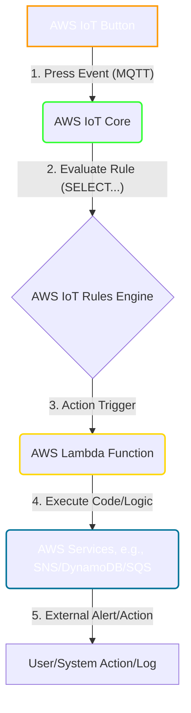
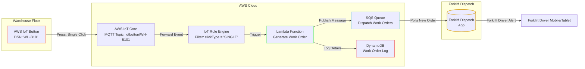
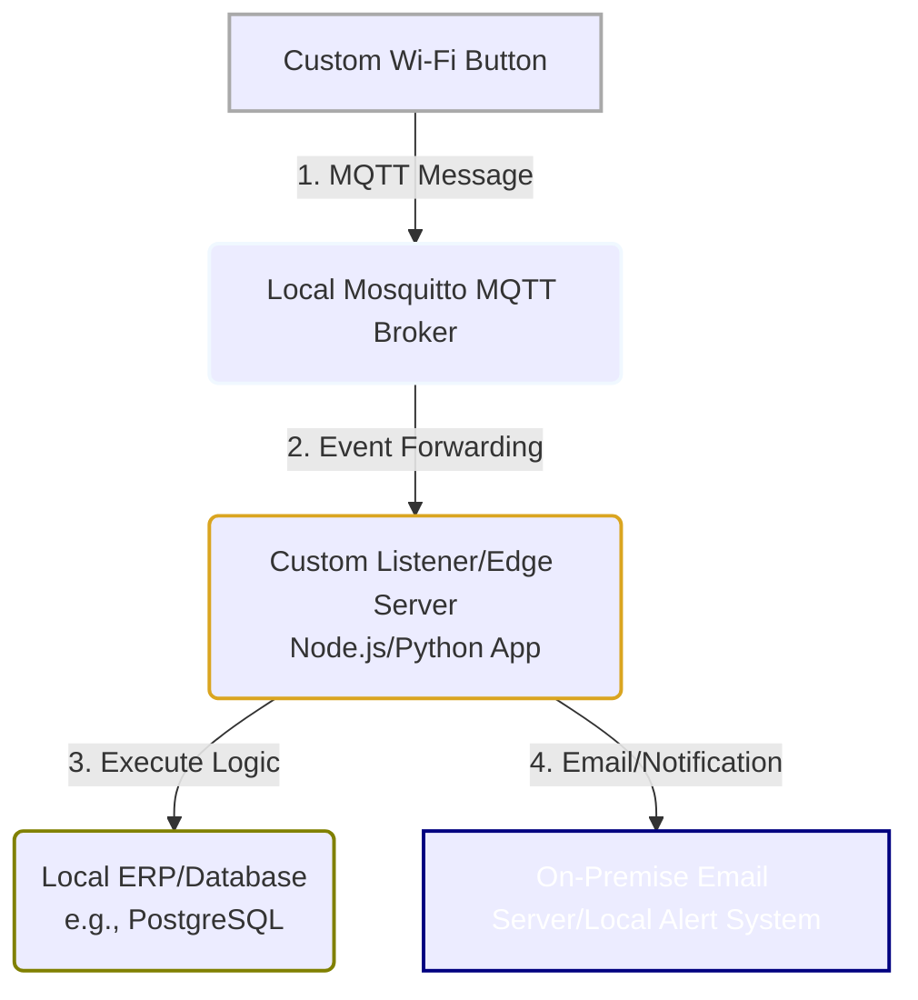

# IoT Button

## 🤖 AWS IoT Button 🚀

### 🌟 Overview

The **AWS IoT Button** is a programmable, Wi-Fi-connected device designed to be an easy-to-use, cloud-integrated physical trigger. It is the unlinked developer version of the Amazon Dash Button. It allows developers to get hands-on experience with the **AWS IoT Core** platform and other AWS services without needing to build a custom device from scratch.

When a user presses the button, it wakes up, connects to a pre-configured Wi-Fi network, and sends a secure message (an event) to the **AWS IoT Core** service. This message can then trigger an **AWS Lambda** function or another AWS service via the **AWS IoT Rules Engine**, enabling practically limitless actions in the cloud or in the physical world (via integrations).

The key feature is the ability to distinguish between **three different click types**:

1. **Single Click**
2. **Double Click**
3. **Long Press**

Each click type can be configured to trigger a separate, unique action, dramatically expanding the utility of a single device.

#### Innovation Spotlight: Edge Compute Utility

While the _original_ AWS IoT Button hardware is largely phased out and often replaced by third-party AWS-compatible devices (like the Seeed IoT Button for AWS), the _concept_ of an AWS 1-Click device remains highly innovative. The spotlight is now on **"Zero-Code Physical Trigger-to-Cloud Workflows"**.

The innovation today isn't just the button itself, but how it paved the way for services like **AWS IoT 1-Click** (a service, not the physical button) that allows quick creation of simple applications where devices like third-party buttons or even virtual buttons can perform cloud actions without requiring deep device-level programming. This simplifies the creation of a massive-scale **real-time alerting** and **workflow automation** system using simple physical interfaces.

***

### ⚡ Problem Statement: Logistics Dispatch Automation

A large **logistics and warehousing** company faces a major bottleneck in its busy sorting facility. When a pallet is full and ready for pickup by a forklift, a warehouse worker has to stop, find a terminal, log in, and manually create a work order ticket for a forklift driver to take the pallet to the staging area. This process is slow, involves context-switching, and is prone to errors (e.g., wrong location code).

#### 🤝 Business Use Cases

| Industry                | Use Case Example                                                                                                                                                     | Benefit                                                                       |
| ----------------------- | -------------------------------------------------------------------------------------------------------------------------------------------------------------------- | ----------------------------------------------------------------------------- |
| **Logistics/Warehouse** | **"Call-for-Pickup"**: Worker presses button to signal a completed pallet is ready for pickup at a specific location.                                                | Reduced idle time, faster turnover, higher operational efficiency.            |
| **Retail/Hospitality**  | **"Service Request"**: Customer/employee presses a button on a table or service desk for immediate assistance.                                                       | Improved customer experience, real-time staff alerts, quicker response times. |
| **Healthcare**          | **"Patient Call/Alert"**: Elderly or home-care patient presses a button for immediate caregiver/nurse notification.                                                  | Emergency response, improved patient safety and monitoring.                   |
| **Manufacturing**       | **"Replenishment/Malfunction"**: Machine operator presses for **Single Click**: Part replenishment, **Double Click**: Tooling issue, **Long Press**: Emergency stop. | JIT (Just-In-Time) inventory, reduced downtime, enhanced safety.              |

***

### 🔥 Core Principles

The AWS IoT Button functionality is built on the principles of **Event-Driven Architecture** and **Serverless Computing**.

| Core Principle           | Explanation                                                                                                                                                                      |
| ------------------------ | -------------------------------------------------------------------------------------------------------------------------------------------------------------------------------- |
| **Event-Driven**         | The "press" of the button is the **event**. This event is published to the cloud and immediately triggers a chain of decoupled services (like Lambda or SNS).                    |
| **Serverless Computing** | The entire backend (Lambda, IoT Core, SNS) scales automatically and incurs costs only when a button is pressed (i.e., when code executes), minimizing idle infrastructure costs. |
| **Scalability**          | The AWS IoT Core service is designed to handle billions of devices and trillions of messages, allowing a company to deploy thousands of buttons without worrying about capacity. |

#### Core Resources and Services

* **AWS IoT Button (Device)**: The physical Wi-Fi device. It sends an **MQTT** (Message Queuing Telemetry Transport) message to the AWS IoT Core endpoint when pressed. The message payload includes the device's Serial Number (DSN) and the click type (single, double, long).
* **AWS IoT Core (Service)**: The central message broker.
  * **Thing**: A representation or entry for the physical button device within the AWS IoT Registry. Identified by its unique **DSN**.
  * **MQTT Topic**: The channel where the button publishes its event message (e.g., `iotbutton/<DSN>`).
  * **Rules Engine**: A serverless mechanism in IoT Core that evaluates the incoming MQTT message (the event). Based on a SQL-like query (e.g., selecting the click type), it executes defined actions.
* **AWS Lambda (Service)**: A serverless compute service that executes code in response to the event forwarded by the IoT Rule. This is where the core logic (e.g., generating a work order, sending an email) resides.
* **Amazon SNS (Simple Notification Service)**: Used by the Lambda function or directly by the IoT Rule to send SMS, email, or push notifications to users/staff.
* **Amazon DynamoDB (Service)**: A NoSQL database often used to log button presses, track device state, or store application configuration data (e.g., the worker/location associated with a specific button).

***

### 📋 Pre-Requirements

| Service/Tool                | Purpose                                                                                                                          |
| --------------------------- | -------------------------------------------------------------------------------------------------------------------------------- |
| **AWS Account**             | Access to all required AWS services (IoT Core, Lambda, SNS, IAM).                                                                |
| **AWS IoT Button**          | The physical device (or a similar third-party AWS 1-Click compatible device).                                                    |
| **Wi-Fi Network**           | The button requires a 2.4 GHz Wi-Fi network with internet access for configuration and operation.                                |
| **IAM Role for Lambda**     | An execution role granting the Lambda function permissions (e.g., to publish to SNS, write to DynamoDB, or call other APIs).     |
| **IAM Policy for IoT Core** | A policy attached to the IoT Thing (button) that restricts it to only connect and publish messages to its designated MQTT topic. |

***

### 👣 Implementation Steps: "Call-for-Pickup"

This guide configures a **Single Click** to trigger an internal alert via SNS.

1. **Create AWS Lambda Function (The Action)**
   * Go to Lambda and create a new function (e.g., `WarehousePalletPickup`).
   * Choose Python or Node.js runtime.
   * The code will parse the incoming JSON payload (which contains the `clickType` and `serialNumber`) and publish a structured message to an SNS Topic.
2. **Create Amazon SNS Topic (The Notification)**
   * Go to SNS and create a new Standard Topic (e.g., `WarehousePickupAlerts`).
   * Create a subscription for this topic (e.g., an SMS to the forklift supervisor's phone number or an email to the dispatch team).
3. **Configure IoT Core Resources**
   * **Register the Button as a "Thing"**: In the AWS IoT console, register the button's Device Serial Number (DSN). AWS will provision a unique **Certificate** and **Private Key** for secure communication.
   * **Create an IoT Policy**: Create an IAM Policy that grants the button's certificate permission to connect and publish messages to its specific MQTT topic (`iotbutton/<DSN>`).
4. **Create an IoT Rule (The Router)**
   * In the AWS IoT Rules Engine, create a new rule (e.g., `ButtonRule_Pickup`).
   * **Rule Query Statement**: `SELECT * FROM 'iotbutton/<DSN>' WHERE clickType = 'SINGLE'`
   * This query filters for only Single Click events from your specific button.
   * **Add an Action**: Choose **"Send a message to a Lambda function"** and select the `WarehousePalletPickup` function created in Step 1.
5. **Configure the Physical Button Wi-Fi**
   * Use the recommended method (often a mobile app or local network configuration via a built-in temporary Wi-Fi hotspot) to provision the button with the target Wi-Fi SSID and password, as well as the unique **AWS IoT Core Endpoint** and its **Certificate/Key** files.
6. **Test**: Press the button once. Observe the green LED for a successful connection. Check the Lambda logs and your SNS subscription (email/SMS) for the alert.

***

### 🗺️ Data Flow Diagram

#### Diagram 1: AWS IoT Button Core Workflow

#### Diagram 2: Logistics Dispatch Automation Usecase

***

### 🔒 Security Measures

* **Least Privilege IAM Roles**: The Lambda execution role must only have permissions for the specific actions it needs (e.g., `sns:Publish`, `dynamodb:PutItem`).
* **Device Certificate Security**: Each button must use a unique **X.509 Certificate** and **Private Key** provisioned by AWS to connect and authenticate with AWS IoT Core. The associated IoT Policy should be as restrictive as possible, allowing it to only publish to its own device-specific MQTT topic.
* **Topic-Based Authorization**: Utilize an IoT Policy that enforces a device can only publish to a topic using its own Serial Number, for example: `Allow: iot:Publish on "arn:aws:iot:REGION:ACCOUNT_ID:topic/iotbutton/${iot:ClientId}"`. (The button's DSN is often used as the Client ID).
* **Data Encryption**: Ensure all data in transit (MQTT payload) is encrypted via **TLS** (which the AWS IoT Button handles automatically) and data at rest (e.g., in DynamoDB or S3) is encrypted using **KMS** or the service's native encryption.

***

### 💡 IoT Simplicity: A Gateway to Real-Time Automation

***

### ⚖️ When to use and when not to use

| Feature          | ✅ When to Use (Best Fit)                                                                                                      | ❌ When Not to Use (Better Alternatives)                                                                     |
| ---------------- | ----------------------------------------------------------------------------------------------------------------------------- | ----------------------------------------------------------------------------------------------------------- |
| **Simplicity**   | Triggering simple, single-purpose, repeatable, and non-time-critical actions (e.g., ordering supplies, simple service calls). | Actions requiring complex, real-time, bidirectional communication or continuous data streaming.             |
| **Deployment**   | Quick prototyping, proof-of-concept for IoT, or low-volume, specialized enterprise applications.                              | Large-scale, high-density sensor networks (e.g., environmental monitoring, industrial control systems).     |
| **Connectivity** | Locations with readily available, stable Wi-Fi connectivity.                                                                  | Remote, mobile, or areas without reliable Wi-Fi (Cellular IoT/LoRaWAN devices are better).                  |
| **Durability**   | Non-critical indoor environments where a short battery life (for the original AWS button) is acceptable.                      | Mission-critical, high-availability systems where battery failure or non-replaceable batteries pose a risk. |

***

### 💰 Costing Calculation

The direct cost of the **AWS IoT Button hardware** itself is a one-time purchase. The operational cost is primarily based on the **AWS IoT Core, AWS Lambda, and other services** it triggers.

#### How it is calculated?

* **AWS IoT Core Messaging**: Billed per million messages published or exchanged. The button's message is typically very small.
* **AWS Lambda**: Billed per execution (Request) and for the compute time (Duration, in milliseconds) and memory used.
* **Amazon SNS**: Billed per notification published (e.g., for SMS/Email/Push notifications).
* **Amazon DynamoDB**: Billed for read/write capacity units (RCUs/WCUs) for logging, or on-demand capacity.

#### Efficient way of handling this service

1. **Use the IoT Rules Engine to Filter**: Only trigger a Lambda function when absolutely necessary. For example, if you only care about a Single Click, ensure the IoT Rule filters out Double and Long presses from triggering an unnecessary Lambda invocation.
2. **Optimize Lambda**: Use the minimum required memory and ensure the Lambda function code is efficient to minimize execution duration.
3. **Basic Ingest**: For high-volume use cases, you could potentially use **Basic Ingest** in AWS IoT Core to reduce messaging costs by skipping the Rules Engine, though this is only for routing data straight to a service like Kinesis/S3, which is less common for simple button triggers.

#### Sample Calculations (Estimates based on typical AWS Free Tier and basic pricing)

Let's assume a warehouse deploys **10 buttons**, each pressed **100 times per day** (total 30,000 presses/month). Each press triggers one Lambda execution and one SNS SMS notification.

| Service Component        | Calculation (per month)                           | Est. Monthly Cost (Excluding Free Tier) |
| ------------------------ | ------------------------------------------------- | --------------------------------------- |
| **IoT Core Messages**    | $30,000 / 1,000,000 \* $1.00 (Tier 1 Messaging)   | $\approx $0.03$                         |
| **Lambda Requests**      | 30,000 Requests \* (Free Tier covers 1M)          | $\approx $0.00$                         |
| **Lambda Compute**       | 30,000 executions \* 100ms (0.1s) \* 128MB memory | $\approx $0.00$                         |
| **SNS SMS**              | 30,000 SMS to US number (est. $0.00645/SMS)       | $\approx $193.50$                       |
| **DynamoDB Writes**      | 30,000 Writes (using WCU for logging)             | $\approx $0.05$                         |
| **Total Estimated Cost** | **(Excluding SMS)**                               | $\approx $0.08$                         |
| **Total Estimated Cost** | **(Including SMS)**                               | $\approx $193.58$                       |

**Conclusion:** The cost is almost entirely driven by the **downstream action** (like sending an SMS via SNS) rather than the button press itself.

***

### 🧩 Alternative services in AWS/Azure/GCP/On-Premise

| Platform       | Alternative Service/Device                                                                   | Key Comparison/Difference                                                                                                                                                    |
| -------------- | -------------------------------------------------------------------------------------------- | ---------------------------------------------------------------------------------------------------------------------------------------------------------------------------- |
| **AWS**        | **AWS IoT 1-Click Service**                                                                  | Abstraction layer for managing 3rd-party certified button devices; easier fleet management.                                                                                  |
| **Azure**      | **Azure IoT Central + Azure IoT Button/Device**                                              | **IoT Central** provides a comprehensive application platform; button devices (e.g., Azure IoT Developer Kit) connect to **Azure IoT Hub**.                                  |
| **GCP**        | **Google Cloud IoT Core (now retired) + Cloud Functions**                                    | GCP used a similar pattern with its IoT Core service (now retired) forwarding to Cloud Functions. Requires more custom device integration now.                               |
| **On-Premise** | **Custom Wi-Fi/LoRaWAN Button + Local Message Broker (e.g., Mosquitto/Kafka) + Edge Server** | High setup and maintenance overhead. Requires managing all networking, hardware, security, and application servers locally. Offers maximum control and latency optimization. |

#### On-Premise Alternative Data Flow Diagram

***

### ✅ Benefits

* **Extreme Simplicity**: Provides a one-click, physical interface to trigger complex cloud workflows, vastly simplifying the user experience.
* **Serverless and Low Cost**: The core mechanism (IoT Core, Lambda) is serverless, eliminating idle costs and scaling automatically. The button's message cost is negligible.
* **Rapid Prototyping**: Excellent tool for quickly testing IoT concepts and connecting the physical world to cloud services without deep embedded programming.
* **Versatile Actions**: The three distinct click types allow for multiple, pre-defined actions from a single device.
* **Security Built-in**: Uses industry-standard, mutual authentication (X.509 certificates) for secure communication with the AWS Cloud.

***

### ⚙️ - The Power of Abstracted Computing

***

### 📝 Summary

The AWS IoT Button is a simple, **Wi-Fi-enabled, programmable physical button** that serves as a dedicated trigger for cloud-based actions. Its core function is to send a secure **MQTT message** to **AWS IoT Core**, which is then processed by the **IoT Rules Engine** to trigger a **Lambda function** (or other AWS services) for a desired outcome. It excels at providing a quick, easy, and cost-effective way to automate repetitive tasks, alert staff, or provide on-demand services in various business and domestic environments by abstracting complex cloud logic behind a single click.

**Top 10 Takeaways:**

1. **Event-Driven Trigger**: It's a fundamental physical event source for an event-driven architecture.
2. **Uses IoT Core**: Requires AWS IoT Core as the secure message broker.
3. **Serverless Backend**: Actions are typically handled by AWS Lambda, ensuring cost efficiency.
4. **Three Click Types**: Supports Single, Double, and Long Press for multi-functionality.
5. **Wi-Fi Dependency**: Requires stable 2.4 GHz Wi-Fi connectivity to operate.
6. **Security via Certificates**: Uses X.509 client certificates for mutual TLS authentication.
7. **Cost Driver is the Action**: Operational cost is low, but downstream services (like SMS via SNS) can increase it.
8. **Rules Engine is the Router**: The IoT Rules Engine filters and routes the event based on DSN and click type.
9. **Prototyping Tool**: Excellent for Proof-of-Concepts and non-critical enterprise tasks.
10. **Hardware is Phased**: While the original button is often discontinued, the **AWS IoT 1-Click** service and third-party compatible buttons carry on the concept.

***

### 🔗 Related Topics

* [AWS IoT Core Developer Guide](https://docs.aws.amazon.com/iot/latest/developerguide/what-is-aws-iot.html)
* [AWS Lambda Documentation](https://www.google.com/search?q=https://aws.amazon.com/lambda/documentation/)
* [AWS IoT 1-Click Service Overview (Successor/Alternative)](https://aws.amazon.com/iot-1-click/)
* [MQTT Protocol Basics](https://mqtt.org/)
