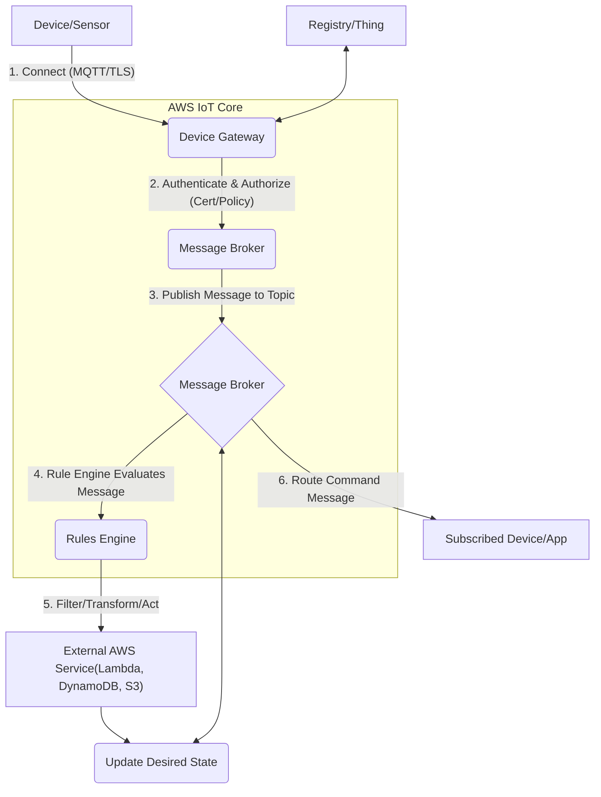
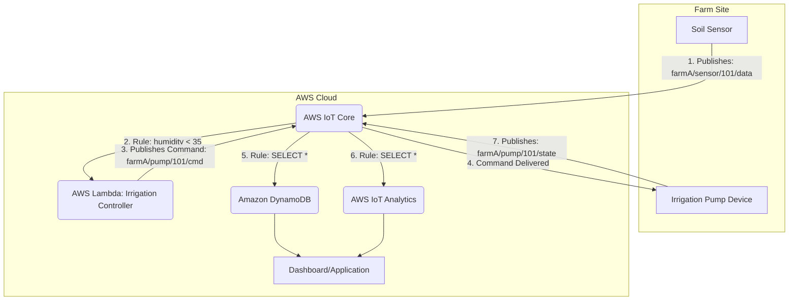
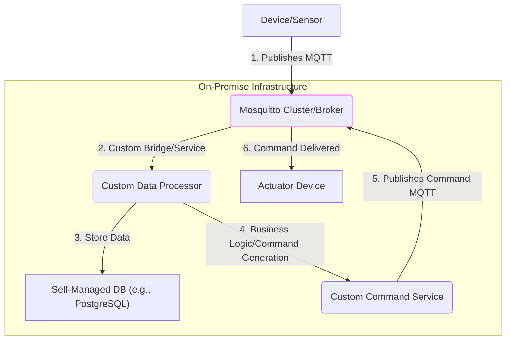

# IoT Core

## AWS IoT Core: The Cloud Gateway for a Billion Devices 🚀

### 🌟 Overview

**AWS IoT Core** is a fully managed cloud service that lets connected devices (like sensors, embedded systems, smart appliances, etc.) easily and securely interact with cloud applications and other devices. It can support billions of devices and trillions of messages, providing a robust, highly available, and scalable platform for IoT solutions without managing servers.

The service acts as a central **Message Broker**, enabling devices to send data (publish) and receive commands (subscribe) using standard protocols like **MQTT**, **MQTT over WSS (WebSockets Secure)**, and **HTTPS**. It handles connection, authentication, and authorization for all devices, simplifying the overall architecture for massive-scale IoT deployments.

#### 🤖 Innovation Spotlight: Generative AI for Anomaly Detection (Modern IoT)

Today's innovation goes beyond simple data routing. By integrating AWS IoT Core data streams with advanced AWS services, a new paradigm emerges:

* **Proactive Maintenance with Generative AI:** Device data (metrics, logs, state changes) is streamed from IoT Core to **Amazon Kinesis** or **AWS IoT Analytics**. This data is then fed into custom Machine Learning models built with **Amazon SageMaker** or leveraged by services like **Amazon Lookout for Equipment**.
* **Intelligent Anomaly Baseline:** The ML model can utilize a Generative AI-powered approach (like a variational autoencoder or transformer model) to learn the **"normal" operational baseline** of an entire class of devices.
* **Contextual Alerting:** When a single device deviates from this learned baseline (e.g., a motor's vibration frequency slightly shifts), IoT Core rules can trigger an **AWS Lambda** function. The Lambda function uses the anomaly data to prompt a Large Language Model (LLM) via **Amazon Bedrock** to generate a **contextualized maintenance ticket** that describes the fault in natural language, suggests a probable root cause, and recommends the part number for replacement. This moves from simple alerts to **prescriptive intelligence**.

***

### ⚡ Problem Statement

A large-scale **Smart Agriculture** company, operating thousands of acres, needs to monitor soil conditions, weather patterns, and irrigation systems in real-time across all their farms. They have thousands of battery-powered micro-controllers (end-devices) equipped with low-power sensors (temperature, humidity, pH, GPS) that communicate over long distances using a low-power protocol like LoRaWAN, which then connects to a central gateway on each farm.

The challenge is:

1. **Massive Scale & Reliability:** How to securely connect **100,000+ devices** with intermittent connectivity and reliably ingest millions of data points per minute.
2. **State Management:** How to track the last reported state of each sensor (e.g., soil moisture) even when the device is momentarily offline.
3. **Real-time Action:** How to automatically trigger an irrigation pump (a command back to the device) when soil moisture drops below a critical threshold without writing and managing complex server-side code.

#### 🤝 Business Use Cases

| Industry            | Application               | Example Action                                                                                                                                                                        |
| ------------------- | ------------------------- | ------------------------------------------------------------------------------------------------------------------------------------------------------------------------------------- |
| **Manufacturing**   | Predictive Maintenance    | Machine vibration anomaly detected $\to$ automatically create a **ServiceNow** ticket and send an alert to the maintenance engineer via **SNS**.                                      |
| **Logistics/Fleet** | Real-time Asset Tracking  | GPS tracker reports position change $\to$ stream location data into **Amazon Kinesis** for immediate visualization and use **AWS IoT Device Defender** to detect geofence violations. |
| **Smart Home/City** | Device State Sync         | A smart light bulb is turned off locally $\to$ update the device's **Device Shadow** in the cloud to reflect the new state, ensuring consistency across all control applications.     |
| **Healthcare**      | Remote Patient Monitoring | Wearable device reports heart rate fluctuation $\to$ **IoT Core Rule** triggers a secure alert via **AWS Lambda** to a hospital's patient monitoring system.                          |

***

### 🔥 Core Principles

AWS IoT Core is built on the principles of **secure connectivity**, **publish/subscribe messaging**, and **state synchronization**.

| Resource/Service Term             | Explanation                                                                                                                                                                                                                           |
| --------------------------------- | ------------------------------------------------------------------------------------------------------------------------------------------------------------------------------------------------------------------------------------- |
| **Device Gateway**                | The point of entry for devices. It manages all active device connections using protocols like MQTT, HTTPS, and WebSockets. It is fully managed and scales automatically.                                                              |
| **Message Broker**                | A high-throughput, bidirectional communication channel. Devices **Publish** messages to _Topics_ and **Subscribe** to _Topics_ to receive messages/commands. It uses the MQTT protocol standard.                                      |
| **Registry**                      | A repository for device identity and metadata. It allows you to organize and manage device attributes (**Things**) and their capabilities.                                                                                            |
| **Thing**                         | A logical representation or identity of a specific device or logical entity (e.g., "IrrigationPump-001"). It has metadata like attributes and unique ID.                                                                              |
| **Thing Group**                   | A collection of things for easier management (e.g., "Farm-A-Pumps"). Policies can be applied to the group.                                                                                                                            |
| **Device Shadow (Thing Shadow)**  | A persistent, reliable, JSON document that stores the last reported state of a device and its desired future state. It allows applications to read and write a device's state even when the device is offline.                        |
| **Rules Engine**                  | A powerful feature that processes, filters, transforms, and routes messages based on defined business rules. It enables integration with over a dozen AWS services (e.g., Lambda, S3, DynamoDB) and is written in an SQL-like syntax. |
| **X.509 Certificates & Policies** | The primary mechanism for **mutual authentication** and authorization. Devices use certificates to authenticate to IoT Core, and an IoT Policy determines which _Topics_ they can Publish to or Subscribe from.                       |
| **AWS IoT Device SDKs**           | Libraries (for C, Java, Python, JavaScript, etc.) that help devices connect, authenticate, and exchange messages with IoT Core easily.                                                                                                |
| **AWS IoT Device Defender**       | A service that continuously monitors IoT configurations to ensure they adhere to security best practices and audits device behavior to detect anomalies (e.g., devices attempting to communicate on unauthorized ports).              |

***

### 📋 Pre-Requirements

| Service/Tool               | Purpose                                                                                                        |
| -------------------------- | -------------------------------------------------------------------------------------------------------------- |
| **AWS Account**            | To access and provision AWS IoT Core and integrated services.                                                  |
| **AWS IAM**                | To create roles and policies for the Rules Engine to allow access to target services (e.g., Lambda, DynamoDB). |
| **Device Hardware**        | The actual sensor/microcontroller (e.g., ESP32, Raspberry Pi) with network connectivity.                       |
| **AWS IoT Device SDK**     | Code library to integrate the device's application with the MQTT Message Broker.                               |
| **X.509 Certificate/Keys** | Generated via IoT Core and provisioned onto the device for secure mutual authentication.                       |
| **Amazon DynamoDB**        | To store raw or processed time-series data from the devices (or use AWS IoT SiteWise/IoT Analytics).           |
| **AWS Lambda**             | To execute serverless code for processing device data or implementing business logic for commands.             |

***

### 👣 Implementation Steps (Smart Agriculture Example)

1. **Register a Thing and Generate Credentials:**
   * In the AWS IoT Core console, create a new **Thing** (e.g., `FarmA-SoilSensor-101`).
   * Generate a new **X.509 Certificate** and the associated **Private Key** and **Root CA** certificate. Download all three files.
2. **Create an AWS IoT Policy:**
   *   Create an IoT Policy that grants specific permissions, e.g., to connect, and to publish/subscribe to a specific topic pattern:

       ```json
       {
         "Effect": "Allow",
         "Action": ["iot:Connect", "iot:Publish", "iot:Receive", "iot:Subscribe"],
         "Resource": ["arn:aws:iot:REGION:ACCOUNT_ID:client/FarmA-SoilSensor-101", 
                      "arn:aws:iot:REGION:ACCOUNT_ID:topic/farmA/sensor/101/*"]
       }
       ```
   * Attach the policy to the certificate.
3. **Provision the Device:**
   * Load the **Certificate**, **Private Key**, and **Root CA** onto the sensor device's file system.
   * Use the **AWS IoT Device SDK** in the device's firmware to establish a secure MQTT connection to the custom AWS IoT Core endpoint.
4. **Create an AWS IoT Rule (Data Ingestion):**
   * Define an SQL-like query to select data from a topic: `SELECT temperature, humidity, timestamp FROM 'farmA/sensor/+/data'`
   * Add an **Action** to send the message payload to a DynamoDB table named `IoT_Sensor_Data`.
5. **Create a Second AWS IoT Rule (Command Trigger):**
   * Define a query: `SELECT * FROM 'farmA/sensor/+/data' WHERE humidity < 35`
   * Add an **Action** to **Invoke an AWS Lambda Function** (e.g., `irrigation-controller-lambda`).
6. **Develop the Lambda Function:**
   * The Lambda function receives the low-humidity payload, determines the corresponding pump's topic (e.g., `farmA/pump/101/cmd`), and publishes a new JSON message to that topic via the IoT Core Data Plane API, e.g., `{"command": "ON", "duration": 600}`.
7. **Device Receives Command:**
   * The irrigation pump device (another Thing) is subscribed to `farmA/pump/101/cmd`.
   * It receives the command and executes the required action (turns on the pump for 10 minutes).

***

### 🗺️ Data Flow Diagram

#### Diagram 1: AWS IoT Core Internal Architecture



#### Diagram 2: Smart Agriculture Usecase



***

### 🔒 Security Measures

| Security Measure                 | Recommendation/Best Practice                                                                                                                                                                                     |
| -------------------------------- | ---------------------------------------------------------------------------------------------------------------------------------------------------------------------------------------------------------------- |
| **Mutual Authentication**        | **Mandatory use of X.509 certificates (or custom authorizers/IAM)** for device authentication. Never use simple username/password.                                                                               |
| **Principle of Least Privilege** | Create granular **AWS IoT Policies** that only allow devices to publish/subscribe to their **specific, unique topics** (e.g., `iot:Publish` on `farmA/sensor/${iot:ClientId}/data`).                             |
| **Transport Encryption**         | Only use **TLS 1.2** (or higher) to ensure all data is encrypted in transit between the device and IoT Core. This is automatic with MQTT/WSS/HTTPS endpoints.                                                    |
| **AWS IoT Device Defender**      | **Enable Audit** to check for non-compliant configurations (e.g., overly permissive policies). **Enable Detect** to monitor device behavior for statistical anomalies that might indicate a compromise.          |
| **VPC Isolation**                | Use **VPC Endpoints (PrivateLink)** for the AWS IoT Data Plane to connect devices privately to IoT Core from a VPC, bypassing the public internet (useful for AWS Greengrass and other cloud-hosted components). |

***

### ☁️ - Secure Mass Device Provisioning

### ⚖️ When to use and when not to use

| Feature              | ✅ When to use                                                                                                                                                        | ❌ When not to use                                                                                                                    |
| -------------------- | -------------------------------------------------------------------------------------------------------------------------------------------------------------------- | ------------------------------------------------------------------------------------------------------------------------------------ |
| **Core Function**    | You need to securely ingest data from a **large fleet of devices** (hundreds to billions) and route that data to other AWS services.                                 | You only have a single, low-volume application that can connect directly to a service like API Gateway or SQS.                       |
| **Communication**    | You require **bidirectional communication** (device $\leftrightarrow$ cloud) and need low-latency, persistent connections (MQTT).                                    | Your devices only need to send infrequent, non-critical data one-way and can tolerate high overhead (e.g., simple HTTPS POST to S3). |
| **State Management** | You need a persistent, reliable record of a device's last reported state (**Device Shadow**) for cloud applications to interact with, even if the device is offline. | Your solution is entirely real-time and transient, and the device state is not critical to the application logic.                    |
| **Protocol**         | Your devices are **constrained** (low power, low bandwidth) and require an efficient protocol like MQTT.                                                             | Your devices are high-power, high-bandwidth machines that rely entirely on legacy protocols not natively supported by IoT Core.      |

***

### 💰 Costing Calculation

#### How it is calculated?

AWS IoT Core pricing is primarily based on **message usage** and **connectivity duration**. It is a pay-as-you-go model with no minimum fees.

1. **Messaging:** Charged per million messages exchanged. This includes messages published by devices, messages delivered to devices via the Message Broker, and messages delivered by the Device Shadow service.
2. **Connectivity:** Charged per minute of connection time for devices that maintain a persistent connection (e.g., using MQTT).
3. **Rules Engine:** Charged per million rules triggered and per million actions executed.
4. **Device Shadow:** Charged per million state transactions (updates/gets).
5. **Additional Services:** Charges apply for other integrated services like AWS IoT Device Defender, AWS IoT Jobs, etc.

#### Efficient way of handling this service

* **Batching/Aggregation:** For high-frequency sensors, use **AWS IoT Greengrass** on a local gateway device to aggregate and filter data before publishing to IoT Core, drastically reducing the message count.
* **Smart Rule Engine Design:** Combine actions in a single rule where possible (e.g., rule $\to$ Lambda $\to$ DynamoDB/S3) rather than creating multiple cascading rules.
* **Ephemeral Connections:** For devices that only report data infrequently, use HTTPS to publish and immediately disconnect instead of maintaining a persistent MQTT connection, reducing connectivity time charges.
* **Device Shadow Pruning:** Only use the Device Shadow for truly critical state data; send high-volume, ephemeral data directly to a data store via the Rules Engine.

#### Give some sample calculations

* **Scenario:** 10,000 sensors, each sends 1 message per hour, for 30 days. All devices use a persistent MQTT connection for 24/7 (720 hours/month).
* **Messages:** $10,000 \text{ devices} \times 1 \text{ msg/hr} \times 720 \text{ hr/month} = 7,200,000 \text{ messages/month}$
  * _Cost:_ 7.2 million messages $\times \frac{$1.00}{1 \text{ million messages\}} \approx $7.20$
* **Connectivity:** $10,000 \text{ devices} \times 720 \text{ hours} \times 60 \text{ minutes/hour} = 432,000,000 \text{ connection minutes}$
  * _Cost:_ 432 million minutes $\times \frac{$0.08}{1 \text{ million minutes\}} \approx $34.56$
* **Rules Engine:** Assume 7.2 million rules triggered, 1 action per rule (e.g., routing to DynamoDB).
  * _Cost:_ $7.2 \text{ million events} \times \frac{$0.15}{1 \text{ million events\}} \text{ (trigger)} + 7.2 \text{ million actions} \times \frac{$0.15}{1 \text{ million actions\}} \text{ (action)} \approx $2.16$

**Estimated Total Monthly Cost (IoT Core Components Only):** \$$7.20 + $34.56 + $2.16 = \mathbf{$43.92}$

***

### 🧩 Alternative services in AWS/Azure/GCP/On-Premise

| Platform       | Alternative Service                 | Key Comparison/Difference                                                                                                                                                                                      |
| -------------- | ----------------------------------- | -------------------------------------------------------------------------------------------------------------------------------------------------------------------------------------------------------------- |
| **AWS**        | **AWS IoT Greengrass**              | Edge computing extension of IoT Core. Moves cloud capabilities (Lambda, ML) _closer to the device_ for local processing.                                                                                       |
| **Azure**      | **Azure IoT Hub**                   | Direct competitor. Provides Device Provisioning Service (DPS) and **Device Twins** (similar to Device Shadow), strong integration with Microsoft enterprise services.                                          |
| **GCP**        | **Cloud Pub/Sub**                   | (After IoT Core retirement in 2023) Used for data ingestion/messaging; however, it lacks the integrated device identity, state management (Shadow), and granular security policies of a dedicated IoT service. |
| **On-Premise** | **Eclipse Mosquitto (MQTT Broker)** | Open-source MQTT broker. Requires complete self-management of servers, clustering, load balancing, security (TLS/PKI), and integration plumbing.                                                               |

#### On-Premise Alternative Data Flow Diagram (Eclipse Mosquitto)



***

### ✅ Benefits

* **Massive Scalability & Reliability:** Connects billions of devices and handles trillions of messages without manual server provisioning.
* **Security by Design:** Enforces strong security with **mutual authentication (Certificates/TLS)** and fine-grained access control with IoT Policies.
* **Real-time Integration:** Seamlessly integrates with the vast AWS ecosystem (Lambda, Kinesis, S3, SageMaker) via the powerful Rules Engine.
* **Device State Persistence (Shadow):** Ensures cloud applications and devices can synchronize state reliably, even during periods of intermittent connectivity.
* **Cost Efficiency:** Pay-per-use model that scales down to small deployments and is optimized for low-bandwidth IoT protocols like MQTT.

### 🧠 - Intelligent Telemetry Compression

***

### 📝 Summary

**AWS IoT Core** is a fully managed, scalable, and secure cloud platform that acts as the central hub for connecting your Internet of Things devices to the AWS Cloud. It uses a **Publish/Subscribe (MQTT)** message broker for bidirectional communication, a **Rules Engine** for real-time data processing and routing, and **Device Shadow** for persistent state synchronization. This allows you to effortlessly collect, process, and act upon data from billions of devices, automating complex workflows across various industries like manufacturing, logistics, and smart infrastructure.

#### Top 5 Key Takeaways:

1. **Security is paramount:** Always enforce **mutual authentication** using X.509 Certificates and adhere to the **least privilege** principle with granular IoT Policies.
2. **Rules Engine is the Brain:** This component is where real-time value is created, transforming, filtering, and routing messages to integrated services.
3. **Device Shadow is State Persistence:** Use it to track and update critical device state, decoupling the device's availability from the application's ability to read/set its state.
4. **MQTT is the Core Protocol:** It's lightweight, low-bandwidth, and ideal for constrained IoT devices.
5. **Cost is Usage-Based:** Optimize by minimizing connection time for inactive devices and aggregating messages to reduce message count and Rules Engine execution charges.

### 🔗 Related Topics

* [AWS IoT Core Developer Guide: Security](https://docs.aws.amazon.com/iot/latest/developerguide/iot-security.html)
* [AWS IoT Greengrass (Edge Computing)](https://aws.amazon.com/greengrass/)
* [AWS IoT Analytics (Managed Analytics for IoT Data)](https://aws.amazon.com/iot-analytics/)
* [MQTT Protocol Specifications](https://mqtt.org/)
