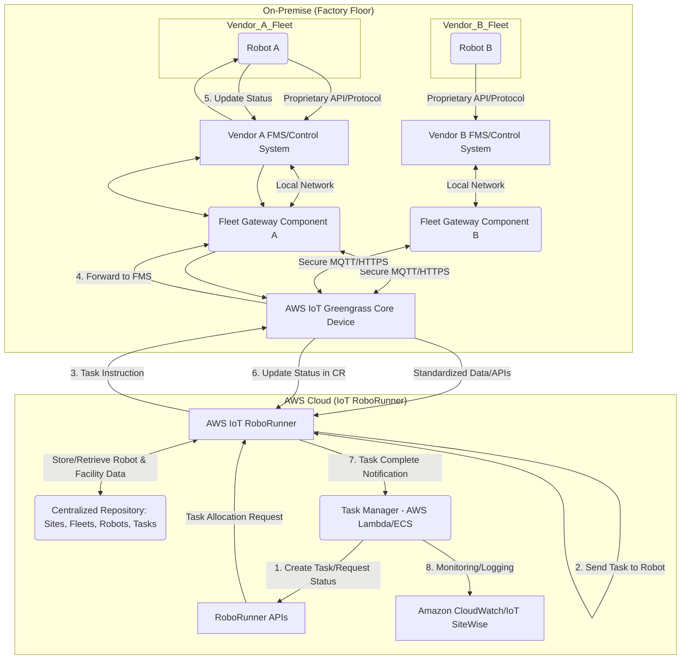
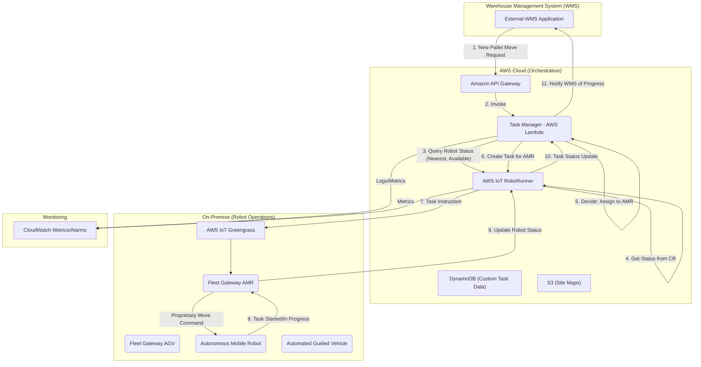

# Robo Runner

## 🤖 AWS IoT RoboRunner

### 🌟 Overview

**AWS IoT RoboRunner** is a robotics service designed to connect various robotic systems and work management systems (WMS, MES, etc.) into a single, unified system. It is specifically created to address the interoperability challenges that arise when companies use a diverse fleet of Autonomous Mobile Robots (AMRs), Automated Guided Vehicles (AGVs), and other industrial robots, often from multiple vendors, within a single facility (like a warehouse, factory floor, or distribution center).

The core function is to create a centralized data repository and a common application layer that simplifies the development of robotics management applications, such as task orchestration, work allocation, and shared-space management. This is built upon the same technology that powers Amazon's own fulfillment centers.

#### 🤖 Innovation Spotlight on AWS IoT RoboRunner

The innovation lies in **Vendor-Agnostic Fleet Orchestration and Interoperability**.

In traditional industrial settings, integrating a new robot from a different vendor required time-consuming, custom software integration work. AWS IoT RoboRunner standardizes the data and communication protocols for all connected robots, acting as a "translation layer" and central command center. This abstraction layer is the innovation that significantly accelerates automation projects and allows for dynamic, heterogeneous robot fleets, driving down operational costs and increasing overall factory efficiency. Furthermore, its native integration with other AWS services (like AWS IoT SiteWise for data analysis, and Amazon SageMaker for task optimization) brings the power of the cloud-to-edge for industrial robotics.

### ⚡ Problem Statement

A large-scale **automotive parts manufacturing facility** uses different types of robots for various tasks:

1. **AGVs (Automated Guided Vehicles)** for transporting heavy parts between assembly lines.
2. **AMRs (Autonomous Mobile Robots)** for delivering smaller components and tools to technicians.
3. **Robotic Arms** for precision welding and assembly tasks.

The facility sources these robots from **three different vendors**, each with its own proprietary fleet management system and communication protocols.

**The Challenge (The Problem Statement):** The facility is unable to efficiently coordinate work across the diverse fleet. For instance, an AMR often waits idly because it doesn't know when an AGV will finish clearing a path, or a task scheduler is blind to the real-time location and availability of all robots. This siloed operation leads to **bottlenecks, increased cycle times, reduced throughput, and higher operational expenditure** due to the inability to dynamically allocate work based on the entire fleet's status. They need a single, unified system to manage and orchestrate tasks for _all_ robots regardless of vendor.

#### 🤝 Business Use Cases

| Industry              | Application                   | Example Use Case                                                                                                                                                                    |
| --------------------- | ----------------------------- | ----------------------------------------------------------------------------------------------------------------------------------------------------------------------------------- |
| **Manufacturing**     | Material Handling & Logistics | Orchestrating a mixed fleet of AGVs and AMRs to optimize the flow of components from the warehouse to the assembly line, minimizing human intervention and wait times.              |
| **E-commerce/Retail** | Fulfillment Centers           | Dynamic task allocation for picking and packing robots (from different vendors) to ensure shared paths are managed without collisions and high-priority orders are processed first. |
| **Hospitals**         | Patient/Material Transport    | Managing a fleet of mobile robots for delivering medicine, lab samples, and supplies between different floors and departments, integrating with hospital information systems.       |
| **Energy/Utilities**  | Inspection & Maintenance      | Coordinating autonomous drones, ground robots, and crawlers to perform concurrent inspections of pipelines or solar farms, with centralized reporting of asset condition.           |

### 🔥 Core Principles

AWS IoT RoboRunner is built on the principles of **Centralized Control, Interoperability, and Scalability.**

1. **Vendor-Agnostic Interoperability:** Enables robots from different vendors to work together by providing a common set of APIs and a standardized data model.
2. **Centralized Repository:** Consolidates facility data (maps, locations, paths) and robot data (status, location, task progress) into one source of truth.
3. **Task Orchestration:** Allows developers to build sophisticated work-management applications (Task Managers) that allocate and coordinate tasks across the entire fleet to maximize efficiency.

#### Core Resources and Services Terms

| Term                         | Description                                                                                                                                                                                                |
| ---------------------------- | ---------------------------------------------------------------------------------------------------------------------------------------------------------------------------------------------------------- |
| **Site**                     | Represents a physical location (e.g., a factory, warehouse, or fulfillment center) where the robots operate. All fleet-related resources are scoped to a Site.                                             |
| **Facility**                 | An optional, logical grouping of resources within a Site, such as a floor or a specific area of a warehouse.                                                                                               |
| **Fleet**                    | A group of robots managed together. A single Site can contain multiple Fleets, often segmented by vendor or robot type.                                                                                    |
| **Robot**                    | Represents an individual physical robot device registered to a Fleet. It's the digital twin of the physical robot.                                                                                         |
| **Destination**              | Represents a physical location within the Site where a robot can be directed, like a charging station, a pick-up point, or a drop-off station.                                                             |
| **Task**                     | A unit of work to be performed by a robot (e.g., "Move part from A to B"). Tasks are orchestrated by the Task Manager.                                                                                     |
| **Vendor Integration Layer** | A component (often implemented using AWS IoT Greengrass on-premises) that translates the proprietary language of a robot's fleet manager into the standardized data format and APIs of AWS IoT RoboRunner. |
| **Task Manager**             | A custom application (often an AWS Lambda function or a service running on ECS/EKS) that uses RoboRunner APIs to create, allocate, and monitor Tasks to the optimal Robot in the fleet.                    |
| **Task Allocation**          | The process where the Task Manager selects the most appropriate and available Robot to execute a new Task, a key benefit of the centralized view.                                                          |

### 📋 Pre-Requirements

| Service/Tool                    | Purpose                                                                                                                                          |
| ------------------------------- | ------------------------------------------------------------------------------------------------------------------------------------------------ |
| **AWS Account**                 | Necessary for provisioning and managing all AWS services.                                                                                        |
| **AWS IoT RoboRunner**          | The core service to manage the sites, fleets, robots, and tasks.                                                                                 |
| **AWS IoT Greengrass**          | Required to run the **Fleet Gateway Library** locally (on-premises) to connect to the robot vendors' proprietary Fleet Management Systems (FMS). |
| **AWS Lambda**                  | Used to deploy the **Task Manager** logic (the custom application) for work orchestration and allocation.                                        |
| **Amazon DynamoDB / Amazon S3** | Used for storing and retrieving complex task-related data or large site maps if needed by the Task Manager.                                      |
| **IAM Roles and Policies**      | Essential for granting the least-privilege access to Greengrass components and Lambda functions to interact with RoboRunner APIs.                |

### 👣 Implementation Steps

Here is a high-level guide to setting up a basic multi-vendor robot orchestration system:

1. **Set up the RoboRunner Site:**
   * Navigate to the AWS IoT RoboRunner console and create a new **Site** representing your physical facility (e.g., `Factory-North`).
2. **Define Fleets and Robots:**
   * Within the Site, create a **Fleet** for each robot vendor or type (e.g., `VendorA-AGVs`, `VendorB-AMRs`).
   * Register each individual **Robot** within its respective Fleet.
3. **Develop the Vendor Integration Layer (Fleet Gateway):**
   * Download the **AWS IoT RoboRunner Fleet Gateway Library**.
   * Develop a custom component (often a Python script) using this library that translates between the proprietary FMS/robot APIs and the standardized RoboRunner APIs.
   * Package this custom component and deploy it to an on-premises gateway device (e.g., an industrial PC) using **AWS IoT Greengrass**. This component securely connects the local FMS to the AWS Cloud.
4. **Create the Task Manager (Orchestration Logic):**
   * Develop an **AWS Lambda function** (the Task Manager). This function will contain your business logic for work allocation (e.g., "find the closest available AMR to Destination X with the required battery level").
   * The Lambda function uses the **RoboRunner APIs** (`CreateTask`, `UpdateRobotState`, `ListRobots`, etc.) to send instructions and retrieve real-time data.
5. **Define Tasks and Destinations:**
   * Use the RoboRunner console or API to define **Destinations** (e.g., `Assembly-Line-1`, `Shipping-Dock`).
   * Trigger the Lambda Task Manager from an external system (e.g., a WMS using Amazon API Gateway) to **Create a Task**.
6. **Monitor and Optimize:**
   * Use Amazon CloudWatch and potentially integrate with **AWS IoT SiteWise** to collect, analyze, and visualize robot metrics (e.g., task completion rate, idle time, utilization).

### 🗺️ Data Flow Diagram

#### Diagram 1: AWS IoT RoboRunner Core Architecture

#### Diagram 2: Task Orchestration Example (Warehouse Pallet Movement)

### 🔒 Security Measures

Security for a robotics orchestration system must cover cloud, edge, and device-level interactions.

* **Least Privilege IAM Roles:** Use fine-grained IAM roles for the AWS Lambda Task Manager and the AWS IoT Greengrass core device. Limit their permissions only to the required RoboRunner API calls and specific resources.
* **Secure Device/Edge Communication (mTLS):** AWS IoT Greengrass and the Fleet Gateway components use Mutual TLS (mTLS) for secure, authenticated communication with the AWS IoT Core endpoint, ensuring data in transit is encrypted.
* **Data Encryption:** All data stored in the RoboRunner Centralized Repository (CR) and related services (S3, DynamoDB) should be encrypted at rest using **KMS** managed keys (e.g., AES-256).
* **VPC Endpoints:** Use **AWS PrivateLink** to create VPC endpoints for AWS IoT RoboRunner and other connected services (Lambda, IoT Core) to keep all traffic within the AWS network, preventing exposure to the public internet.
* **Device Auditing:** Leverage **AWS IoT Device Defender** to audit the configurations of the Greengrass core device and monitor for security-related anomalies (e.g., unauthorized changes to configurations or policy violations).

### 🚀 AWS IoT RoboRunner

### ⚖️ When to use and when not to use

| Feature                 | ✅ When to use                                                                                                                         | ❌ When not to use                                                                                                   |
| ----------------------- | ------------------------------------------------------------------------------------------------------------------------------------- | ------------------------------------------------------------------------------------------------------------------- |
| **Fleet Complexity**    | You have a heterogeneous fleet of robots from **multiple vendors** that need to coordinate and share workspaces.                      | You have a small, homogenous fleet from a **single vendor** whose proprietary FMS is sufficient for all your needs. |
| **Operations Scale**    | You operate a large-scale facility (warehouse, factory) where optimization of **material flow and throughput** is critical.           | For simple, isolated tasks by a single robot where central coordination adds unnecessary latency or complexity.     |
| **Integration Need**    | You need to integrate robot operations with enterprise systems like **WMS, MES, or ERP** for dynamic task allocation.                 | When the primary need is for robot simulation and testing (use **AWS RoboMaker**).                                  |
| **Data Centralization** | You require a **single source of truth** for all robot-related data (location, status, task) for cross-fleet analytics and reporting. | For highly regulated systems where all data must reside on-premises without any cloud connectivity.                 |

### 💰 Costing Calculation

AWS IoT RoboRunner is generally billed based on a **pay-as-you-go** model, primarily around the usage of its key components and API calls.

#### How it is calculated?

The primary cost components are based on:

1. **API Requests:** The number of API requests made to the AWS IoT RoboRunner service (e.g., `CreateSite`, `CreateRobot`, `GetTask`, `UpdateRobotState`).
2. **Related AWS Services:** Charges for services leveraged by RoboRunner, such as:
   * **AWS IoT Greengrass:** Component deployments and messages for the on-premises Fleet Gateway.
   * **AWS Lambda:** Executions, duration, and memory used by the Task Manager application.
   * **AWS IoT Core:** Messaging for data coming from the edge.
   * **Storage (S3/DynamoDB):** For storing facility maps, custom task data, and other related assets.

#### Efficient way of handling this service

* **Batching API Calls:** Where possible, design your Task Manager to batch status updates or task creations to reduce the number of individual API calls.
* **Smart Polling:** For status checks, use event-driven mechanisms (like IoT topics) instead of constant, high-frequency polling with `GetRobotState` to minimize unnecessary API requests.
* **Optimize Task Manager Lambda:** Right-size the memory and optimize the code of your Task Manager Lambda function to reduce execution duration and cost.
* **Leverage IoT Greengrass Local Processing:** Process and filter device data locally using Greengrass before sending it to the cloud. Only send necessary data for centralized orchestration to RoboRunner.

#### Give some sample calculations

_(Note: Pricing tiers and exact numbers vary by region and time; this is an illustrative example based on typical service consumption.)_

| Component                 | Usage Scenario                                                                               | Rate (Illustrative)                                          | Monthly Cost                                                                |
| ------------------------- | -------------------------------------------------------------------------------------------- | ------------------------------------------------------------ | --------------------------------------------------------------------------- |
| **RoboRunner API Calls**  | 10 Robots \* 5 updates/min \* 60 min/hr \* 24 hr/day \* 30 days = **2.16 Million API Calls** | $X per 1 million calls                                       | $\text{$2.16} \times X$                                                     |
| **Lambda (Task Manager)** | 500,000 Invocations (Task Creations/Updates) per month, avg. 500ms duration.                 | First 1M requests/mo are free; $0.20 per million thereafter. | Approx. $0.00 (Assuming it stays under the free tier and duration is small) |
| **IoT Greengrass**        | 10 Greengrass Core devices deployed on-premise.                                              | $1.50 per core device per month.                             | \$$15.00$                                                                   |

**Total Estimated Monthly Cost (excluding networking, data storage, and the actual rate $X$):** $\mathbf{\text{$15.00} + (\text{$2.16} \times X) + \text{Other AWS services\}}$

### 🧩 Alternative services in AWS/Azure/GCP/On-Premise

| Platform       | Alternative Service                    | Key Comparison/Difference                                                                                                                                                                                                     |
| -------------- | -------------------------------------- | ----------------------------------------------------------------------------------------------------------------------------------------------------------------------------------------------------------------------------- |
| **AWS**        | **AWS RoboMaker**                      | Primarily focused on robot simulation, development, and testing. **RoboRunner** is focused on fleet management and orchestration in production.                                                                               |
| **Azure**      | **Azure IoT Hub (Device Management)**  | IoT Hub is a generic device connectivity and management service. It lacks the built-in, standardized data model and task orchestration APIs specifically designed for heterogeneous multi-vendor robot fleets.                |
| **GCP**        | **Google Cloud IoT Core (Deprecated)** | Was focused on device connection and message ingestion. Similar to Azure IoT Hub, it does not offer the high-level, opinionated service for multi-vendor robot fleet orchestration and coordination that RoboRunner provides. |
| **On-Premise** | **Custom Middleware/FMS**              | Involves building a custom integration layer (e.g., using ROS/ROS2, custom APIs) to connect different vendor systems. High complexity, long development time, high maintenance, and lacks cloud scalability/analytics.        |

### ✅ Benefits

* **Interoperability:** Seamlessly connects robots from different vendors, breaking down operational silos.
* **Increased Utilization & Throughput:** Enables intelligent, dynamic task allocation across the entire fleet, ensuring robots are never idle and workflows are optimized.
* **Accelerated Automation:** Reduces the time and effort needed for custom software integration when adding new robot types or vendors.
* **Scalability:** Effortlessly manage a growing fleet from tens to thousands of robots without redesigning the core management system.
* **Data-Driven Optimization:** Provides a centralized data repository, making it easy to analyze fleet performance with AWS IoT SiteWise and build optimization models using Amazon SageMaker.
* **Reduced Operational Cost:** Minimizes bottlenecks, reduces cycle times, and lowers the cost of managing complex, diverse robot fleets.

### ⚙️ - Robotics Orchestration

### 📝 Summary

AWS IoT RoboRunner is a managed AWS service that acts as a **central control plane** for coordinating and managing heterogeneous fleets of robots in industrial environments. It solves the critical problem of multi-vendor interoperability by providing standardized APIs and a unified data repository for sites, fleets, robots, and tasks. This enables customers to build high-level Task Manager applications for intelligent work orchestration, leading to significant increases in operational efficiency, robot utilization, and manufacturing throughput.

**Top 5 Takeaways:**

1. **Vendor Agnostic:** Its primary value is enabling robots from different vendors to work together seamlessly.
2. **Central Data Repository:** Creates a single source of truth for all robot status and facility data.
3. **Task Manager Logic:** Requires a custom application (like an AWS Lambda function) to implement the specific work allocation/orchestration business logic.
4. **Greengrass is Key:** It relies on AWS IoT Greengrass running an on-premise Fleet Gateway component to translate proprietary FMS/robot protocols.
5. **Built on Amazon Tech:** It uses the same technology that Amazon's fulfillment centers use for their massive-scale robotic operations.

### 🔗 Related Topics

* AWS IoT Greengrass Developer Guide
* AWS IoT SiteWise for Industrial Data Analysis
* AWS IoT RoboRunner Developer Guide
* Robotics Interoperability Standard (e.g., VDA 5050 - though RoboRunner acts as a layer above this)
