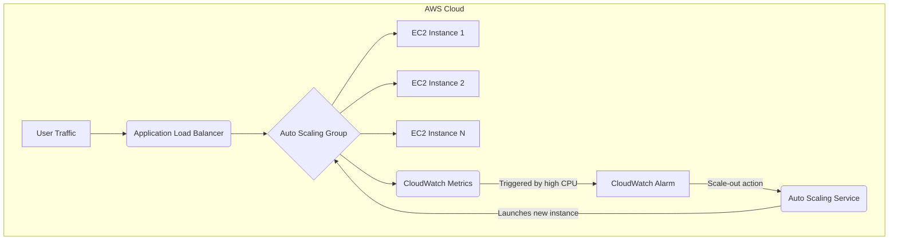
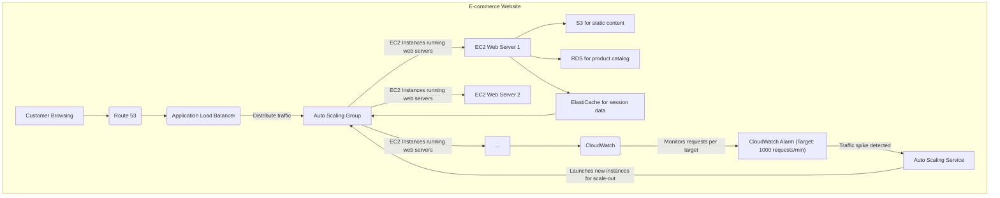
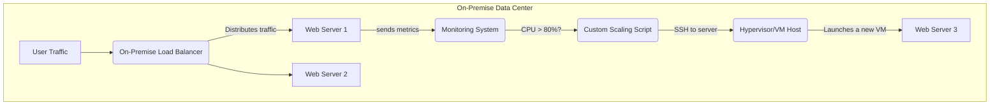

# Auto Scaling

### 🌟 Overview: AWS Auto Scaling 🚀

AWS Auto Scaling is a service that monitors your applications and automatically adjusts capacity to maintain steady, predictable performance at the lowest possible cost. Instead of manually provisioning servers for peak loads and paying for idle capacity during low periods, AWS Auto Scaling automates this process. It helps you ensure that you have the right number of resources available to handle the load for your application. This is a crucial concept for building highly available, fault-tolerant, and cost-effective applications in the cloud.

<figure><figcaption></figcaption></figure>

AWS offers several types of auto-scaling, including:

* **Amazon EC2 Auto Scaling**: This is the most common use case. It allows you to automatically add or remove EC2 instances in a logical group, called an Auto Scaling group (ASG), based on dynamic scaling policies, scheduled scaling, or manual adjustments.
* **Application Auto Scaling**: This service allows you to scale resources for services beyond EC2, such as **Amazon ECS services, DynamoDB tables, Aurora replicas, and SageMaker endpoints**. It uses a unified API and console to manage scaling across these diverse services.
* **AWS Auto Scaling (the service)**: This is a higher-level service that helps you set up scaling for multiple resources across different AWS services in a single, intuitive interface. It simplifies the process by creating a "scaling plan" that includes all the scalable resources for your application.

#### 🤖 Innovation Spotlight: Predictive Scaling

A key innovation in AWS Auto Scaling is **Predictive Scaling**. Instead of only reacting to current load (reactive scaling), Predictive Scaling uses machine learning to forecast future traffic patterns based on historical data. This allows it to provision EC2 instances in advance of anticipated traffic spikes, ensuring your application is ready to handle the load without any performance degradation. This preemptive approach significantly improves application responsiveness and a better user experience, while also preventing over-provisioning and reducing costs.

***

### ⚡ Problem Statement: The E-commerce Black Friday Scenario

Imagine an e-commerce company that experiences predictable, massive traffic spikes during annual events like Black Friday, Cyber Monday, or major product launches.

* **Scenario:** On a typical day, the website receives a moderate number of visitors, handled by a small fleet of servers. However, during Black Friday, the traffic can surge to 10-100 times the normal volume within minutes.
* **The Challenge:**
  * **Manual Scaling:** If the company manually provisions servers, they would need to buy and maintain enough hardware to handle the peak Black Friday load all year. This leads to immense cost waste and underutilized resources for 99% of the year.
  * **Under-provisioning:** If they don't provision enough servers, the website will become slow, or even crash, leading to lost sales, damaged brand reputation, and a poor customer experience.

AWS Auto Scaling provides the solution by dynamically adjusting the server capacity to meet demand, ensuring performance and availability during the traffic surge while optimizing costs during off-peak periods.

#### 🤝 Business Use Cases

* **E-commerce & Retail:** Handling traffic spikes during sales, holiday seasons, or marketing campaigns.
* **Online Gaming:** Scaling game servers up during peak hours (e.g., evenings and weekends) and scaling them down when players are offline.
* **Media & Entertainment:** Scaling video transcoding or streaming services based on the number of active users.
* **SaaS Applications:** Ensuring consistent performance for multi-tenant applications by scaling resources per customer or based on overall application load.
* **Big Data Processing:** Scaling a cluster of EC2 instances for an Apache Spark or Hadoop job to complete the task quickly, then scaling down to zero to save costs.

***

### 🔥 Core Principles & Resources

The fundamental concept of AWS Auto Scaling is to automate the scaling of resources based on a defined policy.

* **Auto Scaling Group (ASG):** A logical collection of EC2 instances that are treated as a single unit for scaling and management. The ASG ensures a minimum number of instances are always running and never exceeds a specified maximum.
* **Launch Template/Launch Configuration:** A blueprint for the EC2 instances in an ASG. It specifies the AMI, instance type, security groups, key pair, and other settings. The latest best practice is to use **Launch Templates**.
* **Scaling Policies:** The rules that govern how and when the ASG scales.
  * **Target Tracking Scaling:** The most recommended and simplest policy. You set a target value for a metric (e.g., keep CPU utilization at 50%), and AWS automatically adjusts the number of instances to maintain that target.
  * **Step Scaling:** You define a series of scaling actions based on "steps" or ranges of a metric. For example, if CPU is > 60%, add 2 instances; if > 80%, add 4 instances.
  * **Simple Scaling:** A deprecated version of step scaling. It waits for the previous scaling activity to complete before starting another one.
  * **Scheduled Scaling:** You set a specific time and date for the scaling action to occur. Useful for predictable load changes, like an evening traffic spike.
* **Predictive Scaling:** The advanced scaling method that uses historical data and machine learning to predict future load and proactively scale capacity.
* **Warm Pools:** A feature that allows you to maintain a pool of pre-initialized EC2 instances in a "stopped" state. When a scale-out event occurs, instances from the warm pool can be brought online much faster than launching a new instance from an AMI. This is great for applications with long startup times.
* **Instance Health Checks:** Auto Scaling continuously monitors the health of instances in the ASG. If an instance becomes unhealthy (e.g., fails its EC2 status checks), Auto Scaling automatically terminates it and launches a new one to replace it, ensuring high availability.

***

### 📋 Pre-Requirements

* **AWS Account:** With appropriate IAM permissions to create and manage EC2 instances, Auto Scaling groups, and other related services.
* **Amazon EC2 Launch Template:** A template defining the instance configuration (AMI, instance type, key pair, security group).
* **Application Load Balancer (ALB) or Network Load Balancer (NLB):** Recommended for distributing incoming traffic across the instances in your Auto Scaling group.
* **Amazon CloudWatch Alarms:** Used by dynamic scaling policies to trigger scaling actions based on specific metrics (e.g., CPU, network I/O, or custom metrics).

***

### 👣 Implementation Steps

1. **Create a Launch Template:** In the EC2 console, navigate to "Launch Templates" and click "Create launch template". Configure the AMI, instance type, key pair, and security group.
2. **Create an Auto Scaling Group:**
   * In the EC2 console, go to "Auto Scaling Groups" and click "Create Auto Scaling group".
   * Give it a name and select the Launch Template you created.
   * Choose your VPC and select the subnets for your instances (across multiple Availability Zones for high availability).
   * Attach a Load Balancer if you have one.
3. **Configure Group Size and Scaling Policies:**
   * Set the **Desired capacity**, **Minimum capacity**, and **Maximum capacity**.
   * Choose a scaling policy. **Target Tracking** is the simplest and most effective. For example, set a target CPU Utilization of 50%.
   * (Optional) Configure a **Predictive Scaling Policy** for predictable workloads.
4. **Add Lifecycle Hooks and Notifications (Optional):** If your application needs to perform actions when an instance is launching or terminating, configure a lifecycle hook to trigger a Lambda function or an SNS notification.
5. **Review and Create:** Review all your settings and create the Auto Scaling Group. AWS will immediately launch instances to meet the "Desired capacity."

***

### 🗺️ Data Flow Diagram

**Diagram 1: How AWS EC2 Auto Scaling Works**

**Explanation:** Incoming user traffic is distributed by an ALB to the EC2 instances in the ASG. CloudWatch continuously monitors metrics like CPU utilization from these instances. If the CPU crosses a predefined threshold, a CloudWatch Alarm is triggered. This alarm notifies the Auto Scaling Service, which then launches a new EC2 instance in the ASG to handle the increased load. The new instance is automatically registered with the ALB. The process works in reverse for scaling in.

**Diagram 2: A Real-World E-commerce Use Case**

**Explanation:** A customer visits the e-commerce site. Route 53 directs them to the Application Load Balancer. The ALB distributes the load to the web servers running on EC2 instances within the ASG. CloudWatch monitors the "requests per target" metric on the ALB. When a traffic spike (e.g., Black Friday) causes the requests to exceed the target, a CloudWatch Alarm triggers the Auto Scaling Service. This service then launches new EC2 instances, which are automatically registered with the ALB to handle the increased load.

***

### 🔒 Security Measures

* **IAM Roles and Least Privilege:** Use a dedicated IAM role for the Auto Scaling service with the minimum required permissions to manage EC2 instances and CloudWatch alarms. Do not grant it administrative access.
* **Security Groups:** Use security groups to control inbound and outbound traffic to your EC2 instances. Only allow necessary traffic (e.g., from the Load Balancer) to reach the instances.
* **VPC Isolation:** Place your Auto Scaling group within a private subnet of a Virtual Private Cloud (VPC) to prevent direct access from the public internet. Use a NAT Gateway or VPC Endpoint for instances to access public AWS services.
* **Encryption:** Ensure that the data on your instances and associated EBS volumes is encrypted.
* **Instance Profiles:** Assign a dedicated IAM role to the EC2 instances in the ASG via an Instance Profile. This grants the applications running on the instances the necessary permissions to interact with other AWS services securely.

***

### ⚖️ When to Use and When Not to Use

#### ✅ When to use:

* **Workloads with variable or unpredictable traffic:** Websites, APIs, or streaming services that experience daily, weekly, or seasonal traffic fluctuations.
* **Mission-critical applications:** Applications that require high availability and fault tolerance. Auto Scaling can automatically replace unhealthy instances.
* **Cost-sensitive applications:** When you want to optimize costs by only paying for the compute resources you need at any given moment.
* **Microservices architecture:** Scaling individual services independently based on their specific demand.

#### ❌ When not to use:

* **Stable, predictable workloads with constant traffic:** If your application's load is consistently low and unchanging, a fixed number of instances might be more cost-effective.
* **Stateful applications:** Applications that store critical state on the instance itself (e.g., in-memory databases) are not well-suited for Auto Scaling unless a robust mechanism is in place to handle state migration.
* **Single-instance applications:** If your architecture is based on a single, monolithic instance, auto scaling is not applicable.
* **Legacy applications with long startup times:** While warm pools help, if a new instance takes an extremely long time to become operational, it may not be able to handle a sudden spike in traffic effectively.

***

### 💰 Costing Calculation

* **How it is calculated?** There is **no additional charge** for using AWS Auto Scaling. You only pay for the underlying AWS resources that are provisioned and used, such as:
  * **EC2 Instance Usage:** The cost of the EC2 instances themselves, based on their instance type, duration, and pricing model (On-Demand, Spot, Reserved).
  * **CloudWatch Metrics:** CloudWatch has a free tier, but additional metrics and alarms will incur a small charge.
  * **Elastic Load Balancer:** The cost of the ALB or NLB for distributing traffic.
  * **Data Transfer:** Standard AWS data transfer costs.
* **Efficient way of handling this service:**
  * **Use Target Tracking:** It's the most efficient scaling policy, as it automatically scales to maintain a desired performance level without over-provisioning.
  * **Combine On-Demand and Spot Instances:** Use a mixed instance policy in your ASG to combine a baseline of costlier, reliable On-Demand instances with a fleet of much cheaper, but interruptible, Spot Instances.
  * **Utilize Predictive Scaling:** For predictable workloads, this feature helps you provision capacity _before_ the traffic arrives, preventing the need for an expensive, reactive scaling event that might overshoot the required capacity.
  * **Set appropriate min/max values:** A lower minimum capacity helps reduce costs during low traffic, while a reasonable maximum prevents runaway costs due to misconfigured scaling policies.
* **Sample Calculation:**
  * **Typical Day (Low Traffic):** 2 instances running 24/7.
    * 2 x t3.medium On-Demand instances in us-east-1 ($0.0416/hr) = $0.0832/hr.
    * Daily Cost: $0.0832 x 24 = $1.99.
  * **Peak Day (Black Friday):** Scaling up to 10 instances for 8 hours.
    * 2 base instances + 8 additional instances.
    * Cost for base instances (24 hrs): $1.99.
    * Cost for additional instances (8 hrs): 8 x ($0.0416/hr) x 8 hrs = $2.66.
    * Total Peak Day Cost: $1.99 + $2.66 = $4.65.
  * **Total Monthly Cost (Approx.):** (29 low-traffic days \* $1.99) + (1 peak day \* $4.65) = $57.71 + $4.65 = $62.36.
  * **Without Auto Scaling:** To handle the peak load, you'd need to run 10 instances 24/7.
    * 10 x ($0.0416/hr) x 24 hrs x 30 days = $299.52.
  * **Savings with Auto Scaling:** $299.52 - $62.36 = **$237.16 per month**.

***

### 🧩 Alternative Services

| Service            | AWS                                                                                                                                        | Azure                                                                                                             | GCP                                                                                                                         | On-Premise                                                                                                                                                 |
| ------------------ | ------------------------------------------------------------------------------------------------------------------------------------------ | ----------------------------------------------------------------------------------------------------------------- | --------------------------------------------------------------------------------------------------------------------------- | ---------------------------------------------------------------------------------------------------------------------------------------------------------- |
| **Service Name**   | AWS Auto Scaling                                                                                                                           | Azure Autoscale                                                                                                   | Google Cloud Autoscaler                                                                                                     | Cluster Management Tools/Custom Scripts                                                                                                                    |
| **Key Comparison** | A unified service for multiple resource types (EC2, ECS, DynamoDB, etc.). Offers advanced features like Predictive Scaling and Warm Pools. | Part of the Virtual Machine Scale Sets and App Service. Supports reactive scaling based on metrics and schedules. | Part of Managed Instance Groups (MIGs). Supports CPU, HTTP load balancing, and custom metrics. Also has predictive scaling. | Manual or Script-based. Requires significant upfront investment in hardware and complex scripting with tools like Nagios, Zabbix, or custom shell scripts. |
| **Integration**    | Deeply integrated with AWS services like CloudWatch, ALB, and EC2.                                                                         | Integrated with Azure Monitor and Load Balancer.                                                                  | Integrated with Google Cloud Monitoring and HTTP(S) Load Balancing.                                                         | Requires significant manual effort to integrate monitoring and scaling logic across disparate hardware and software.                                       |
| **Cost**           | No direct cost for the service, you pay for the resources.                                                                                 | No direct cost for the service, you pay for the resources.                                                        | No direct cost for the service, you pay for the resources.                                                                  | High upfront capital expenditure (CAPEX) for hardware, plus ongoing operational expenses (OPEX) for maintenance and power.                                 |

**On-Premise Scaling Data Flow Diagram (Custom Scripting)**

**Explanation:** This flow is a manual or script-based process. A monitoring system (like Zabbix) detects high CPU usage and triggers a custom script. The script then connects to a hypervisor (e.g., VMware vSphere) to provision a new virtual machine. This process is slow, error-prone, and lacks the native integration and automation of cloud services.

***

### ✅ Benefits

* **Cost Savings:** Optimizes resource usage by scaling down during off-peak hours, so you only pay for what you use.
* **Improved Performance and Availability:** Ensures your application maintains optimal performance by having enough capacity to handle traffic spikes. It also increases fault tolerance by automatically replacing unhealthy instances.
* **Automation:** Eliminates the need for manual, time-consuming provisioning and de-provisioning of resources.
* **Increased Fault Tolerance:** Automatically detects and replaces instances that have become unhealthy, ensuring high availability.
* **Predictability:** Predictive scaling allows you to anticipate load, providing a smoother user experience and avoiding sudden performance bottlenecks.

***

### 📝 Summary

AWS Auto Scaling is a powerful, cost-effective, and highly available solution for managing application capacity. By automating the process of adding or removing resources based on demand, it ensures that your application performs optimally during peak loads and minimizes costs during lulls. It provides a simple, unified interface for scaling a variety of AWS services, and with features like Predictive Scaling, it is evolving from a reactive tool to a proactive, intelligent system. The core takeaway is that Auto Scaling enables you to build resilient, scalable, and economical applications without the complexities of manual resource management.

**Top 5 things to keep in mind:**

1. **Start with Target Tracking:** It's the simplest and most effective scaling policy for most use cases.
2. **Use a Launch Template:** This is the modern, flexible way to define your instance configuration.
3. **Set Appropriate Min/Max Capacity:** This is crucial for both cost control and availability.
4. **Consider Predictive Scaling:** For predictable, recurring workloads, this feature provides a significant performance and cost advantage.
5. **Use Mixed Instance Types:** Combining On-Demand and Spot instances can dramatically reduce costs while maintaining reliability.

> In short, AWS Auto Scaling is a core component of modern cloud architecture that automatically adjusts your application's capacity to match demand, ensuring performance, availability, and cost efficiency. It's the key to building an elastic, resilient, and economical system in the cloud.

***

### 🔗 Related Topics

* **Amazon EC2:** The foundational compute service on which EC2 Auto Scaling is based.
* **Elastic Load Balancing (ELB):** Essential for distributing traffic to the instances in an Auto Scaling group.
* **Amazon CloudWatch:** The monitoring service that provides the metrics used by Auto Scaling to trigger actions.
* **AWS CloudFormation/Terraform:** Tools for Infrastructure as Code, which allow you to define and manage your Auto Scaling groups and related infrastructure as code templates.
* **AWS Well-Architected Framework:** Auto Scaling is a key component of the "Performance Efficiency" and "Cost Optimization" pillars of the framework.

***
