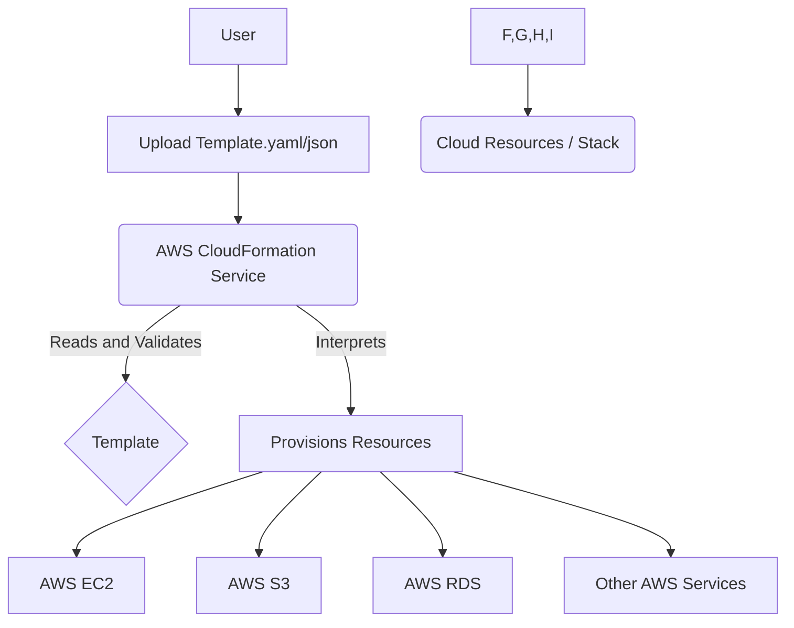
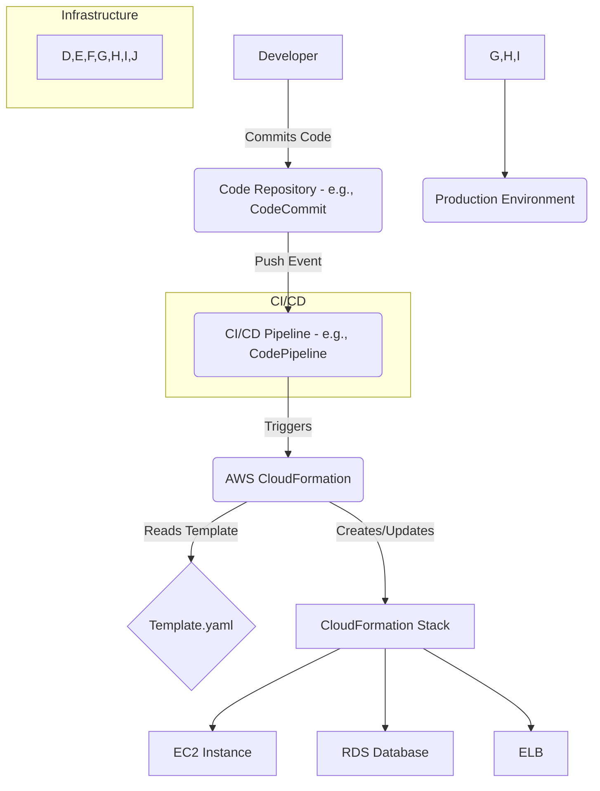
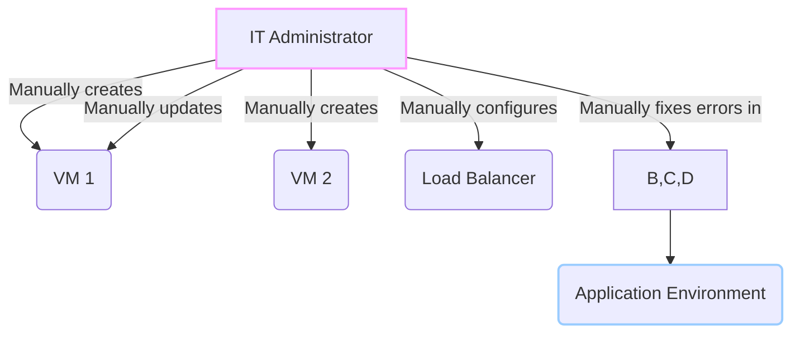

# Cloud Formation

## AWS CloudFormation

### 🚀 AWS CloudFormation: Infrastructure as Code

As an AWS Cloud Expert, let's dive into AWS CloudFormation, a fundamental service for managing your cloud infrastructure. It's a cornerstone of the **Infrastructure as Code (IaC)** paradigm, which is crucial for modern, scalable, and reliable cloud deployments.

***

### 🌟 Overview

AWS CloudFormation is a service that helps you model and set up your AWS resources so you can spend less time managing those resources and more time on your applications. You define your desired state of resources in a **template** file, and CloudFormation provisions and configures them for you as a single unit called a **stack**. This approach treats your infrastructure like application code, enabling version control, peer review, and automated deployment.

<figure><figcaption></figcaption></figure>

#### 🤖 Innovation Spotlight

Today, CloudFormation is more than just an IaC tool for AWS. The **CloudFormation Registry** allows you to provision and manage **third-party resources** (like Datadog, GitHub, or MongoDB Atlas) and even your own custom resources. This extends the power of CloudFormation beyond the AWS ecosystem, creating a single, unified method for managing your entire application stack, both in and out of the AWS cloud. Another powerful innovation is **CloudFormation Guard**, an open-source policy-as-code tool that helps you validate your templates against your organizational security and compliance policies _before_ you even deploy them.

***

### ⚡ Problem Statement

Imagine you are a startup needing to deploy a multi-tier web application consisting of EC2 instances, an RDS database, a load balancer, and several S3 buckets. Manually provisioning these resources through the AWS Management Console is not only time-consuming but also highly susceptible to human error. Recreating the exact same environment for a development, staging, or production setup becomes a nightmare, leading to inconsistencies and configuration drift.

#### 🤝 Business Use Cases

* **E-commerce:** Rapidly deploy and scale identical, high-availability web environments across different regions for disaster recovery.
* **FinTech:** Ensure secure and compliant environments by enforcing strict security group rules and data encryption policies in a repeatable manner.
* **Software Development:** Automate the provisioning of CI/CD pipelines, testing environments, and application stacks, integrating seamlessly with version control systems like GitHub or AWS CodeCommit.
* **Healthcare:** Maintain strict compliance by using templates that enforce HIPAA-compliant configurations for data storage and processing.

***

### 🔥 Core Principles

* **Infrastructure as Code (IaC):** Managing and provisioning infrastructure through code instead of manual processes. This brings consistency, repeatability, and version control to your infrastructure.
* **Template:** A text file in JSON or YAML format that describes the resources you want to provision in your stack. It's the blueprint of your infrastructure.
* **Stack:** A collection of AWS resources created and managed as a single unit. If you delete the stack, all the resources within it are automatically deleted.
* **Change Set:** A preview of the changes CloudFormation will make to your stack. It allows you to review the proposed modifications before they are applied, preventing unintended resource deletions or updates.
* **StackSets:** An extension of stacks that allows you to deploy a single template to multiple AWS accounts and regions with a single operation. This is ideal for multi-account or multi-region strategies.
* **Drift Detection:** A feature that identifies when the actual state of your deployed resources differs from the state defined in your CloudFormation template. It helps you catch manual changes made outside of CloudFormation.

***

### 📋 Pre-Requirements

* **An AWS Account:** With sufficient permissions to create and manage the necessary services.
* **IAM User/Role:** An IAM entity with an attached policy that grants `cloudformation:*` and specific permissions for the resources you intend to create (e.g., `ec2:*`, `s3:*`).
* **Text Editor:** Any text editor to write your JSON or YAML template files.
* **AWS CLI (Optional):** Command-line tool for interacting with AWS services, useful for automated deployments.

***

### 👣 Implementation Steps

1.  **Write the CloudFormation Template:** Use YAML or JSON to define your resources. For a simple web app, this might include an `AWS::EC2::Instance` and an `AWS::S3::Bucket`.

    ```yaml
    AWSTemplateFormatVersion: '2010-09-09'
    Resources:
      MyS3Bucket:
        Type: AWS::S3::Bucket
        Properties:
          AccessControl: PublicRead
          BucketName: my-unique-website-bucket-001
      MyEC2Instance:
        Type: AWS::EC2::Instance
        Properties:
          InstanceType: t2.micro
          ImageId: ami-0c55b159cbfafe1f0
    ```
2. **Save the File:** Save the template as `template.yaml`.
3. **Upload the Template:** Navigate to the AWS CloudFormation console, click "Create stack," and upload your template file.
4. **Configure Stack Details:** Give your stack a name (e.g., `MyWebAppStack`). You can also provide parameters, tags, and other options here.
5. **Review and Create:** Review the details, acknowledge that CloudFormation might create IAM resources, and click "Create stack."
6. **Monitor the Stack Creation:** Watch the "Events" tab. CloudFormation will show the progress of each resource creation.
7. **Update (Optional):** If you need to make changes, modify your `template.yaml` and create a **Change Set** to preview the impact before applying the update.
8. **Delete the Stack:** When the environment is no longer needed, you can delete the entire stack, and CloudFormation will tear down all provisioned resources cleanly and automatically.

***

### 🗺️ Data Flow Diagram

**Diagram 1: How CloudFormation Works**



**Diagram 2: CI/CD Deployment with CloudFormation**



***

### 🔒 Security Measures

* **Least Privilege IAM Roles:** Grant CloudFormation an IAM role with only the necessary permissions to create, update, and delete the specific resources defined in your template. Avoid using admin-level permissions.
* **Enable Encryption:** Use CloudFormation properties to enforce encryption on resources like S3 buckets (`S3Bucket::Encryption`) and RDS databases (encrypted `StorageEncrypted` parameter).
* **VPC Isolation:** Ensure your resources are deployed in a private VPC and subnet, with public access only granted through controlled access points like a load balancer.
* **CloudFormation Guard:** Proactively use this tool to validate your templates against security policies (e.g., "no S3 buckets should be public," "all databases must be encrypted").

***

### ⚖️ When to use and when not to use

### # ✅ When to use

* **Repeatable Deployments:** When you need to create identical environments for development, testing, and production.
* **Automated Provisioning:** As part of a CI/CD pipeline for a fully automated deployment process.
* **Complex Environments:** To manage a large number of interdependent resources.
* **Version Control:** To track changes to your infrastructure and roll back to previous versions if needed.

### # ❌ When not to use

* **Single, One-Off Resources:** It's overkill to use CloudFormation for a single, non-critical S3 bucket.
* **Manual Hotfixes:** When an urgent, manual change is required and you don't have time to create and validate a template update. However, this will cause configuration drift and is generally discouraged.

***

### 💰 Costing Calculation

* **How it is calculated:** CloudFormation itself is a **free service**. You are only billed for the AWS resources that your CloudFormation stack provisions and uses. The costs are calculated based on the standard pricing models of each individual service (e.g., EC2 instance-hours, S3 storage, RDS instance class).
* **Efficient way of handling this service:**
  * **Delete Unnecessary Stacks:** Clean up development and test environments when they are not in use to avoid paying for idle resources.
  * **Use `DeletionPolicy: Retain`:** For critical data stores (like databases or S3 buckets), use `DeletionPolicy: Retain` to ensure the resource and its data are not accidentally deleted when the stack is.
  * **Monitor Drift:** Regularly check for drift to ensure no manually created resources are incurring unexpected costs.
* **Sample Calculation:**
  * **Stack:** 1 x `t3.medium` EC2 instance, 1 x `db.t3.micro` RDS instance, 1 x S3 bucket (100 GB storage).
  * **Monthly Cost Breakdown:**
    * **EC2:** `$0.0416 per hour` (approx.) x `730 hours/month` = `$30.37`
    * **RDS:** `$0.017 per hour` (approx.) x `730 hours/month` = `$12.41`
    * **S3:** `$0.023 per GB` x `100 GB` = `$2.30`
  * **Total Monthly Cost (approx.):** `$30.37 + $12.41 + $2.30 = $45.08`

***

### 🧩 Alternative services&#x20;

#### AWS/Azure/GCP/On-Premise

| Service                             | Platform    | Key Comparison/Difference                                                                                                                       |
| ----------------------------------- | ----------- | ----------------------------------------------------------------------------------------------------------------------------------------------- |
| **AWS CloudFormation**              | AWS         | Native AWS service. Declarative (JSON/YAML). Strong integration with all AWS services.                                                          |
| **AWS CDK**                         | AWS         | Abstraction over CloudFormation. Use familiar programming languages (Python, TypeScript) to define infrastructure.                              |
| **Azure ARM Templates**             | Azure       | Azure's native IaC service. JSON-based. Tightly integrated with Azure resources.                                                                |
| **Google Cloud Deployment Manager** | GCP         | GCP's native IaC service. YAML or Python-based. Designed for managing resources on Google Cloud.                                                |
| **Terraform**                       | Multi-Cloud | An open-source, multi-cloud IaC tool by HashiCorp. Uses its own language (HCL) and can manage resources across all major clouds and on-premise. |

**On-Premise Alternative Data Flow Diagram (Manual/Script-based)**



***

### ✅ Benefits

* **Consistency:** Eliminates configuration drift and ensures all environments are identical.
* **Automation:** Automates the entire resource provisioning and tear-down process.
* **Version Control:** Templates can be stored in Git, allowing for full version history and collaboration.
* **Reduced Human Error:** Minimizes the risk of manual misconfigurations.
* **Cost Efficiency:** Easier to manage and delete environments, preventing unnecessary costs.
* **Speed:** Accelerates the deployment of complex applications and infrastructure.

***

### 📝 Summary

AWS CloudFormation is a powerful, native Infrastructure as Code service that allows you to automate the provisioning and management of your AWS resources through declarative templates. It treats your infrastructure as code, enabling consistency, version control, and repeatable deployments. This approach is essential for scaling modern cloud applications while minimizing human error.

**Top 5 Things to Keep in Mind:**

1. **IaC Mindset:** Treat your CloudFormation templates like application code.
2. **YAML over JSON:** It's generally more human-readable and easier to write.
3. **Change Sets:** Always use change sets to preview updates before applying them.
4. **Cost Management:** You only pay for the resources, not for the CloudFormation service itself, so clean up unused stacks.
5. **Drift Detection:** Regularly check for configuration drift to ensure your templates and deployed resources are in sync.

***

### 🔗 Related Topics

* AWS Cloud Development Kit (CDK): A higher-level abstraction for authoring CloudFormation templates using programming languages.
* AWS SAM (Serverless Application Model): An extension of CloudFormation specifically for building serverless applications.
* Terraform: A popular open-source, multi-cloud IaC tool.
* AWS CloudFormation User Guide: [AWS CloudFormation: A Year in Review](https://www.google.com/search?q=https://www.youtube.com/watch%3Fv%3DgT5c3s8J4L0)
