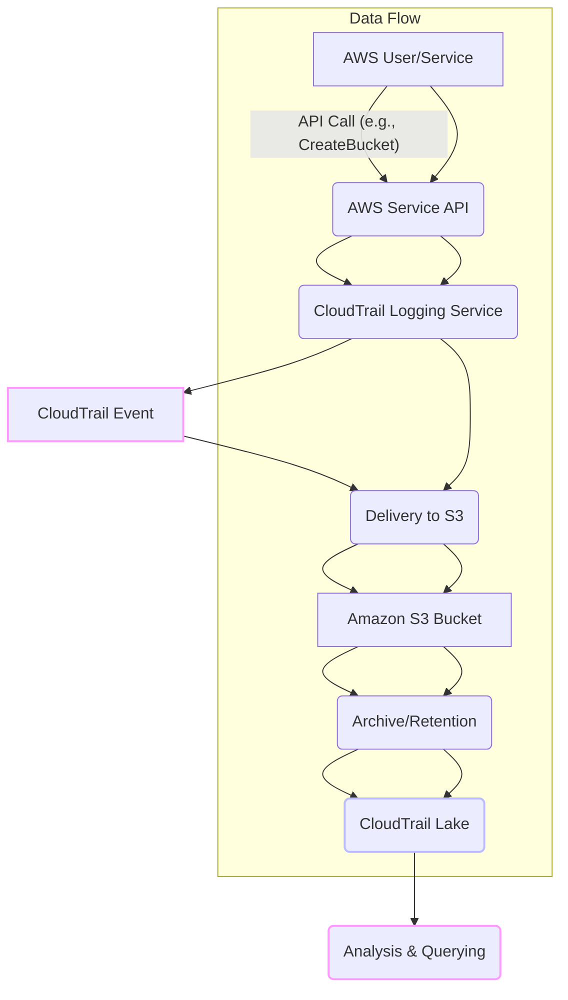
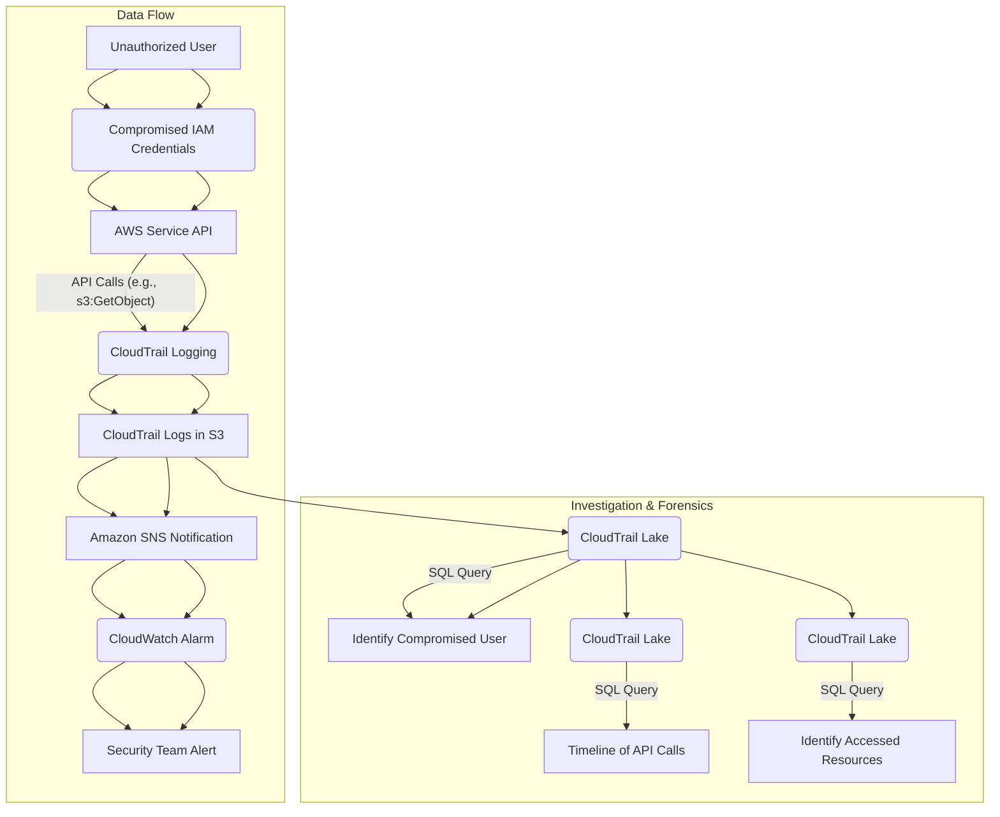

# CloudTrail

## AWS CloudTrail

### 🌟 Overview: What is AWS CloudTrail?

AWS CloudTrail is a service that provides a detailed log of all API activity within your AWS account. It acts as a powerful auditing and governance tool, recording every action—who performed it, what resource was involved, when it happened, and from where. This creates a comprehensive, immutable audit trail for your AWS environment.

<figure><figcaption></figcaption></figure>

Think of it as the flight recorder for your AWS account. Just as a black box records all flight data, CloudTrail captures every API call, providing a detailed history of all operations. This is crucial for security analysis, compliance auditing, operational troubleshooting, and incident forensics.

#### 🤖 Innovation Spotlight: CloudTrail Lake

While traditional CloudTrail focuses on delivering logs to an S3 bucket, **CloudTrail Lake** is a recent innovation that transforms how you use this data. Instead of just storing raw log files, CloudTrail Lake is a managed data lake for your audit and security logs. It allows you to:

* **Centralize Data:** Ingest, aggregate, and immutably store events from various sources, including AWS services, external cloud environments (like Azure and GCP), and on-premise applications.
* **Analyze at Scale:** Use SQL-based queries to analyze petabytes of log data, eliminating the need for a separate data warehouse or analytics service like Amazon Athena.
* **Derive Insights:** Detect unusual activity and trends in API usage patterns with CloudTrail Insights. This goes beyond simple logging to provide intelligent anomaly detection for potential security threats.

***

### ⚡ Problem Statement: Unraveling a Security Incident

An e-commerce company, "SecureShop," experiences an unexpected data breach. An unauthorized user gained access to a customer database, but the security team is struggling to identify how the breach occurred and what data was exfiltrated. The logs from their web servers and databases don't provide a clear picture of the AWS-level actions that led to the compromise. They need to answer critical questions:

* What IAM role or user was used to gain access?
* What specific API calls were made to the database service?
* When did the unauthorized activity begin and end?
* Was any other data accessed or exfiltrated?

Without a comprehensive audit trail, the security team is blind. They cannot perform a proper forensic investigation, ensure compliance with regulations like GDPR, or implement measures to prevent a future attack.

#### 🤝 Business Use Cases

* **Financial Services:** Banks and FinTech companies use CloudTrail to meet stringent compliance requirements (e.g., PCI DSS, SOX) by providing an immutable audit trail of all financial data access and system changes.
* **Healthcare:** Healthcare providers and tech companies (HealthTech) leverage CloudTrail to ensure HIPAA compliance by tracking access to protected health information (PHI) and verifying that only authorized individuals and services interact with sensitive data.
* **SaaS Providers:** Companies with multi-tenant SaaS platforms use CloudTrail to provide customers with an audit trail of their own activities and to troubleshoot application issues by tracing API calls.
* **Government Agencies:** Public sector organizations use CloudTrail for governance, risk management, and compliance with various government standards.

***

### 🔥 Core Principles

* **Event-driven Logging:** CloudTrail captures every API call as a JSON-formatted event. An event records all relevant details of an action, such as the `userIdentity`, `eventTime`, `eventName`, and `sourceIpAddress`.
* **Immutable Audit Trail:** By delivering logs to an S3 bucket with versioning and file integrity validation enabled, CloudTrail creates a tamper-proof record of all activity.
* **Granular Control:** You can choose which types of events to log (management, data, or both), and apply advanced event selectors to filter events for specific resources or API calls.

#### Core Resources and Terms

* **Trails:** A trail is a configuration that enables CloudTrail logging for your AWS account. You can create a trail to log events from all AWS Regions (a multi-Region trail) or a single Region.
* **Events:** CloudTrail logs three main types of events:
  * **Management Events:** These events provide insight into management operations performed on resources in your AWS account. Examples include creating an EC2 instance, attaching an IAM policy, or modifying a security group. These are logged by default.
  * **Data Events:** These events log data plane operations on resources. Examples include an S3 `GetObject` API call or a Lambda `Invoke` API call. Data events are high-volume and are not logged by default. You must explicitly configure which data events to log.
  * **Insights Events:** These are a specialized type of management event that captures unusual API activity. For example, a sudden spike in API call rate or an unusual number of API errors.
* **Event History:** This is a built-in, no-cost feature of CloudTrail that provides a searchable, 90-day history of management events in your AWS account. It's a quick way to look up recent activity but lacks the long-term storage and analytical capabilities of a trail.
* **CloudTrail Lake:** A managed data lake for audit and security logs that enables long-term storage and advanced SQL querying. You can ingest events from CloudTrail trails as well as from external sources.
* **Event Data Store:** The core component of CloudTrail Lake, where your event data is stored. You can create different event data stores for different types of logs, with configurable retention periods.
* **Channels:** CloudTrail Lake uses channels to receive events from external sources and ingest them into an event data store.

***

### 📋 Pre-Requirements

* **AWS Account:** Access to an AWS account with the necessary IAM permissions.
* **IAM Role:** An IAM role for CloudTrail with permissions to create and manage the trail, and to deliver logs to an S3 bucket.
* **Amazon S3 Bucket:** A dedicated S3 bucket to store CloudTrail log files. It's a best practice to use a separate S3 bucket that is not used for other purposes.
* **AWS KMS Key (Optional but Recommended):** A KMS key for encrypting the log files at rest in S3.

***

### 👣 Implementation Steps

1. **Sign in to the AWS Management Console** and navigate to the CloudTrail service.
2. **Create a Trail:**
   * From the CloudTrail dashboard, choose **Trails** and then **Create trail**.
   * Give your trail a name (e.g., `My-Organization-Trail`).
   * Select **Apply trail to all Regions** to get a unified view of all API activity across your AWS account.
3. **Configure Storage:**
   * Choose **Create a new S3 bucket** or select an existing one. It's highly recommended to use a new, dedicated bucket.
   * Enable **Log file SNS notification** to receive alerts when new log files are delivered.
   * Enable **Log file validation** to ensure the integrity of your log files.
4. **Configure Events:**
   * Under **Choose log events**, select the event types you want to log:
     * **Management events:** This is enabled by default. Choose to log **Read** events (e.g., `ListBuckets`) and/or **Write** events (e.g., `CreateBucket`).
     * **Data events:** To track high-volume activities (like S3 object access), enable this and select the specific resources you want to monitor (e.g., a specific S3 bucket).
     * **Insights events:** To detect unusual activity, enable this for your management events.
5. **Review and Create:** Review your configuration and click **Create trail**. CloudTrail will now begin logging API activity and delivering log files to your S3 bucket.

***

### 🗺️ Data Flow Diagram

#### Diagram 1: How AWS CloudTrail Works

#### Diagram 2: Security Incident Investigation with CloudTrail

This diagram illustrates how CloudTrail logs are used to investigate a potential data breach.

***

### 🔒 Security Measures

* **Least Privilege IAM Roles:** Ensure that the IAM role used by CloudTrail has only the minimum necessary permissions to write to the S3 bucket and perform logging. Avoid using the `AWSCloudTrail_FullAccess` managed policy for day-to-day operations.
* **S3 Bucket Security:**
  * **Enable Server-Side Encryption (SSE-KMS):** Encrypt your log files at rest using a customer-managed KMS key. This adds an extra layer of protection.
  * **Restrict Public Access:** Configure the S3 bucket policy to prevent public access.
  * **MFA Delete:** Enable Multi-Factor Authentication (MFA) on the S3 bucket to prevent accidental or malicious deletion of logs.
  * **Bucket Policy:** Implement a strict S3 bucket policy that only allows the CloudTrail service to write to it.
* **Log File Integrity Validation:** Enable this feature to have CloudTrail create a "digest file" that verifies the integrity of your log files. This is a critical security and compliance control.
* **Centralized Logging:** For multi-account environments, use an AWS Organization trail to centrally log activity from all member accounts into a single, dedicated security account. This prevents individual account administrators from disabling logging.
* **Integrate with CloudWatch:** Stream CloudTrail events to CloudWatch Logs to enable real-time alerting on suspicious activities. For example, create an alarm for the `DeleteTrail` API call.

***

### ⚖️ When to use and when not to use

* **✅ When to use:**
  * **Auditing and Compliance:** When you need to meet regulatory standards like HIPAA, PCI DSS, or GDPR.
  * **Security Incident Response:** For forensic analysis to understand the root cause of a security breach.
  * **Operational Troubleshooting:** To debug application or infrastructure issues by tracing API calls and resource changes.
  * **Governance:** To enforce accountability by tracking who makes changes to your AWS environment.
* **❌ When not to use:**
  * **Real-time Performance Monitoring:** CloudTrail events have a delivery latency of a few minutes, making them unsuitable for real-time monitoring of application performance. Use Amazon CloudWatch for this purpose.
  * **Configuration Management:** While CloudTrail logs configuration changes, it doesn't provide a continuous record of the state of a resource over time. AWS Config is the right tool for tracking resource configuration history and compliance with rules.
  * **Cost Monitoring:** While CloudTrail can log cost-related API calls, it is not a cost management tool. Use AWS Cost Explorer and AWS Budgets for detailed cost analysis and alerts.

***

### 💰 Costing Calculation

* **How it is calculated?**
  * **Management Events:** By default, CloudTrail logs one copy of management events per region for free. If you enable logging for multiple regions, you get one free copy of events from each region. Additional copies of management events, as well as data events and Insights events, are charged.
  * **Data Events & Insights Events:** These are charged per 100,000 events. The cost is based on the volume of events logged.
  * **CloudTrail Lake:** You pay for data ingestion, retention, and analysis. Ingestion charges are based on the volume of data ingested into your event data store. Retention costs depend on the retention period (one-year extendable or seven-year). Analysis is charged based on the amount of data scanned by your queries.
  * **Associated Services:** You also incur costs for the services that CloudTrail integrates with, such as S3 storage and data transfer, Amazon CloudWatch Logs for log analysis, and Amazon SNS for notifications.
* **Efficient way of handling this service:**
  * **Centralize Logging:** Use a single, multi-Region trail in a dedicated logging account to avoid redundant logging across accounts and regions.
  * **Filter Data Events:** Don't log all data events. Be selective and only enable data event logging for critical resources (e.g., S3 buckets containing sensitive data) to control costs.
  * **Optimize S3 Storage:** Use S3 Lifecycle Policies to transition old log files to a cost-effective storage class like S3 Glacier after a certain period.
  * **Use CloudTrail Lake wisely:** Use CloudTrail Lake for long-term, high-volume analysis. For simple, recent lookups, use the free 90-day Event History.
* **Sample Calculations:**
  * **Scenario:** A customer logs 500,000 data events per month and uses a single multi-region trail.
  * **Calculation:**
    * **Management Events:** 1 copy is free.
    * **Data Events:**
      * 500,000 data events / 100,000 events = 5 units
      * Cost per 100,000 data events: $0.10 (example rate)
      * Total Data Events Cost: 5 units \* $0.10 = **$0.50**
    * **S3 Storage:** Assuming 100MB of logs per month, stored in S3 Standard at $0.023/GB, this is negligible.
  * **Total estimated cost:** \~$0.50 + S3 storage costs.

***

### 🧩 Alternative services in AWS/Azure/GCP/On-Premise

| Platform       | Service Name                   | Key Comparison/Difference                                                                                                                                                                                                                                                                                                               |
| -------------- | ------------------------------ | --------------------------------------------------------------------------------------------------------------------------------------------------------------------------------------------------------------------------------------------------------------------------------------------------------------------------------------- |
| **AWS**        | **AWS CloudTrail**             | Provides a detailed, immutable audit trail of API activity, ideal for security, compliance, and governance.                                                                                                                                                                                                                             |
| **AWS**        | **AWS Config**                 | Tracks resource configuration changes and their history, focusing on state and compliance rules, not API calls.                                                                                                                                                                                                                         |
| **AWS**        | **Amazon CloudWatch**          | A monitoring service for real-time metrics, logs, and alarms to track performance and operational health. Complementary to CloudTrail.                                                                                                                                                                                                  |
| **Azure**      | **Azure Monitor Activity Log** | Similar to CloudTrail's Event History. It records control plane events (management operations) and provides insights into who performed an action and when.                                                                                                                                                                             |
| **GCP**        | **Cloud Audit Logs**           | Captures administrative activity and data access for Google Cloud services. Provides a similar function to CloudTrail for Google's ecosystem.                                                                                                                                                                                           |
| **On-Premise** | **Syslog / SIEM Solutions**    | Uses a centralized syslog server to collect logs from various on-premise systems (servers, network devices). A SIEM (Security Information and Event Management) system like Splunk or Elastic Stack is then used to ingest, correlate, and analyze these logs. This requires manual setup and management of the logging infrastructure. |

***

### ✅ Benefits

* **Compliance & Auditing:** Helps organizations meet regulatory requirements by providing a complete and verifiable audit trail.
* **Security Posture Improvement:** Enables security teams to identify suspicious activity, unauthorized access attempts, and potential security threats.
* **Operational Efficiency:** Simplifies troubleshooting by allowing engineers to quickly pinpoint the cause of a problem by reviewing the sequence of events.
* **Centralized Governance:** A multi-account trail helps a security team maintain a single source of truth for all API activity across an entire organization.
* **Accountability:** Provides a clear record of who did what, when, and where, which is essential for internal governance.

***

### 📝 Summary

AWS CloudTrail is a foundational service for auditing, governance, and compliance. It continuously monitors and records all API activity in your AWS account, providing a detailed, immutable log of every action. This "black box" of your cloud environment is indispensable for security incident response, operational troubleshooting, and meeting regulatory requirements. Key to its value is the ability to not just store logs, but to query and analyze them at scale with CloudTrail Lake and detect anomalies with CloudTrail Insights.

**Top 5 Things to Keep in Mind:**

1. **CloudTrail is enabled by default:** It logs 90 days of management events, but you need to create a trail for long-term storage.
2. **Separate Management and Data Events:** Management events are logged by default, but data events (high-volume) must be enabled explicitly and can be a significant cost factor.
3. **Centralize Logging:** Use a single, multi-Region trail in a dedicated security account for enterprise-wide visibility.
4. **Secure Your Logs:** Enable log file validation, MFA delete, and server-side encryption on the S3 bucket to protect your audit trail.
5. **CloudTrail is for "who did what," not "how is it performing."** Use it alongside CloudWatch (for performance monitoring) and AWS Config (for resource state history).

> In short, CloudTrail provides a comprehensive record of all user and service actions within your AWS account. It logs API calls, changes to resources, and other key events, creating a critical audit trail for security, compliance, and operational analysis.

***

### 🔗 Related Topics

* **AWS CloudWatch:** For application and infrastructure monitoring, logging, and performance metrics.
* **AWS Config:** For evaluating, auditing, and assessing the configurations of your AWS resources.
* **AWS Organizations:** For centrally managing multiple AWS accounts under a single administrative umbrella.
* **AWS Security Hub:** For a comprehensive view of your security alerts and compliance status across multiple AWS accounts.
