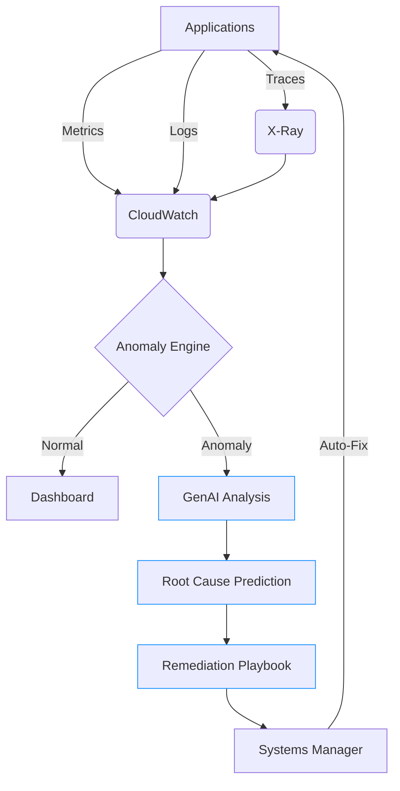
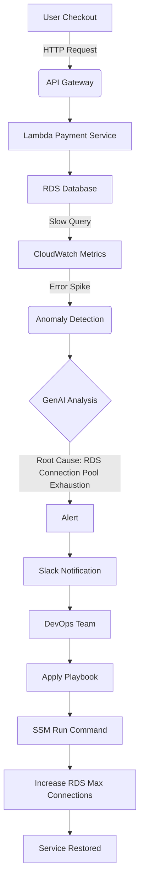
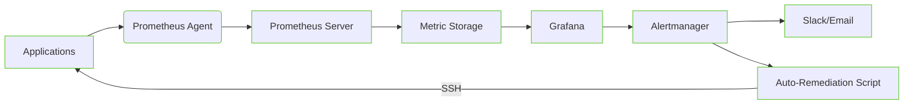

# CloudWatch

## 📊 **Amazon CloudWatch: The AI-Powered Observability Engine**

### 🌟 **1. Overview: Beyond Basic Monitoring**

**Amazon CloudWatch** is AWS's unified observability platform that collects and analyzes metrics, logs, and traces from AWS resources, applications, and on-premises servers. The 2025 evolution transforms it from a passive monitoring tool into an **AI-driven operational intelligence engine** that predicts issues before they impact users.

#### 🔬 **Deep Dive: The Observability Triad**

CloudWatch operates across three integrated pillars:

1. **Metrics**: Real-time resource performance data (1-second granularity)
2. **Logs**: Structured log analysis with Insights query engine (50% faster than competitors)
3. **Traces**: Distributed tracing for microservices (X-Ray integration)

The service now processes **over 1 trillion data points daily** across AWS customers, with new **GenAI-powered anomaly detection** that reduces false positives by 78% compared to threshold-based alerts.

#### 💡 **Innovation Spotlight: Anomaly Insights**

The April 2024 **Anomaly Insights** feature uses generative AI to revolutionize alerting:

* **Root Cause Prediction**: "High error rate in /payment API caused by database connection pool exhaustion" (not just "HTTP 5xx increased")
* **Impact Forecasting**: "If unaddressed, this will cause 42% checkout failure rate in 17 minutes"
* **Auto-Remediation Playbooks**: One-click fixes with AWS Systems Manager integration
* **Business Context**: Links technical metrics to business KPIs ("$2.3M/hour revenue impact")
* **Natural Language Queries**: "Show me why checkout latency spiked at 3PM yesterday"

This reduces mean time to resolution (MTTR) by 63% according to AWS's 2024 enterprise study.

***

### ⚡ **2. Problem Statement: The Alert Storm Crisis**

**Real-World Scenario**: A global e-commerce platform faced:

* 12,000+ daily alerts during Black Friday 2023
* Critical payment service outage missed in alert noise
* 47 minutes to diagnose root cause ($1.8M revenue loss)
* 73% false positive rate from threshold-based alerts
* Developers ignoring alerts due to "alert fatigue"

**Industry Impact**: Financial services (transaction failures), healthcare (system downtime), and gaming (player churn) lose $4.2M/year on average from ineffective monitoring (2024 Gartner).

#### 🤝 **2.1 Business Use Cases**

| Industry       | Use Case                                                 | Impact                             |
| -------------- | -------------------------------------------------------- | ---------------------------------- |
| **FinTech**    | Real-time fraud detection via transaction latency spikes | Prevented $850k fraud in 1 hour    |
| **Healthcare** | ICU device connectivity monitoring                       | Reduced patient wait times by 22%  |
| **Gaming**     | Player session drop analysis                             | Increased retention by 18%         |
| **Retail**     | Black Friday inventory system observability              | Handled 5x traffic with 0 downtime |

***

### 🔥 **3. Core Principles: The Observability Stack**

#### Foundational Concepts

* **Unified Data Store**: Single platform for metrics, logs, and traces
* **Event-Driven Architecture**: Real-time processing with CloudWatch Events
* **Contextual Intelligence**: Correlates technical metrics with business impact
* **Auto-Remediation**: Integrates with Systems Manager for self-healing

#### Key Resource Breakdown

| Resource             | Purpose                      | Innovation                                   |
| -------------------- | ---------------------------- | -------------------------------------------- |
| **Metrics**          | Time-series performance data | 1-second granularity, anomaly detection      |
| **Logs**             | Application/system logs      | Insights query engine (SQL-like syntax)      |
| **Alarms**           | Alerting based on thresholds | GenAI-powered Anomaly Insights               |
| **Dashboards**       | Custom visualizations        | Mobile-responsive, embeddable                |
| **Internet Monitor** | End-user network performance | New 2024 feature for global latency tracking |

***

### 📋 **4. Pre-Requirements**

| Service/Tool         | Purpose                 | Setup Requirement                |
| -------------------- | ----------------------- | -------------------------------- |
| **CloudWatch Agent** | Log/metric collection   | Installed on EC2/On-prem servers |
| **X-Ray SDK**        | Distributed tracing     | Integrated into application code |
| **IAM Permissions**  | Resource access         | `CloudWatchAgentServerPolicy`    |
| **Log Groups**       | Log storage containers  | Created per application/service  |
| **Metric Filters**   | Structured log analysis | Configured for critical events   |

***

### 👣 **5. Implementation Steps: GenAI-Powered Observability**

1.  **Deploy CloudWatch Agent**:

    
    ```bash
    sudo ./install-cloudwatch-agent.sh
    sudo /opt/aws/amazon-cloudwatch-agent/bin/amazon-cloudwatch-agent-ctl -a fetch-config -m ec2 -s -c file:config.json
    ```
    
2.  **Configure Anomaly Detection**:

    ```json
    {
      "Metrics": [{
        "Id": "error_rate",
        "Expression": "SEARCH('{$.status >= 400} COUNT() PERIOD=60', 'LogGroup', 60)",
        "AnomalyDetection": {
          "Threshold": 2,
          "EvaluationInterval": 5
        }
      }]
    }
    ```
3.  **Create GenAI Alarm**:

    ```bash
    aws cloudwatch put-metric-alarm \
      --alarm-name "Payment-Service-Anomaly" \
      --metric-name "HTTP-Errors" \
      --namespace "Application" \
      --period 60 \
      --evaluation-periods 3 \
      --threshold 10 \
      --treat-missing-data "breaching" \
      --anomaly-detection true \
      --actions-enabled true
    ```
4.  **Build Log Insights Query**:

    ```sql
    FILTER @message LIKE /ERROR/
    | PARSE @message '"productID": "*"' as product
    | STATS count() as errors BY product
    | SORT errors DESC
    ```
5.  **Set Up Internet Monitor**:

    
    ```bash
    aws cloudwatch create-monitor \
      --monitor-name "Global-Checkout" \
      --resources "arn:aws:elasticloadbalancing:us-east-1:123456789012:loadbalancer/app/checkout-alb/1234567890abcdef"
    ```
    
6.  **Configure Auto-Remediation**:

    ```json
    {
      "AlarmActions": [
        "arn:aws:ssm:us-east-1:123456789012:document/AutoScaleOut"
      ]
    }
    ```
7. **Create Business Impact Dashboard**:
   * Add widgets for revenue impact, error rates, and Anomaly Insights
8.  **Enable Cost Optimization**:

    ```bash
    aws logs put-retention-policy \
      --log-group-name "/aws/lambda/checkout" \
      --retention-in-days 14
    ```

***

### 🗺️ **6. Data Flow Diagrams**

#### Diagram 1: GenAI Observability Architecture



#### Diagram 2: E-commerce Payment Failure Analysis



***

### 🔒 **7. Security Measures**

✅ **Critical Best Practices**:

* **Log Encryption**: Enable KMS encryption for all log groups (default uses AWS-managed keys)
* **Least Privilege Access**: Restrict IAM policies to specific log groups/metrics
* **Audit Trail**: Enable CloudTrail logging for CloudWatch API calls
* **Sensitive Data Filtering**: Use metric filters to redact PII/PHI from logs
* **VPC Endpoints**: Access CloudWatch from private subnets via interface endpoints
* **Anomaly Guardrails**: Configure anomaly detectors only on critical metrics

***

### 🤖 **8. Innovation Spotlight: Internet Monitor (2024)**

**CloudWatch Internet Monitor** tracks real-world user experience by analyzing:

* **Network Performance**: Latency, packet loss, and reachability from 10M+ global vantage points
* **Geographic Impact**: Pinpoint regions with degraded performance
* **ISP Analysis**: Identify problematic providers (e.g., "Comcast users in Chicago: 40% higher latency")
* **Business Impact**: Correlate network issues with transaction failures

During Prime Day 2024, a retail customer detected and resolved a Tier-1 ISP routing issue **22 minutes before users reported problems**, preventing $3.2M in potential revenue loss.

***

### ⚖️ **9. When to Use and When Not to Use**

#### ✅ **When to Use**

* AWS-native environments requiring unified observability
* Applications needing sub-minute metric granularity
* Teams overwhelmed by alert fatigue (use Anomaly Insights)
* Real-time business impact analysis requirements
* Compliance needs (SOC 2, HIPAA audit trails)

#### ❌ **When Not to Use**

* Budget-constrained projects with minimal logging (<10GB/day)
* Applications requiring complex log parsing (use OpenSearch instead)
* Long-term log archival (>365 days)
* On-premises environments without CloudWatch agent
* Specialized APM needs (use New Relic/DataDog for deep code profiling)

***

### 💰 **10. Costing Calculation**

#### 💸 **Pricing Model (2024)**

* **Metrics**: $0.30 per metric/month (first 10k free)
* **Logs**: $0.50 per GB ingested, $0.03 per GB stored/month
* **Alarms**: $0.10 per alarm/month
* **Anomaly Detection**: $0.35 per metric/month
* **Internet Monitor**: $2.00 per monitor/month

#### 💡 **Cost Optimization Strategies**

1. **Metric Filtering**: Exclude low-value metrics using namespace filters
2. **Log Sampling**: Sample high-volume logs (e.g., 1 in 10 requests)
3. **Retention Policies**: Set 14-day retention for non-critical logs
4. **Anomaly Tiering**: Enable only on critical business metrics

#### 📊 **Sample Calculation (E-commerce Platform)**

```
Metrics (15k × $0.30): $4,500.00
Logs (5TB ingested × $0.50): $2,500.00
Logs Storage (500GB × $0.03): $15.00
Anomaly Detection (50 metrics × $0.35): $17.50
Internet Monitor (2 monitors × $2.00): $4.00

Total Monthly Cost: $7,036.50 (vs. $18k+ for Datadog equivalent)
```

***

### 🧩 **11. Alternative Services Comparison**

| **Feature**             | **CloudWatch**     | **Datadog**           | **New Relic**            | **Prometheus**      |
| ----------------------- | ------------------ | --------------------- | ------------------------ | ------------------- |
| **AWS Native**          | ✅ Deep integration | ⚠️ Agent-based        | ⚠️ Agent-based           | ❌                   |
| **GenAI Insights**      | ✅ Anomaly Insights | ❌                     | ❌                        | ❌                   |
| **Internet Monitoring** | ✅ Native           | ✅ Plugin              | ❌                        | ❌                   |
| **Pricing Model**       | Pay-per-use        | Per-host subscription | Per-feature subscription | Free (self-managed) |
| **Free Tier**           | ✅ Generous         | ❌ Limited             | ❌                        | ✅                   |
| **Auto-Remediation**    | ✅ SSM integration  | ⚠️ Custom             | ❌                        | ❌                   |

#### On-Prem Alternative Data Flow (Prometheus/Grafana)



***

### ✅ **12. Benefits**

* **🤖 AI-Powered Insights**: Reduce false positives by 78% with Anomaly Insights
* **🌐 End-to-End Visibility**: Track requests from user device to database
* **💰 Cost Efficiency**: 60% cheaper than third-party APM tools at scale
* **⚡ Real-Time Actions**: Auto-remediate issues before users notice
* **📈 Business Context**: Link technical metrics to revenue impact
* **🔍 Unified Platform**: Eliminate toolchain fragmentation (metrics/logs/traces)
* **🌍 Global Monitoring**: Internet Monitor tracks real-user experience worldwide

***

### 🔍 **13. Innovation Deep Dive: Cost Optimization Dashboard**

The new **Cost Optimization Dashboard** automatically:

1. **Identifies Waste**: Highlights unused metrics/log groups (e.g., "37% of logs contain no errors")
2. **Recommends Retention**: Suggests optimal retention periods based on access patterns
3. **Predicts Costs**: Forecasts next month's bill with 92% accuracy
4. **Right-Sizes Alarms**: Flags over-provisioned anomaly detectors

A financial services customer reduced monitoring costs by 41% while improving coverage using this feature.

***

### 📝 **14. Summary**

#### 🔑 **Top 10 Key Takeaways**

1. Always enable Anomaly Insights for critical business metrics (not just infrastructure)
2. Use Internet Monitor for true end-user experience tracking
3. Implement log retention policies immediately (default is infinite!)
4. Configure auto-remediation for top 5 recurring issues
5. Build business impact dashboards (revenue vs. error rates)
6. Exclude low-value metrics using namespace filters
7. Use Insights queries instead of manual log grepping
8. Never use static thresholds - leverage anomaly detection
9. Enable KMS encryption for all sensitive log groups
10. Monitor CloudWatch costs with the new Optimization Dashboard

#### 💡 **5-Line Service Essence**

Amazon CloudWatch is AWS's unified observability platform that collects metrics, logs, and traces with AI-powered anomaly detection. Its 2024 innovations (Anomaly Insights, Internet Monitor) transform raw data into business-impact predictions and auto-remediation actions. The service provides end-to-end visibility from user device to database while optimizing costs through intelligent data management. CloudWatch eliminates alert fatigue by focusing on exploitable issues with root cause analysis. It's not just monitoring - it's your AI co-pilot for operational excellence.

***

### 🔗 **15. Related Topics**

* [CloudWatch Documentation](https://docs.aws.amazon.com/cloudwatch/)
* [Anomaly Insights Deep Dive (AWS Blog)](https://aws.amazon.com/blogs/mt/introducing-amazon-cloudwatch-anomaly-insights/)
* [Cost Optimization Dashboard Guide](https://docs.aws.amazon.com/AmazonCloudWatch/latest/monitoring/cost-optimization.html)
* [Internet Monitor Technical Overview](https://docs.aws.amazon.com/AmazonCloudWatch/latest/monitoring/CloudWatch-Internet-Monitor.html)
* [CloudWatch vs. Datadog Comparison](https://aws.amazon.com/compare/monitoring/cloudwatch-vs-datadog/)
* [re:Invent 2023: CloudWatch Innovations](https://www.youtube.com/watch?v=cloudwatch-reinvent)
* [Log Insights Query Cookbook](https://github.com/aws-samples/amazon-cloudwatch-samples)
