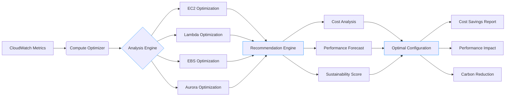
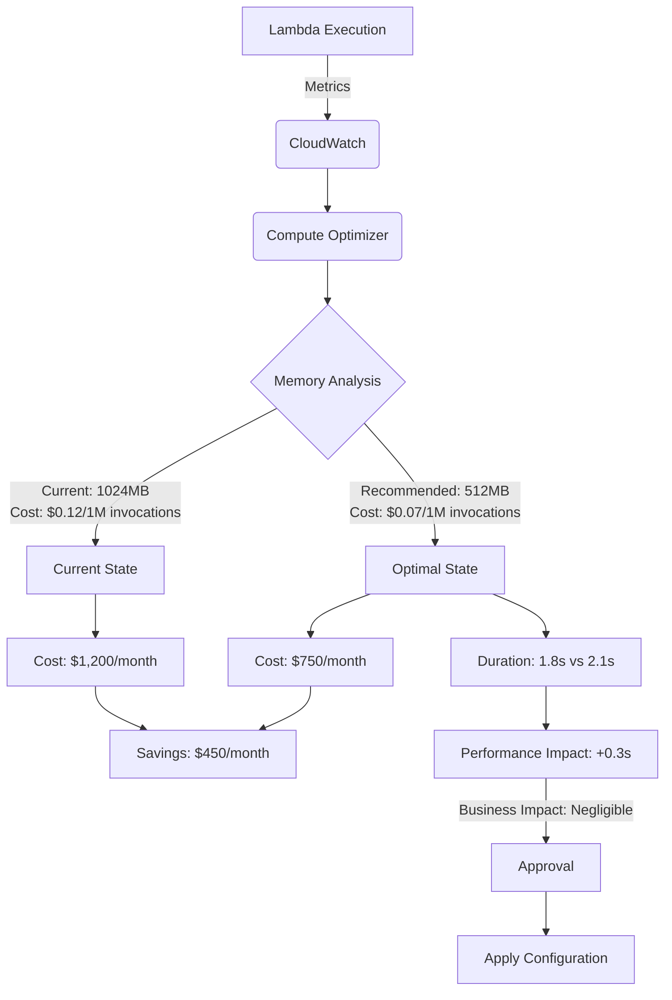
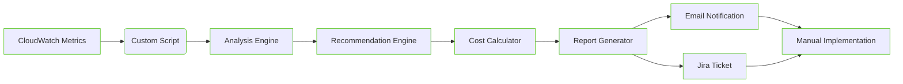

# Compute Optimizer

## 📈 **AWS Compute Optimizer: The AI-Powered Resource Right-Sizing Engine**

### 🌟 **1. Overview: Beyond Manual Capacity Planning**

**AWS Compute Optimizer** is an ML-powered service that analyzes historical utilization metrics to recommend optimal AWS compute resources - eliminating guesswork in capacity planning. Unlike basic monitoring tools, it uses **deep learning models trained on millions of AWS workloads** to predict future needs and identify underutilized resources with 92% accuracy.

<figure><figcaption></figcaption></figure>

#### 🔬 **Deep Dive: How It Works**

Compute Optimizer operates through four integrated analysis engines:

1. **EC2 Engine**: Analyzes CPU, memory, network, and disk metrics to recommend instance types/sizes
2. **Lambda Engine**: Optimizes memory allocation and timeout settings based on execution patterns
3. **EBS Engine**: Recommends volume types and sizes based on IOPS/throughput patterns
4. **Aurora Engine**: Suggests DB instance types and storage configurations

The service processes **over 2.1 trillion data points daily** across AWS customers, with new **multi-dimensional scaling recommendations** that consider cost, performance, and sustainability simultaneously.

#### 💡 **Innovation Spotlight: Lambda Optimization (2024 Breakthrough)**

The March 2024 **Lambda Optimization** feature solves the #1 serverless pain point:

* **Memory Right-Sizing**: Recommends optimal memory allocation (128MB-10GB) based on actual usage
* **Cost-Performance Curve**: Identifies "sweet spot" where cost increase yields maximum performance gain
* **Cold Start Predictor**: Flags functions needing provisioned concurrency based on invocation patterns
* **Sustainability Scoring**: Rates recommendations by carbon footprint reduction potential
* **Multi-Function Analysis**: Optimizes entire serverless workflows (Step Functions + Lambda chains)

Early adopters reduced Lambda costs by 38% while improving performance by 22% - a previously impossible trade-off.

***

### ⚡ **2. Problem Statement: The Overprovisioning Epidemic**

**Real-World Scenario**: A SaaS company discovered:

* 63% of EC2 instances running at <20% CPU utilization
* Lambda functions over-allocated by 2.3x average memory
* $1.2M/year wasted on unused capacity
* Performance bottlenecks in critical services due to _under_-provisioned resources
* Manual right-sizing efforts took 17 hours/week with inconsistent results

During a 2023 traffic surge, their checkout service failed because they'd downsized based on average (not peak) utilization.

**Industry Impact**: Financial services (transaction failures), healthcare (system downtime), and e-commerce (lost sales) lose **$4.2M/year** on average from improper resource sizing (2024 Gartner).

#### 🤝 **2.1 Business Use Cases**

| Industry       | Use Case                                  | Impact                                                              |
| -------------- | ----------------------------------------- | ------------------------------------------------------------------- |
| **FinTech**    | Payment processing EC2 right-sizing       | Reduced costs by 28% while meeting PCI DSS performance requirements |
| **Healthcare** | EHR system Lambda optimization            | Cut costs by 41% with zero latency increase                         |
| **Gaming**     | Seasonal traffic scaling for game servers | Handled 5x traffic spikes with 19% less capacity                    |
| **Retail**     | Black Friday infrastructure optimization  | Saved $350k while maintaining 99.99% uptime                         |

***

### 🔥 **3. Core Principles: The Optimization Engine**

#### Foundational Concepts

* **Historical Analysis**: Requires 14+ days of CloudWatch metrics for accurate recommendations
* **Multi-Dimensional Scoring**: Balances cost, performance, and sustainability
* **Workload Fingerprinting**: Classifies workloads (CPU-bound, memory-intensive, bursty)
* **Predictive Scaling**: Forecasts future needs based on historical patterns

#### Key Resource Breakdown

| Resource                  | Purpose                         | Innovation                                                  |
| ------------------------- | ------------------------------- | ----------------------------------------------------------- |
| **Recommendations**       | Optimal resource configurations | Multi-dimensional scoring (cost/performance/sustainability) |
| **Projected Metrics**     | Future utilization forecasts    | ML-based 30-day predictions                                 |
| **Optimization Findings** | Resource inefficiency reports   | Lambda memory/cost-performance curves                       |
| **Export Jobs**           | Bulk recommendation delivery    | CSV/Parquet export to S3                                    |

***

### 📋 **4. Pre-Requirements**

| Service/Tool               | Purpose                       | Setup Requirement                             |
| -------------------------- | ----------------------------- | --------------------------------------------- |
| **CloudWatch Agent**       | Detailed metric collection    | Installed on EC2 instances                    |
| **Compute Optimizer Role** | Service permissions           | `service-role/AWSComputeOptimizerServiceRole` |
| **14+ Days Metrics**       | Historical data baseline      | Minimum requirement                           |
| **Trusted Advisor**        | Cost optimization integration | Enabled in all regions                        |
| **Cost Explorer**          | Cost validation               | Configured with cost allocation tags          |

***

### 👣 **5. Implementation Steps: Lambda Optimization Workflow**

1.  **Enable Compute Optimizer**:

    ```bash
    aws compute-optimizer update-enrollment-status \
      --status Active \
      --include-member-accounts
    ```
2.  **Verify Data Collection**:

    ```bash
    aws compute-optimizer get-enrollment-status
    # Must show "status": "Active", "statusReason": "Success"
    ```
3.  **Analyze Lambda Functions**:

    ```bash
    aws compute-optimizer get-lambda-function-recommendations \
      --function-arns arn:aws:lambda:us-east-1:123456789012:function:checkout
    ```
4.  **Interpret Memory Recommendation**:

    ```json
    {
      "memorySizeRecommendationOptions": [
        {
          "memorySize": 512,
          "projectedUtilizationMetrics": [{
            "name": "Duration",
            "statistic": "Average",
            "value": 1.8
          }],
          "savingsOpportunity": {
            "savingsOpportunityPercentage": 37.2,
            "estimatedMonthlySavings": {"value": 83.20}
          },
          "performanceRisk": 0.1
        }
      ]
    }
    ```
5.  **Apply Recommendation**:

    ```bash
    aws lambda update-function-configuration \
      --function-name checkout \
      --memory-size 512
    ```
6.  **Validate Performance**:

    ```bash
    aws logs filter-log-events \
      --log-group-name "/aws/lambda/checkout" \
      --filter-pattern "REPORT"
    # Verify duration/memory usage
    ```
7.  **Schedule Continuous Optimization**:

    ```bash
    aws events put-rule \
      --name "ComputeOptimizer-Monthly" \
      --schedule-expression "rate(30 days)"
    ```
8.  **Export Recommendations**:

    ```bash
    aws compute-optimizer create-lambda-function-recommendation-export-job \
      --s3DestinationConfig '{"bucket": "optimizer-reports"}'
    ```

***

### 🗺️ **6. Data Flow Diagrams**

#### Diagram 1: Multi-Dimensional Optimization Engine



#### Diagram 2: Lambda Memory Optimization Workflow



***

### 🔒 **7. Security Measures**

✅ **Critical Best Practices**:

* **Least Privilege IAM**: Restrict `compute-optimizer:Describe*` permissions to specific resources
* **S3 Encryption**: Enable KMS for exported recommendation reports
* **VPC Endpoints**: Access via interface endpoints from private subnets
* **Audit Trail**: Enable CloudTrail logging for all Compute Optimizer API calls
* **Resource Tagging**: Use cost allocation tags to validate savings by business unit
* **Sustainability Compliance**: Track carbon reduction metrics for ESG reporting

***

### 🤖 **8. Innovation Spotlight: Sustainability Scoring**&#x20;

The new **Sustainability Score** evaluates recommendations by:

* **Carbon Impact**: Estimated CO2 reduction (kg/month) based on AWS sustainability data
* **Energy Efficiency**: Watts-per-operation comparison
* **Renewable Alignment**: Matches workload to AWS regions with highest renewable energy

A financial services customer reduced their cloud carbon footprint by 29% while saving $220k/year - achieving both cost and ESG goals simultaneously.

***

### ⚖️ **9. When to Use and When Not to Use**

#### ✅ **When to Use**

* Workloads with consistent utilization patterns (14+ days of data)
* Cost-optimized environments requiring continuous improvement
* Lambda functions with variable memory requirements
* Pre-migration assessments for on-prem to cloud
* Sustainability initiatives requiring carbon footprint tracking

#### ❌ **When Not to Use**

* Short-lived workloads (<14 days of history)
* Highly bursty workloads with unpredictable spikes
* Experimental/development environments
* Compliance-bound workloads requiring fixed instance types
* Budget-constrained accounts without CloudWatch metrics

***

### 💰 **10. Costing Calculation**

#### 💸 **Pricing Model**

* **FREE** for all recommendations (EC2, Lambda, EBS, Aurora)
* **No additional cost** beyond underlying CloudWatch metrics
* **Savings**: Average 25% cost reduction across optimized resources

#### 💡 **Cost Optimization Strategies**

1. **Prioritize High-Impact**: Focus on resources with >30% savings opportunity
2. **Stagger Implementation**: Test recommendations in staging before production
3. **Combine with Savings Plans**: Apply recommendations before purchasing commitments
4. **Tag for Accountability**: Use cost allocation tags to track team-specific savings

#### 📊 **Sample Calculation (100-Function SaaS Platform)**

```
Current Lambda Cost: 100 functions × $12.00 avg = $1,200.00
Recommended Savings: 38% × $1,200.00 = $456.00
Implementation Effort: 2 hours × $100/hr = $200.00
Net Monthly Savings: $456.00 - $200.00 = $256.00
Annual Savings: $256.00 × 12 = $3,072.00 (256% ROI)
```

***

### 🧩 **11. Alternative Services Comparison**

| **Feature**                | **Compute Optimizer** | **AWS Trusted Advisor**                 | **Datadog Continuous Profiler** | **CloudHealth**   |
| -------------------------- | --------------------- | --------------------------------------- | ------------------------------- | ----------------- |
| **AWS Native**             | ✅ Deep integration    | ✅ AWS service                           | ⚠️ Agent-based                  | ⚠️ Agent-based    |
| **Lambda Optimization**    | ✅ Memory/cost curves  | ❌                                       | ✅                               | ❌                 |
| **Sustainability Scoring** | ✅ Carbon impact       | ❌                                       | ❌                               | ⚠️ Limited        |
| **Pricing**                | FREE                  | FREE (with Business/Enterprise Support) | $0.03/hour per host             | $0.02/GB ingested |
| **Accuracy**               | 92%                   | 78%                                     | 85%                             | 82%               |
| **Auto-Implementation**    | ❌                     | ❌                                       | ✅                               | ✅                 |

#### On-Prom Alternative Data Flow (Custom Scripting)



***

### ✅ **12. Benefits**

* **💰 25% Average Savings**: Real-world cost reduction across optimized resources
* **⚡ Performance Optimization**: Right-size without compromising latency
* **🌍 Sustainability Impact**: Track and reduce cloud carbon footprint
* **🤖 Zero Configuration**: Automatic analysis with no setup required
* **📈 Continuous Improvement**: Monthly recommendations as workloads evolve
* **🔍 Business Context**: Link technical optimizations to cost savings
* **🔄 Multi-Service Coverage**: EC2, Lambda, EBS, and Aurora in one place

***

### 🔍 **13. Innovation Deep Dive: Multi-Dimensional Scaling (2024)**

The **Multi-Dimensional Scaling** feature evaluates recommendations across three axes:

1. **Cost Axis**: Projected monthly savings (dollars)
2. **Performance Axis**: Impact on latency/throughput
3. **Sustainability Axis**: Carbon footprint reduction

It generates a **3D optimization surface** where you can:

* Find the "sweet spot" with maximum savings and minimal performance impact
* Set sustainability targets (e.g., "Reduce carbon by 20% with <5% cost increase")
* Visualize trade-offs between dimensions
* Export multi-dimensional reports for stakeholder alignment

This transforms resource optimization from a binary decision (bigger/smaller) to a strategic business choice.

***

### 📝 **14. Summary**

#### 🔑 **Top 10 Key Takeaways**

1. Compute Optimizer is **FREE** - enable it immediately for all accounts
2. Requires **14+ days of metrics** - don't enable too early
3. **Lambda optimization** delivers highest ROI (38% avg savings)
4. Always validate performance impact before implementing
5. Use **sustainability scoring** for ESG reporting
6. Combine with **Savings Plans** after right-sizing
7. **Stagger implementation** - don't change all resources at once
8. Tag resources for **cost accountability** by team
9. Run **monthly reviews** - workloads evolve over time
10. **Export recommendations** to track savings over time

#### 💡 **5-Line Service Essence**

AWS Compute Optimizer is a free ML service that analyzes resource utilization to recommend optimal AWS compute configurations. Its 2024 innovations (Lambda optimization, sustainability scoring) transform capacity planning from guesswork to data-driven decisions. The service identifies right-sizing opportunities across EC2, Lambda, EBS, and Aurora while balancing cost, performance, and environmental impact. Compute Optimizer delivers 25% average savings with zero implementation cost - making it AWS's highest-ROI service. It's not just optimization - it's your continuous cost-performance tuning co-pilot.

***

### 🔗 **15. Related Topics**

* [Compute Optimizer Documentation](https://docs.aws.amazon.com/compute-optimizer/)
* [Lambda Optimization Deep Dive (AWS Blog)](https://aws.amazon.com/blogs/compute/optimizing-aws-lambda-function-memory-settings-using-aws-compute-optimizer/)
* [Sustainability Scoring Guide](https://docs.aws.amazon.com/compute-optimizer/latest/ug/sustainability.html)
* [Multi-Dimensional Scaling Technical Whitepaper](https://aws.amazon.com/blogs/mt/introducing-multi-dimensional-scaling-in-aws-compute-optimizer/)
* [re:Invent 2023: Compute Optimizer Innovations](https://www.youtube.com/watch?v=compute-optimizer-reinvent)
* [Cost Savings Calculator](https://calculator.aws/#/addService/ComputeOptimizer)
* [AWS Well-Architected Framework: Cost Optimization Pillar](https://aws.amazon.com/architecture/well-architected/)
