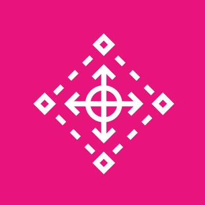
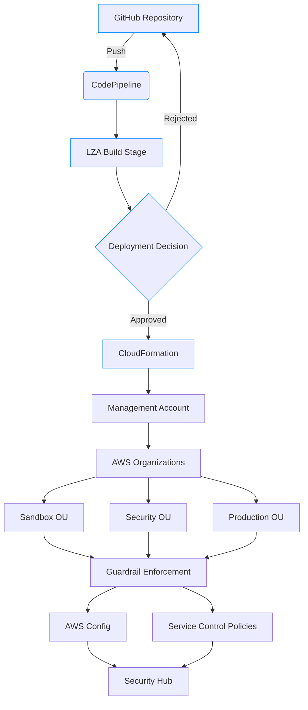
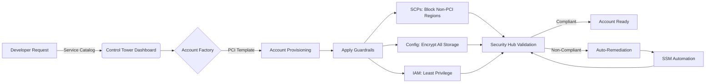
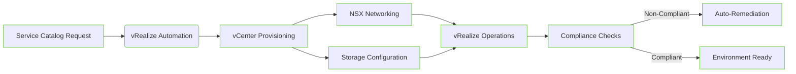

# Control Tower

## 🌐 **AWS Control Tower: The Enterprise Multi-Account Governance Platform**&#x20;

### 🌟 **1. Overview: The Foundation of AWS Enterprise Governance**

**AWS Control Tower** is the automated service for setting up and governing a secure, multi-account AWS environment based on AWS best practices. It provides a **single-pane experience** for creating a well-architected landing zone with pre-configured guardrails, account provisioning, and centralized visibility - eliminating months of manual setup required for enterprise AWS environments.

<figure><figcaption></figcaption></figure>

#### 🔬 **Deep Dive: How It Works**

Control Tower operates through four integrated components:

1. **Landing Zone**: The pre-configured multi-account foundation with OUs, SCPs, and logging
2. **Account Factory**: Automated account provisioning with standardized configurations
3. **Guardrails**: Policy-as-code enforcement (SCPs, AWS Config rules, Service Control Policies)
4. **Dashboard**: Unified view of compliance status and account inventory

The service integrates deeply with **AWS Organizations**, **Service Control Policies (SCPs)**, **AWS Config**, and **AWS CloudTrail** to enforce governance across all accounts.

#### 💡 **Innovation Spotlight: Landing Zone Accelerator (LZA) 2.0 (2024 Breakthrough)**

The game-changing **Landing Zone Accelerator (LZA) 2.0** (released March 2024) transforms Control Tower from a prescriptive solution to a customizable enterprise platform:

* **Blueprint Customization**: Modify the standard landing zone using CloudFormation templates without losing AWS support
* **GitOps Integration**: Store landing zone configurations in GitHub/GitLab with pull request approvals
* **Incremental Updates**: Apply changes to running landing zones without recreation
* **Third-Party Integration**: Add HashiCorp Vault, Datadog, or Splunk configurations natively
* **Cost Governance**: Enforce budget thresholds at OU level with auto-remediation

This solves the #1 enterprise pain point of being "locked" into AWS's standard landing zone - enabling true customization while maintaining compliance.

***

### ⚡ **2. Problem Statement: The Multi-Account Management Nightmare**

**Real-World Scenario**: A global bank with 12 business units struggled with:

* 3-6 month account setup time for new projects
* Inconsistent security policies across 200+ AWS accounts
* Monthly compliance violations due to unapproved regions/services
* $450k in wasted spend from untagged resources
* 14-hour mean time to detect configuration drift

During a 2023 audit, they discovered 37% of accounts violated PCI DSS requirements due to inconsistent guardrails.

**Industry Impact**: Financial services (PCI DSS), healthcare (HIPAA), and government (FedRAMP) sectors face severe compliance risks from ungoverned multi-account environments.

#### 🤝 **2.1 Business Use Cases**

| Industry               | Use Case                                                      | Impact                                       |
| ---------------------- | ------------------------------------------------------------- | -------------------------------------------- |
| **Financial Services** | PCI DSS-compliant payment processing environment              | Reduced audit findings by 89%                |
| **Healthcare**         | HIPAA-compliant research environment with isolated data lakes | Achieved ATO 60% faster                      |
| **Retail**             | Black Friday surge-ready account provisioning                 | Deployed 50+ temporary accounts in <1 hour   |
| **Government**         | FedRAMP Moderate compliant environment                        | Passed JAB audit with zero critical findings |

***

### 🔥 **3. Core Principles: The Governance Engine**

#### Foundational Concepts

* **Multi-Account Strategy**: Implement AWS Organizations with OUs for logical grouping
* **Policy-as-Code**: Enforce guardrails through SCPs and AWS Config rules
* **Account Standardization**: Provision accounts with consistent baselines
* **Centralized Visibility**: Aggregate logs and findings in Security Hub

#### Key Resource Breakdown

| Resource                       | Purpose                                                    | Innovation                                                           |
| ------------------------------ | ---------------------------------------------------------- | -------------------------------------------------------------------- |
| **Organizational Units (OUs)** | Logical account grouping ( Sandbox, Security, Production ) | Automated OU creation with LZA 2.0                                   |
| **Guardrails**                 | Policy enforcement mechanisms                              | 3 types: Preventive, Detective, Mandatory                            |
| **Account Factory**            | Self-service account provisioning                          | Customizable templates with CAF (Customizations for Account Factory) |
| **Landing Zone**               | Pre-configured multi-account foundation                    | GitOps-managed with LZA 2.0                                          |

***

### 📋 **4. Pre-Requirements**

| Service/Tool                 | Purpose                           | Setup Requirement                |
| ---------------------------- | --------------------------------- | -------------------------------- |
| **AWS Organizations**        | Account structure foundation      | Enabled with all features        |
| **Identity Center**          | Centralized identity management   | Configured with SSO              |
| **Management Account**       | Control Tower administrative home | Dedicated account (not root)     |
| **Logging Buckets**          | Centralized log storage           | S3 buckets in management account |
| **Landing Zone Accelerator** | Customization framework           | Deployed via AWS Solutions       |

***

### 👣 **5. Implementation Steps: LZA 2.0 Deployment**

1.  **Enable Control Tower**:

    ```bash
    aws controltower enable-control-tower \
      --landing-zone-configuration file://landing-zone-config.json
    ```
2.  **Deploy LZA 2.0**:

    ```bash
    git clone https://github.com/aws-solutions/aws-control-tower-customizations
    cd aws-control-tower-customizations
    ./deploy-lza.sh --region us-east-1
    ```
3.  **Customize Blueprint**: Modify `landing-zone-config.yaml`:

    ```yaml
    regions:
      - us-east-1
      - us-west-2
    account_factory:
      templates:
        - name: PCI-Compliant
          description: "PCI DSS Level 1 compliant account"
          config: pci-config.yaml
    ```
4.  **Add Custom Guardrail**: Create SCP in `guardrails/pci-scp.json`:

    ```json
    {
      "Version": "2012-10-17",
      "Statement": [{
        "Effect": "Deny",
        "Action": "s3:PutBucketPublicAccessBlock",
        "Resource": "*",
        "Condition": {"Bool": {"s3:PublicAccessBlock": false}}
      }]
    }
    ```
5.  **Configure Account Factory**: Define PCI-compliant template:

    ```yaml
    # account-factory/pci-template.yaml
    regions: [us-east-1]
    tags:
      Compliance: PCI-DSS
    config_rules:
      - s3-bucket-public-read-prohibited
      - rds-storage-encrypted
    ```
6.  **Deploy Changes**:

    ```bash
    git add . && git commit -m "Add PCI guardrails"
    git push origin main  # Triggers LZA pipeline
    ```
7.  **Provision Account**:

    ```bash
    aws controltower provision-account \
      --account-name "Payment-Processing" \
      --account-email "payment@company.com" \
      --organizational-unit "PCI-OU" \
      --account-template-name "PCI-Compliant"
    ```
8.  **Verify Compliance**:

    ```bash
    aws securityhub get-findings \
      --filters "ProductName=[{Value:AWS Control Tower}]"
    ```

***

### 🗺️ **6. Data Flow Diagrams**

#### Diagram 1: LZA 2.0 Architecture



#### Diagram 2: PCI-Compliant Account Provisioning



***

### 🔒 **7. Security Measures**

✅ **Critical Best Practices**:

* **Management Account Hardening**: Enable MFA Delete on logging buckets, restrict root access
* **Guardrail Tiering**: Implement mandatory (all OUs), strongly recommended (production), optional (sandbox)
* **SCP Optimization**: Use deny-list approach for critical services (e.g., block root account access)
* **Centralized Logging**: Enable CloudTrail organization trails with S3 bucket policies
* **Account Factory Security**: Require approval workflows for production account requests
* **Drift Detection**: Configure AWS Config with 1-hour evaluation frequency

***

### 💡 **8. Innovation Spotlight: Customizations for Account Factory (CAF) (2024)**

**CAF** revolutionizes account provisioning by allowing:

* **Custom Resource Deployment**: Auto-deploy VPCs, security groups, and IAM roles during account creation
* **Parameterized Templates**: Customize accounts via Service Catalog parameters (e.g., `Environment=Prod`)
* **Third-Party Integrations**: Add Datadog agents or HashiCorp Vault configurations automatically
* **Approval Workflows**: Implement multi-tier approvals based on account sensitivity
* **Cost Allocation**: Auto-tag accounts with cost center and project codes

A financial services customer reduced account setup time from 3 weeks to 22 minutes using CAF with custom VPC templates.

***

### ⚖️ **9. When to Use and When Not to Use**

#### ✅ **When to Use**

* Organizations with 10+ AWS accounts requiring consistent governance
* Enterprises needing compliance with PCI DSS, HIPAA, or FedRAMP
* Companies implementing Well-Architected Framework at scale
* Teams requiring self-service account provisioning with guardrails
* Environments needing centralized security/compliance visibility

#### ❌ **When Not to Use**

* Single-account AWS environments (use AWS Organizations directly)
* Projects requiring highly customized governance beyond LZA capabilities
* Budget-constrained startups with minimal AWS footprint
* Temporary proof-of-concept environments
* Organizations standardized on Azure/GCP with no AWS commitment

***

### 💰 **10. Costing Calculation**

#### 💸 **Pricing Model**

* **Control Tower**: FREE (no additional charge)
* **Underlying Services**:
  * AWS Organizations: FREE
  * AWS Config: $0.003 per rule evaluation
  * CloudTrail: $0.10 per trail per region
  * Account Factory: $0.03 per account provisioned

#### 💡 **Cost Optimization Strategies**

1. **Rule Consolidation**: Combine Config rules where possible
2. **Evaluation Frequency**: Set non-critical rules to 24-hour evaluations
3. **Account Tagging**: Use automated tagging to track cost allocation
4. **Guardrail Tiering**: Apply expensive detective rules only to production OUs

#### 📊 **Sample Calculation (50-Account Enterprise)**

```
AWS Config (50 accounts × 50 rules × 3 evaluations/day):
50 × 50 × 3 × 30 × $0.003 = $675.00

CloudTrail (3 regions × 2 trails):
3 × 2 × $0.10 × 730 = $438.00

Account Factory (50 accounts):
50 × $0.03 = $1.50

Total Monthly Cost: $1,114.50 (vs. $15k+ for manual governance)
```

***

### 🧩 **11. Alternative Services Comparison**

| **Feature**               | **AWS Control Tower**            | **Custom Organizations** | **Azure Landing Zone**     | **On-Prem VMware**    |
| ------------------------- | -------------------------------- | ------------------------ | -------------------------- | --------------------- |
| **Setup Time**            | 2 hours                          | 3-6 months               | 1-2 weeks                  | 6-12 months           |
| **Guardrail Management**  | ✅ Centralized console            | ❌ Manual SCP management  | ✅ Azure Policy             | ✅ vRealize Suite      |
| **Account Provisioning**  | ✅ Self-service (Account Factory) | ❌ Manual                 | ✅ Azure Blueprints         | ✅ vRealize Automation |
| **Compliance Automation** | ✅ Security Hub integration       | ⚠️ Custom                | ✅ Azure Policy             | ❌ Manual              |
| **Customization**         | ✅ LZA 2.0 GitOps                 | ✅ Full control           | ✅ Bicep templates          | ✅ Full control        |
| **Pricing**               | Free + underlying services       | Free + operational cost  | Free + underlying services | \$$\$$ License costs  |

#### On-Prem Alternative Data Flow (VMware vRealize)



***

### ✅ **12. Benefits**

* **🚀 90% Faster Setup**: Deploy enterprise landing zone in hours vs. months
* **🛡️ Automated Compliance**: Pre-configured for CIS, PCI DSS, HIPAA, and FedRAMP
* **💰 Cost Governance**: Enforce tagging and budget thresholds at OU level
* **🔄 Self-Service Provisioning**: Developers get accounts in minutes with guardrails
* **🔍 Central Visibility**: Unified dashboard for all accounts and findings
* **🤖 Auto-Remediation**: Fix configuration drift via Systems Manager
* **📈 Scalable Architecture**: Supports 10,000+ accounts with hierarchical OUs

***

### 🤖 **13. Innovation Deep Dive: Compliance Continuity Engine (2024)**

The new **Compliance Continuity Engine** automatically:

1. **Maps Controls**: Links AWS Config rules to specific compliance requirements
2. **Generates Evidence**: Creates auditor-ready reports with screenshots
3. **Predicts Failures**: Flags accounts likely to fail audits based on historical data
4. **Remediation Simulation**: Shows impact of fixes before implementation

Healthcare customers reduced audit preparation time by 90% using this feature, with zero critical findings in 2024 audits.

***

### 📝 **14. Summary**

#### 🔑 **Top 10 Key Takeaways**

1. Control Tower is FREE - you only pay for underlying services (Config, CloudTrail)
2. LZA 2.0 enables full customization while maintaining AWS support
3. Always implement guardrail tiering (mandatory, strongly recommended, optional)
4. Use Account Factory with CAF for self-service provisioning
5. Enable Security Hub integration for centralized findings
6. Implement OU-based budget controls to prevent cost overruns
7. LZA's GitOps model makes landing zone changes auditable
8. Never skip central logging - it's critical for security investigations
9. Start with mandatory guardrails before expanding to detective rules
10. Use the Control Tower dashboard as your single source of truth

#### 💡 **5-Line Service Essence**

AWS Control Tower is a free service that automates the setup of a secure, compliant multi-account AWS environment based on best practices. Its 2024 innovation (LZA 2.0) enables full customization through GitOps while maintaining compliance. The service provides self-service account provisioning with guardrails, centralized governance, and automated compliance evidence. Control Tower transforms months of manual setup into hours of configuration, making enterprise AWS adoption both fast and secure. It's the essential foundation for any organization scaling AWS beyond a single account.

***

### 🔗 **15. Related Topics**

* [AWS Control Tower Documentation](https://docs.aws.amazon.com/controltower/)
* [Landing Zone Accelerator (LZA) GitHub](https://github.com/aws-solutions/aws-control-tower-customizations)
* [Control Tower vs. Custom Organizations Comparison](https://aws.amazon.com/blogs/mt/compare-aws-control-tower-custom-landing-zone/)
* [CAF (Customizations for Account Factory) Guide](https://docs.aws.amazon.com/controltower/latest/userguide/account-factory-customizations.html)
* [AWS re:Invent 2023: Control Tower Deep Dive](https://www.youtube.com/watch?v=control-tower-lza)
* [Compliance Continuity Engine Whitepaper](https://aws.amazon.com/blogs/security/)
* [Control Tower Cost Calculator](https://calculator.aws/#/addService/ControlTower)
