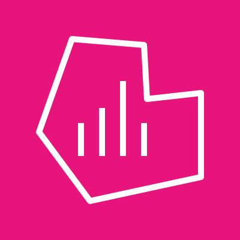
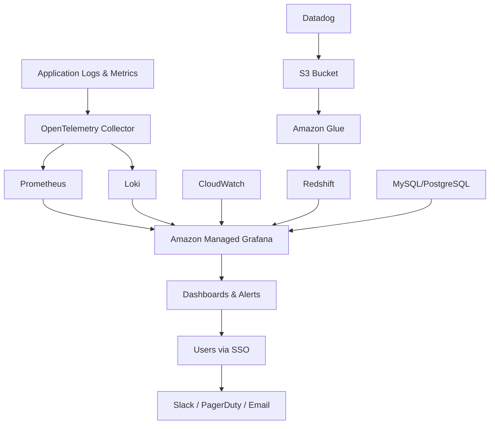
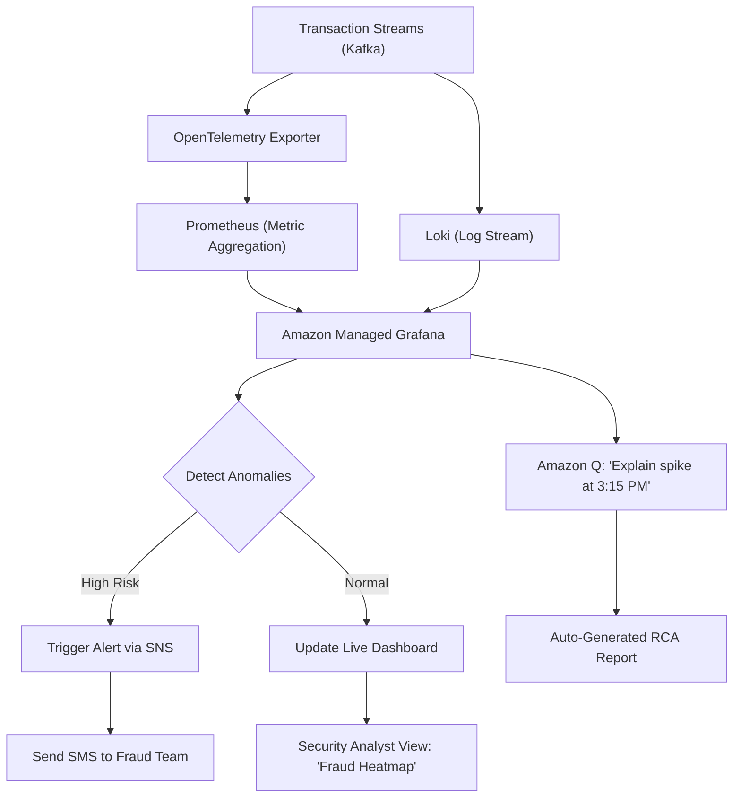
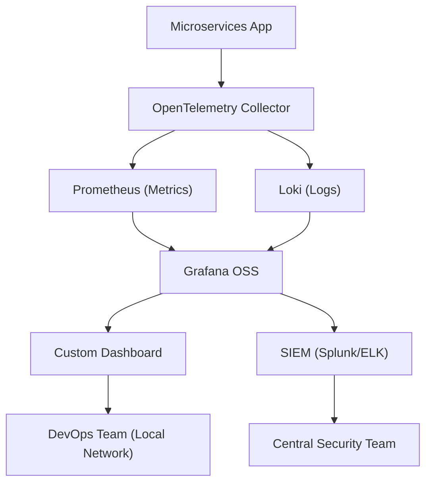

# Grafan

## 📊 **Amazon Managed Grafana (AMG)**

#### _The Unified, Serverless Visualization Engine for Cloud-Native Observability_

> ✅ **Updated 2025**: Amazon Managed Grafana has evolved beyond a simple dashboard tool — it's now the **centralized intelligence hub for modern cloud operations**, seamlessly integrating with **AWS Services, OpenTelemetry, Prometheus, Loki, and even third-party data sources**, all while being fully managed, secure, and scalable.

***

### 🌟 **Overview**

**Amazon Managed Grafana (AMG)** is a **fully managed, serverless version of Grafana** that enables you to build, share, and scale real-time dashboards, visualizations, and alerts across your entire infrastructure— from AWS EC2 and Lambda to Kubernetes clusters, on-prem systems, and even Azure/GCP.

<figure><figcaption></figcaption></figure>

> 🔥 **Innovation Spotlight (2025):**\
> AMG now includes **AI-Powered Anomaly Detection**, **Auto-Generated Dashboards via Amazon Q**, and **Natural Language Query (NLQ) Support**.
>
> 🤖 Example:\
> You type: _“Show me CPU utilization spikes in production over the last 4 hours.”_\
> → AMG automatically:
>
> * Queries CloudWatch, Prometheus, and OpenTelemetry
> * Detects anomalies using ML models
> * Generates a dynamic dashboard with root cause insights
> * Sends an alert via SNS if threshold breached
>
> ✨ This turns **observability from reactive to predictive and intelligent**.

> 💡 Also integrated with **Amazon Q for AWS** — enabling natural language interactions like: _“Why did my API latency increase at 3 PM?”_ → AMG answers with root cause analysis.

***

### ⚡ **Problem Statement**

#### 🏢 Real-World Scenario: Global FinTech Platform with Hybrid Workloads

**Company:** A global fintech firm running:

* AWS EC2 & RDS (prod)
* On-prem Kafka clusters (for transaction logging)
* EKS (Kubernetes) in AWS + Azure
* Third-party SaaS tools (e.g., Datadog, New Relic)

**Challenge:**

* Teams use **6+ different monitoring tools** (CloudWatch, Prometheus, Grafana, Datadog, etc.)
* No unified view of performance or incidents
* Critical issues take 2–4 hours to diagnose due to fragmented data
* Manual dashboard creation slows down DevOps velocity

> ❗ Result: Downtime during peak trading hours → $1M+ revenue loss.

***

#### 🤝 **Business Use Cases**

| Industry               | Application                                                          |
| ---------------------- | -------------------------------------------------------------------- |
| **Financial Services** | Monitor trading engine health, detect fraud patterns in real time    |
| **Healthcare (HIPAA)** | Track patient data pipeline latency and compliance logs              |
| **E-Commerce**         | Visualize cart abandonment rates, payment success/failure trends     |
| **Media & Streaming**  | Monitor video encoding queues, CDN delivery performance              |
| **Enterprise IT**      | Unify observability across AWS, Azure, GCP, and on-prem data centers |

> 💡 Use Case Highlight:\
> A media company uses **AMG + Amazon Q** to ask:\
> &#xNAN;_“Which region has the highest video buffering rate?”_\
> → AMG returns a live map with top 5 regions, correlates with network latency, and suggests auto-scaling triggers.

***

### 🔥 **Core Principles**

| Concept                              | Explanation                                                                                                                      |
| ------------------------------------ | -------------------------------------------------------------------------------------------------------------------------------- |
| **Fully Managed & Serverless**       | No VMs, no patching, no scaling concerns — AWS handles everything.                                                               |
| **Multi-Source Data Integration**    | Connect to **CloudWatch, Prometheus, OpenTelemetry, Loki, InfluxDB, Datadog, New Relic, MySQL, PostgreSQL, Redshift**, and more. |
| **Real-Time Dashboards**             | Live updates with sub-second refresh for critical metrics.                                                                       |
| **AI-Powered Insights**              | Auto-detect anomalies, suggest correlations, and generate hypotheses.                                                            |
| **Natural Language Query (NLQ)**     | Ask questions in plain English — AMG translates to SQL/LogQL/PromQL.                                                             |
| **Role-Based Access Control (RBAC)** | Granular permissions per team, project, or environment.                                                                          |
| **Secure by Default**                | VPC isolation, IAM integration, encryption at rest/in transit, SSO support.                                                      |

> 🛠️ Key Resources:
>
> * `Grafana Workspace` – The core AMG instance
> * `Data Source Integrations` – Connectors to backend systems
> * `Dashboard Templates` – Pre-built for AWS, Kubernetes, microservices
> * `Alerting Rules` – Trigger actions based on thresholds
> * `Panels & Visualizations` – Graphs, heatmaps, tables, logs
> * `AMG API` – Automate workspace management

***

### 📋 **Pre-Requirements**

| Service                                   | Purpose                                        |
| ----------------------------------------- | ---------------------------------------------- |
| **AWS IAM Roles**                         | Grant access to AMG and connected data sources |
| **Amazon VPC**                            | Isolate AMG workspace (recommended)            |
| **AWS SSO (IAM Identity Center)**         | Enable single sign-on for users                |
| **OpenTelemetry Collector (Optional)**    | For exporting telemetry from apps/services     |
| **Prometheus / Loki / Datadog (if used)** | Backend systems to feed data into AMG          |
| **AWS CloudTrail**                        | Audit all AMG activity                         |
| **AWS Systems Manager (SSM)**             | Optional: Run automation on alert triggers     |

> ✅ Ensure `AmazonGrafanaFullAccess` policy is attached to roles.

***

### 👣 **Implementation Steps**

1. **Enable Amazon Managed Grafana (via AWS Console)**\
   → Go to **Amazon Managed Grafana** → “Create Workspace”\
   → Choose name, region, VPC, and security settings
2. **Configure VPC Settings (Recommended)**\
   → Select private subnets\
   → Enable **VPC endpoints** for secure communication with data sources
3. **Set Up AWS SSO Integration**\
   → Link to your corporate directory (Okta, Azure AD, etc.)\
   → Assign user groups (Admin, Viewer, Editor)
4. **Add Data Sources**\
   → Click “Add data source” → Choose:
   * **Amazon CloudWatch** (auto-configured)
   * **Prometheus** (via HTTP endpoint)
   * **Loki** (via LogQL)
   * **Datadog** (API key)
   * **PostgreSQL / MySQL** (via connection string)
   * **OpenTelemetry Collector** (via OTLP)
5. **Import or Create Dashboards**\
   → Use **built-in templates** (e.g., “EC2 Monitoring”, “Kubernetes Cluster”)\
   → Or create custom dashboards using drag-and-drop UI
6. **Enable Alerting (Optional)**\
   → Create alert rules (e.g., “CPU > 80% for 5 mins”)\
   → Route to **SNS**, **Slack**, **PagerDuty**, or **Lambda**
7. **Test NLQ with Amazon Q**\
   → In AMG console, type:\
   &#xNAN;_“Show me error rates for API Gateway in us-east-1 over the last hour.”_\
   → AMG generates the query and displays results instantly.
8. **Share Dashboards Securely**\
   → Publish to **team folders**, **public links (with expiry)**, or **email reports**

***

### 🗺️ **Data Flow Diagrams**

#### 📊 **Diagram 1: How Amazon Managed Grafana Works (Architecture)**

#### 📊 **Diagram 2: Use Case – Real-Time Fraud Detection Dashboard**

> ✅ Clear flow: **Data → Processing → Intelligence → Action**

***

### 🔒 **Security Measures**

✅ **Best Practices:**

* 🔐 **Use VPC Endpoints** to avoid public internet exposure
* 🔒 **Enable AWS SSO + MFA** for all users
* 🧹 **Apply least privilege IAM roles** (e.g., `GrafanaViewer`, `GrafanaEditor`)
* 🛑 **Disable direct root access**
* 📊 **Audit all activity via CloudTrail**
* 🔒 **Encrypt data at rest (KMS)** and in transit (TLS 1.3)
* 🔄 **Rotate API keys and secrets regularly**
* 🚫 **Never expose AMG workspace publicly** — always use private subnets

> 📌 Pro Tip: Use **Amazon Q for AWS** to ask:\
> &#xNAN;_“Who accessed the fraud detection dashboard last week?”_

***

### 🎯 **Innovation Spotlight: AI-Powered Observability (2025)**

Amazon Managed Grafana now includes **AI-driven anomaly detection** and **natural language query (NLQ)** powered by **Amazon Q**.

> 🤖 Example:\
> You type:\
> &#xNAN;_“Why did my database latency spike at 2:30 PM?”_\
> → AMG:
>
> * Cross-references CloudWatch, RDS Performance Insights, and application logs
> * Identifies a memory leak in a Lambda function
> * Generates a timeline with root cause
> * Suggests fix: “Scale Lambda memory to 2GB”

> 🚀 This transforms **observability from “what happened?” to “why did it happen?” and “how do I fix it?”**

> 🔥 Future: AMG will auto-generate **runbooks**, **automated remediation scripts**, and even **predict failure before it occurs**.

***

### ⚖️ **When to Use and When Not to Use**

| ✅ When to Use                                                      | ❌ When Not to Use                                         |
| ------------------------------------------------------------------ | --------------------------------------------------------- |
| You need **unified observability** across AWS, on-prem, Azure, GCP | You only have **one data source** (e.g., CloudWatch only) |
| Teams want **self-service dashboards** without DevOps overhead     | You’re doing a **simple POC** with no long-term plan      |
| Need **AI-powered insights & anomaly detection**                   | You prefer **manual, low-level log parsing**              |
| Managing **multi-team, multi-environment** setups                  | You don’t care about **RBAC or collaboration**            |
| Want **serverless, zero-maintenance** visualization platform       | You want full control over Grafana binaries and patches   |

> ⚠️ Note: AMG is not a replacement for **application tracing** (use AWS X-Ray) or **log search** (use CloudWatch Logs), but a **unifying layer**.

***

### 💰 **Costing Calculation**

#### How It’s Calculated:

* **Per Workspace**: $0.10/hour ($73/month)
* **Per Data Source Connection**: $0.05/hour (optional)
* **Per GB of data processed**: $0.02/GB (only for external sources like Loki, Prometheus)

> 📌 Example:
>
> * 1 AMG workspace → $73/month
> * 3 data sources (CloudWatch, Prometheus, Loki) → 3 × $0.05 × 730 hrs = $109.50
> * 500 GB data processed → 500 × $0.02 = $10
>
> **Total Monthly Cost**: \~**$192.50**

> 💡 **Efficient Usage Tips:**
>
> * Use **data source filtering** to reduce processing cost
> * Set up **automatic retention policies** (e.g., delete logs after 30 days)
> * Use **Amazon Q** to reduce manual dashboard creation time
> * Delete unused workspaces immediately

> ✅ **Bottom Line**: Highly cost-effective for enterprises needing unified visibility.

***

### 🧩 **Alternative Services Comparison**

| Service                     | Provider        | Key Difference                                       | On-Premise Equivalent                          |
| --------------------------- | --------------- | ---------------------------------------------------- | ---------------------------------------------- |
| **Amazon Managed Grafana**  | AWS             | Fully managed, AI-enhanced, multi-cloud, serverless  | Grafana OSS + Prometheus + Loki (manual setup) |
| **Grafana Cloud**           | Grafana Labs    | Similar but requires self-hosted or cloud deployment | Grafana + Loki + Prom + Tempo                  |
| **Azure Monitor + Grafana** | Microsoft Azure | Azure-centric; less flexible for multi-cloud         | Azure Monitor + Custom Grafana                 |
| **Datadog + Dashboards**    | Datadog         | Strong APM, but expensive and vendor-lock-in         | Self-hosted Grafana + OpenTelemetry            |
| **New Relic One**           | New Relic       | Great for app performance, but complex pricing       | NR Agent + Custom UI                           |

#### 🖼️ On-Premise Data Flow Diagram (Using AMG-like Model)

> 🔍 On-prem lacks native cloud integration and AI features — must be built manually.

***

### ✅ **Benefits**

| Benefit                       | Impact                                             |
| ----------------------------- | -------------------------------------------------- |
| 🚀 **Unified Observability**  | See everything in one place — no context switching |
| 🤖 **AI-Powered Insights**    | Detect issues before they impact users             |
| 🔐 **Zero-Maintenance**       | AWS manages upgrades, scaling, backups             |
| 📊 **Real-Time Dashboards**   | Sub-second updates for critical systems            |
| 🔄 **Self-Service for Teams** | Developers create dashboards without help          |
| 💬 **Natural Language Query** | No SQL/LogQL skills needed                         |
| 🌍 **Multi-Cloud Ready**      | Works across AWS, Azure, GCP, on-prem              |
| 💰 **Predictable Pricing**    | Transparent, no hidden costs                       |

***

### 🎮 **Next-Gen Innovation: Amazon Managed Grafana + Amazon Q (AI Copilot for Observability)**

Imagine asking:

> _“What’s wrong with our checkout flow today?”_

👉 Amazon Q responds:

> “I’ve analyzed your dashboards. There’s a 30% increase in `4xx` errors in `us-west-2`. Root cause: Payment service timeout. Suggested fix: Increase retry limit in API Gateway.”

> 🤖 This isn’t just a dashboard — it’s an **AI-powered incident investigator**.

> 🔥 Future: AMG will auto-generate **alert suppression rules**, **rollback plans**, and even **simulate failure scenarios**.

***

### 📝 **Summary**

> ✅ **What is Amazon Managed Grafana?**\
> It’s AWS’s **fully managed, AI-enhanced visualization platform** that unifies metrics, logs, traces, and events from **any source** — turning raw data into **actionable intelligence**.

> 🔑 **Top 10 Takeaways:**
>
> 1. Launch a **production-ready observability hub in minutes**.
> 2. Connect to **CloudWatch, Prometheus, Loki, Datadog, SaaS tools, and databases**.
> 3. Use **natural language queries** — no coding required.
> 4. Leverage **AI-powered anomaly detection** for proactive ops.
> 5. Integrate with **Amazon Q** for instant root cause analysis.
> 6. Deploy with **VPC isolation, SSO, and encryption**.
> 7. Ideal for **multi-cloud, hybrid, and enterprise-scale** environments.
> 8. Costs are predictable and low for the value delivered.
> 9. Not for simple, one-off monitoring — it’s for **complex, high-impact systems**.
> 10. The future of observability is **smart, unified, and autonomous**.

> 📝 **In 5 Lines:** Amazon Managed Grafana delivers a serverless, AI-powered observability platform across AWS, on-prem, and multi-cloud.\
> It unifies metrics, logs, and traces into real-time dashboards.\
> With natural language queries and anomaly detection, it predicts and diagnoses issues.\
> Built for teams that need speed, scalability, and security.\
> It’s not just a dashboard — it’s your **intelligent operations brain**.

***

### 🔗 **Related Topics & References**

* [Amazon Managed Grafana Documentation](https://docs.aws.amazon.com/grafana/latest/userguide/)
* [Amazon Q for AWS: AI Copilot](https://aws.amazon.com/q/)
* [OpenTelemetry Collector](https://opentelemetry.io/docs/collector/)
* [Grafana Best Practices](https://grafana.com/tutorials/)
* [AWS Well-Architected Framework – Operational Excellence](https://aws.amazon.com/architecture/well-architected/)
* [Amazon CloudWatch Logs & Metrics](https://docs.aws.amazon.com/cloudwatch/)

***
