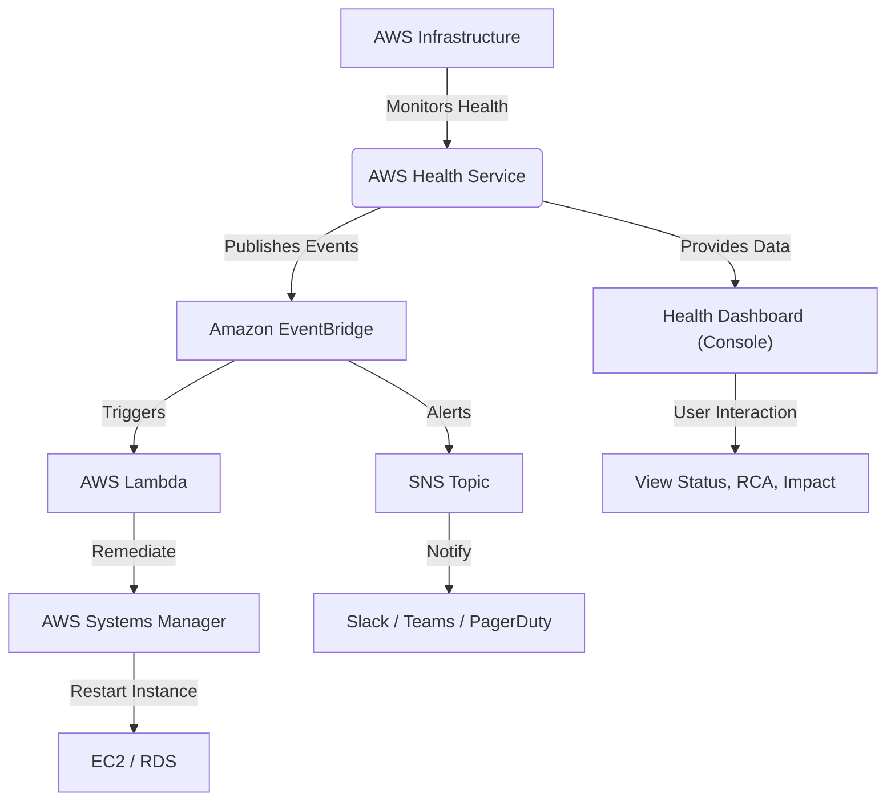
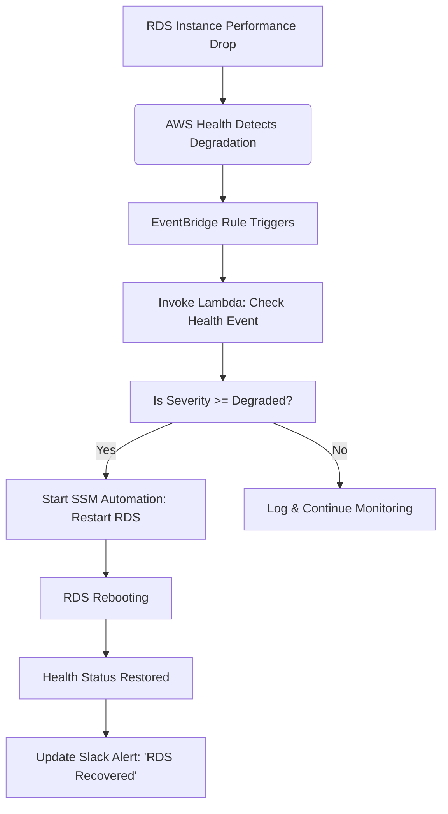
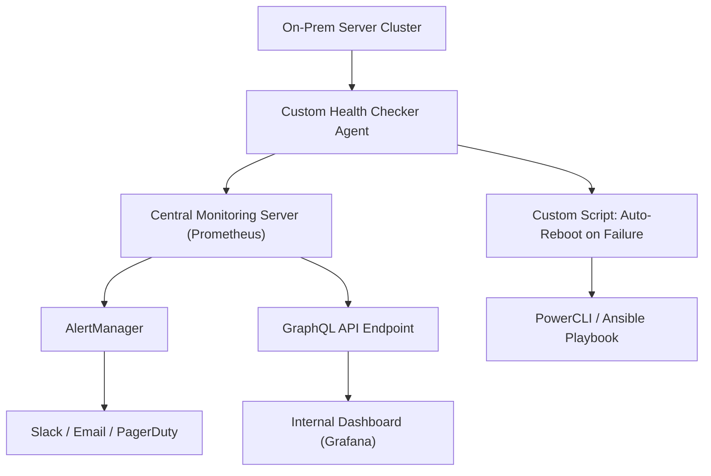

# Health

## 🩺 **AWS Health (Amazon CloudWatch Events + AWS Health Dashboard)**

_**The Intelligent Pulse of Your AWS Environment – Proactive Monitoring, Real-Time Insights, & Automated Remediation**_

***

### 🌟 **Overview**

**AWS Health** is a comprehensive service that provides **real-time visibility into the operational health of your AWS resources and services**, enabling you to detect, diagnose, and respond to issues before they impact your applications. It goes beyond traditional monitoring by offering **event-driven intelligence**, **root cause analysis**, **impact assessment**, and **automated recovery workflows**.

<figure><figcaption></figcaption></figure>

> 🔥 **Innovation Spotlight (2025 Update):**\
> AWS Health now integrates deeply with **Amazon EventBridge**, **AWS Systems Manager Automation**, and **AWS Control Tower** to deliver **AI-powered anomaly detection** and **predictive failure alerts** using machine learning models trained on global AWS infrastructure telemetry.
>
> ✅ New feature: **Health Intelligence Engine (HIE)** — uses historical data to predict potential outages in your account based on resource patterns, region trends, and dependency chains.
>
> 🤖 Also integrated with **Amazon Q for AWS** — allowing natural language queries like:\
> &#xNAN;_“Show me all recent events affecting my EC2 instances in us-east-1 over the last 7 days.”_

This isn’t just logging — it’s **smart, self-aware cloud operations**.

***

### ⚡ **Problem Statement**

#### 🏥 Real-World Scenario: E-Commerce Platform Downtime During Peak Sales

**Company:** A mid-sized e-commerce platform using AWS (EC2, RDS, ElastiCache, S3, API Gateway)\
**Challenge:**\
During Black Friday sales, customers report slow page loads and failed checkout attempts. The DevOps team spends 4 hours diagnosing the issue only to discover a **regional RDS outage** caused by an AWS infrastructure maintenance event — which was **not visible until after the fact**.

**Impact:**

* $250K+ lost revenue
* Customer trust erosion
* Manual triage across multiple dashboards (CloudWatch, CloudTrail, Route 53 Health Checks)

> ❗ Traditional monitoring tools missed this because they don't correlate **infrastructure-level events** with **application-level symptoms**.

***

#### 🤝 **Business Use Cases**

| Industry               | Application Example                                                                            |
| ---------------------- | ---------------------------------------------------------------------------------------------- |
| **Retail/E-Commerce**  | Detect regional database failures during flash sales; auto-trigger failover via SSM Automation |
| **Financial Services** | Monitor compliance with SLAs; alert on any service degradation impacting trading systems       |
| **Healthcare (HIPAA)** | Ensure critical patient data pipelines remain healthy; integrate with audit trails             |
| **Media & Streaming**  | Track real-time media ingestion health; prevent content delivery disruptions                   |
| **Enterprise IT**      | Automate incident response workflows across hybrid environments (AWS Outposts + Cloud)         |

> 💡 Use Case Highlight: **A global bank uses AWS Health + EventBridge + SSM Automation to automatically restart stalled RDS clusters when health events indicate performance degradation — reducing MTTR from 60 mins to <5 mins.**

***

### 🔥 **Core Principles**

| Concept                               | Explanation                                                                                                                        |
| ------------------------------------- | ---------------------------------------------------------------------------------------------------------------------------------- |
| **Event-Driven Health Monitoring**    | AWS Health emits events (via EventBridge) when AWS infrastructure or service health changes (e.g., `AWS::RDS::Instance` degraded). |
| **Global & Account-Level Visibility** | See health status across all regions, accounts (in Organizations), and even specific resources.                                    |
| **Root Cause Analysis (RCA)**         | Automatically identifies if an issue stems from AWS-side (infrastructure) vs. customer-side (misconfiguration).                    |
| **Impact Assessment**                 | Maps affected resources, services, and APIs — shows what's broken and who’s impacted.                                              |
| **Service Health Dashboard (SHD)**    | Centralized UI showing current and past events (status: Healthy / Unhealthy / Investigating).                                      |
| **APIs & Integration Layer**          | Use `DescribeHealthEvents`, `DescribeAffectedEntities`, `DescribeEventDetails` via CLI/APIs for automation.                        |
| **EventBridge Integration**           | Trigger Lambda functions, SSM documents, or send alerts to Slack/Teams/PagerDuty upon health events.                               |

> 🛠️ Key Resources:
>
> * `AWS Health Events`: Metadata about incidents (ID, category, severity, region)
> * `Affected Entities`: Specific resources impacted (e.g., `i-1234abcd`, `arn:aws:rds:us-east-1:...`)
> * `Event Categories`: `Infrastructure`, `Service`, `Security`, `Account`
> * `Severity Levels**:` Informational`,` Unhealthy`,` Degraded`,` Performance Issues`,` Outage\`

***

### 📋 **Pre-Requirements**

| Service                       | Purpose                                                        |
| ----------------------------- | -------------------------------------------------------------- |
| **AWS IAM Roles**             | Grant read access to AWS Health API (`health:Describe*`)       |
| **Amazon EventBridge**        | To capture and route AWS Health events to downstream systems   |
| **AWS Systems Manager (SSM)** | For automated remediation (e.g., restart EC2/RDS)              |
| **Amazon CloudWatch Alarms**  | Optional: Combine with custom metrics for deeper observability |
| **AWS Organizations**         | Required if managing multi-account environments                |
| **AWS Config**                | To track configuration drift linked to health issues           |

> ✅ Ensure `AWSHealthFullAccess` policy is attached to roles used for automation.

***

### 👣 **Implementation Steps**

1. **Enable AWS Health in Your Account**\
   → Go to **AWS Health Console** → "Enable" if not already enabled.
2.  **Set Up EventBridge Rule to Capture Health Events**

    ```bash
    aws events put-rule \
      --name "HealthEventToLambda" \
      --event-pattern '{"source":["aws.health"]}'
    ```
3. **Add Target: AWS Lambda Function**\
   → Create a Lambda function to process health events (e.g., log, notify, trigger SSM).
4. **Create IAM Role for Lambda**
   * Permissions: `health:DescribeEvents`, `health:DescribeAffectedEntities`, `ssm:StartAutomationExecution`
5.  **Write Lambda Logic (Python Example)**

    ```python
    import boto3
    import json

    def lambda_handler(event, context):
        client = boto3.client('health')
        for record in event['Records']:
            detail = record['Sns']['Message']
            event_data = json.loads(detail)
            event_arn = event_data['detail']['eventArn']
            
            # Get event details
            response = client.describe_event_details(
                eventArns=[event_arn]
            )
            print(f"Event: {response['successfulSet'][0]['event']['statusCode']}")
            
            # Trigger SSM Automation if needed
            if 'DEGRADED' in response['successfulSet'][0]['event']['statusCode']:
                ssm_client = boto3.client('ssm')
                ssm_client.start_automation_execution(
                    DocumentName="AWS-RestartEC2Instance",
                    Parameters={"InstanceId": ["i-1234abcd"]}
                )
    ```
6. **Test with Sample Event (Optional)**\
   → Use AWS Health Simulator (available in console) to simulate an event.
7. **Integrate with Slack/Teams via SNS**\
   → Subscribe SNS topic to EventBridge → forward messages to chat tools.

***

### 🗺️ **Data Flow Diagrams**

#### 📊 **Diagram 1: How AWS Health Works (Architecture)**



#### 📊 **Diagram 2: Use Case – Auto-Remediate RDS Degradation**



> ✅ Clear, actionable flow: **Detect → Analyze → Act → Notify**

***

### 🔒 **Security Measures**

✅ **Best Practices:**

* 🔐 **Least Privilege IAM Policies**: Only grant `health:Describe*` and `ssm:StartAutomationExecution` where needed.
* 🔒 **VPC Endpoints for Health API**: Avoid public internet exposure using `vpce` for AWS Health.
* 🧹 **Audit Trail via CloudTrail**: Log all `DescribeHealthEvents` calls.
* 🚫 **Never expose raw health data publicly**: Use EventBridge/SNS with proper access controls.
* 🔄 **Rotate Lambda Execution Roles Regularly**
* 🛡️ **Use AWS Organizations SCPs** to restrict Health access in sensitive accounts.

> 📌 Pro Tip: Enable **AWS Health integration with AWS Security Hub** to enrich findings with security posture.

***

### 🎯 **Innovation Spotlight: AI-Powered Predictive Health Monitoring (2025)**

AWS has introduced **Predictive Health Analytics (PHA)** — a new capability powered by ML models trained on 10+ years of AWS infrastructure logs.

* **Features:**
  * Forecasts potential outages 2–72 hours in advance
  * Identifies risky resource configurations (e.g., under-provisioned RDS)
  * Recommends proactive scaling or migration actions
* **Use Case:**\
  A financial firm receives a notification: _“Your RDS instance in us-west-2 may experience performance degradation within 12 hours due to CPU saturation trend.”_\
  → They scale up preemptively → avoid downtime.

> 🚀 This turns AWS Health from **reactive** to **predictive** — a game-changer for mission-critical workloads.

***

### ⚖️ **When to Use and When Not to Use**

| ✅ When to Use                                                   | ❌ When Not to Use                                            |
| --------------------------------------------------------------- | ------------------------------------------------------------ |
| You want **early warnings** on AWS infrastructure issues        | You’re running **on-premise-only** (no AWS)                  |
| Managing **multi-account/multi-region** environments            | You need **real-time diagnostics** for application code bugs |
| Building **self-healing systems** using SSM/Automation          | You’re doing **manual monitoring** with no automation        |
| Compliance-heavy industries needing **audit-ready health logs** | You don’t have IAM access to AWS Health APIs                 |

> ⚠️ Note: AWS Health does **not** monitor your application logic — only AWS service health and resource status.

***

### 💰 **Costing Calculation**

#### How It’s Calculated:

* **Free Tier**: First 100 health events/month (includes all regions/accounts).
* **Beyond Free Tier**:
  * **$0.0005 per health event** (per month)
  * **$0.0005 per affected entity** (if queried via API)

> 📌 Example:
>
> * 500 health events/month
> * 2,000 affected entities
>
> **Total Cost** = (500 × $0.0005) + (2,000 × $0.0005) = **$1.25/month**

> 💡 **Efficient Usage Tips:**
>
> * Filter events by `eventTypeCategory = Infrastructure` to reduce noise
> * Use EventBridge filtering rules to only route relevant events
> * Avoid frequent polling of `DescribeHealthEvents` — use EventBridge instead

> ✅ **Bottom Line**: Extremely low cost for massive value.

***

### 🧩 **Alternative Services Comparison**

| Service                                          | Provider        | Key Difference                                          | On-Premise Equivalent                          |
| ------------------------------------------------ | --------------- | ------------------------------------------------------- | ---------------------------------------------- |
| **AWS Health**                                   | AWS             | Native AWS infrastructure health + predictive analytics | Prometheus + Grafana + Custom Scripts (manual) |
| **Azure Monitor (Health)**                       | Microsoft Azure | Similar but limited to Azure ecosystem                  | Operations Manager (SCOM) + Azure Arc          |
| **Google Cloud Operations Suite (Cloud Health)** | Google Cloud    | Focus on GCP services only                              | Stackdriver + Anthos + OpenTelemetry           |
| **Datadog Cloud Health**                         | Third-party     | Covers multi-cloud but requires agent                   | Datadog Agent on-prem                          |
| **New Relic One (Infrastructure Monitoring)**    | Third-party     | Strong observability but expensive                      | NR agent on VMs                                |

#### 🖼️ On-Premise Data Flow Diagram (Using AWS Health-like Model)



```mermaid
graph TD
    A[On-Prem Server Cluster] --> B[Custom Health Checker Agent]
    B --> C[Central Monitoring Server (Prometheus)]
    C --> D[AlertManager]
    D --> E[Slack / Email / PagerDuty]
    C --> F[GraphQL API Endpoint]
    F --> G[Internal Dashboard (Grafana)]
    B --> H[Custom Script: Auto-Reboot on Failure]
    H --> I[PowerCLI / Ansible Playbook]
```

> 🔍 Note: On-prem lacks native integration with cloud provider health — so you must build everything manually.

***

### ✅ **Benefits**

| Benefit                             | Impact                                      |
| ----------------------------------- | ------------------------------------------- |
| 🚨 **Proactive Issue Detection**    | Prevent outages before users are affected   |
| 🔄 **Automated Remediation**        | Reduce MTTR from hours to minutes           |
| 📊 **Unified View Across Accounts** | Manage health at scale in enterprise setups |
| 📈 **Improved SLA Compliance**      | Meet uptime targets consistently            |
| 💬 **Better Collaboration**         | Share RCA reports across teams              |
| 🤖 **AI-Powered Predictions**       | Stay ahead of failures with foresight       |
| 💰 **Low Cost, High ROI**           | Sub-$2/month for large-scale monitoring     |

***

### 🎮 **Next-Gen Innovation: AWS Health + Amazon Q (AI Copilot for Ops)**

Imagine asking:

> _“Why did my API Gateway start failing at 3:15 PM?”_

👉 Amazon Q responds:

> “AWS Health detected a regional DNS issue affecting API Gateway in us-east-1. Affected: 4 endpoints. Root cause: AWS infrastructure change. Resolution timeline: 10 minutes. No action required on your part.”

> 🤖 This is **AI-driven incident resolution** — where AWS Health feeds directly into **natural language ops assistants**.

> 🔥 Future: Q will auto-generate runbooks, suggest fixes, and even execute safe SSM commands with approval.

***

### 📝 **Summary**

> ✅ **What is AWS Health?**\
> It’s AWS’s intelligent, event-driven system for detecting, analyzing, and responding to infrastructure health issues across your environment — with predictive capabilities and full automation support.

> 🔑 **Top 8 Takeaways:**
>
> 1. AWS Health detects **infrastructure-level problems** before they affect apps.
> 2. Use **EventBridge + Lambda + SSM** for self-healing systems.
> 3. Leverage **AI-powered predictions** for proactive operations.
> 4. Always apply **least privilege IAM policies**.
> 5. Integrate with **Slack/Teams/PagerDuty** for faster response.
> 6. Costs are **negligible** (<$2/month for large accounts).
> 7. Not for app-level debugging — focus on **AWS service health**.
> 8. Best used in **multi-account, high-availability, regulated environments**.

> 📝 **In 5 Lines:** AWS Health monitors the health of AWS infrastructure and services in real time.\
> It detects outages, provides root cause analysis, and enables automated responses.\
> Integrated with EventBridge, SSM, and Amazon Q, it powers self-healing systems.\
> Ideal for enterprises seeking resilience, compliance, and reduced downtime.\
> It’s not just monitoring — it’s **predictive, intelligent cloud operations**.

***

### 🔗 **Related Topics & References**

* [AWS Health Developer Guide](https://docs.aws.amazon.com/awshealth/latest/APIReference/Welcome.html)
* [Amazon EventBridge Documentation](https://docs.aws.amazon.com/eventbridge/)
* [AWS Systems Manager Automation](https://docs.aws.amazon.com/systems-manager/latest/userguide/sysman-ssm-automation.html)
* [AWS Health FAQ](https://aws.amazon.com/premiumsupport/knowledge-center/aws-health-faq/)
* [AWS Well-Architected Framework – Operational Excellence](https://aws.amazon.com/architecture/well-architected/)
* [Amazon Q for AWS: Enterprise AI Assistant](https://aws.amazon.com/q/)

***

.
