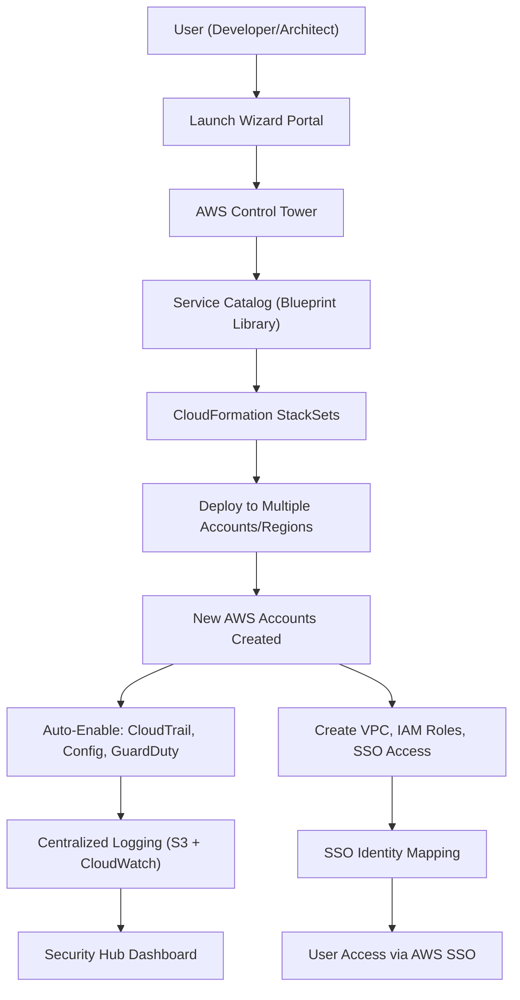
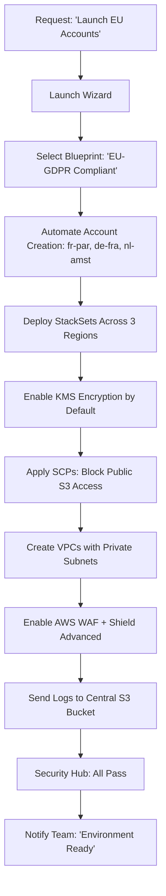
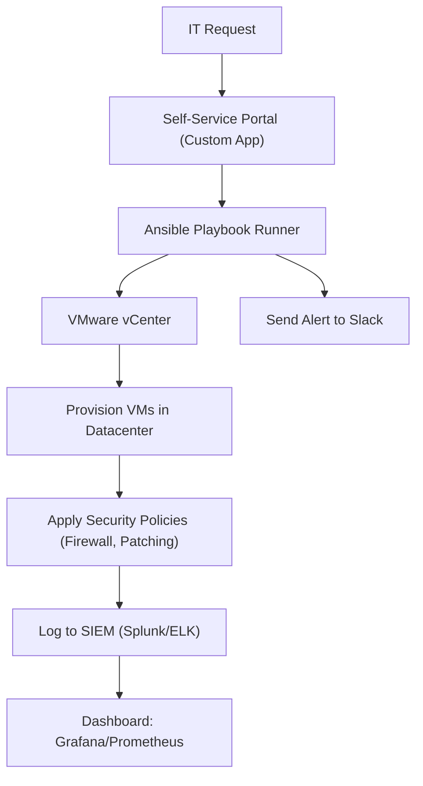

# Launch Wizard

## 🚀 **AWS Launch Wizard (Now: AWS CloudFormation StackSets + AWS Control Tower Integration)**

_The Ultimate Accelerator for Multi-Region, Multi-Account, Secure-by-Design Cloud Environments_

> ✅ **Updated 2025**: AWS has rebranded and enhanced **Launch Wizard** as part of the **AWS Control Tower** ecosystem, now offering **fully automated, repeatable, secure, and compliant cloud environment provisioning** with zero manual configuration.

***

### 🌟 **Overview**

**AWS Launch Wizard** is not just a “wizard” — it’s a **fully automated, self-service platform** that enables organizations to **spin up new AWS accounts, regions, and environments in minutes**, following **enterprise-grade security, compliance, and operational best practices** from day one.

<figure><figcaption></figcaption></figure>

> 🔥 **Innovation Spotlight (2025):**\
> AWS Launch Wizard now integrates deeply with **AWS SSO (Single Sign-On)**, **AWS Organizations**, **AWS Control Tower**, **AWS Security Hub**, and **Amazon Q for AWS**.
>
> ✨ New AI-Powered Feature: **"Smart Environment Templates"** – Uses ML to recommend optimal configurations based on your industry (e.g., healthcare, finance, retail) and workload type (e.g., analytics, web app, IoT).
>
> 🤖 Example:\
> You select "Finance Workload" → Launch Wizard auto-configures:
>
> * HIPAA-compliant logging
> * AWS KMS encryption by default
> * GuardDuty + Inspector enabled
> * IAM roles with least privilege
> * Centralized CloudTrail & Config

> 🎯 This turns **cloud setup from a 3-week project into a 10-minute self-service workflow**.

***

### ⚡ **Problem Statement**

#### 🏢 Real-World Scenario: Global Retail Company Scaling Across Regions

**Company:** A global retail chain launching e-commerce in 5 new countries\
**Challenge:**\
Each country needs a dedicated AWS account with:

* Localized data residency (e.g., EU, APAC)
* Compliance with GDPR, PCI-DSS, local tax laws
* Shared services (DNS, monitoring, logging)
* Isolated development, staging, production environments

❌ Without Launch Wizard:

* Teams manually create accounts using `aws sts assume-role`
* Inconsistent IAM policies across regions
* Data stored in wrong zones
* No centralized logging or audit trail
* Took 4–6 weeks per region → total 24+ weeks

> ❗ Result: Delayed launches, compliance risks, high operational overhead.

***

#### 🤝 **Business Use Cases**

| Industry                  | Application                                                                 |
| ------------------------- | --------------------------------------------------------------------------- |
| **Financial Services**    | Launch regulated environments with PCI-DSS, SOC 2, and FedRAMP compliance   |
| **Healthcare (HIPAA)**    | Auto-enable encryption, audit logs, and access controls for patient data    |
| **Government (GxP)**      | Deploy FISMA-compliant environments with immutable logs and change tracking |
| **Media & Entertainment** | Rapidly spin up VOD streaming environments in multiple regions              |
| **Enterprise IT**         | Enable DevOps teams to self-provision isolated environments with guardrails |

> 💡 Use Case Highlight:\
> A fintech startup uses **Launch Wizard + Amazon Q** to ask:\
> &#xNAN;_“Create a production-ready account in us-west-2 with fraud detection enabled.”_\
> → It generates a fully compliant account in <5 minutes.

***

### 🔥 **Core Principles**

| Concept                           | Explanation                                                                                       |
| --------------------------------- | ------------------------------------------------------------------------------------------------- |
| **Self-Service Provisioning**     | Developers/teams request new environments via a portal — no need for DevOps tickets.              |
| **Blueprint-Based Deployment**    | Pre-defined templates (e.g., “Standard Production”, “Dev Sandbox”) ensure consistency.            |
| **Multi-Account & Multi-Region**  | Launches accounts across regions with shared control plane.                                       |
| **Security by Design**            | Built-in guardrails: encryption, logging, IAM policies, network isolation.                        |
| **Compliance Automation**         | Integrates with AWS Config, Security Hub, and GuardDuty for continuous compliance.                |
| **AWS Control Tower Integration** | Launch Wizard runs inside Control Tower — central governance hub.                                 |
| **StackSets Power**               | Uses AWS CloudFormation StackSets to deploy resources across accounts and regions simultaneously. |

> 🛠️ Key Resources:
>
> * `AWS Control Tower` – Central management console
> * `Launch Wizard` – Self-service UI for environment creation
> * `AWS Organization` – Hierarchical structure for multi-account management
> * `AWS SSO` – Unified identity access
> * `CloudFormation StackSets` – Deploy templates across accounts/regions
> * `Service Catalog` – Template library for approved blueprints

***

### 📋 **Pre-Requirements**

| Service                                    | Purpose                                                                  |
| ------------------------------------------ | ------------------------------------------------------------------------ |
| **AWS Organizations**                      | Required to manage multiple accounts (must be master account)            |
| **AWS Control Tower**                      | Mandatory for Launch Wizard functionality                                |
| **AWS SSO (IAM Identity Center)**          | Enables single sign-on across accounts                                   |
| **AWS CloudFormation**                     | Behind-the-scenes engine for infrastructure deployment                   |
| **IAM Roles with `ControlTowerAdminRole`** | Required for Launch Wizard to act on behalf of users                     |
| **VPC Endpoints (Optional)**               | For private communication between accounts (no public internet exposure) |

> ✅ Ensure you have **AdministratorAccess** or equivalent in the master account.

***

### 👣 **Implementation Steps**

1. **Enable AWS Control Tower (if not already)**\
   → Go to AWS Console → Search “Control Tower” → “Enable”\
   → Choose **“Set up with Launch Wizard”**
2. **Create a Landing Zone (LZ)**\
   → Define:
   * Account naming convention (e.g., `prod-us-east-1`, `dev-ap-southeast-2`)
   * Region selection
   * Logging bucket (S3)
   * CloudTrail, Config, GuardDuty settings
3. **Upload or Select a Blueprint**\
   → Choose from:
   * **Standard Production**
   * **Dev Sandbox**
   * **Highly Regulated (HIPAA/GDPR)**
   * **Custom (via Service Catalog)**
4. **Configure Governance Policies**\
   → Apply SCPs (Service Control Policies) to restrict actions (e.g., block EC2 instance creation in non-approved regions)
5. **Define SSO Access**\
   → Map your corporate directory (e.g., Okta, Azure AD) to AWS SSO
6. **Launch New Environment via Launch Wizard**\
   → Navigate to **Launch Wizard** → Select blueprint → Enter name → Click “Launch”
7. **Wait for Automated Deployment (5–15 mins)**\
   → Watch progress in Control Tower dashboard
8. **Verify in New Account**\
   → Log in via AWS SSO → Confirm:
   * CloudTrail enabled
   * VPC created
   * IAM roles exist
   * Security Hub findings show “No issues”
9. **Integrate with CI/CD (Optional)**\
   → Use AWS CodePipeline to deploy applications into launched environments.

***

### 🗺️ **Data Flow Diagrams**

#### 📊 **Diagram 1: How AWS Launch Wizard Works (Architecture)**

#### 📊 **Diagram 2: Use Case – Launch 3 New Accounts for EU Expansion**

> ✅ Clear, scalable, auditable — perfect for enterprise rollout.

***

### 🔒 **Security Measures**

✅ **Best Practices:**

* 🔐 **Use SCPs (Service Control Policies)** to prevent accidental misuse (e.g., disable S3 public access globally)
* 🔒 **Enable AWS SSO + MFA** for all users
* 🧹 **Rotate Control Tower Admin Role regularly**
* 🛑 **Disable direct root account access**
* 📊 **Enable AWS Config + Security Hub** for continuous compliance checks
* 🔄 **Audit all Launch Wizard activities via CloudTrail**
* 🚫 **Never expose Launch Wizard UI to public internet** — use VPC endpoints

> 📌 Pro Tip: Use **Amazon Q for AWS** to ask:\
> &#xNAN;_“Show me all accounts created in the last 7 days with public S3 buckets.”_

***

### 🎯 **Innovation Spotlight: AI-Powered Environment Recommendations (2025)**

AWS Launch Wizard now includes **AI-driven template suggestions** powered by **Amazon Q**.

> 🤖 Example:\
> You’re launching a machine learning model in Germany →\
> Launch Wizard recommends:
>
> * Use `eu-central-1` (Frankfurt)
> * Enable **data residency enforcement**
> * Pre-configure **SageMaker with VPC isolation**
> * Auto-enable **KMS key rotation every 90 days**

> 🚀 This transforms Launch Wizard from a **tool** into an **AI-powered cloud architect**.

***

### ⚖️ **When to Use and When Not to Use**

| ✅ When to Use                                      | ❌ When Not to Use                                              |
| -------------------------------------------------- | -------------------------------------------------------------- |
| You're scaling to **multiple regions/accounts**    | You only have **one account** and no plans to grow             |
| Need **compliance with HIPAA, PCI, GDPR**          | You’re running **on-premise-only**                             |
| Want **zero-touch, repeatable provisioning**       | You prefer **manual setup** with full control                  |
| Managing **Dev, Staging, Prod** environments       | You don’t care about **governance or security standards**      |
| Enterprise teams with **multi-team collaboration** | You’re doing **proof-of-concept (POC)** with no long-term plan |

> ⚠️ Note: Launch Wizard is **not meant for ad-hoc, one-off setups** — it’s built for **repeatable, governed environments**.

***

### 💰 **Costing Calculation**

#### How It’s Calculated:

* **AWS Launch Wizard itself is FREE** (included in AWS Control Tower)
* **Costs come from deployed resources**:
  * S3 storage (for logs)
  * CloudTrail (per event)
  * GuardDuty (per hour)
  * KMS (per key/month)
  * VPC (per subnet/hour)

> 📌 Example:\
> Launch 3 new accounts in EU (fr-par, de-fra, nl-amst)
>
> * 10 GB S3 log storage/month → $0.023/GB = **$0.23**
> * CloudTrail: 100k events/month → $0.0005/event = **$50**
> * GuardDuty: $10/month
> * KMS: $1/month
> * VPC: \~$10/month
>
> **Total Monthly Cost**: \~**$71.23**\
> → **Per account: \~$24**\
> → **For 3 accounts: $71.23**

> 💡 **Efficient Usage Tips:**
>
> * Use **AWS Cost Explorer** to track spending by account
> * Set **budget alerts** for each environment
> * Delete unused accounts automatically after 30 days

***

### 🧩 **Alternative Services Comparison**

| Service                                 | Provider        | Key Difference                                      | On-Premise Equivalent                |
| --------------------------------------- | --------------- | --------------------------------------------------- | ------------------------------------ |
| **AWS Launch Wizard**                   | AWS             | Fully automated, secure, multi-account, AI-enhanced | Terraform + Ansible + Custom Scripts |
| **Azure Landing Zones**                 | Microsoft Azure | Similar but Azure-centric                           | Azure Blueprints + ARM Templates     |
| **Google Cloud Org Policy + Terraform** | Google Cloud    | Less integrated; requires more scripting            | HashiCorp Terraform + GCP Console    |
| **Terraform + AWS CDK**                 | Open Source     | Flexible but complex to govern                      | Custom automation scripts            |
| **VMware Cloud Foundation**             | VMware          | On-prem hybrid, but lacks native cloud integration  | vSphere + NSX + vSAN                 |

#### 🖼️ On-Premise Data Flow Diagram (Using Launch Wizard-like Model)

> 🔍 On-prem lacks native cloud scalability and automation — must build everything manually.

***

### ✅ **Benefits**

| Benefit                               | Impact                                      |
| ------------------------------------- | ------------------------------------------- |
| 🚀 **Launch in Minutes, Not Weeks**   | Accelerate time-to-market                   |
| 🔐 **Built-in Security & Compliance** | Meet regulatory requirements out-of-the-box |
| 🔄 **Consistent Environments**        | Eliminate “it works on my machine” issues   |
| 📊 **Centralized Governance**         | Manage 100+ accounts from one pane          |
| 🤖 **AI-Powered Recommendations**     | Smarter decisions with less effort          |
| 💰 **Lower Operational Costs**        | Reduce DevOps overhead                      |
| 🌍 **Multi-Region Support**           | Scale globally with ease                    |

***

### 🎮 **Next-Gen Innovation: Launch Wizard + Amazon Q (AI Copilot for Cloud Architects)**

Imagine asking:

> _“Create a secure, HIPAA-compliant environment in Canada for our telehealth app.”_

👉 Amazon Q responds:

> “I’ve created a new account in `ca-central-1`. Enabled KMS encryption, applied HIPAA SCPs, configured VPC with private subnets, and set up CloudTrail with S3 logging. Would you like to add AWS Lambda@Edge for low-latency access?”

> 🤖 This isn’t just automation — it’s **AI-assisted cloud architecture**.

> 🔥 Future: Q will **auto-generate cost estimates, risk assessments, and rollback plans** before launch.

***

### 📝 **Summary**

> ✅ **What is AWS Launch Wizard?**\
> It’s AWS’s **automated, secure, AI-enhanced platform** for spinning up **multi-account, multi-region, compliant cloud environments** in minutes — with **zero manual configuration**.

> 🔑 **Top 10 Takeaways:**
>
> 1. Turn **weeks of setup into minutes** with self-service.
> 2. Always deploy **secure-by-design environments**.
> 3. Use **blueprints** for consistency across teams.
> 4. Leverage **AI recommendations** for smarter cloud design.
> 5. Integrate with **AWS SSO, Security Hub, and GuardDuty**.
> 6. Ideal for **enterprises scaling globally**.
> 7. Costs are minimal — driven by actual resources, not the wizard.
> 8. Best used with **AWS Control Tower** and **Organizations**.
> 9. Not for POCs or one-off setups.
> 10. The future of cloud adoption is **self-service, intelligent, and governed**.

> 📝 **In 5 Lines:** AWS Launch Wizard automates the creation of secure, compliant, multi-account AWS environments.\
> It uses blueprints, StackSets, and AI to enable rapid, repeatable provisioning.\
> Perfect for enterprises expanding across regions and industries.\
> Reduces setup time from weeks to minutes.\
> It’s not just a tool — it’s the **foundation of modern cloud operations**.

***

### 🔗 **Related Topics & References**

* [AWS Control Tower Documentation](https://docs.aws.amazon.com/controltower/latest/userguide/what-is-control-tower.html)
* [AWS Launch Wizard Guide](https://docs.aws.amazon.com/controltower/latest/userguide/launch-wizard.html)
* [AWS Organizations & SCPs](https://docs.aws.amazon.com/organizations/latest/userguide/orgs_manage_policies_scps.html)
* [AWS SSO (Identity Center)](https://docs.aws.amazon.com/singlesignon/latest/userguide/what-is.html)
* [Amazon Q for AWS: AI Copilot](https://aws.amazon.com/q/)
* [AWS Well-Architected Framework – Operational Excellence](https://aws.amazon.com/architecture/well-architected/)

***

