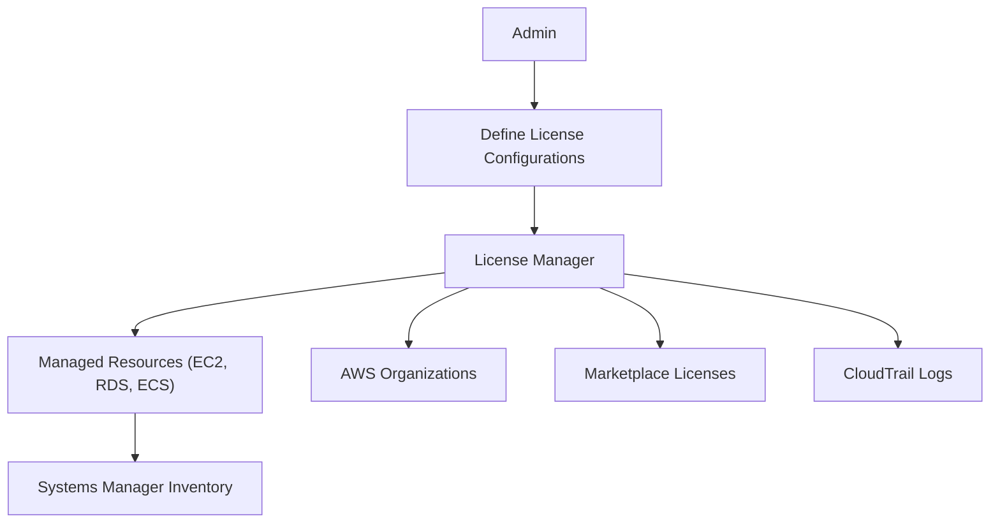
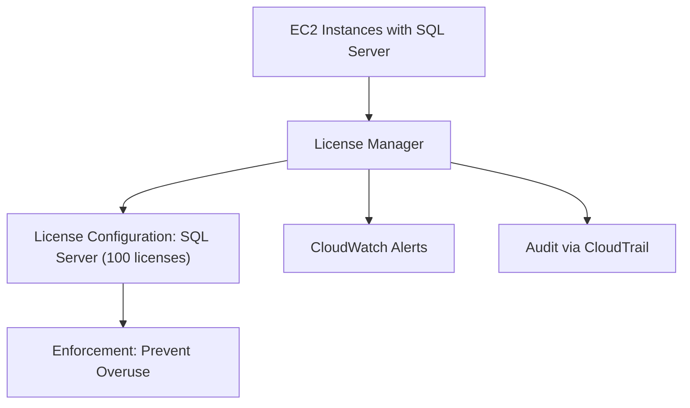
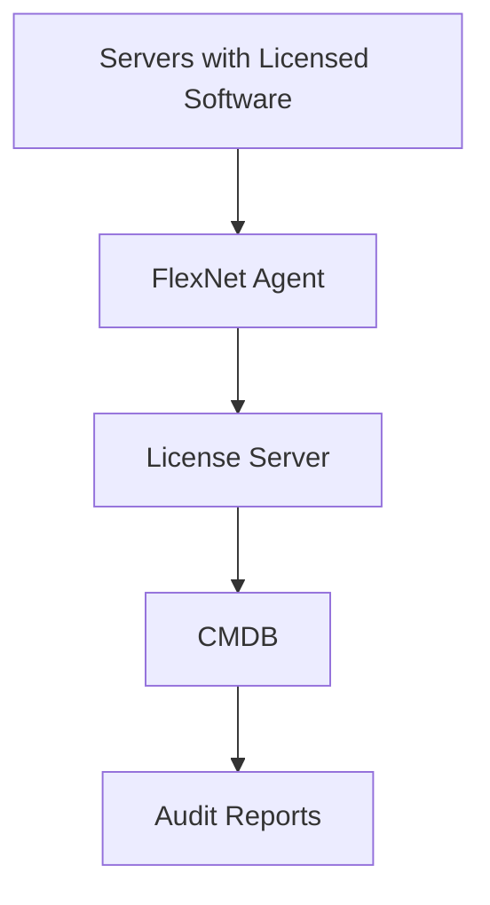

# License Manager

## License Manager

**🛠️ AWS License Manager – Automated License Tracking for Cloud and Hybrid Environments (2025 Edition)**

***

### 🌟 Overview

**AWS License Manager** helps organizations manage software licenses across AWS, on-premises, and hybrid environments. It ensures compliance, prevents over-provisioning, and automates license tracking for vendors like Microsoft, Oracle, SAP, and custom BYOL (Bring Your Own License) models.

<figure><figcaption></figcaption></figure>

#### 🚀 Innovation Spotlight (2025)

* **License Manager + Amazon Q**: AI-driven license optimization and compliance insights.
* **Integration with AWS Marketplace**: Auto-track licenses from third-party vendors.
* **Cross-account License Management**: Centralized license governance across AWS Organizations.
* **License Mobility for Containers**: Track licenses in ECS/EKS workloads.

***

### ⚡ Problem Statement

**Scenario**: A global enterprise uses hundreds of EC2 instances with Microsoft SQL Server and Oracle DB. They struggle to track license usage, leading to compliance risks and overspending.

**Challenge**: Manual tracking is error-prone, lacks visibility, and doesn’t scale across accounts or hybrid setups.

#### 2.1 🤝 Business Use Cases

* 🏦 Financial Services: Track Windows Server and SQL licenses across VMs.
* 🏥 Healthcare: Ensure HIPAA-compliant license usage for EMR systems.
* 🏢 Enterprises: Centralize license governance across departments.
* 🧪 Research Labs: Monitor BYOL usage for specialized software.

***

### 🔥 Core Principles

* **License Configuration**: Define rules for license usage (e.g., per-core, per-instance).
* **Automated Tracking**: Monitor usage across EC2, RDS, ECS, EKS, and on-prem.
* **Enforcement**: Prevent launching resources that exceed license limits.
* **Integration**: Works with AWS Organizations, Systems Manager, and Marketplace.

#### Key Resources

| Resource                  | Description                               |
| ------------------------- | ----------------------------------------- |
| License Configuration     | Defines license rules and limits          |
| License Manager           | Core service for tracking and enforcement |
| Managed Resources         | EC2, RDS, ECS, EKS, on-prem servers       |
| AWS Organizations         | Centralized license governance            |
| Systems Manager Inventory | Tracks on-prem license usage              |
| Marketplace Integration   | Auto-track third-party licenses           |

***

### 📋 Pre-Requirements

| Service               | Purpose                              |
| --------------------- | ------------------------------------ |
| IAM                   | Role-based access to License Manager |
| EC2 / RDS / ECS / EKS | Resources to be tracked              |
| Systems Manager       | Inventory for on-prem servers        |
| AWS Organizations     | Cross-account license management     |
| AWS Marketplace       | Vendor license integration           |
| CloudTrail            | Audit license usage events           |

***

### 👣 Implementation Steps

1. **Create IAM roles** for License Manager access.
2. **Define License Configurations** (e.g., 100 SQL Server licenses).
3. **Associate Configurations** with resource types (EC2, RDS, etc.).
4. **Enable Systems Manager Inventory** for on-prem tracking.
5. **Integrate with AWS Organizations** for multi-account governance.
6. **Enable Marketplace license tracking**.
7. **Monitor usage via License Manager dashboard**.
8. **Set alerts via CloudWatch and AWS Budgets**.
9. **Review audit logs in CloudTrail**.

***

### 🗺️ Data Flow Diagram

#### Diagram 1 – How AWS License Manager Works

#### Diagram 2 – SQL Server License Tracking Use Case

***

### 🔒 Security Measures

* 🔐 **IAM Policies**: Restrict who can define and modify license configurations.
* 🛡️ **CloudTrail Logging**: Track all license-related actions.
* 📊 **Tag Enforcement**: Use tags to identify licensed resources.
* 🧪 **Cross-account Isolation**: Use Organizations SCPs to restrict license usage.
* 🔍 **Inventory Validation**: Use Systems Manager to verify on-prem licenses.

***

### ⚖️ When to Use and When Not to Use

#### ✅ When to Use

* Managing commercial licenses (Microsoft, Oracle, SAP).
* BYOL scenarios across EC2, RDS, ECS, EKS.
* Multi-account license governance.

#### ❌ When Not to Use

* Open-source software without license constraints.
* Small environments with minimal license usage.
* Real-time license enforcement for third-party SaaS (use vendor tools).

***

### 💰 Costing Calculation

#### Pricing Factors

* AWS License Manager is **free**.
* Indirect costs from:
  * Systems Manager Inventory
  * CloudTrail logs
  * CloudWatch alerts

#### Sample Calculation

* **100 EC2 instances tracked**
* **Systems Manager Inventory**: Free up to 1000 instances
* **CloudTrail**: \~$2/month for logs
* **CloudWatch Alerts**: \~$1/month

→ **Total: \~$3/month**

#### Efficiency Tips

* Use **tag-based license grouping**.
* Schedule **inventory scans** during off-peak.
* Integrate with **Budgets** for cost alerts.

***

### 🧩 Alternative Services

| Feature        | AWS License Manager    | Azure License Management | GCP License Tracking | On-Premise             |
| -------------- | ---------------------- | ------------------------ | -------------------- | ---------------------- |
| Vendor Support | Microsoft, Oracle, SAP | Microsoft, Oracle        | Microsoft            | FlexNet, Snow Software |
| BYOL Support   | Yes                    | Yes                      | Limited              | Yes                    |
| Enforcement    | Prevent overuse        | Advisory                 | Advisory             | Manual                 |
| Hybrid Support | Yes                    | Yes                      | No                   | Yes                    |

#### On-Premise Data Flow (FlexNet + CMDB)

***

### ✅ Benefits

* 🧭 Centralized license governance
* 🔐 Prevents overuse and compliance risks
* 🔄 Tracks hybrid and cloud resources
* 📊 Audit-ready via CloudTrail
* 🧠 AI-powered optimization (Amazon Q)
* 🤝 Marketplace integration for third-party licenses

***

### 📝 Summary

AWS License Manager is a **governance tool for tracking and enforcing software license usage** across AWS and hybrid environments. It ensures compliance, prevents overspending, and integrates with key AWS services for visibility and automation.

#### Top Takeaways

1. Define license rules and track usage automatically.
2. Prevent overuse with enforcement policies.
3. Supports BYOL and vendor licenses.
4. Works across AWS and on-prem resources.
5. Integrated with Systems Manager and Organizations.
6. No direct cost—pay only for supporting services.
7. Ideal for regulated industries and large enterprises.
8. Enables audit trails via CloudTrail.
9. Supports Marketplace license tracking.
10. AI insights via Amazon Q.

***

### 🔗 Related Topics

* [AWS License Manager Docs](https://docs.aws.amazon.com/license-manager/)
* [BYOL on AWS](https://aws.amazon.com/blogs/aws/bring-your-own-licenses-to-aws/)
* [Systems Manager Inventory](https://docs.aws.amazon.com/systems-manager/latest/userguide/systems-manager-inventory.html)
* [License Manager + Organizations](https://docs.aws.amazon.com/license-manager/latest/userguide/license-manager-cross-account.html)

***
