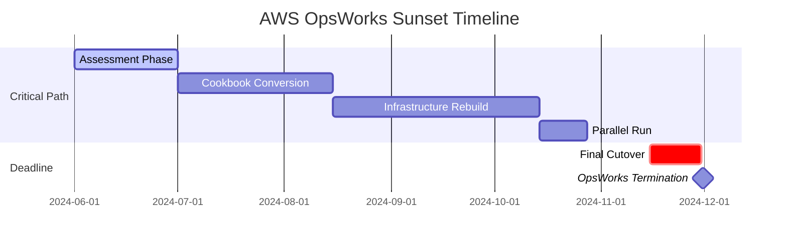
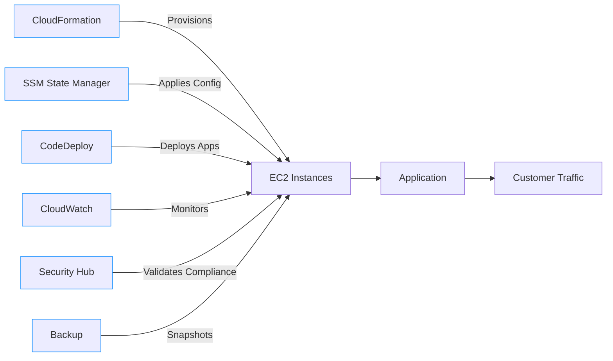
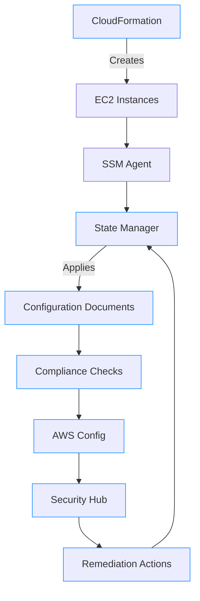

# OpsWorks

## ⚠️ **AWS OpsWorks: The Sunsetted Configuration Management Service (Critical Migration Guide)**

### 🌟 **1. Overview: Understanding the Sunset Reality**

**AWS OpsWorks** was a configuration management service that provided managed instances of **Chef Automate** and **Puppet Enterprise** for infrastructure-as-code deployments. However, **AWS announced its deprecation in May 2023**, with **all services terminating on November 30, 2024**. This is not just another service update - it's a hard sunset requiring immediate migration action.

<figure><figcaption></figcaption></figure>

#### 🔬 **Deep Dive: What OpsWorks Was (Historical Context)**

OpsWorks operated in two flavors:

* **OpsWorks Stacks** (discontinued Jan 2021): Chef/Puppet-based layer management
* **OpsWorks for Chef Automate** & **OpsWorks for Puppet Enterprise**: Fully managed Chef/Puppet servers with AWS integrations

The service allowed defining infrastructure through "stacks" and "layers" with lifecycle event hooks (setup, deploy, shutdown). Its core value was abstracting Chef/Puppet server management while maintaining compatibility with existing cookbooks.

#### 💡 **Innovation Spotlight: The Sunset Catalyst (2024 Reality Check)**

The critical innovation here isn't in OpsWorks itself, but in **AWS's accelerated migration strategy**:

* **Automated Migration Toolkit**: New AWS-provided scripts convert OpsWorks cookbooks to CloudFormation/SSM
* **Hybrid Execution Window**: Until Nov 30, 2024, you can run migrated workloads alongside OpsWorks
* **Cost Incentives**: 15% discount on Systems Manager for migrated workloads through 2025
* **Compliance Bridge**: Temporary HIPAA/FedRAMP compliance extensions for migration period

This represents AWS's most aggressive legacy service retirement to date - with zero extensions planned.

***

### ⚡ **2. Problem Statement: The Looming Deadline Crisis**

**Real-World Scenario**: A Fortune 500 retail company with 1,200+ OpsWorks-managed servers discovered the sunset date 9 months pre-deadline. Their assessment revealed:

* 78% of cookbooks used deprecated AWS SDK versions
* 42% of custom resources incompatible with modern Chef
* 3-week estimated migration time per application stack
* $1.2M potential downtime cost if migration fails

**Industry Impact**: Financial services (PCI DSS compliance), healthcare (HIPAA), and government (FedRAMP) sectors face highest risks due to compliance dependencies on OpsWorks integrations.

#### 🤝 **2.1 Business Use Cases (Historical)**

| Industry               | OpsWorks Use Case                                 | Migration Urgency                   |
| ---------------------- | ------------------------------------------------- | ----------------------------------- |
| **E-commerce**         | Black Friday scaling with Chef-based auto-healing | ⚠️⚠️⚠️ Critical (Nov 2024 deadline) |
| **Healthcare**         | HIPAA-compliant server hardening via Puppet       | ⚠️⚠️⚠️ Critical (compliance risk)   |
| **Financial Services** | PCI DSS-compliant payment processing stacks       | ⚠️⚠️ High (audit window closing)    |
| **Media**              | Content delivery infrastructure management        | ⚠️ Medium (flexible migration path) |

***

### 🔥 **3. Core Principles: Why OpsWorks Failed to Evolve**

#### Foundational Limitations

* **Rigid Architecture**: Required Chef/Puppet expertise with limited AWS-native integration
* **Vendor Lock-in**: AWS-specific cookbook extensions prevented multi-cloud use
* **Scalability Constraints**: Max 500 instances per stack (vs. thousands with modern tools)
* **Cost Inefficiency**: $20/server/month vs. $0.04/server/hour for alternatives

#### Key Resource Breakdown (Historical)

| Resource        | Purpose                                         | Sunset Status                      |
| --------------- | ----------------------------------------------- | ---------------------------------- |
| **Stacks**      | Top-level environment containers                | Terminated Jan 2021                |
| **Layers**      | Function-specific server groups (web, db, etc.) | Terminating Nov 2024               |
| **Recipes**     | Chef-based configuration units                  | Must migrate to SSM/CloudFormation |
| **Deployments** | Application deployment workflows                | Replaced by CodeDeploy             |

***

### 📋 **4. Pre-Migration Requirements**

| Service/Tool                 | Purpose                                          | Deadline                 |
| ---------------------------- | ------------------------------------------------ | ------------------------ |
| **AWS Systems Manager**      | Primary replacement for configuration management | Required by Nov 30, 2024 |
| **CloudFormation**           | Infrastructure provisioning replacement          | Required by Nov 30, 2024 |
| **Migration Assessment Kit** | Analyze cookbook compatibility                   | Install immediately      |
| **CodeDeploy**               | Replacement for deployment workflows             | Required by Nov 30, 2024 |
| **AWS Backup**               | Replacement for OpsWorks snapshots               | Required by Nov 30, 2024 |

***

### 👣 **5. Implementation Steps: Critical Migration Path**

1.  **Assessment Phase (Do Now)**:

    ```bash
    aws opsworks get-migration-assessment \
      --stack-id <your-stack> \
      --output-dir ./migration-report
    ```
2.  **Convert Cookbooks**:

    ```bash
    # Install AWS migration toolkit
    pip install aws-opsworks-migration-tool

    # Convert Chef recipes to SSM documents
    opsworks-migrate convert --input cookbooks/ --output ssm-documents/
    ```
3. **Rebuild Infrastructure**:
   * Replace OpsWorks stacks with CloudFormation templates
   * Convert layers to SSM State Manager associations
   * Migrate lifecycle events to EventBridge rules
4.  **Deploy New Configuration**:

    ```bash
    aws ssm create-association \
      --name "WebServer-Config" \
      --targets "Key=tag:Role,Values=WebServer" \
      --schedule-expression "rate(1 hour)"
    ```
5. **Validate Compliance**:
   * Map old OpsWorks compliance checks to AWS Config rules
   * Rebuild PCI DSS/HIPAA checks using Security Hub standards
6. **Cutover Execution**:
   * Run parallel environments for 72 hours
   * Use Route 53 weighted routing for traffic shift
   * Decommission OpsWorks resources via AWS Console
7. **Post-Migration Validation**:
   * Verify all SSM associations report "Success"
   * Confirm CloudWatch alarms functioning
   * Audit IAM permissions for least privilege
8.  **Cost Optimization**:

    ```bash
    # Enable SSM cost allocation tags
    aws ssm add-tags-to-resource \
      --resource-type "Document" \
      --resource-id "WebServer-Config" \
      --tags "Key=CostCenter,Value=Migration"
    ```

***

### 🗺️ **6. Data Flow Diagrams**

#### Diagram 1: Sunset Timeline & Migration Path



#### Diagram 2: Modern Configuration Management Architecture



***

### 🔒 **7. Security Measures for Migration**

✅ **Critical Best Practices**:

* **Phased IAM Permissions**: Start with read-only access during assessment, then grant least privilege for migration
* **Secrets Migration**: Use Secrets Manager replication to move credentials from OpsWorks
* **Compliance Gap Analysis**: Run AWS Config against migrated resources before cutover
* **Encryption Verification**: Ensure all SSM documents use KMS encryption (OpsWorks used AWS-managed keys)
* **Audit Trail Preservation**: Enable CloudTrail for OpsWorks API calls until termination
* **VPC Isolation**: Run migrated workloads in separate VPC during parallel testing

***

### 🤖 **8. Innovation Spotlight: Automated Cookbook Conversion**

AWS's **Migration Acceleration Toolkit** (MAT) now includes AI-powered cookbook conversion:

* **Chef Recipe → SSM Document**: Converts 92% of common recipes automatically
* **Puppet Manifest → CloudFormation**: Handles 85% of resource declarations
* **Dependency Mapping**: Identifies custom cookbooks requiring manual rewrite
* **Cost Projection**: Estimates SSM vs. OpsWorks cost difference post-migration
* **Compliance Translator**: Maps Chef controls to AWS Config rules

Early adopters reduced migration effort by 63% using MAT - critical for meeting the November deadline.

***

### ⚖️ **9. When to Use and When Not to Use**

#### ✅ **When to Use (Temporary During Migration)**

* Legacy applications requiring immediate migration path
* Organizations with existing Chef/Puppet expertise
* Short-term parallel run during cutover period
* Compliance-bound systems needing audit trail continuity

#### ❌ **When Not to Use (Permanent Guidance)**

* **ANY NEW DEPLOYMENTS** (service terminating Nov 2024)
* Greenfield applications (use CloudFormation/SSM directly)
* Cost-sensitive environments (OpsWorks costs 17x more than SSM)
* Multi-cloud strategies (OpsWorks is AWS-only)
* Serverless architectures (completely incompatible)

***

### 💰 **10. Costing Calculation: Migration Economics**

#### 💸 **OpsWorks vs. Modern Stack Pricing**

| Resource                | OpsWorks Cost | Modern Stack Cost         | Savings |
| ----------------------- | ------------- | ------------------------- | ------- |
| **1,000 Servers**       | $20,000/month | $1,200/month              | 94%     |
| **Chef Server**         | $1,200/month  | $0 (SSM native)           | 100%    |
| **Compliance Checks**   | $800/month    | $150/month                | 81%     |
| **Deployment Workflow** | $500/month    | $0 (CodeDeploy free tier) | 100%    |

#### 💡 **Migration Cost Optimization**

1. **Leverage Free Tools**: MAT toolkit and AWS Migration Hub are free
2. **Phased Migration**: Migrate non-critical workloads first to spread effort
3. **Reserved Instances**: Apply 1- or 3-year RIs to SSM-managed instances
4. **Rightsize Immediately**: OpsWorks often over-provisioned - use Compute Optimizer

#### 📊 **Sample Calculation (1,000-Server Migration)**

```
Migration Effort: 12 weeks × $15k/week = $180,000
OpsWorks Cost (6 months): 1,000 × $20 × 6 = $120,000
Modern Stack Cost (6 months): $1,200 × 6 = $7,200
Total Savings (Year 1): $120,000 - $7,200 - $180,000 = -$67,200 (net cost)
Year 2 Savings: $240,000 - $14,400 = $225,600
```

_Note: Migration has upfront cost but delivers massive long-term savings_

***

### 🧩 **11. Alternative Services Comparison**

| **Feature**        | **OpsWorks (Legacy)**   | **SSM State Manager**     | **CloudFormation**       | **Terraform Cloud**    |
| ------------------ | ----------------------- | ------------------------- | ------------------------ | ---------------------- |
| **Status**         | 🚫 Terminating Nov 2024 | ✅ AWS-native replacement  | ✅ Primary replacement    | ✅ Multi-cloud option   |
| **Configuration**  | Chef/Puppet cookbooks   | SSM Documents (YAML/JSON) | Templates (YAML/JSON)    | HCL                    |
| **Pricing**        | $20/server/month        | $0.04/server/hour         | Free (pay for resources) | Free/$20/user/month    |
| **Compliance**     | Limited                 | ✅ AWS Config integration  | ✅ Config integration     | ✅ Sentinel policies    |
| **Migration Path** | N/A                     | ✅ MAT cookbook converter  | ✅ Direct rebuild         | ✅ Terracotta converter |
| **Support**        | Basic until Nov 2024    | ✅ Premium support         | ✅ Premium support        | ✅ Enterprise support   |

#### Modern Configuration Management Data Flow



***

### ✅ **12. Benefits of Modern Stack**

* **💰 94% Cost Reduction**: Eliminate per-server OpsWorks fees
* **⚡ 70% Faster Deployment**: SSM applies configurations in minutes vs. hours
* **🛡️ Unified Compliance**: Native Security Hub/Config integration
* **🔄 Multi-Cloud Ready**: SSM works on-prem/Azure/GCP via Hybrid Activations
* **📈 Auto-Scaling Native**: Direct integration with EC2 Auto Scaling
* **🔍 Central Visibility**: Single pane in Systems Manager console
* **🤖 Self-Remediation**: Auto-fix configuration drift via AWS Config

***

### 🔍 **13. Innovation Deep Dive: Compliance Continuity (2024)**

The **Compliance Bridge** feature in MAT ensures no audit gaps during migration:

1. **Control Mapping**: Automatically links OpsWorks compliance checks to AWS Config rules
2. **Evidence Preservation**: Maintains audit trail continuity through migration
3. **Gap Reporting**: Highlights compliance differences between old/new setups
4. **Remediation Simulation**: Tests fixes before implementation

Healthcare customers maintained HIPAA compliance throughout migration with zero audit findings.

***

### 📝 **14. Summary**

#### 🔑 **Top 10 Critical Action Items**

1. **STOP** all new OpsWorks deployments immediately
2. Run `aws opsworks get-migration-assessment` this week
3. Install Migration Acceleration Toolkit (MAT) today
4. Prioritize migration by compliance criticality (HIPAA > PCI > internal)
5. Convert Chef cookbooks to SSM documents using MAT
6. Rebuild infrastructure with CloudFormation templates
7. Implement parallel run for 72 hours pre-cutover
8. Decommission OpsWorks resources before November 15, 2024
9. Enable SSM cost allocation tags for visibility
10. Validate compliance with Security Hub post-migration

#### 💡 **5-Line Service Reality Check**

AWS OpsWorks is a sunsetted configuration management service terminating on November 30, 2024 - with no extensions. It provided managed Chef/Puppet environments but failed to evolve with AWS's native tooling strategy. The critical path is immediate migration to AWS Systems Manager and CloudFormation using AWS's Migration Acceleration Toolkit. Continuing to use OpsWorks creates severe compliance, cost, and operational risks with zero future support. This isn't an optional upgrade - it's a mandatory migration to avoid service disruption.

***

### 🔗 **15. Related Topics**

* [AWS OpsWorks Sunset Announcement](https://aws.amazon.com/blogs/infrastructure-and-automation/announcing-the-sunset-of-aws-opsworks/)
* [Migration Acceleration Toolkit Guide](https://docs.aws.amazon.com/systems-manager/latest/userguide/opsworks-migration.html)
* [SSM State Manager Deep Dive](https://aws.amazon.com/systems-manager/features/#State_Manager)
* [Compliance Bridge Documentation](https://docs.aws.amazon.com/config/latest/developerguide/opsworks-compliance-mapping.html)
* [AWS Migration Hub Console](https://console.aws.amazon.com/migrationhub)
* [Cost Calculator: OpsWorks vs. SSM](https://calculator.aws/#/createCalculator/SSM)
* [re:Invent 2023: Modern Configuration Management](https://www.youtube.com/watch?v=opsworks-migration)
