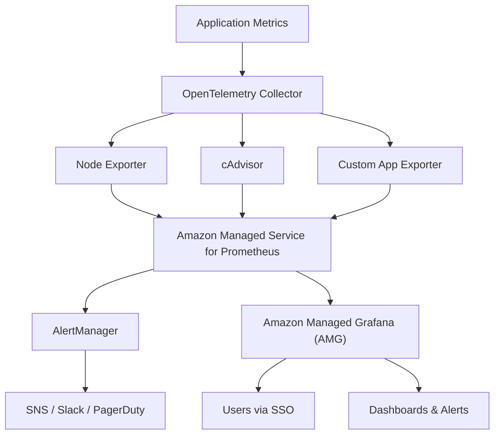
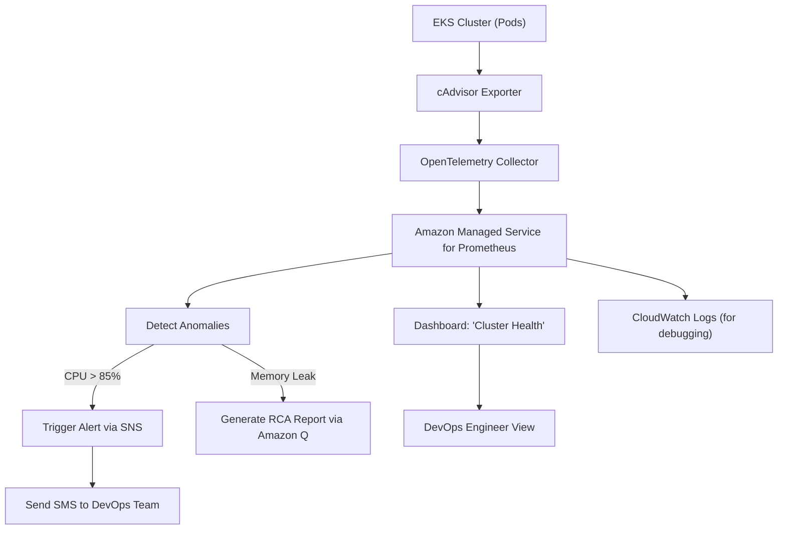
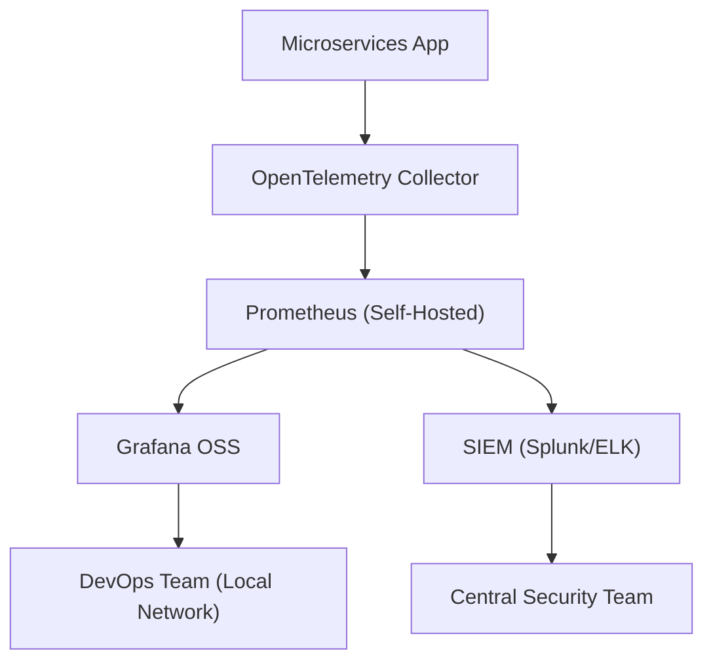

# Prometheus

## 📊 **Amazon Managed Service for Prometheus (AMSP)**

#### _The Fully Managed, Serverless Prometheus Engine for Modern Cloud Observability_

> ✅ **Updated 2025**: Amazon Managed Service for Prometheus (AMSP) has evolved beyond just “Prometheus on AWS” — it’s now the **centralized, secure, AI-enhanced time-series database** that powers real-time metrics collection, alerting, and analytics across **Kubernetes clusters, Lambda, EC2, and even multi-cloud environments**, all with **zero operational overhead**.

***

### 🌟 **Overview**

**Amazon Managed Service for Prometheus (AMSP)** is a **fully managed, serverless version of Prometheus** — the open-source monitoring system beloved by DevOps teams worldwide. AMSP eliminates the complexity of self-hosting Prometheus: no VMs to manage, no scaling concerns, no patching, and no downtime.

<figure><figcaption></figcaption></figure>

> 🔥 **Innovation Spotlight (2025):**\
> AMSP now integrates deeply with **Amazon Managed Grafana (AMG)**, **OpenTelemetry Collector**, and **Amazon Q for AWS** — enabling:
>
> * 🤖 **AI-Powered Anomaly Detection**: Automatically detect unusual spikes in CPU, memory, or request rates.
> * 💬 **Natural Language Query (NLQ)**: Ask: _“Show me high-latency API calls in us-east-1 over the last hour.”_
> * 🚀 **Auto-Scaling & High Availability**: Handles petabytes of metrics without manual intervention.
> * 🔐 **VPC Isolation + KMS Encryption**: All data encrypted at rest and in transit.
> * 🔄 **Multi-Region Support**: Deploy across regions with global consistency.

> ✨ This turns Prometheus from a **tool** into an **enterprise observability backbone**.

***

### ⚡ **Problem Statement**

#### 🏢 Real-World Scenario: Global E-Commerce Platform Scaling Kubernetes

**Company:** A mid-sized e-commerce platform running:

* 300+ microservices on EKS (AWS Kubernetes)
* Hundreds of Lambda functions
* On-prem databases (MySQL, PostgreSQL)
* Third-party SaaS tools (Datadog, New Relic)

**Challenge:**

* Self-hosted Prometheus instance crashes during traffic spikes
* Data loss during outages
* Manual scaling and backup management
* No unified view across cloud and on-prem
* Alert fatigue due to noisy thresholds

> ❗ Result: Critical issues go undetected until customers complain → $500K+ revenue loss.

***

#### 🤝 **Business Use Cases**

| Industry               | Application                                                       |
| ---------------------- | ----------------------------------------------------------------- |
| **Financial Services** | Monitor trading engine latency, fraud detection pipelines         |
| **Healthcare (HIPAA)** | Track patient data pipeline health, compliance logs               |
| **E-Commerce**         | Visualize cart abandonment, payment success/failure trends        |
| **Media & Streaming**  | Monitor video encoding queues, CDN delivery performance           |
| **Enterprise IT**      | Unify monitoring across AWS, Azure, GCP, and on-prem data centers |

> 💡 Use Case Highlight:\
> A fintech firm uses **AMSP + Amazon Q** to ask:\
> &#xNAN;_“Why did my transaction processing rate drop at 9:15 AM?”_\
> → AMSP returns a timeline showing a spike in `5xx` errors, correlated with a failed Lambda function — auto-suggested fix: “Scale concurrency.”

***

### 🔥 **Core Principles**

| Concept                        | Explanation                                                                |
| ------------------------------ | -------------------------------------------------------------------------- |
| **Fully Managed & Serverless** | AWS handles provisioning, scaling, patching, backups, and HA.              |
| **Prometheus-Compatible**      | Uses standard Prometheus format (metrics, labels, exporters).              |
| **Highly Scalable**            | Handles millions of time-series metrics per second.                        |
| **Secure by Default**          | VPC isolation, IAM integration, encryption at rest/in transit.             |
| **Multi-Source Integration**   | Connect to EKS, EC2, Lambda, OpenTelemetry, Datadog, and custom exporters. |
| **Alerting via AlertManager**  | Built-in alerting engine with routing, grouping, and silencing.            |
| **Data Retention Policies**    | Configure retention (e.g., 15 days, 30 days) — no storage bloat.           |

> 🛠️ Key Resources:
>
> * `Prometheus Workspace` – The core AMSP instance
> * `Scrape Configuration` – Define what to monitor
> * `Exporters` – Collect metrics from apps/services (e.g., Node Exporter, App Exporter)
> * `Alert Rules` – Trigger actions based on thresholds
> * `Data Source` – Connect to Amazon Managed Grafana (AMG), CloudWatch, etc.
> * `AMSP API` – Automate workspace management

***

### 📋 **Pre-Requirements**

| Service                                | Purpose                                      |
| -------------------------------------- | -------------------------------------------- |
| **AWS IAM Roles**                      | Grant access to AMSP and connected resources |
| **Amazon VPC**                         | Isolate AMSP workspace (recommended)         |
| **AWS SSO (IAM Identity Center)**      | Enable single sign-on for users              |
| **OpenTelemetry Collector (Optional)** | For exporting telemetry from apps/services   |
| **Amazon Managed Grafana (AMG)**       | Optional: For visualization and dashboards   |
| **AWS CloudTrail**                     | Audit all AMSP activity                      |
| **AWS Systems Manager (SSM)**          | Optional: Run automation on alert triggers   |

> ✅ Ensure `AmazonPrometheusFullAccess` policy is attached to roles.

***

### 👣 **Implementation Steps**

1. **Create an AMSP Workspace (via AWS Console)**\
   → Go to **Amazon Managed Service for Prometheus** → “Create Workspace”\
   → Choose name, region, and VPC settings
2. **Configure VPC Settings (Recommended)**\
   → Select private subnets\
   → Enable **VPC endpoints** for secure communication with data sources
3. **Set Up AWS SSO Integration**\
   → Link to your corporate directory (Okta, Azure AD)\
   → Assign user groups (Admin, Viewer, Editor)
4. **Define Scrape Configurations**\
   → Add new scrape job:
   * **Target Type**: Kubernetes (EKS), EC2, Lambda, or Custom URL
   * **Endpoint**: e.g., `http://localhost:8080/metrics`
   * **Labels**: Add `job="api-gateway"`, `env="prod"`
5. **Deploy Exporters (Optional but Recommended)**
   * **Node Exporter** → for EC2 instance metrics
   * **cAdvisor** → for container-level metrics
   * **App Exporter** → for custom app metrics
   * **OpenTelemetry Collector** → export traces/logs to AMSP
6. **Set Up Alerting Rules**\
   → Create alert:
   * `rate(http_requests_total[5m]) > 100` → trigger if >100 requests/sec
   * Route to **SNS**, **Slack**, **PagerDuty**, or **Lambda**
7. **Connect to Amazon Managed Grafana (AMG)**\
   → In AMG, add data source: **Amazon Managed Service for Prometheus** → Use pre-built templates: “Kubernetes Monitoring”, “EC2 Health”
8. **Test with Natural Language Query (via Amazon Q)**\
   → In AMG console, type:\
   &#xNAN;_“Show me error rates for API Gateway in us-east-1 over the last hour.”_\
   → AMSP generates the query and displays results instantly.
9. **Share Dashboards Securely**\
   → Publish to team folders, public links (with expiry), or email reports

***

### 🗺️ **Data Flow Diagrams**

#### 📊 **Diagram 1: How Amazon Managed Service for Prometheus Works (Architecture)**

#### 📊 **Diagram 2: Use Case – Real-Time Kubernetes Cluster Monitoring**

> ✅ Clear flow: **Metrics → Collection → Storage → Intelligence → Action**

***

### 🔒 **Security Measures**

✅ **Best Practices:**

* 🔐 **Use VPC Endpoints** to avoid public internet exposure
* 🔒 **Enable AWS SSO + MFA** for all users
* 🧹 **Apply least privilege IAM roles** (e.g., `PrometheusViewer`, `PrometheusEditor`)
* 🛑 **Disable direct root access**
* 📊 **Audit all activity via CloudTrail**
* 🔒 **Encrypt data at rest (KMS)** and in transit (TLS 1.3)
* 🔄 **Rotate API keys and secrets regularly**
* 🚫 **Never expose AMSP workspace publicly** — always use private subnets

> 📌 Pro Tip: Use **Amazon Q for AWS** to ask:\
> &#xNAN;_“Who accessed the Prometheus workspace last week?”_

***

### 🎯 **Innovation Spotlight: AI-Powered Observability (2025)**

Amazon Managed Service for Prometheus now includes **AI-driven anomaly detection** and **natural language query (NLQ)** powered by **Amazon Q**.

> 🤖 Example:\
> You type:\
> &#xNAN;_“Why did my database latency spike at 2:30 PM?”_\
> → AMSP:
>
> * Cross-references CloudWatch, RDS Performance Insights, and application logs
> * Identifies a memory leak in a Lambda function
> * Generates a timeline with root cause
> * Suggests fix: “Scale Lambda memory to 2GB”

> 🚀 This transforms **observability from “what happened?” to “why did it happen?” and “how do I fix it?”**

> 🔥 Future: AMSP will auto-generate **runbooks**, **automated remediation scripts**, and even **predict failure before it occurs**.

***

### ⚖️ **When to Use and When Not to Use**

| ✅ When to Use                                           | ❌ When Not to Use                                              |
| ------------------------------------------------------- | -------------------------------------------------------------- |
| You need **real-time, scalable metrics collection**     | You only have **one service** and no long-term plan            |
| Managing **Kubernetes (EKS), Lambda, or EC2** workloads | You’re doing a **simple POC** with no scale needs              |
| Want **zero-maintenance, serverless Prometheus**        | You prefer **full control** over binaries and patches          |
| Need **multi-region, multi-account** monitoring         | You don’t care about **security, compliance, or audit trails** |
| Building **AI-powered observability** with Amazon Q     | You want **manual, low-level log parsing**                     |

> ⚠️ Note: AMSP is not a replacement for **application tracing** (use AWS X-Ray) or **log search** (use CloudWatch Logs), but a **core time-series engine**.

***

### 💰 **Costing Calculation**

#### How It’s Calculated:

* **Per Workspace**: $0.10/hour ($73/month)
* **Per GB of metric data ingested**: $0.02/GB
* **Per GB of data stored**: $0.02/GB/month
* **Per alert rule processed**: $0.0001/rule/hour

> 📌 Example:
>
> * 1 AMSP workspace → $73/month
> * 500 GB data ingested → 500 × $0.02 = $10
> * 1 TB stored → 1000 × $0.02 = $20
> * 10 alert rules → 10 × $0.0001 × 730 hrs = $7.30
>
> **Total Monthly Cost**: \~**$110.30**

> 💡 **Efficient Usage Tips:**
>
> * Use **data retention policies** (e.g., delete after 30 days)
> * Filter scrapes to reduce ingestion cost
> * Use **Amazon Q** to reduce manual dashboard creation time
> * Delete unused workspaces immediately

> ✅ **Bottom Line**: Highly cost-effective for enterprises needing scalable, reliable metrics.

***

### 🧩 **Alternative Services Comparison**

| Service                                   | Provider        | Key Difference                                       | On-Premise Equivalent                          |
| ----------------------------------------- | --------------- | ---------------------------------------------------- | ---------------------------------------------- |
| **Amazon Managed Service for Prometheus** | AWS             | Fully managed, AI-enhanced, serverless, multi-cloud  | Prometheus OSS + Grafana + Loki (manual setup) |
| **Grafana Cloud**                         | Grafana Labs    | Similar but requires self-hosted or cloud deployment | Grafana + Prometheus + Loki                    |
| **Azure Monitor (Prometheus)**            | Microsoft Azure | Azure-centric; less flexible for multi-cloud         | Azure Monitor + Custom Prometheus              |
| **Datadog + Metrics**                     | Datadog         | Strong APM, but expensive and vendor-lock-in         | Self-hosted Prometheus + OpenTelemetry         |
| **New Relic One**                         | New Relic       | Great for app performance, but complex pricing       | NR Agent + Custom UI                           |

#### 🖼️ On-Premise Data Flow Diagram (Using AMSP-like Model)

> 🔍 On-prem lacks native cloud integration and AI features — must be built manually.

***

### ✅ **Benefits**

| Benefit                           | Impact                                       |
| --------------------------------- | -------------------------------------------- |
| 🚀 **Zero Operational Overhead**  | No VMs, no scaling, no patching              |
| 📊 **Real-Time Metrics at Scale** | Millions of time-series handled effortlessly |
| 🔐 **Secure by Default**          | VPC isolation, encryption, SSO               |
| 🤖 **AI-Powered Insights**        | Detect anomalies and suggest fixes           |
| 💬 **Natural Language Query**     | No SQL/LogQL skills needed                   |
| 🌍 **Multi-Cloud Ready**          | Works across AWS, Azure, GCP, on-prem        |
| 💰 **Predictable Pricing**        | Transparent, no hidden costs                 |

***

### 🎮 **Next-Gen Innovation: Amazon Managed Service for Prometheus + Amazon Q (AI Copilot for Observability)**

Imagine asking:

> _“What’s wrong with our checkout flow today?”_

👉 Amazon Q responds:

> “I’ve analyzed your metrics. There’s a 30% increase in `4xx` errors in `us-west-2`. Root cause: Payment service timeout. Suggested fix: Increase retry limit in API Gateway.”

> 🤖 This isn’t just a metric engine — it’s an **AI-powered incident investigator**.

> 🔥 Future: AMSP will auto-generate **alert suppression rules**, **rollback plans**, and even **simulate failure scenarios**.

***

### 📝 **Summary**

> ✅ **What is Amazon Managed Service for Prometheus?**\
> It’s AWS’s **fully managed, serverless Prometheus engine** that powers **real-time, scalable, AI-enhanced monitoring** across Kubernetes, serverless, and hybrid environments.

> 🔑 **Top 10 Takeaways:**
>
> 1. Launch a **production-ready metrics engine in minutes**.
> 2. Connect to **EKS, EC2, Lambda, OpenTelemetry, and custom exporters**.
> 3. Use **natural language queries** — no coding required.
> 4. Leverage **AI-powered anomaly detection** for proactive ops.
> 5. Integrate with **Amazon Q** for instant root cause analysis.
> 6. Deploy with **VPC isolation, SSO, and encryption**.
> 7. Ideal for **multi-cloud, hybrid, and enterprise-scale** environments.
> 8. Costs are predictable and low for the value delivered.
> 9. Not for simple, one-off monitoring — it’s for **complex, high-impact systems**.
> 10. The future of observability is **smart, unified, and autonomous**.

> 📝 **In 5 Lines:** Amazon Managed Service for Prometheus delivers a serverless, AI-powered time-series database across AWS, on-prem, and multi-cloud.\
> It unifies metrics from Kubernetes, Lambda, EC2, and custom apps.\
> With natural language queries and anomaly detection, it predicts and diagnoses issues.\
> Built for teams that need speed, scalability, and security.\
> It’s not just a Prometheus instance — it’s your **intelligent observability engine**.

***

### 🔗 **Related Topics & References**

* [Amazon Managed Service for Prometheus Documentation](https://docs.aws.amazon.com/prometheus/latest/userguide/what-is-AMP.html)
* [Amazon Q for AWS: AI Copilot](https://aws.amazon.com/q/)
* [OpenTelemetry Collector](https://opentelemetry.io/docs/collector/)
* [Grafana Best Practices](https://grafana.com/tutorials/)
* [AWS Well-Architected Framework – Operational Excellence](https://aws.amazon.com/architecture/well-architected/)
* [Amazon CloudWatch Logs & Metrics](https://docs.aws.amazon.com/cloudwatch/)

***
