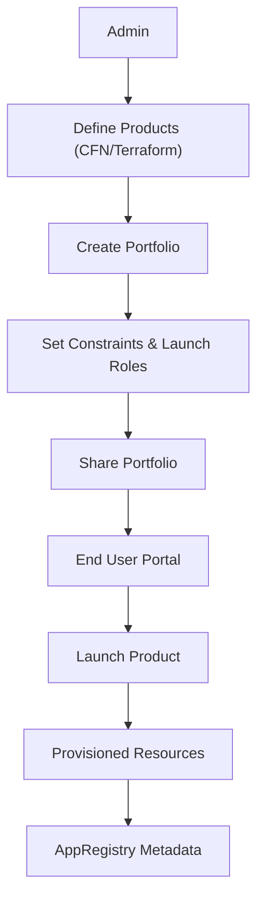
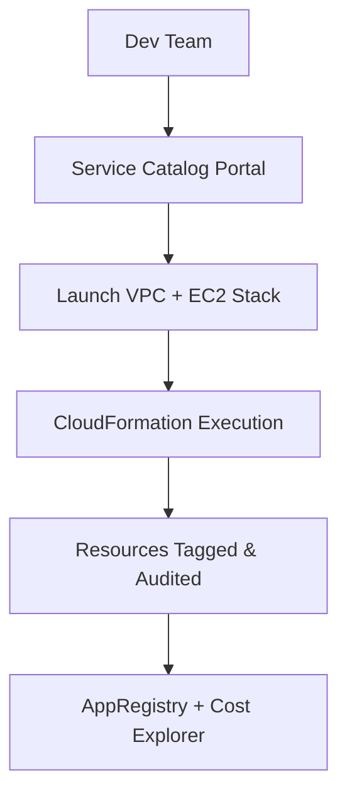
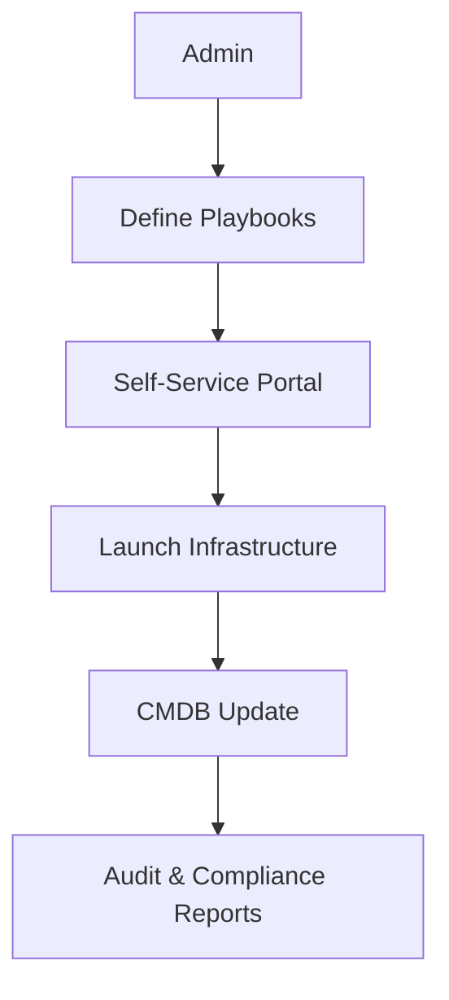

# Service Catalog

## Service Catalog

**🛠️ AWS Service Catalog – Governance-Driven Self-Service for Cloud Resources**

***

### 🌟 Overview

**AWS Service Catalog** empowers organizations to centrally manage and distribute approved IT services—including EC2 instances, Lambda functions, databases, and entire application stacks—while enforcing governance, compliance, and cost controls.

<figure><figcaption></figcaption></figure>

#### 🚀 Innovation Spotlight

* **Service Catalog AppRegistry + Amazon Q**: Auto-document and query app metadata using AI.
* **Terraform Support**: Publish Terraform configurations as products.
* **Cross-Account Portfolio Sharing**: Seamless sharing across org units with fine-grained access.
* **Governed Self-Service Portals**: Integrated with AWS Control Tower and ServiceNow.

***

### ⚡ Problem Statement

**Scenario**: A large enterprise wants to empower developers to launch infrastructure without compromising security, budget, or architectural standards.

**Challenge**: Manual provisioning leads to drift, inconsistent tagging, and security risks.

#### 2.1 🤝 Business Use Cases

* 🏢 Enterprises: Standardized environments for dev/test/prod.
* 🏥 Healthcare: HIPAA-compliant stacks with audit trails.
* 🏦 Finance: Pre-approved templates for secure VPCs and databases.
* 🧪 Research: Controlled access to compute resources for experiments.

***

### 🔥 Core Principles

* **Governance First**: Admins define what can be launched and by whom.
* **Self-Service Enablement**: Users launch approved products without needing deep AWS knowledge.
* **Compliance & Auditability**: Enforced tagging, versioning, and access controls.
* **Integration Ready**: Works with CloudFormation, Terraform, Control Tower, and ServiceNow.

#### Key Resources

| Resource             | Description                                    |
| -------------------- | ---------------------------------------------- |
| Portfolio            | Collection of approved products                |
| Product              | A deployable CloudFormation/Terraform template |
| Constraints          | Rules on usage (e.g., regions, IAM roles)      |
| Launch Role          | IAM role used to provision resources           |
| AppRegistry          | Metadata store for applications                |
| ServiceNow Connector | Enables ITSM integration                       |

***

### 📋 Pre-Requirements

| Service                    | Purpose                         |
| -------------------------- | ------------------------------- |
| IAM                        | Define launch roles and access  |
| CloudFormation / Terraform | Define infrastructure templates |
| AWS Organizations          | Enable cross-account sharing    |
| AWS Control Tower          | Governed landing zones          |
| AppRegistry                | Application metadata tracking   |
| ServiceNow (optional)      | ITSM integration                |

***

### 👣 Implementation Steps

1. **Create IAM roles** for admins and launch users.
2. **Define CloudFormation or Terraform templates** for products.
3. **Create a Portfolio** and add products.
4. **Set Constraints** (e.g., region, tag enforcement).
5. **Assign Launch Roles** to products.
6. **Share Portfolio** across accounts/org units.
7. **Enable AppRegistry** for metadata tracking.
8. **Integrate with ServiceNow** if needed.
9. **Monitor usage via CloudTrail and Cost Explorer**.

***

### 🗺️ Data Flow Diagram

#### Diagram 1 – How AWS Service Catalog Works

#### Diagram 2 – DevOps Self-Service Portal

***

### 🔒 Security Measures

* 🔐 **IAM Launch Roles**: Scoped permissions for provisioning.
* 🛡️ **Constraints**: Enforce region, tag, and role usage.
* 📜 **CloudTrail Logging**: Track all launches and changes.
* 🧪 **Version Control**: Maintain approved template versions.
* 🔍 **AppRegistry**: Metadata for audit and compliance.

***

### ⚖️ When to Use and When Not to Use

#### ✅ When to Use

* Need for standardized, compliant infrastructure provisioning.
* Large teams with varying AWS expertise.
* Multi-account governance via AWS Organizations.

#### ❌ When Not to Use

* Ad-hoc infrastructure experimentation.
* Highly dynamic, non-template-based deployments.
* Small teams with direct access to AWS resources.

***

### 💰 Costing Calculation

#### Pricing Factors

* No direct cost for Service Catalog.
* Indirect costs from provisioned resources (EC2, RDS, etc.)
* AppRegistry and CloudFormation usage are free.

#### Sample Calculation

* **Product**: EC2 + RDS stack
* EC2: t3.medium → $0.0416/hr
* RDS: db.t3.medium → $0.067/hr
* Monthly (24x7):\
  → EC2: \~$30\
  → RDS: \~$48\
  → **Total: \~$78/month**

#### Efficiency Tips

* Use **Spot Instances** in templates.
* Enforce **tag-based budgets**.
* Schedule **auto-stop** via Automation documents.

***

### 🧩 Alternative Services

| Feature           | AWS Service Catalog | Azure Blueprints | GCP Deployment Manager | On-Premise     |
| ----------------- | ------------------- | ---------------- | ---------------------- | -------------- |
| Template Language | CFN/Terraform       | ARM/Bicep        | YAML/Python            | Ansible/Chef   |
| Governance        | IAM + Constraints   | RBAC + Policies  | IAM + Labels           | LDAP + ACLs    |
| Self-Service      | Yes                 | Yes              | Limited                | Custom Portals |
| Metadata Tracking | AppRegistry         | Resource Graph   | Labels                 | CMDB           |

#### On-Premise Data Flow (Ansible + CMDB)

***

### ✅ Benefits

* 🧭 Governance with flexibility
* 🛠️ Self-service without risk
* 🔄 Version-controlled infrastructure
* 🔐 Secure provisioning via IAM
* 📊 Cost and usage visibility
* 🧠 Metadata tracking via AppRegistry
* 🤝 Integration with ITSM tools

***

### 📝 Summary

AWS Service Catalog enables **governed self-service provisioning** of cloud resources using approved templates. It balances agility with control, making it ideal for large organizations with compliance needs.

#### Top Takeaways

1. Centralized product and portfolio management.
2. Supports CloudFormation and Terraform.
3. Enforces constraints and launch roles.
4. Enables cross-account sharing.
5. Tracks metadata via AppRegistry.
6. Integrates with ServiceNow and Control Tower.
7. No direct cost—pay only for provisioned resources.
8. Ideal for enterprise-scale governance.
9. Enhances security and auditability.
10. Empowers teams with safe self-service.

***

### 🔗 Related Topics

* [AWS Service Catalog Docs](https://docs.aws.amazon.com/servicecatalog/)
* [AppRegistry Overview](https://docs.aws.amazon.com/servicecatalog/latest/adminguide/appregistry.html)
* [Terraform Support in Service Catalog](https://aws.amazon.com/blogs/mt/terraform-support-in-aws-service-catalog/)
* [Control Tower Integration](https://docs.aws.amazon.com/controltower/latest/userguide/catalog.html)

***

