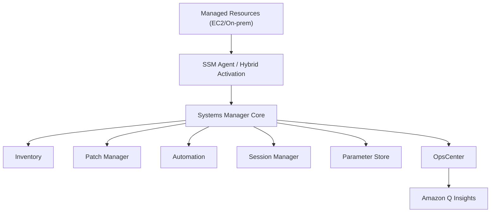
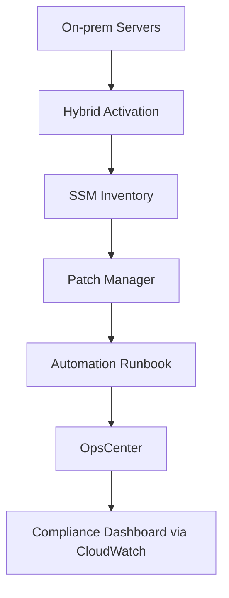
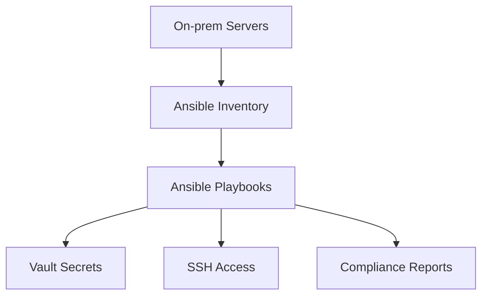

# System Manager

## AWS Systems Manager (SSM)

🛠️ **AWS Systems Manager – Unified Ops for Hybrid and Cloud Infrastructure (2025 Edition)**

***

### 🌟 Overview

**AWS Systems Manager (SSM)** is a unified operations hub that enables visibility and control over AWS and on-premises resources. It simplifies **configuration management**, **patching**, **automation**, and **compliance** across hybrid environments.

<figure><figcaption></figcaption></figure>

#### 🚀 Innovation Spotlight (2025)

* **SSM Agentless Management**: Manage EC2 and on-prem resources without installing agents.
* **OpsCenter AI Insights**: Integrated with Amazon Q for intelligent incident resolution.
* **Hybrid Activation Enhancements**: Seamless onboarding of on-prem servers with secure tunneling.
* **SSM Parameter Store + Secrets Manager Sync**: Unified secrets and config management.

***

### ⚡ Problem Statement

**Scenario**: A fintech company operates across AWS and on-prem data centers. They struggle with inconsistent patching, manual configuration drift, and lack of centralized visibility.

**Challenge**: Managing hybrid infrastructure securely and consistently without increasing operational overhead.

#### 2.1 🤝 Business Use Cases

* 🏦 Banking: Compliance-driven patching and audit trails.
* 🏥 Healthcare: Secure parameter storage and automation.
* 🏭 Manufacturing: Remote device management and diagnostics.
* 🧪 Pharma: Automated SOP enforcement via runbooks.

***

### 🔥 Core Principles

* **Unified Management**: Centralized control across AWS and hybrid environments.
* **Automation**: Runbooks, patching, and remediation workflows.
* **Compliance**: Inventory, change tracking, and audit logging.
* **Security**: Role-based access, encrypted parameters, and session isolation.

#### Key Resources

| Resource        | Description                             |
| --------------- | --------------------------------------- |
| SSM Agent       | Installed on EC2/on-prem for management |
| Parameter Store | Secure config and secrets storage       |
| Automation      | Runbooks for repeatable tasks           |
| Patch Manager   | Schedule and enforce patching           |
| Session Manager | Secure shell access without SSH         |
| OpsCenter       | Incident tracking and resolution        |
| Inventory       | Resource metadata collection            |
| State Manager   | Enforce desired configurations          |

***

### 📋 Pre-Requirements

| Service                       | Purpose                               |
| ----------------------------- | ------------------------------------- |
| IAM                           | Role-based access control             |
| EC2 / On-prem servers         | Managed resources                     |
| SSM Agent / Hybrid Activation | Enable management                     |
| CloudWatch                    | Monitoring and alerts                 |
| AWS Config                    | Compliance tracking                   |
| Secrets Manager               | Secure secret rotation                |
| Amazon Q                      | AI-powered troubleshooting (optional) |

***

### 👣 Implementation Steps

1. **Create IAM roles** for Systems Manager access.
2. **Install SSM Agent** on EC2/on-prem (or use agentless mode).
3. **Register on-prem servers** via Hybrid Activations.
4. **Enable Inventory** to collect metadata.
5. **Configure Patch Manager** schedules.
6. **Create Automation documents** for tasks (e.g., restart service).
7. **Use Session Manager** for secure shell access.
8. **Store configs in Parameter Store** or Secrets Manager.
9. **Monitor via OpsCenter and CloudWatch**.
10. **Enforce config via State Manager**.

***

### 🗺️ Data Flow Diagram

#### Diagram 1 – How AWS Systems Manager Works

#### Diagram 2 – Fintech Compliance Automation

***

### 🔒 Security Measures

* 🔐 **IAM Roles**: Use scoped roles for each SSM feature.
* 🧪 **Session Manager**: Disable SSH, use encrypted sessions.
* 🛡️ **Parameter Store Tier**: Use Advanced tier for encryption and policies.
* 📜 **Audit Trails**: Enable CloudTrail for all SSM actions.
* 🔍 **Resource Tagging**: Enforce access boundaries via tags.

***

### ⚖️ When to Use and When Not to Use

#### ✅ When to Use

* Managing EC2 and hybrid infrastructure.
* Automating patching, config enforcement, and diagnostics.
* Secure shell access without network exposure.

#### ❌ When Not to Use

* Real-time monitoring (use CloudWatch).
* Deep application-level observability (use X-Ray).
* Managing non-AWS cloud resources directly.

***

### 💰 Costing Calculation

#### Pricing Factors

* Number of managed instances
* Advanced Parameter Store usage
* Automation executions
* Session Manager logs (stored in CloudWatch)

#### Sample Calculation

* **100 managed instances**
* **50 automation executions/month**
* **Advanced Parameter Store (10 secrets)**

→ Instance management: Free\
→ Automation: $0.002 per execution → $0.10\
→ Parameter Store: $0.05/secret/month → $0.50\
→ **Total: \~$0.60/month**

#### Efficiency Tips

* Use **basic Parameter Store** for non-sensitive configs.
* Schedule **automation** during off-peak hours.
* Use **tag-based targeting** to reduce scope.

***

### 🧩 Alternative Services

| Feature            | AWS SSM         | Azure Arc    | GCP OS Config | On-Premise  |
| ------------------ | --------------- | ------------ | ------------- | ----------- |
| Hybrid Management  | Yes             | Yes          | Limited       | Puppet/Chef |
| Secure Shell       | Session Manager | Bastion      | IAP Tunnel    | SSH + VPN   |
| Automation         | Runbooks        | Logic Apps   | OS Policies   | Ansible     |
| Config Enforcement | State Manager   | Azure Policy | OS Config     | CFEngine    |

#### On-Premise Data Flow (Ansible + Vault)

***

### ✅ Benefits

* 🔄 Unified management across cloud and on-prem
* 🔐 Secure access without SSH
* ⚙️ Automation of routine tasks
* 📦 Centralized config and secrets
* 📊 Compliance and audit readiness
* 🧠 AI-powered troubleshooting (Amazon Q)

***

### 📝 Summary

AWS Systems Manager is a **centralized operations hub** for managing, automating, and securing AWS and hybrid infrastructure. It reduces manual overhead, enhances compliance, and enables secure, scalable operations.

#### Top Takeaways

1. Agent-based or agentless management of resources.
2. Secure shell access via Session Manager.
3. Automation and patching via runbooks.
4. Parameter Store for config and secrets.
5. OpsCenter for incident tracking.
6. Hybrid Activation for on-prem servers.
7. Compliance via Inventory and State Manager.
8. Integrated with Amazon Q for AI insights.
9. Cost-effective and scalable.
10. Ideal for regulated industries.

***

### 🔗 Related Topics

* [AWS Systems Manager Docs](https://docs.aws.amazon.com/systems-manager/)
* [Session Manager Best Practices](https://docs.aws.amazon.com/systems-manager/latest/userguide/session-manager.html)
* [Hybrid Activations Guide](https://docs.aws.amazon.com/systems-manager/latest/userguide/systems-manager-managed-instances.html)
* [SSM Automation Examples](https://docs.aws.amazon.com/systems-manager/latest/userguide/automation-documents.html)

***

