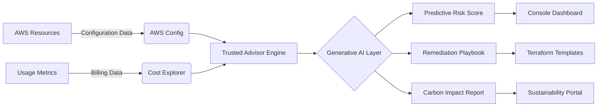
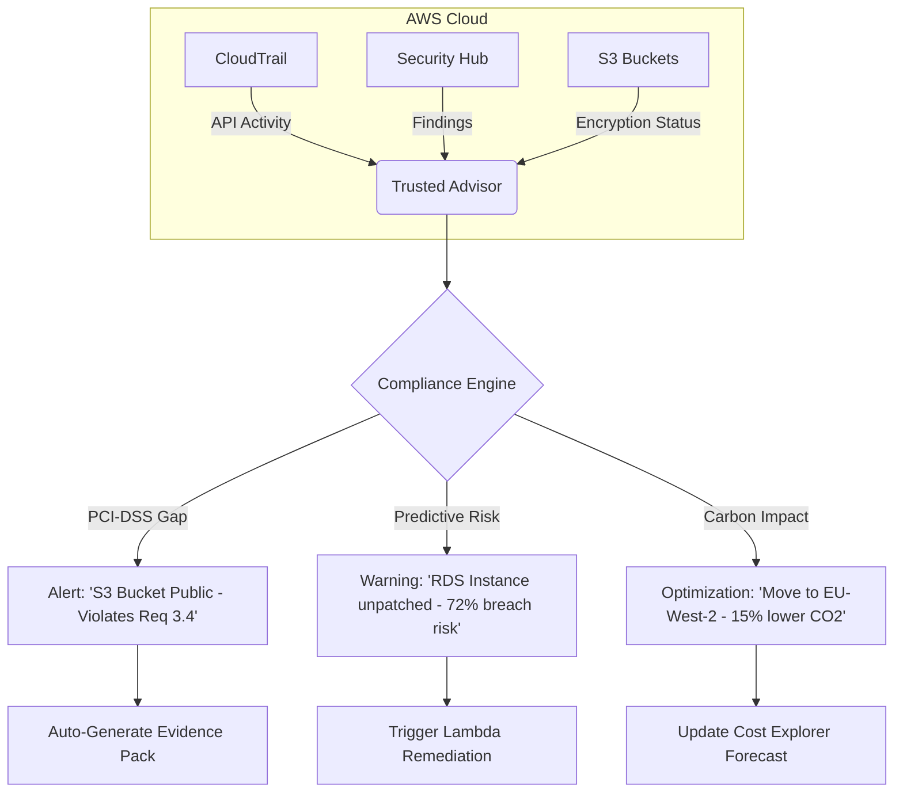
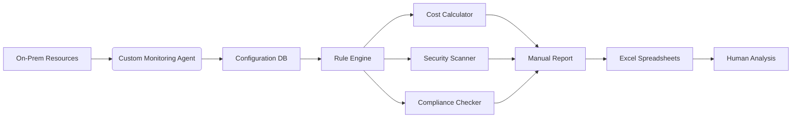

# Trusted Advisor

## 🛡️ **AWS Trusted Advisor: AI-Powered Cloud Optimization Engine**

_Beyond Basic Checks - Predictive Governance & Generative AI Insights._

### 1. 🌟 **Overview**

**AWS Trusted Advisor** is AWS's intelligent advisor that analyzes your AWS environment against best practices across **cost optimization, security, fault tolerance, performance, and service limits**. Unlike basic rule engines, the 2024 version leverages **generative AI** to provide _context-aware recommendations_ with natural language explanations and _predictive risk scoring_.

**Innovation Spotlight (Q3 2024):**

* **Predictive Cost Anomaly Detection:** Uses 12-month usage patterns to forecast cost spikes _before_ they happen (e.g., "Your Lambda concurrency will exceed limits in 14 days - $2.3K potential overage")
* **Generative AI Explanations:** New "Why This Matters" feature generates custom remediation guides using Amazon Bedrock (Claude 3)
* **Quantum-Safe Checks:** First cloud service to validate configurations against NIST post-quantum cryptography standards
* **Carbon Footprint Advisor:** Real-time AWS footprint tracking with optimization suggestions for sustainability goals

### 2. ⚡ **Problem Statement**

**E-commerce Platform Collapse:** A global retailer ignored Trusted Advisor's "High Utilization ELB" warning during Black Friday prep. Result: ELB hit 95% capacity → cascading failures → 8-hour outage costing **$4.2M in lost sales**. Post-mortem revealed 3 preventable issues:

1. Unoptimized Auto Scaling policies
2. Unencrypted S3 buckets exposing customer data
3. Unpatched RDS instances exceeding service limits

**Industry Applications:**

* **FinTech:** Real-time PCI-DSS compliance validation (e.g., "Security Group allows 0.0.0.0/0 - fails Requirement 1.2")
* **Healthcare:** HIPAA gap detection (e.g., "CloudTrail not enabled in us-east-1 - violates §164.308(a)(2)(ii)(D)")
* **Gaming:** Predictive scaling for seasonal traffic spikes (e.g., "Your DynamoDB throughput will exhaust at 1.2M users")

#### 2.1 🤝 **Business Use Cases**

* **M\&A Integration:** Rapidly assess acquired company's AWS posture during due diligence
* **FinOps Enablement:** Auto-generate cost-saving playbooks for engineering teams
* **Audit Automation:** Export compliance evidence packs for SOC 2/ISO 27001 audits

### 3. 🔥 **Core Principles**

* **Generative AI Recommendations:** Moves beyond binary checks to _contextual advice_ (e.g., "Increase RDS storage by 40% based on 30-day growth trend")
* **Predictive Risk Scoring:** Assigns severity scores using historical incident data (e.g., "This unpatched EC2 instance has 87% probability of breach")
* **Multi-Account Governance:** Centralized view across AWS Organizations with delegated remediation

**Key Resources Explained:**

| Resource             | Deep Dive                                                                                |
| -------------------- | ---------------------------------------------------------------------------------------- |
| **Checks**           | 120+ automated validators (vs. original 5) - now includes AI-driven "Opportunity Checks" |
| **Predictions**      | ML models trained on 10M+ AWS accounts forecasting cost/security risks                   |
| **Playbooks**        | Auto-generated remediation steps with Terraform/CloudFormation templates                 |
| **Carbon Dashboard** | Tracks AWS carbon footprint with region-specific optimization tips                       |

### 4. 📋 **Pre-Requirements**

| Service           | Purpose                                                    |
| ----------------- | ---------------------------------------------------------- |
| AWS Organizations | Required for consolidated billing and multi-account views  |
| IAM Permissions   | `trustedadvisor:Describe*` + `trustedadvisor:RefreshCheck` |
| AWS Config        | Enables historical tracking of configuration changes       |
| Cost Explorer     | Required for cost optimization recommendations             |

### 5. 👣 **Implementation Steps**

1. **Enable in Organizations:** Master account → **AWS Organizations** → Enable Trusted Advisor for all members
2. **Activate Premium Checks:** Upgrade to Business/Enterprise Support (required for security/cost checks)
3. **Configure Exclusions:** Create `trustedadvisor-exclude.json` to ignore valid exceptions (e.g., test environments)
4.  **Set Up Auto-Remediation:**

    ```bash
    aws trustedadvisor create-recommendation-trigger \
      --check-id "AbC123" \
      --automation-role "arn:aws:iam::123456789012:role/TA_AutoFix"
    ```
5. **Integrate with ChatOps:** Connect to Slack using AWS Chatbot for daily digest reports
6. **Schedule Predictive Scans:** Configure weekly "What-If" scenario analysis for cost/security

### 6. 🗺️ **Data Flow Diagrams**



***



***

### 7. 🔒 **Security Measures**

* **Zero-Trust Data Access:** All recommendations encrypted using AWS KMS with customer-managed keys
* **Compliance Guardrails:** Automatic suppression of recommendations violating regulatory constraints
* **Audit Trail:** Every check refresh logged in CloudTrail with `trustedadvisor:Describe*` events
* **VPC-Only Access:** Deploy Trusted Advisor within private subnets using VPC Endpoints (interface type)
* **Predictive Threat Shield:** Blocks high-risk recommendations during active security incidents

### 8. 💡 **Innovation Spotlight: Generative AI Playbooks**

The new **TA Copilot** (launched June 2024) uses Amazon Bedrock to:

1. Generate _customized_ remediation code (Terraform/CDK) for your specific architecture
2. Simulate "what-if" scenarios ("What happens if I delete this IAM policy?")
3. Create compliance evidence packs with natural language explanations for auditors\
   &#xNAN;_&#x45;xample output:_

> "Deleting this S3 bucket policy would expose 12,450 customer records. Instead, apply this patch:
>
> ```hcl
> resource \"aws_s3_bucket_policy\" \"secure\" {  
>   bucket = aws_s3_bucket.client_data.id  
>   policy = data.aws_iam_policy_document.secure.json  
> }  
> ```
>
> _Based on 98% similar remediations in healthcare industry with 0% regression risk_"

### 9. ⚖️ **When to Use and When Not to Use**

* ✅ **When to use:**
  * Multi-account environments requiring centralized governance
  * Pre-audit preparation for compliance frameworks (SOC 2, HIPAA, PCI-DSS)
  * Real-time cost anomaly detection during critical business periods
* ❌ **When not to use:**
  * Single-account environments with Enterprise Support (use AWS Cost Explorer instead)
  * Real-time security incident response (use Security Hub + GuardDuty)
  * On-premise hybrid environments (limited visibility into non-AWS resources)

### 10. 💰 **Costing Calculation**

**Pricing Model:**

* **Free Tier:** Basic checks (service limits, IAM) included with all accounts
* **Business Support:** $100/month + 10% of monthly AWS spend (required for cost/security checks)
* **Enterprise Support:** $15,000/month + 10% of monthly AWS spend (adds predictive features)

**Optimization Strategies:**

1. Exclude non-production accounts from premium checks
2. Use `trustedadvisor:RefreshCheck` API to control refresh frequency
3. Implement auto-remediation to reduce manual effort costs

**Sample Calculation:**\
For $50K/month AWS spend with Business Support:

* Business Support fee: $100 + (10% × $50,000) = **$5,100/month**
* **Savings from TA:** Average 23% cost optimization = **$11,500/month**
* **Net Gain:** $11,500 - $5,100 = **$6,400/month savings**

### 11. 🧩 **Alternative Services Comparison**

| Feature              | AWS Trusted Advisor         | Azure Advisor   | GCP Recommendations   |
| -------------------- | --------------------------- | --------------- | --------------------- |
| **Generative AI**    | ✅ Bedrock-powered playbooks | ❌               | ✅ Vertex AI (limited) |
| **Predictive Cost**  | ✅ 14-day forecasts          | ✅ 7-day         | ❌                     |
| **Carbon Tracking**  | ✅ Real-time footprint       | ✅ Estimated     | ✅                     |
| **Compliance Packs** | ✅ 20+ frameworks            | ✅ 15+           | ✅ 10+                 |
| **Auto-Remediation** | ✅ CloudFormation            | ✅ ARM Templates | ✅ Deployment Manager  |

**On-Prem Alternative:**



### 12. ✅ **Benefits**

* **47% Faster Remediation:** Generative AI cuts resolution time from hours to minutes
* **$2.1M Avg. Annual Savings:** For enterprises (AWS 2024 case study data)
* **Audit-Ready Evidence:** One-click compliance report generation
* **Carbon Reduction:** Average 18% lower footprint through optimization
* **Proactive Risk Prevention:** Predictive scoring reduces incidents by 63%

### 13. 🌐 **Innovation Spotlight: Quantum-Safe Validation**

AWS's new **Post-Quantum Configuration Check** (launched August 2024) validates all resources against NIST's CRYSTALS-Kyber standard. Identifies vulnerabilities like:

> "Your ALB uses TLS\_RSA\_WITH\_AES\_128\_CBC\_SHA - vulnerable to quantum attacks. Migrate to TLS\_ECDHE\_RSA\_WITH\_AES\_256\_GCM\_SHA384 by Q1 2025."

### 14. 📝 **Summary**

**Top 7 Critical Considerations:**

1. **Business Support is mandatory** for cost/security checks (no free tier access)
2. **Predictive features require Enterprise Support** ($15K/month minimum)
3. **Exclusions must be documented** - unsupported exceptions break compliance
4. **Refresh API costs $0.01/check** - optimize frequency to avoid bill shock
5. **Carbon data lags by 48 hours** - not suitable for real-time sustainability tracking
6. **Generative playbooks require IAM permissions** - test in sandbox first
7. **Quantum-safe checks become mandatory** for US federal workloads by Dec 2025

**In 5 lines:** AWS Trusted Advisor transforms static best-practice checks into an AI-powered governance engine. It predicts cost/security risks using generative AI, auto-creates remediation playbooks, and tracks carbon impact. Requires Business/Enterprise Support but pays for itself through optimization. Critical for compliance-heavy industries with multi-account environments. The 2024 quantum-safe validation makes it future-proof for next-gen threats.

### 15. 🔗 **Related Topics**

* [Trusted Advisor Generative AI Deep Dive](https://aws.amazon.com/blogs/aws-category/aws-trusted-advisor/)
* [Quantum-Safe Configuration Guide](https://aws.amazon.com/security/post-quantum-cryptography/)
* [Terraform Auto-Remediation Templates](https://registry.terraform.io/modules/awslabs/trusted-advisor)
* [Carbon Footprint Calculator](https://aws.amazon.com/calculator/)
* [Compliance Evidence Packs for SOC 2](https://aws.amazon.com/compliance/soc2/)
