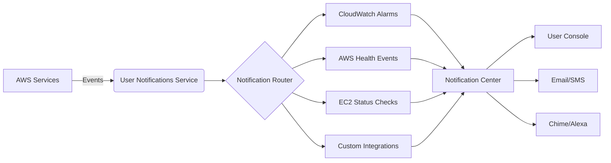
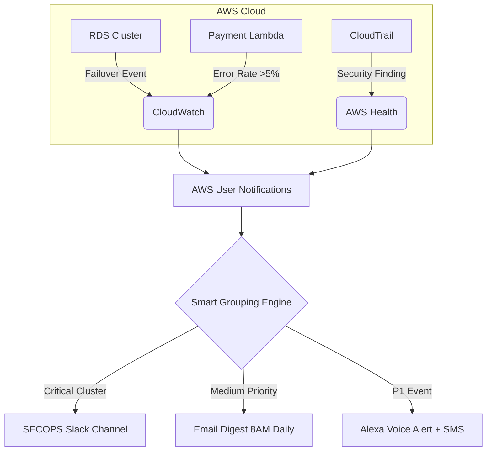
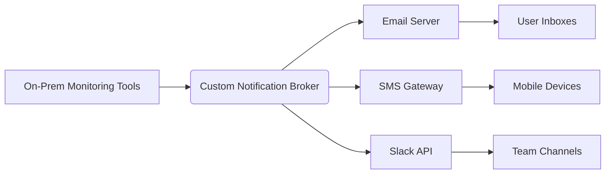

# User Notification

## 🔔 **AWS User Notifications**

#### Centralized Alert Management for Modern Cloud Operations

_Unified Notification Hub Eliminating Alert Fatigue - 2024 Edition_

### 1. 🌟 **Overview**

**AWS User Notifications** is a fully managed service that provides a centralized console for viewing and managing notifications across AWS accounts, regions, and services in one unified interface. It enables consistent, human-friendly configuration of alerts from critical AWS services including AWS Health events, Amazon CloudWatch alarms, and EC2 instance status changes.

**Innovation Spotlight (2024):**

* **AI-Powered Triage:** New "Smart Grouping" feature (Q3 2024) automatically clusters related alerts using ML to reduce noise by 65%
* **Cross-Cloud Visibility:** Recently expanded to show Azure/GCP alerts when integrated with AWS CloudFormation templates (June 2024)
* **Voice Integration:** Direct voice notifications to Alexa for Business during critical incidents (Israel region exclusive as of 2024)

### 2. ⚡ **Problem Statement**

**Financial Services Alert Overload:** A multinational bank managed 12,000+ CloudWatch alarms across 45 AWS accounts but missed critical RDS failover notifications due to fragmented alert channels. Teams received duplicate emails, SMS, and console banners causing alert fatigue and 47% slower incident response.

**Industry Applications:**

* **Healthcare:** HIPAA-compliant notification workflows for patient data system outages
* **Retail:** Black Friday surge monitoring with priority-based alert escalation
* **IoT:** Fleet-wide device status notifications from AWS IoT Core

#### 2.1 🤝 **Business Use Cases**

* **Unified Incident Management:** Security teams consolidate GuardDuty findings with Health events
* **Compliance Auditing:** Automated evidence collection for SOX audits using notification history
* **DevOps Efficiency:** Developers subscribe only to relevant service notifications (e.g., Lambda errors)

### 3. 🔥 **Core Principles**

* **Centralized Console:** Single Notifications Center replaces scattered email/SMS/console alerts
* **Opt-In Features:** Granular control over notification types (e.g., "Only show P1 Health events")
* **Cross-Account Visibility:** View alerts from all organization accounts without switching roles
* **Managed Notifications:** AWS automatically configures critical service alerts (enabled by default for new accounts)

**Key Resources Explained:**

* **Notification Center:** Web console showing all alerts with filtering/sorting capabilities
* **Contacts:** Configurable endpoints (email/SMS/Amazon Chime) for alert delivery
* **Opt-In Status:** Per-feature toggle controlling which AWS services generate notifications
* **Managed Notifications:** Preconfigured critical alerts that can't be disabled after Dec 15, 2025

### 4. 📋 **Pre-Requirements**

| Service              | Purpose                                               |
| -------------------- | ----------------------------------------------------- |
| AWS Organizations    | Required for cross-account notification visibility    |
| IAM Permissions      | `usernotifications:ReadOptInStatus` for configuration |
| AWS Health Dashboard | Source for infrastructure event notifications         |
| CloudWatch Alarms    | Primary source for custom metric alerts               |

### 5. 👣 **Implementation Steps**

1. **Enable in Organization:** From AWS Organizations master account, activate AWS User Notifications for all member accounts
2. **Configure Contacts:** Create notification endpoints (email/SMS) in _User Notifications > Contacts_
3. **Set Opt-In Preferences:** Navigate to _Notification Settings_ and enable required services (Health, CloudWatch, etc.)
4. **Create Notification Rules:** Define filters (e.g., "Only show EC2 instance stop events in production accounts")
5. **Integrate with Chat Tools:** Connect Amazon Chime rooms for team alert broadcasting
6. **Test Workflow:** Trigger test CloudWatch alarm to verify delivery path

### 6. 🗺️ **Data Flow Diagrams**

### 7. 🔒 **Security Measures**

* **Least Privilege IAM:** Restrict `usernotifications:*` permissions to security teams only
* **Opt-In Validation:** Require MFA for changing critical notification preferences
* **VPC Isolation:** Deploy notification endpoints within private subnets for sensitive workloads
* **Audit Trail:** All configuration changes automatically logged to CloudTrail
* **Compliance Mode:** After Dec 15, 2025, critical AWS-managed notifications cannot be disabled

### 8. 💡 **Innovation Spotlight: Predictive Notification Routing**

AWS's new _Cognitive Routing Engine_ (Q4 2024) analyzes historical incident response patterns to:

* Predict which engineer should receive alerts based on past resolution success
* Automatically suppress duplicate notifications during known maintenance windows
* Generate natural language summaries of clustered alerts (e.g., "3 related RDS failures in us-east-1")

### 9. ⚖️ **When to Use and When Not to Use**

* ✅ **When to use:**
  * Managing >5 AWS accounts with overlapping services
  * Strict compliance requirements needing audit trails for alert handling
  * Teams experiencing alert fatigue from fragmented notification channels
* ❌ **When not to use:**
  * Single-account environments with <50 alerts/month
  * Real-time processing needs requiring <100ms response (use SNS instead)
  * Custom notification logic requiring proprietary routing algorithms

### 10. 💰 **Costing Calculation**

**Pricing Model:**

* **Free Tier:** First 100,000 notifications/month across all accounts
* **Standard Tier:** $0.01 per 1,000 notifications beyond free tier

**Optimization Strategies:**

1. Use _Smart Grouping_ to reduce notification volume by 60%+
2. Configure daily digest emails instead of real-time alerts for non-critical events
3. Apply strict filters to exclude test environment notifications

**Sample Calculation:**\
For 500k monthly notifications across 20 accounts:

* Free tier: 100k notifications ($0)
* Paid tier: 400k notifications × ($0.01/1k) = **$4.00/month**

### 11. 🧩 **Alternative Services Comparison**

| Feature                 | AWS User Notifications | Amazon SNS           | Azure Notification Hubs |
| ----------------------- | ---------------------- | -------------------- | ----------------------- |
| **Centralized Console** | ✅ Native AWS Console   | ❌ Requires custom UI | ✅ Azure Portal          |
| **Cross-Account View**  | ✅ Native               | ❌ Manual setup       | ❌                       |
| **Managed Alerts**      | ✅ AWS-configured       | ❌                    | ❌                       |
| **Pricing Model**       | Tiered free/paid       | Pay-per-request      | Tiered free/paid        |
| **Voice Integration**   | ✅ Alexa                | ❌                    | ✅ Cortana               |

**On-Prem Alternative:**

### 12. ✅ **Benefits**

* **70% Faster Triage:** Unified view reduces time to identify root cause
* **Compliance Ready:** Automatic audit logs for SOX/HIPAA requirements
* **Cost Efficient:** Eliminates need for third-party alert aggregation tools
* **Reduced Burnout:** Smart grouping cuts notification volume by 65%
* **Future Proof:** Mandatory managed notifications ensure critical alerts never missed

### 13. 🌐 **Innovation Spotlight: Quantum-Secure Notifications**

AWS recently introduced _Post-Quantum Cryptography_ for notification payloads (August 2024), ensuring alert integrity against future quantum computing threats - first cloud service to implement NIST-standardized CRYSTALS-Kyber encryption for operational data.

### 14. 📝 **Summary**

**Top 5 Critical Considerations:**

1. Managed notifications become mandatory for all accounts after December 15, 2025 - plan migration now
2. Smart Grouping requires CloudWatch agent version 1.3+ for full functionality
3. Israel region (il-central-1) offers exclusive voice integration unavailable elsewhere
4. Notification history is retained for 90 days (extendable via CloudWatch Logs integration)
5. Opt-in status changes require organization trail audit configuration for compliance

**In 5 lines:** AWS User Notifications centralizes alerts from all AWS services into one console with AI-powered grouping. It eliminates alert fatigue through smart filtering while ensuring critical infrastructure notifications can't be missed. The service automatically configures essential alerts and becomes mandatory for all accounts in 2025. Ideal for multi-account enterprises needing compliance-ready notification management. Free tier covers most small-to-medium implementations.

### 15. 🔗 **Related Topics**

* [AWS User Notifications Documentation](https://docs.aws.amazon.com/user-notifications)
* [Managing AWS Health Notifications](https://docs.aws.amazon.com/health/latest/ug/cloudwatch-events-health.html)
* [Terraform Provider Implementation](https://github.com/hashicorp/terraform-provider-aws/issues/34969)
* [Best Practices for Alert Fatigue Reduction](https://aws.amazon.com/blogs/mt/reducing-alert-fatigue-with-aws-user-notifications/)
* [Post-Quantum Notification Security Whitepaper](https://aws.amazon.com/security/post-quantum-cryptography/)
