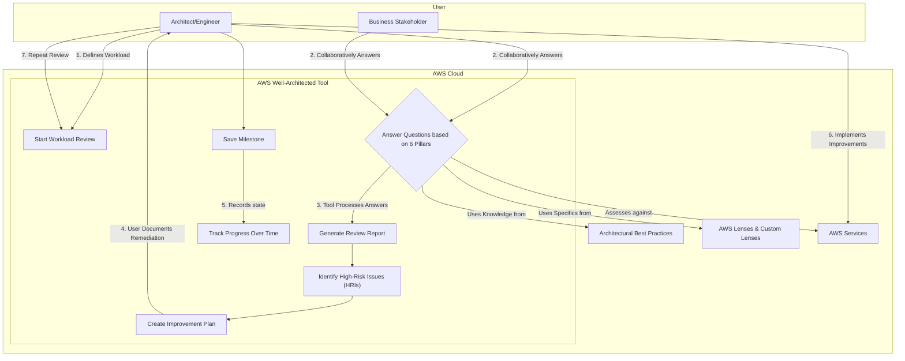
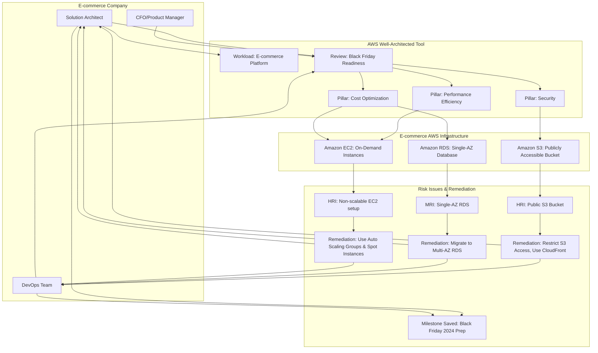
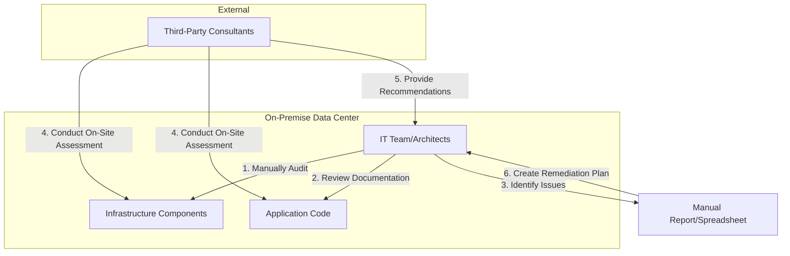

# Well Architect

## Well Architected Tool

### 🌟 Overview: AWS Well-Architected Tool 🛠️

The AWS Well-Architected Tool is a no-cost service in the AWS Management Console that helps you review the state of your workloads and compare them to the latest AWS architectural best practices. It's not a service that you "run" on your infrastructure, but rather a guide and assessment tool to help you build and operate applications more effectively in the cloud.

<figure><figcaption></figcaption></figure>

The tool is based on the **AWS Well-Architected Framework**, which is a comprehensive set of guidelines developed by AWS Solutions Architects. This framework is a living document that has been refined through countless customer engagements and is designed to help you build architectures that are secure, high-performing, resilient, and efficient.

#### 🤖 Innovation Spotlight: Custom Lenses and Profiles

A significant innovation in the AWS Well-Architected Tool is the introduction of **Custom Lenses** and **Profiles**. While the tool comes with default lenses for the main pillars, you can now create your own custom lenses. This allows you to integrate your organization's specific best practices, compliance requirements, or industry-specific standards directly into your architectural reviews. For example, a healthcare company could create a custom lens focused on HIPAA compliance, or a financial institution could build one for PCI DSS. This empowers organizations to tailor the review process to their unique business needs, ensuring a more comprehensive and relevant assessment. Profiles, on the other hand, allow you to define and apply a set of best practices and controls that are specific to a particular type of workload, further streamlining the review process.

### ⚡ Problem Statement

A common challenge for companies migrating to or operating in the cloud is the risk of building "lift-and-shift" architectures that don't fully leverage the benefits of the cloud. This can lead to a variety of issues, such as:

* **Over-provisioned resources:** Wasted money on idle or underutilized servers.
* **Security vulnerabilities:** Misconfigured security groups, public S3 buckets, or weak IAM policies.
* **Single points of failure:** Architectures that are not resilient and can't recover from a service outage.
* **Poor performance:** Applications that are slow and can't handle peak loads efficiently.
* **Operational complexity:** Teams spending excessive time on manual tasks that could be automated.

This can happen to any company, from a small startup to a large enterprise, and across all industries. For instance, an e-commerce platform that experiences a sudden spike in traffic during a flash sale may fail if its architecture isn't built to scale. A financial services firm could face a security breach if its data isn't encrypted at rest and in transit.

#### 🤝 Business Use Cases

* **E-commerce:** An online retailer wants to ensure its Black Friday sale platform can handle a 10x surge in traffic without crashing and without overspending on resources for the rest of the year. The AWS Well-Architected Tool can identify performance bottlenecks and cost-saving opportunities.
* **Healthcare:** A telehealth provider needs to ensure its patient data is stored and processed in a HIPAA-compliant manner. A custom lens focused on healthcare compliance can be used to audit the architecture and flag any deviations from regulatory standards.
* **Media & Entertainment:** A streaming service wants to optimize its video delivery pipeline for low latency and high availability. The tool can help assess the architecture's reliability and performance efficiency, recommending services like CloudFront and a multi-region setup.
* **Financial Services:** A fintech startup building a new payment processing system needs to ensure it meets stringent security and reliability standards. The tool provides a structured way to review and validate the architecture against industry best practices.

### 🔥 Core Principles

The AWS Well-Architected Framework is built on six pillars, each with its own set of design principles and best practices.

* **Operational Excellence:** Focuses on running and monitoring systems, and continually improving processes and procedures. It emphasizes automating changes, responding to events, and managing daily operations.
* **Security:** This pillar is all about protecting information, systems, and assets. Key topics include data confidentiality and integrity, managing user permissions, and establishing controls to detect security events.
* **Reliability:** Ensures a workload performs its intended function correctly and consistently. It focuses on how to recover quickly from failure and adapt to changing demands.
* **Performance Efficiency:** Concentrates on the structured and streamlined allocation of IT and computing resources. It's about selecting the right resource types and sizes, and monitoring performance to maintain efficiency as business needs evolve.
* **Cost Optimization:** The goal here is to avoid unnecessary costs. This includes understanding spending over time, selecting the right resources, and scaling to meet business needs without overspending.
* **Sustainability:** The newest pillar, which focuses on minimizing the environmental impacts of running cloud workloads. It promotes practices like maximizing utilization, adopting more efficient hardware, and leveraging managed services.

**Resources & Terms:**

* **Workload:** A collection of components (e.g., applications, data, infrastructure) that deliver business value.
* **Review:** A process of assessing a workload against the Well-Architected Framework's best practices.
* **Milestone:** A snapshot of a workload's state at a specific point in time, useful for tracking progress.
* **Lenses:** A specific set of questions and best practices tailored to a particular domain or technology (e.g., Serverless Lens, Data Analytics Lens, or your own Custom Lens).
* **High-Risk Issues (HRIs):** Architectural decisions that could lead to a significant negative business impact.
* **Improvement Plan:** A list of recommended actions to address high-risk issues and improve the workload's architecture.

### 📋 Pre-Requirements

Since the AWS Well-Architected Tool is a service within the AWS Management Console, the primary requirements are access-based and informational.

* **AWS Account:** You must have an active AWS account.
* **IAM Permissions:** The IAM user or role performing the review needs appropriate permissions to use the AWS Well-Architected Tool. AWS provides managed policies like `AWSHighlyOptimizedAccess` or `AWSServiceRoleForWellArchitectedTool`. For fine-grained control, you can create a custom IAM policy.
* **Knowledge of Workload:** The reviewer should have a deep understanding of the workload's architecture, including its components, data flow, and business purpose. Having an architectural diagram is highly recommended.
* **Stakeholder Participation:** It's best to involve a diverse team (e.g., solution architects, developers, operations, and business stakeholders) for a comprehensive review.

### 👣 Implementation Steps

Here is a step-by-step guide to conducting a review using the AWS Well-Architected Tool.

1. **Log in to the AWS Management Console:** Navigate to the AWS Well-Architected Tool.
2. **Define a Workload:** Click "Define workload." Provide a name, description, and the owner of the review. Specify the AWS Regions and accounts involved.
3. **Add a Lens:** Select the AWS Well-Architected Framework as the primary lens. You can also add other AWS Lenses (like the Serverless Lens) or a Custom Lens if your organization has created one.
4. **Start the Review:** The tool will present a series of questions categorized by the six pillars. Answer each question based on your workload's current state. For each answer, you can add notes, links to documentation, or even attach architectural diagrams.
5. **Identify High-Risk Issues (HRIs):** As you answer the questions, the tool will automatically identify high-risk and medium-risk issues based on your responses.
6. **Create an Improvement Plan:** After completing the review, the tool generates a report with a prioritized list of HRIs. You can mark issues as "acknowledged" or "resolved" and document your plan to address them.
7. **Save a Milestone:** Once the review is complete, save a milestone. This creates a point-in-time record of your workload's architectural state, allowing you to track progress over time.
8. **Repeat and Refine:** The process is not a one-time event. Re-evaluate your workload regularly, especially after significant architectural changes, to ensure continuous improvement.

### 🗺️ Data Flow Diagram

#### Diagram 1: How the AWS Well-Architected Tool Works

**Explanation:** This diagram illustrates the iterative process of using the AWS Well-Architected Tool. A user (architect or engineer) defines a workload and, often with business stakeholders, answers a series of questions. The tool, using its internal knowledge of best practices and various lenses, processes these answers, generates a report, and highlights high-risk issues. The user then creates an improvement plan, implements the changes, and saves a milestone to track the progress. The cycle repeats, promoting continuous architectural improvement.

#### Diagram 2: Example Use Case - E-commerce Platform Architecture Review

**Explanation:** This diagram shows a specific use case where an e-commerce company uses the tool to prepare for a major sales event. The tool's review process uncovers high-risk issues like a publicly accessible S3 bucket and single-AZ database, and a performance issue with non-scalable EC2 instances. The tool then guides the team to create a remediation plan, which includes adopting best practices like using Auto Scaling Groups, Multi-AZ deployments, and secure S3 configurations.

### 🔒 Security Measures

The AWS Well-Architected Tool itself is a security-enhancing tool, but its use must also follow security best practices.

* **Least Privilege IAM Roles:** Ensure that the IAM user or role used to access the tool has only the permissions necessary to perform the review. Do not grant it administrative access to your entire AWS environment.
* **Authentication and Access Control:** Use Multi-Factor Authentication (MFA) for all IAM users, especially for those with access to the AWS Management Console and the Well-Architected Tool.
* **Data Protection:** Be mindful that the information you input into the tool (workload details, architectural notes) is stored within AWS. While AWS secures this data, ensure you are not adding highly sensitive, personally identifiable information (PII) or secrets.
* **Review Workload Access:** The tool allows sharing reviews with other IAM users or across the organization. Control who can view or modify the review to maintain the confidentiality of your architectural details.

### ⚖️ When to use and when not to use

**✅ When to use:**

* **New Workload Design:** Use it at the beginning of a project to ensure the architecture is well-designed from day one.
* **Regular Audits:** Perform periodic reviews (e.g., quarterly) on existing workloads to identify new issues or track improvements.
* **Major Architectural Changes:** Conduct a review before and after a significant change (e.g., migrating a monolithic application to microservices) to assess the impact.
* **Compliance and Governance:** Leverage the tool and custom lenses to enforce organizational or industry-specific best practices and compliance standards.
* **Cost Optimization:** When you are looking to reduce your AWS bill, the Cost Optimization pillar is invaluable for finding areas of waste.

**❌ When not to use:**

* **Real-time Monitoring:** The tool is not for real-time monitoring or alerting. Use services like Amazon CloudWatch, AWS Trusted Advisor, or third-party tools for continuous operational insights.
* **Automated Remediation:** It does not automatically fix your architecture. It provides recommendations, but the implementation is a manual or automated process carried out by your team.
* **Single AWS Service Review:** For a deep dive into a single service, it's often better to consult the service's specific documentation and best practices guides, although the tool can provide a great starting point.

### 💰 Costing Calculation

The AWS Well-Architected Tool itself is **free of charge**. There is no additional cost for using the service to perform a review. You only pay for the underlying AWS resources that you are running and that the tool helps you optimize.

* **How it is calculated?** The tool's cost is effectively zero. The value comes from the potential cost savings and other benefits it helps you achieve.
* **Efficient way of handling this service:**
  * **Proactive Reviews:** Regularly using the tool, especially during the design phase, can prevent costly architectural mistakes.
  * **Prioritize HRIs:** Focus on resolving the high-risk issues identified in the review. These often have the most significant impact on cost, security, or reliability.
  * **Automate Improvements:** Use the recommendations from the tool to drive automation. For example, if the tool recommends using Auto Scaling, automate the setup using AWS CloudFormation or a CI/CD pipeline.
* **Sample Calculations:** Since the tool is free, the "calculation" is more about Return on Investment (ROI). For example:
  * **Scenario:** A company spends an average of $5,000 per month on a production workload. A Well-Architected review identifies an opportunity to use a different instance type and leverage reserved instances, which could lead to a 20% cost reduction.
  * **Potential Savings:** $5,000 \* 20% = $1,000 per month.
  * **ROI:** The time and effort spent on the review (which has no direct cost) results in a significant and ongoing monthly saving.

### 🧩 Alternative services - <mark style="color:$warning;">**AWS/Azure/GCP/On-Premise**</mark>

| Service                             | AWS                                                                                                                              | Azure                                                                                                                                                                                         | GCP                                                                                                                                                                                        | On-Premise                                                                                                                                                                      |
| ----------------------------------- | -------------------------------------------------------------------------------------------------------------------------------- | --------------------------------------------------------------------------------------------------------------------------------------------------------------------------------------------- | ------------------------------------------------------------------------------------------------------------------------------------------------------------------------------------------ | ------------------------------------------------------------------------------------------------------------------------------------------------------------------------------- |
| **Well-Architected Framework Tool** | AWS Well-Architected Tool                                                                                                        | Azure Advisor                                                                                                                                                                                 | Cloud Architecture Center                                                                                                                                                                  | **Manual Audit/Consulting**                                                                                                                                                     |
| **Key Comparison/Difference**       | **Free, structured review** based on 6 pillars. Integrates with other AWS services like Trusted Advisor. Supports custom lenses. | **Automated recommendations** and a dashboard focused on 5 pillars (Cost, Security, Reliability, Performance, Operational Excellence). More proactive and less of a structured manual review. | **Comprehensive documentation** and best practices for building on Google Cloud, often presented as guides and design patterns. Less of a dedicated "tool" and more of a resource library. | **Consultant-led, manual process** of auditing and assessing infrastructure. Can be expensive and is often a point-in-time activity, lacking continuous improvement mechanisms. |

**On-Premise Alternative Data Flow Diagram:**

**Explanation:** This diagram shows a traditional, manual on-premise approach. It's often a labor-intensive and expensive process that relies on the internal IT team or external consultants to audit the infrastructure and application code. The findings are documented in a manual report, which is then used to create a remediation plan. This process lacks the speed, consistency, and continuous feedback loop of a cloud-native tool.

### ✅ Benefits

* **Cost Savings:** Identifies opportunities to right-size resources, eliminate waste, and leverage more cost-effective services.
* **Increased Security:** Helps uncover and remediate security vulnerabilities by enforcing a strong security posture.
* **Improved Reliability:** Promotes building fault-tolerant and resilient systems that can handle failures gracefully.
* **Enhanced Performance:** Provides guidance on optimizing your architecture for higher performance and scalability.
* **Operational Efficiency:** Encourages automation and "operations as code," reducing manual toil and the risk of human error.
* **Consistency:** Provides a consistent framework for evaluating all workloads, making it easier to maintain architectural standards across an organization.
* **Continuous Improvement:** Facilitates an iterative process of review, remediation, and re-evaluation, fostering a culture of continuous improvement.

### 📝 Summary

The AWS Well-Architected Tool is a free, powerful service that helps you evaluate your cloud workloads against the six pillars of the AWS Well-Architected Framework: Operational Excellence, Security, Reliability, Performance Efficiency, Cost Optimization, and Sustainability. It provides a structured, question-based review process that uncovers high-risk issues and generates a clear improvement plan. The tool is not an automated fix but a guided consultation service that empowers your teams to build better, more resilient, and cost-effective cloud architectures. It's an essential resource for anyone serious about building professionally and efficiently on AWS.

<strong>Top 5-10 things to keep in mind</strong>

1. **It's a process, not a product:** The value is in the review process and the subsequent actions you take.
2. **It's free:** There's no cost to use the tool itself, only for the underlying AWS resources.
3. **It's based on the Framework:** The tool is the operationalization of the Well-Architected Framework's principles.
4. **Custom Lenses are powerful:** Use them to tailor the review to your specific business and compliance needs.
5. **Use it iteratively:** The best results come from regular, not one-off, reviews.
6. **It's a team sport:** Involve different stakeholders for a comprehensive review.
7. **Focus on HRIs:** Prioritize and address the high-risk issues first for the greatest impact.

***

### 🔗 Related Topics

* [AWS Well-Architected Framework Whitepaper](https://aws.amazon.com/architecture/well-architected/)
* [AWS Well-Architected Tool User Guide](https://www.google.com/search?q=https://docs.aws.amazon.com/wellarchitected/latest/userguide/what-is-wa-tool.html)
* [AWS Trusted Advisor](https://www.google.com/search?q=https://aws.amazon.com/premiumsupport/knowledge-center/trusted-advisor-checks/)
* [AWS CloudFormation](https://aws.amazon.com/cloudformation/)
* [AWS Cost Explorer](https://aws.amazon.com/aws-cost-management/aws-cost-explorer/)
* [AWS Cost Explorer](https://aws.amazon.com/aws-cost-management/aws-cost-explorer/)
