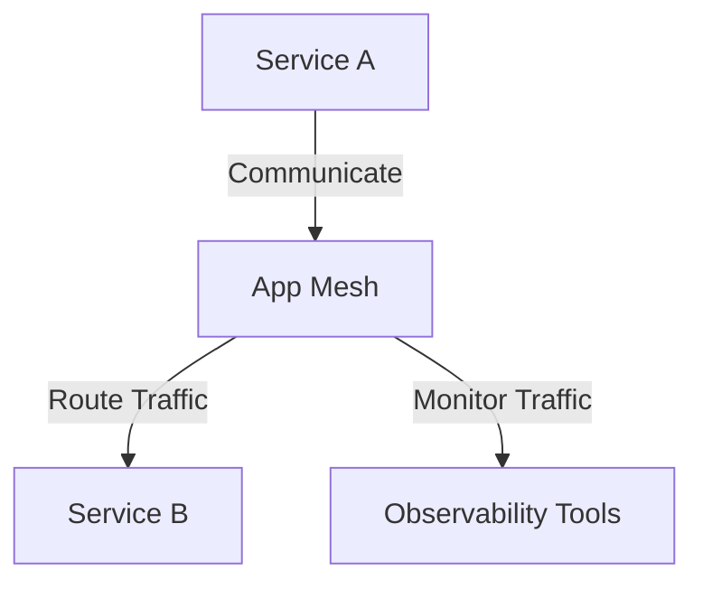
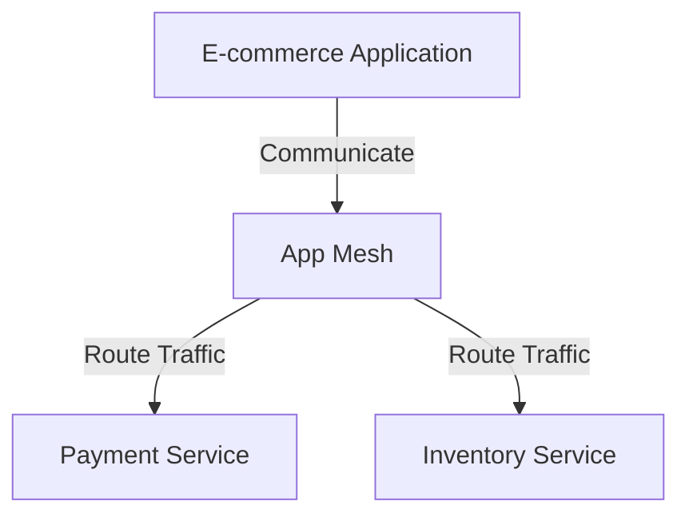

# App Mesh

## AWS App Mesh

### 🌟 Overview

**AWS App Mesh** is a service mesh that provides application-level networking to make it easy for your services to communicate with each other across multiple computing environments. It standardizes how your services communicate, giving you end-to-end visibility and ensuring high availability for your applications.

**🤖 Innovation Spotlight** As of today, AWS App Mesh has introduced several innovative features, including enhanced observability with detailed metrics and logs, improved integration with AWS services like Amazon ECS and Amazon EKS, and support for custom routing and traffic management.

### ⚡ Problem Statement

Consider a scenario where a company needs to manage and monitor communications between microservices in a complex application environment. They require a solution that provides a consistent way to route traffic, monitor service health, and enforce security policies.

For example, an e-commerce company wants to ensure that their microservices can communicate securely and efficiently, with the ability to monitor and manage traffic flows in real-time.

### 🤝 Business Use Cases

1. **Microservices Management**: Managing and monitoring communications between microservices.
2. **Traffic Routing**: Implementing custom routing and traffic management policies.
3. **Service Discovery**: Automatically discovering and configuring services within your application.
4. **Security**: Enforcing security policies and managing certificates for service-to-service communication.

### 🔥 Core Principles

**Foundational Concepts:**

* **Service Mesh**: App Mesh is a service mesh that provides application-level networking.
* **Observability**: App Mesh provides detailed metrics and logs for end-to-end visibility.
* **Traffic Management**: App Mesh allows you to implement custom routing and traffic management policies.
* **Security**: App Mesh enforces security policies and manages certificates for service-to-service communication.

**Resource Services Terms:**

* **Mesh**: A logical boundary for service-to-service communication.
* **Virtual Node**: A logical representation of a service within a mesh.
* **Virtual Router**: A logical entity that routes traffic between virtual nodes.
* **Virtual Service**: A logical representation of a service that can be accessed by virtual nodes.

### 📋 Pre-Requirements

1. **AWS Account**: You need an AWS account to create and manage App Mesh resources.
2. **AWS CLI**: The AWS Command Line Interface (CLI) is useful for managing App Mesh resources from the command line.
3. **AWS SDKs**: The AWS Software Development Kits (SDKs) are useful for integrating App Mesh with your applications.
4. **IAM Permissions**: Proper IAM permissions are required to access and manage App Mesh resources.

### 👣 Implementation Steps

1. **Create a Mesh**:
   * Log in to the AWS Management Console.
   * Navigate to the App Mesh service.
   * Click on "Create Mesh" and follow the prompts to configure your mesh.
2. **Define Virtual Nodes**:
   * Define virtual nodes to represent your services within the mesh.
3. **Configure Virtual Routers**:
   * Configure virtual routers to route traffic between virtual nodes.
4. **Set Up Virtual Services**:
   * Set up virtual services to represent the services that can be accessed by virtual nodes.
5. **Monitor and Manage**:
   * Use the AWS Management Console to monitor and manage your App Mesh resources.

### 🗺️ Data Flow Diagram

**Diagram 1: How App Mesh Works**

**Diagram 2: Example Use Case**

### 🔒 Security Measures

1. **IAM Policies**: Use IAM policies to manage access to your App Mesh resources.
2. **Network Security**: Use network security groups and firewalls to control access to your App Mesh resources.
3. **Encryption in Transit**: Enable encryption in transit to protect your data as it travels over the network.
4. **Certificate Management**: Use App Mesh to manage certificates for service-to-service communication.
5. **Regular Audits**: Regularly audit your App Mesh resources to ensure they are secure and compliant.

### 💰 Costing Calculation

**How it is calculated?** App Mesh pricing is based on the number of API calls and the amount of data processed. You pay for the API calls you make and the data processed through your mesh.

**Efficient way of handling this service:**

* Use App Mesh for applications that require detailed observability and custom traffic management.
* Monitor your usage with Amazon CloudWatch to identify opportunities for cost savings.

**Sample Calculations:**

* **API Call Cost**: Suppose you make 1,000,000 API calls, which cost $0.10 per 1,000 calls. The cost would be approximately $100 per month.
* **Data Processing Cost**: Suppose you process 100 GB of data through your mesh, which costs $0.01 per GB. The cost would be approximately $1 per month.

### 🧩 Alternative Services in AWS/Azure/GCP/On-Premise

| Service                   | Provider   | Key Differences                                                             |
| ------------------------- | ---------- | --------------------------------------------------------------------------- |
| Azure Service Fabric Mesh | Azure      | A service mesh that provides application-level networking for microservices |
| Google Cloud Service Mesh | GCP        | A service mesh that provides application-level networking for microservices |
| On-Premise Service Mesh   | On-Premise | Local service mesh solutions with full control over data                    |

### ✅ Benefits

1. **Service Mesh**: App Mesh is a service mesh that provides application-level networking.
2. **Observability**: App Mesh provides detailed metrics and logs for end-to-end visibility.
3. **Traffic Management**: App Mesh allows you to implement custom routing and traffic management policies.
4. **Security**: App Mesh enforces security policies and manages certificates for service-to-service communication.
5. **Integration**: App Mesh integrates with AWS services like Amazon ECS and Amazon EKS.

### 📝 Summary

**Top 5 Points to Keep in Mind:**

1. App Mesh is a service mesh that provides application-level networking to make it easy for your services to communicate with each other across multiple computing environments.
2. App Mesh provides detailed metrics and logs for end-to-end visibility.
3. App Mesh pricing is based on the number of API calls and the amount of data processed.
4. App Mesh allows you to implement custom routing and traffic management policies.
5. App Mesh enforces security policies and manages certificates for service-to-service communication.

**In Short:** AWS App Mesh is a service mesh that provides application-level networking to make it easy for your services to communicate with each other across multiple computing environments. It standardizes how your services communicate, giving you end-to-end visibility and ensuring high availability for your applications.

### 🔗 Related Topics

* [AWS App Mesh Documentation](https://docs.aws.amazon.com/app-mesh/latest/userguide/what-is-app-mesh.html)
* [App Mesh Best Practices](https://docs.aws.amazon.com/app-mesh/latest/userguide/best-practices.html)
* [App Mesh Pricing](https://aws.amazon.com/app-mesh/pricing/)
