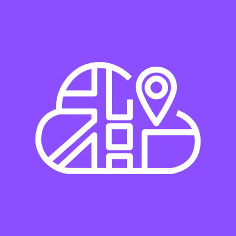
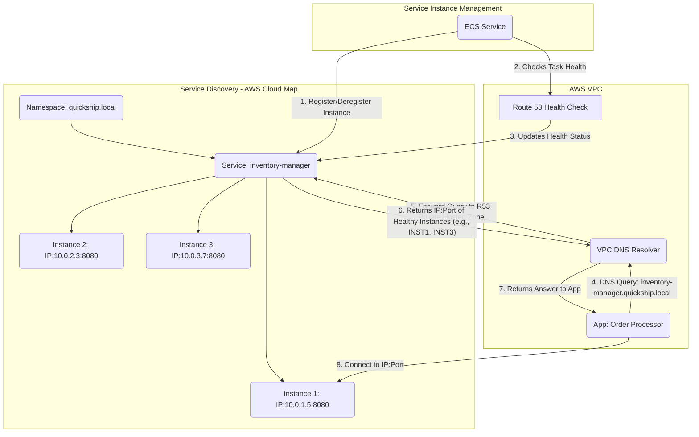
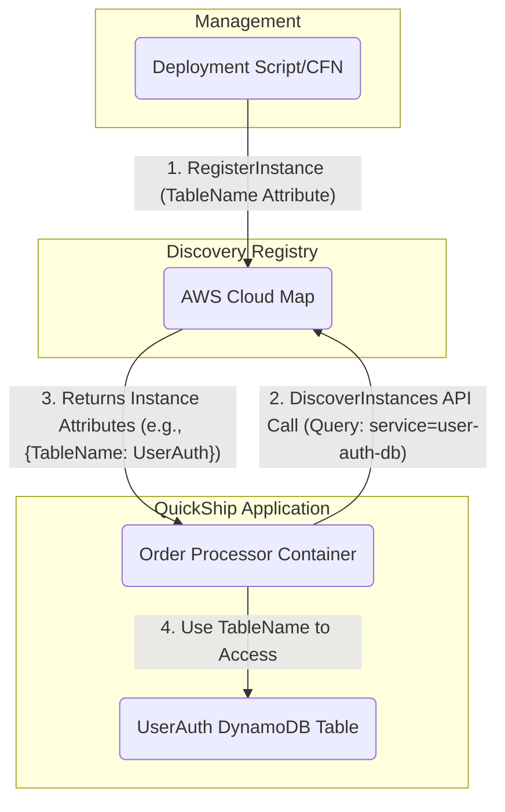
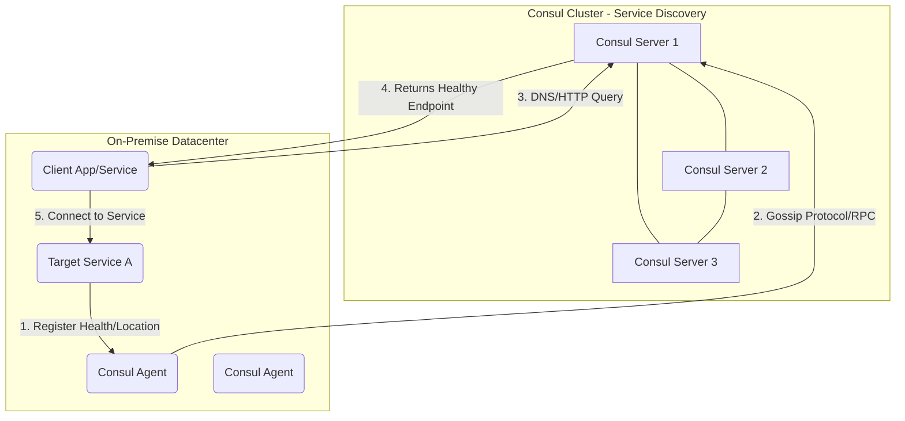

# Cloud Map

## AWS Cloud Map 🗺️

### 🌟 Overview

**AWS Cloud Map** is a fully managed cloud resource discovery service. In modern, dynamic application environments—especially those based on **microservices** and **containers**—resources (like database instances, API endpoints, queues, and container tasks) are constantly scaling up, scaling down, or changing IP addresses. Cloud Map solves the critical challenge of **service discovery** by acting as a single, authoritative registry that maintains the current locations of all your application resources.

<figure><figcaption></figcaption></figure>

Instead of hard-coding service endpoints or implementing complex, self-managed discovery mechanisms (like Consul or ZooKeeper), your application components can simply query Cloud Map using **AWS APIs** or standard **DNS queries** to find the endpoints of their dependencies. It supports the registration of virtually any cloud resource, including Amazon EC2 instances, ECS/EKS tasks, Amazon S3 buckets, DynamoDB tables, and custom on-premises resources.

#### 🤖 Innovation Spotlight: Service Mesh Integration

The most impactful innovation for Cloud Map today lies in its deep integration with **AWS App Mesh** (a service mesh for monitoring and controlling microservices).

* **Intelligent Traffic Routing:** Cloud Map provides the backend service registry for App Mesh. This allows App Mesh to dynamically discover and route traffic to service instances based on their health and specified attributes (like version or deployment stage), enabling powerful features like **blue/green deployments** and **A/B testing** without changing application code.
* **Observability:** By leveraging Cloud Map as the source of truth, App Mesh gains immediate visibility into all service instances, ensuring that metrics and logs are accurately collected from all active endpoints.
* **Attribute-Based Discovery:** The ability to register instances with custom attributes (e.g., `version=v2`, `environment=staging`) allows for highly granular, context-aware service discovery, which is critical for complex, evolving microservice architectures.

***

### ⚡ Problem Statement

A high-growth e-commerce company, **"QuickShip,"** is migrating its monolithic application to a **microservices architecture** using **Amazon ECS (Elastic Container Service)** and **AWS Fargate**.

The application consists of services like:

1. **`OrderProcessor`** (a Fargate service).
2. **`InventoryManager`** (a separate Fargate service).
3. **`UserAuthDB`** (an Amazon DynamoDB table).

When the `OrderProcessor` needs to check stock, it must connect to the `InventoryManager` service. As `InventoryManager` scales up and down based on traffic, its container IP addresses change frequently. The developers are tired of manually updating configuration files, and using an Application Load Balancer (ALB) for every internal service-to-service call is overly complex and expensive. They need a simple, centralized, and reliable way for `OrderProcessor` to consistently find the current, healthy location of `InventoryManager` and `UserAuthDB` without hardcoding IPs or hostnames.

#### 🤝 Business Use Cases

| Industry                  | Application                                         | AWS Cloud Map Role                                                                                                          |
| ------------------------- | --------------------------------------------------- | --------------------------------------------------------------------------------------------------------------------------- |
| **E-commerce**            | Microservices communication for checkout/inventory. | Central registry for dynamically discovering backend microservices (e.g., payment service finds shipping service).          |
| **Financial Services**    | Trading platform backend.                           | Dynamic discovery of low-latency data feeders or micro-transaction processors in a high-frequency trading environment.      |
| **Healthcare**            | Electronic Health Records (EHR) system.             | Locating different API versions or environments (e.g., production EHR API vs. sandbox testing API) using custom attributes. |
| **Media & Entertainment** | Video transcoding pipeline.                         | Registering and discovering stateless worker services (e.g., transcode workers) to distribute tasks efficiently.            |

***

### 🔥 Core Principles

AWS Cloud Map's functionality is built around three core resource types:

1. **Namespace 🏷️:**
   * **Concept:** A logical grouping of services, typically representing an application or an environment (e.g., `quickship.com`, `dev.quickship.com`). It provides an isolation boundary.
   * **Types:**
     * **DNS Namespace:** Allows resources to be discovered using standard DNS queries. Can be **Public** (creates a Route 53 Public Hosted Zone) or **Private** (creates a Route 53 Private Hosted Zone for use within a VPC).
     * **API Namespace:** Allows resources to be discovered only through the `DiscoverInstances` API call. Used for non-IP resources like S3 buckets or when you need richer attribute filtering.
2. **Service 🛠️:**
   * **Concept:** A template defining a specific type of application component within a Namespace (e.g., `InventoryManager`, `OrderProcessor`). It holds the configuration for DNS records, health checks, and a set of service instances.
   * **Resources/Terms:**
     * **Record Type:** Specifies the DNS record created for discovery (`A`, `AAAA`, `CNAME`, `SRV`). For internal microservices, `SRV` (Service Record, includes port) is often preferred.
     * **Routing Policy:** Determines how multiple healthy instances are returned (e.g., `Weighted` for traffic distribution, `Multivalue Answer` for simple DNS load balancing).
     * **Health Checks:** Configured to monitor the health of registered instances, ensuring only healthy endpoints are returned during discovery.
3. **Service Instance 📍:**
   * **Concept:** A specific, discoverable endpoint of a Service (e.g., an individual container, EC2 instance, or a DynamoDB ARN). It is registered with the service.
   * **Registration Details:** Includes the resource's IP address and port (for DNS-based discovery) or a custom resource identifier (e.g., ARN for an S3 bucket) and a set of **custom attributes** (key-value pairs) for advanced filtering.

***

### 📋 Pre-Requirements

| Service/Tool        | Purpose                                                                                                                    |
| ------------------- | -------------------------------------------------------------------------------------------------------------------------- |
| **Amazon VPC**      | Provides the network context for private DNS-based discovery. The Private DNS Namespace is associated with a VPC.          |
| **Amazon ECS/EKS**  | Often the compute platform whose dynamic tasks/pods are automatically registered/deregistered with Cloud Map.              |
| **IAM**             | To create roles with permissions (`servicediscovery:*`) to create namespaces, services, and register/deregister instances. |
| **AWS SDK/CLI**     | Used by applications or orchestration services (like ECS) to call the `RegisterInstance` and `DiscoverInstances` APIs.     |
| **Amazon Route 53** | Utilized behind the scenes for DNS-based discovery. Cloud Map manages the necessary Hosted Zones.                          |

***

### 👣 Implementation Steps

This guide focuses on using Cloud Map for service discovery in an Amazon ECS/Fargate microservices environment.

1. **Create an AWS Cloud Map Private DNS Namespace:**
   * Go to the Cloud Map console and choose **Create namespace**.
   * Select **Private DNS Namespace**.
   * Name it (e.g., `quickship.local`) and select the VPC where your ECS services run.
2. **Create a Service for `InventoryManager`:**
   * In the new namespace, choose **Create service**.
   * Name it (e.g., `inventory-manager`).
   * Configure service discovery: Set **Record type** to **SRV** (to include port information) and choose an appropriate **Routing policy** (e.g., **Multivalue Answer**).
   * Configure a **Health check** (e.g., an HTTP path check on the container port).
3. **Integrate ECS/Fargate with Cloud Map:**
   * When defining the `InventoryManager` **ECS Service**, enable **Service discovery (optional)**.
   * Select the namespace (`quickship.local`) and the service (`inventory-manager`).
   * ECS automatically handles the `RegisterInstance` and `DeregisterInstance` API calls for every task, updating the IP and port in Cloud Map as tasks scale.
4. **Register Non-Container Resources (e.g., DynamoDB):**
   * Create an **API Namespace** (if you need to discover non-IP resources outside the DNS system). _For this example, we'll stick to a simple API service instance registration in the existing private DNS namespace for simplicity._
   * Create a service named `user-auth-db` with discovery via **API calls**.
   *   Call the `RegisterInstance` API using the AWS CLI or SDK:

       ```bash
       aws servicediscovery register-instance \
         --service-id <service-id-for-user-auth-db> \
         --instance-id user-auth-prod-01 \
         --attributes tablename=UserAuth,environment=prod
       ```
5. **Implement Service Discovery in `OrderProcessor`:**
   * The `OrderProcessor` application code can now use the fully qualified domain name (FQDN) to find the `InventoryManager` service:
     * **DNS Query:** Query `inventory-manager.quickship.local`. The response returns the healthy IP(s) and port(s) (due to the SRV record).
     *   **API Query (for DynamoDB):** Call the `DiscoverInstances` API:

         ```python
         # Python SDK example for DynamoDB
         response = cloudmap_client.discover_instances(
             NamespaceName='quickship.local',
             ServiceName='user-auth-db',
             QueryParameters={'environment': 'prod'}
         )
         # The code extracts the DynamoDB table name from the attributes
         table_name = response['Instances'][0]['Attributes']['tablename']
         ```

***

### 🗺️ Data Flow Diagram

#### Diagram 1: How AWS Cloud Map Works (DNS Discovery)



#### Diagram 2: QuickShip E-commerce Usecase (API Discovery for Database)



***

### 🔒 Security Measures

* **Least Privilege IAM Roles:** The IAM role used by compute services (like ECS tasks) to register/deregister instances should only have permissions for the specific `Namespace` and `Service` ARN it manages. For instance, restrict `servicediscovery:RegisterInstance` to only the `inventory-manager` service.
* **Private DNS Namespaces:** Always use **Private DNS Namespaces** for internal microservices to ensure they are not discoverable from the public internet, restricting access to only within your VPC.
* **VPC Security Groups:** Use **Security Groups** to control traffic flow between discovered instances. The `OrderProcessor` security group should only allow egress traffic to the `InventoryManager` security group's port.
* **Attribute Filtering:** Use custom attributes (e.g., `environment=prod`) to ensure clients only discover resources in the correct deployment stage, preventing staging services from being used in production environments.
* **Monitoring and Logging:** Enable AWS CloudTrail logging for Cloud Map API calls (`RegisterInstance`, `DeregisterInstance`, `DiscoverInstances`) to audit who accessed and modified the service registry.

### 📦 AWS Cloud Map

***

### ⚖️ When to use and when not to use

#### ✅ When to use

* **Microservices on Containers (ECS/EKS/Fargate):** When you need a reliable, native mechanism for services to find each other as container tasks are spun up and down dynamically.
* **Hybrid Environments:** To create a unified registry for both AWS-hosted services and on-premises resources, allowing cloud applications to discover and connect to legacy systems.
* **Attribute-Based Routing:** When you need a service consumer to filter endpoints based on metadata (e.g., find a service with `version=v3` or `region=us-east-1`).
* **Need for DNS & API Discovery:** When you have a mix of applications that prefer standard DNS lookup (for simplicity) and those that need the rich, filtered responses of an API call.

#### ❌ When not to use

* **Simple Applications with Few Services:** For a monolithic application or one with a very small, static number of services, hard-coding or using an Elastic Load Balancer (ELB) directly might be simpler and cheaper.
* **Public-Facing Discovery:** Cloud Map is primarily for _internal_ service discovery. For exposing services publicly, use an **Application Load Balancer (ALB)** or **Amazon API Gateway**.
* **Advanced Load Balancing Logic:** Cloud Map provides basic DNS routing policies (Weighted, Multivalue), but for complex L7 traffic routing (path-based, header-based), an **ALB** or **AWS App Mesh** is required.

***

### 💰 Costing Calculation

AWS Cloud Map has a pay-as-you-go pricing model based on three main components:

1. **Service Registry Charge:** You pay per **registered resource (service instance)** per month.
   * **Rate:** **$0.10 per registered resource/month** (for instances not registered via ECS Service Discovery).
   * _Note: Instances registered via **Amazon ECS Service Discovery are free** of this monthly registry charge._
2. **Discovery API Call Charges:** You pay per million `DiscoverInstances` and `DiscoverInstancesRevision` API calls.
   * **Rate:** **$1.00 per million calls.**
3. **Associated Amazon Route 53 Charges:** If you use DNS-based discovery, you incur standard Route 53 charges for:
   * **Hosted Zones:** For the Private/Public DNS Namespace ($0.50 per month for the first 25 private hosted zones).
   * **DNS Queries:** For lookups against the records Cloud Map creates ($0.40 per million queries for the first billion).

#### Efficient Way of Handling This Service

* **Leverage ECS Integration:** By using ECS Service Discovery, you eliminate the $0.10/month registry charge for container tasks, resulting in significant savings for highly dynamic, containerized environments.
* **Use API Discovery for Low-Frequency Lookups:** For static resources or resources that change rarely (like a DynamoDB table ARN), use **API-based discovery**. The application retrieves the ARN once at startup, caches it, and avoids continuous DNS queries.
* **Optimize DNS TTL:** For DNS namespaces, set a reasonable **Time-to-Live (TTL)** value on the DNS records. A high TTL reduces the number of queries (saving Route 53 query costs) but increases the time it takes for a client to detect a failed/deregistered service instance. Balance latency and cost.

#### Sample Calculation

**Scenario: A microservices application running 50 average EC2 instances, a single API-only DynamoDB table, and all use DNS-based discovery.**

| Component                        | Quantity                            | Rate           | Monthly Cost  |
| -------------------------------- | ----------------------------------- | -------------- | ------------- |
| **Service Registry (EC2)**       | 50 instances                        | $0.10/instance | $5.00         |
| **Service Registry (DynamoDB)**  | 1 instance                          | $0.10/instance | $0.10         |
| **Private Hosted Zone (R53)**    | 1 Zone                              | $0.50/zone     | $0.50         |
| **DNS Queries (Estimate)**       | 10,000 queries/day (approx 0.3M/mo) | $0.40/million  | $0.12         |
| **Total Estimated Monthly Cost** | -                                   | -              | \*\*$5.72\*\* |

_(Note: API calls for discovery are not included as all is assumed to be DNS. If you switched the 50 EC2 instances to ECS, the Service Registry charge would drop to $0.10 total, and the total cost would be \~\*\*$0.72_\* plus R53 DNS query costs.)\*

***

### 🧩 Alternative services in AWS/Azure/GCP/On-Premise

| Platform        | Alternative Service                 | Key Comparison/Difference                                                                                                                                                 |
| --------------- | ----------------------------------- | ------------------------------------------------------------------------------------------------------------------------------------------------------------------------- |
| **AWS (Other)** | **Amazon Route 53**                 | Route 53 is the underlying DNS layer. Cloud Map _manages_ the Hosted Zones/Records; it adds the instance registration, health checking, and API-based discovery features. |
| **Azure**       | **Azure Private DNS Zones**         | Provides DNS resolution but lacks the automatic service instance registration, API discovery, and health-check integration that Cloud Map offers natively.                |
| **GCP**         | **Google Cloud Service Directory**  | Direct competitor. Provides a unified registry for services (VPC-based and external) and supports both DNS and HTTP/gRPC API resolution.                                  |
| **On-Premise**  | **HashiCorp Consul**                | Very powerful, feature-rich service mesh/discovery solution. Requires significant overhead to install, configure, and maintain the Consul server cluster.                 |
| **On-Premise**  | **Apache ZooKeeper/Netflix Eureka** | Mature but often legacy service discovery solutions. Require high operational burden for setup, maintenance, and cluster management.                                      |

#### On-Premise Alternative Data Flow (HashiCorp Consul)



***

### ✅ Benefits

* **Enhanced Reliability:** Only healthy service instances are returned to the client application due to integrated health checks, increasing application availability.
* **Reduced Operational Complexity:** Eliminates the need to manually update service configurations or manage a third-party service discovery cluster (like Consul or ZooKeeper).
* **Dynamic Scalability:** Seamlessly integrates with container orchestrators (ECS, EKS) to automatically update the service registry as services scale up or down.
* **Flexibility (DNS/API):** Supports both standard DNS lookups for simple, cross-platform needs and feature-rich API calls for filtered, attribute-based discovery.
* **Cost Efficiency:** Using ECS Service Discovery eliminates the registry fee for container-based instances, leading to very low operating costs.

### 🚀 - Seamless Cross-VPC/Cross-Region Discovery

Cloud Map simplifies connecting services across different VPCs or even different AWS regions. While cross-VPC communication typically requires **VPC Peering** or **AWS Transit Gateway**, Cloud Map's ability to maintain a central registry and utilize private DNS makes the _discovery_ part trivial. A service in VPC-A can query the Cloud Map Private DNS Namespace (if the Resolver is correctly configured via Transit Gateway/Peering) and get the IP of a healthy instance in VPC-B, greatly simplifying multi-VPC microservice networking.

***

### 📝 Summary

AWS Cloud Map is an essential service for modern, distributed cloud applications, acting as a **centralized, dynamic map** of all your application resources. It keeps track of the constantly changing network locations and health of your microservices, containers, and other cloud assets, enabling client services to effortlessly and reliably discover their dependencies via standard DNS queries or the AWS API.

**Top 10 Key Takeaways:**

1. **Service Discovery:** Its primary role is to provide a single source of truth for all application resource locations.
2. **DNS & API:** Supports two main discovery methods: standard DNS and the feature-rich `DiscoverInstances` API.
3. **Namespaces:** Used for logical isolation, typically representing an application or environment. Can be Public or Private DNS, or API-only.
4. **ECS/EKS Integration:** Tightly integrated with container services for automatic instance registration/deregistration.
5. **Cost Savings with ECS:** ECS-registered instances are exempt from the monthly registry fee.
6. **Health Checks:** Integrates with Route 53 health checks to ensure only healthy endpoints are returned.
7. **Custom Attributes:** Allows for advanced, context-aware discovery and filtering (e.g., finding the 'v2' version of a service).
8. **Serverless Glue:** Can register non-IP resources like DynamoDB tables or SQS queues, acting as a central link for serverless components.
9. **App Mesh Foundation:** Provides the service registry necessary for advanced traffic routing and observability with AWS App Mesh.
10. **Scalable & Low Operational Overhead:** Fully managed, eliminating the undifferentiated heavy lifting of self-managed discovery solutions.

In short, **AWS Cloud Map** is a managed service registry that allows applications to use custom, logical names to find the dynamic network location of any backend resource—be it a container, a database, or an API—using either DNS or API calls, significantly simplifying microservices communication and improving application resilience.

***

### 🔗 Related Topics

* **AWS App Mesh:** For advanced service-to-service communication, traffic control, and observability layered on top of Cloud Map's registry.
* **Amazon ECS Service Discovery:** The native integration within ECS that leverages Cloud Map.
* **Amazon Route 53:** The underlying DNS service used by Cloud Map for DNS-based discovery.
* **Microservices Architecture:** General design pattern that Cloud Map is an essential enabler for.
