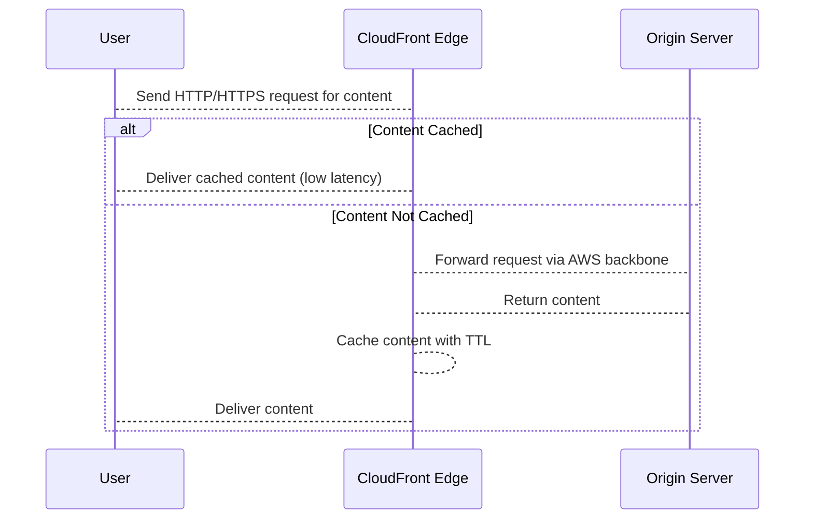
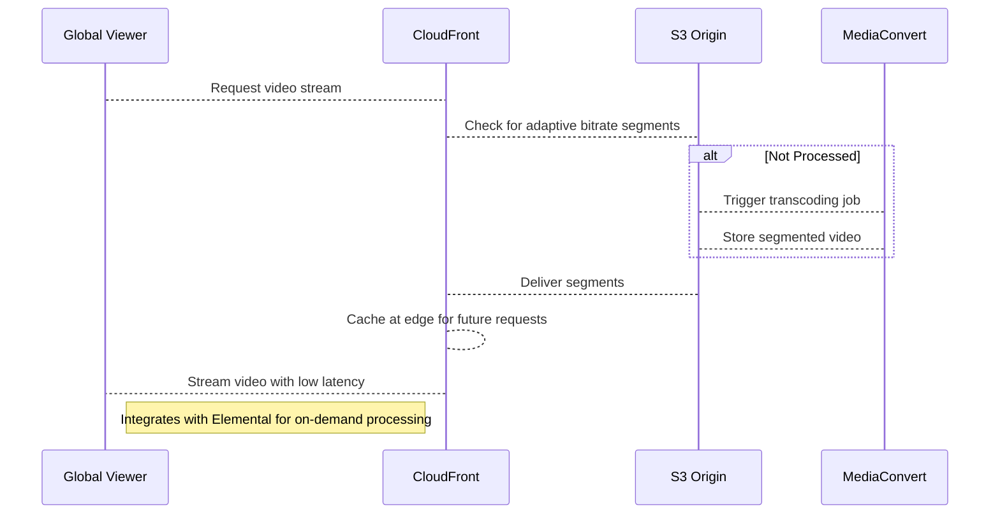
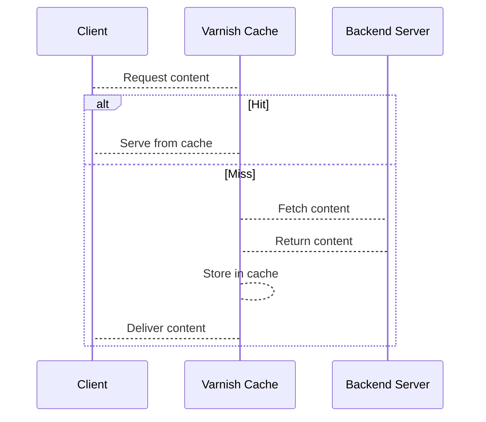

# CloudFront

## Amazon CloudFront

### **🌟 Overview**

Amazon CloudFront is a fast, secure, and highly programmable content delivery network (CDN) service from AWS that accelerates the delivery of websites, APIs, video content, and other web assets to users globally. It integrates seamlessly with other AWS services like Amazon S3, EC2, and Lambda, using a vast network of over 600 edge locations across 200+ cities in 100+ countries to cache content closer to end-users, reducing latency and improving performance. CloudFront supports both static and dynamic content, handles HTTPS traffic, and provides real-time monitoring via Amazon CloudWatch. It also offers advanced features like origin shielding for high availability and continuous deployment for seamless updates.

<figure><figcaption></figcaption></figure>

**Deep Dive**: At its core, CloudFront operates on a request-response model where user requests are routed to the optimal edge location via AWS’s global backbone. Content is cached based on configurable policies, with automatic invalidation and compression. It supports HTTP/3 for faster connections and integrates with AWS Shield for DDoS protection. For developers, it allows custom code execution at the edge via Lambda@Edge or CloudFront Functions, enabling personalization and security logic without full server management. Pricing is pay-as-you-go, with no upfront costs, focusing on data transfer out and requests processed.

🤖 **Innovation Spotlight**: As of September 2025, CloudFront has introduced a streamlined user-friendly interface for easier configuration of distributions and security settings, simplifying web application delivery. Additionally, support for HTTPS DNS alias records in Route 53 enhances DNS security and performance by returning protocol details with IP addresses, reducing lookup times. Other updates include additional geolocation headers for more granular cache and origin policies, and tighter integration with AWS WAF’s simplified experience for web security management.

### **⚡ Problem Statement**

Imagine a global e-commerce platform experiencing high latency for users in Asia and Europe when accessing product images and videos hosted on a US-based server, leading to cart abandonment and lost revenue during peak sales. CloudFront solves this by caching content at edge locations, delivering it from the nearest POP, and reducing load times from seconds to milliseconds.

Industries/Applications: E-commerce (e.g., fast image loading for online stores like Amazon), Media & Entertainment (streaming videos on platforms like Netflix clones), Gaming (low-latency asset delivery for multiplayer games), and Finance (secure API responses for banking apps).

**🤝 Business Use Cases**

* **E-commerce Acceleration**: Cache product catalogs and images globally to handle flash sales without origin overload.
* **Video Streaming**: Deliver on-demand videos with adaptive bitrate streaming, integrated with AWS Elemental Media Services.
* **API Caching**: Speed up RESTful APIs for mobile apps, reducing backend calls and costs.
* **Website Optimization**: Serve static sites with custom domains, SSL, and compression for news portals.
* **Secure Content Delivery**: Restrict access to premium content via signed URLs for educational platforms.

### **🔥 Core Principles**

CloudFront is built on event-driven, scalable, and serverless principles, leveraging AWS’s global infrastructure for low-latency delivery. It emphasizes caching to minimize origin fetches, automatic scaling to handle traffic spikes, and pay-per-use economics without provisioning servers.

Foundational Concepts:

* **Content Delivery Network (CDN)**: A distributed system that delivers web content based on user location, reducing latency.
* **Scalability**: Automatically scales to handle millions of requests without manual intervention.
* **Serverless Benefits**: No servers to manage; focus on content while AWS handles infrastructure, availability, and updates.

Resources/Services Terms Explained:

* **Distribution**: The core entity configuring how CloudFront delivers content; includes origins, behaviors, and cache settings. Standard for unique setups, Multi-Tenant for SaaS with shared configs.
* **Origin**: Source of content, e.g., S3 bucket (for static files), EC2 instance (for dynamic apps), or custom HTTP server.
* **Edge Location/Point of Presence (POP)**: Global data centers where content is cached; over 600 worldwide.
* **Behavior**: Rules defining how CloudFront handles requests, like path patterns, caching TTL, and query string forwarding.
* **Cache Policy**: Controls what is cached, including headers, cookies, and query strings.
* **Origin Request Policy**: Manages what data is sent to the origin.
* **Signed URLs/Cookies**: Secure access methods for private content, using time-limited tokens.
* **Lambda@Edge**: Serverless code execution at edge for custom logic like A/B testing.
* **CloudFront Functions**: Lightweight JavaScript functions for simple modifications at viewer request/response.

### **📋 Pre-Requirements**

* **AWS Account**: Required to access the AWS Management Console or API; sign up at aws.amazon.com.
* **Origin Server**: An S3 bucket (for storage) or EC2/HTTP server (for hosting content) to store original files.
* **Domain Name (Optional)**: Custom domain via Route 53 for branded URLs.
* **SSL Certificate**: AWS Certificate Manager (ACM) for free HTTPS support.
* **IAM Roles**: For secure access between CloudFront and origins.
* **Tools**: AWS CLI or SDK for automation; CloudWatch for monitoring.

### **👣 Implementation Steps**

1. Log in to the AWS Management Console and navigate to CloudFront.
2. Create a new distribution: Select web delivery method.
3. Configure origin: Add S3 bucket or custom origin domain, enable origin access control if private.
4. Set behaviors: Define default cache behavior, path patterns, and TTL (e.g., 24 hours default).
5. Add security: Enable HTTPS, attach WAF web ACL, and configure signed URLs if needed.
6. Customize settings: Add alternate domain names, SSL cert from ACM, and error pages.
7. Enable logging: Set up S3 bucket for access logs.
8. Create and deploy: Review and create the distribution; it propagates to edges in minutes.
9. Test: Update DNS to point to CloudFront domain and verify content delivery.
10. Monitor: Use CloudWatch metrics for requests, bytes downloaded, and error rates.

### **🗺️ Data Flow Diagram**

**Diagram 1: How CloudFront Works**

> Note right of CloudFront: Caches at nearest POP; invalidates on update

**Diagram 2: Example Use Case - Video Streaming**

### **🔒 Security Measures**

* Enable HTTPS-only access and use ACM for free certificates.
* Implement AWS WAF for protection against SQL injection, XSS, and bots.
* Use Origin Access Control (OAC) to restrict direct origin access.
* Apply least privilege IAM roles for CloudFront-origin interactions.
* Enable Field-Level Encryption for sensitive data in transit.
* Use signed URLs/cookies for private content with time/IP restrictions.
* Integrate AWS Shield for DDoS mitigation and enable logging to S3 for audits.
* Isolate in VPC if needed, and monitor with CloudTrail for API calls.

### **🚀 Edge Compute Innovations**

CloudFront’s Lambda@Edge and Functions enable innovative edge computing, allowing real-time personalization like geo-based content redirection or A/B testing without origin hits. As of 2025, enhanced runtime support for complex logic reduces latency further, integrating with Amazon Bedrock for AI-driven optimizations at the edge, such as dynamic image resizing.

### **⚖️ When to Use and When Not to Use**

✅ **When to Use**:

* For global audiences needing low-latency content delivery.
* When handling high-traffic spikes, like live events or sales.
* Integrating with AWS ecosystem for seamless caching of S3/EC2 content.
* Requiring security features like WAF and signed access.
* For cost-effective, scalable distribution without server management.

❌ **When Not to Use**:

* For entirely dynamic, non-cacheable content (e.g., real-time databases better with API Gateway).
* Small-scale, single-region apps where a simple load balancer suffices.
* When needing full control over hardware (use on-prem CDNs).
* Budget-constrained setups with unpredictable high data transfer.
* Compliance requiring data residency in non-AWS regions.

### **💰 Costing Calculation**

Costs are calculated based on data transfer out to the internet (per GB), requests (per 10,000), and optional features like invalidations ($0.005 each after 1,000 free/month). No charges for inbound data or AWS-to-CloudFront transfers. Pricing tiers by region: e.g., US/Europe \~$0.085/GB for first 10TB, decreasing with volume.

Efficient Handling: Use cache policies to maximize hits (aim for 90%+ ratio), compress content, and set longer TTLs. Leverage free tiers and Savings Plans for up to 73% discounts.

Sample Calculations:

* 100GB out, 1M requests in US: Data = 100 \* $0.085 = $8.50; Requests = 1M / 10K \* $0.01 = $1; Total \~$9.50.
* High volume: 1PB out = First 10TB $0.085/GB ($850), next 40TB $0.080 ($3,200), etc., plus requests.

### **🧩 Alternative Services in AWS/Azure/GCP/On-Premise**

| Service               | Provider   | Key Features                                                               | Differences/Comparison                                                                                               |
| --------------------- | ---------- | -------------------------------------------------------------------------- | -------------------------------------------------------------------------------------------------------------------- |
| **Amazon CloudFront** | AWS        | Global edge network, Lambda@Edge, WAF integration, pay-per-GB.             | Strong AWS integration; best for hybrid dynamic/static; higher customization.                                        |
| **Azure Front Door**  | Azure      | CDN + WAF + routing, AI anomaly detection, anycast network.                | Better global traffic management; integrated with Azure AD; similar pricing but Azure-focused.                       |
| **Cloud CDN**         | GCP        | Integrated with Google network, cache invalidation, HTTPS load balancing.  | Cheaper (25-50% less than AWS), minute-level billing; strong for GCP workloads; less edge locations (200+ vs. 600+). |
| **Varnish Cache**     | On-Premise | Open-source reverse proxy, custom VCL scripting, high-performance caching. | Full control, no vendor lock-in; requires self-management; cost = hardware + ops; no global edges unless federated.  |

**On-Premise Alternative Data Flow Diagram (Varnish Cache)**

Note right of Varnish: Local deployment; manual scaling and geo-distribution

### **✅ Benefits**

* **Cost Savings**: Pay only for used data/requests; free AWS transfers reduce bills.
* **Scalability**: Handles petabyte-scale traffic automatically.
* **Automation**: Serverless setup with API/CLI for CI/CD.
* **Quality & Performance**: Sub-100ms latency globally; HTTP/3 support.
* **Security**: Built-in DDoS, encryption, and access controls enhance protection.

### **🤖 AI-Enhanced Security**

With 2025 updates, CloudFront integrates AWS Bedrock for AI-driven threat detection in WAF, automatically blocking anomalous traffic patterns. This innovation enables predictive security rules, reducing false positives and enhancing real-time web app protection without manual tuning.

### **📝 Summary**

This solution ensures fast, secure global content delivery with minimal latency and infrastructure management.

Top 5-10 Points to Keep in Mind:

1. Always configure cache behaviors for optimal hit ratios.
2. Use OAC for private origins to prevent bypass.
3. Monitor cache hit rates via CloudWatch to optimize costs.
4. Leverage Lambda@Edge for edge logic but watch execution limits.
5. Test invalidations during deployments to refresh content.
6. Enable WAF for common web exploits.
7. Consider multi-tenant distributions for SaaS efficiency.
8. Review regional pricing for global audiences.
9. Integrate with Route 53 for custom domains.
10. Stay updated on features like HTTPS DNS for performance gains.

In Short: Amazon CloudFront is AWS’s CDN for accelerating web content delivery via global caching. It reduces latency, scales automatically, and secures assets with integrations like WAF. Ideal for static/dynamic sites, it charges per usage with free tiers. Latest 2025 innovations include user-friendly interfaces and enhanced DNS security.

### **🔗 Related Topics**

* AWS CloudFront Documentation: https://docs.aws.amazon.com/AmazonCloudFront/latest/DeveloperGuide/Introduction.html
* Pricing Details: https://aws.amazon.com/cloudfront/pricing/
* What’s New: https://aws.amazon.com/cloudfront/whats-new/
* AWS WAF Integration: https://aws.amazon.com/waf/
* Lambda@Edge Guide: https://docs.aws.amazon.com/lambda/latest/dg/lambda-edge.html
* re:Post Community: https://repost.aws/tags/TA8pHF0m5aQdawzT2gwPcVYQ/amazon-cloudfront
* AWS Premium Support: https://aws.amazon.com/premiumsupport/
