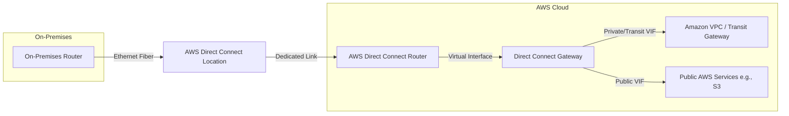
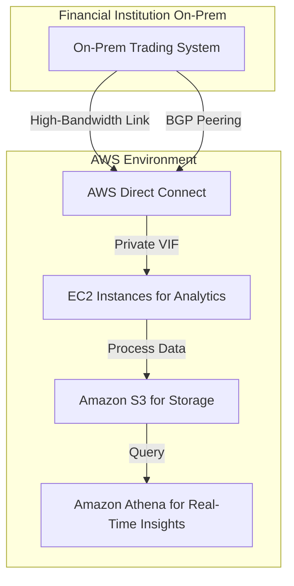
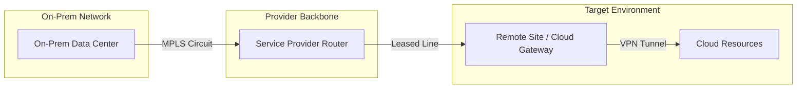

# Direct Connect

## AWS Direct Connect

### 🌟 Overview

AWS Direct Connect is a dedicated networking service that establishes a private, high-bandwidth connection between your on-premises data center, office, or colocation environment and AWS cloud resources. It bypasses the public internet, offering more predictable performance, reduced latency, and enhanced security compared to internet-based connections. This service enables seamless hybrid cloud architectures by linking your internal network to AWS via standard Ethernet fiber-optic cables, with one end connected to your router and the other to an AWS Direct Connect router. You can create virtual interfaces to access public AWS services (like Amazon S3) or private resources in Amazon VPC, and it supports global access across Regions using Direct Connect gateways.

<figure><figcaption></figcaption></figure>

Deep dive: Direct Connect supports capacities from 1 Gbps to 400 Gbps for dedicated connections and hosted options via partners. It handles both IPv4 and IPv6, jumbo frames (up to 9023 bytes), and integrates with AWS Transit Gateway for multi-VPC connectivity. It reduces data transfer costs and improves reliability for large-scale workloads, with options for resilient setups like multiple connections for failover.

**🤖 Innovation Spotlight**: As of September 2025, a key innovation is the support for long ASN (Autonomous System Number) values in BGP sessions for virtual interfaces, introduced in July 2025, enabling more flexible routing in complex, multi-cloud environments. Additionally, enhancements through partners like Console Connect (June 2025) simplify global cloud connectivity management for AWS customers.

### ⚡ Problem Statement

Imagine a financial institution handling massive daily data transfers for real-time trading analytics. Relying on public internet leads to unpredictable latency, packet loss during peak hours, and security vulnerabilities from potential DDoS attacks. AWS Direct Connect solves this by providing a dedicated, private link that ensures consistent low-latency performance (e.g., under 10ms round-trip) and secure data flow, enabling the firm to process terabytes of market data without interruptions.

Industries/applications:

* **Financial Services**: High-frequency trading platforms transfer sensitive data securely.
* **Media & Entertainment**: Content creation studios upload large video files for editing in AWS.
* **Retail**: In-store personalization systems sync inventory data in real-time.
* **IT Services & Software**: Backup and disaster recovery for enterprise apps.

#### 🤝 Business Use Cases

* **High-Volume Data Transfer**: Enterprises migrating petabytes of data to AWS for analytics, like a healthcare provider archiving patient records.
* **Hybrid Cloud Workloads**: Running applications across on-premises and AWS, e.g., a manufacturing firm using IoT sensors connected to AWS for predictive maintenance.
* **Real-Time Applications**: Gaming companies streaming live events with minimal latency.

### 🔥 Core Principles

AWS Direct Connect is built on principles of dedicated connectivity, scalability, and network isolation. It emphasizes event-driven routing via BGP, automatic failover for high availability, and cost-effective data transfer without internet dependencies.

Key terms/resources explained:

* **Connection**: Physical Ethernet link from your premises to an AWS Direct Connect location; supports 1/10/100/400 Gbps.
* **Virtual Interface (VIF)**: Logical overlay on the connection; types include Private VIF (for VPC access using private IPs), Public VIF (for public AWS services using public IPs), and Transit VIF (for Transit Gateway integration across Regions/accounts).
* **Direct Connect Gateway**: Virtual device aggregating multiple VIFs to connect to VPCs in different Regions or accounts.
* **SiteLink**: Enables private connections between Direct Connect locations globally, bypassing the internet for inter-site data transfer.
* **BGP (Border Gateway Protocol)**: Routing protocol for peering; supports MD5 authentication and long ASNs.
* **BFD (Bidirectional Forwarding Detection)**: Protocol for quick failure detection on links.

### 📋 Pre-Requirements

* **Colocation or Partner Access**: Be at an AWS Direct Connect location or use an APN partner for hosted connections. Purpose: To establish the physical link.
* **Compatible Hardware**: Single-mode fiber with transceivers like 1000BASE-LX (1 Gbps) or 100GBASE-LR4 (100 Gbps). Purpose: Ensures Ethernet compatibility.
* **Network Support**: 802.1Q VLAN encapsulation, BGP with MD5 auth, optional BFD. Purpose: For secure routing and isolation.
* **AWS Account**: With permissions for Direct Connect console/API. Purpose: To provision resources.

### 👣 Implementation Steps

1. **Sign Up and Verify Prerequisites**: Ensure your network meets hardware and protocol requirements; request a connection via AWS console or partner.
2. **Create a Connection**: In the AWS Management Console, request a dedicated (1-400 Gbps) or hosted connection at a Direct Connect location.
3. **Download LOA-CFA**: Receive the Letter of Authorization and Connecting Facility Assignment; provide to your colocation provider or partner for cross-connect setup.
4. **Create Virtual Interfaces**: Set up Private/Public/Transit VIFs, configure BGP peering with ASN and VLAN tags.
5. **Associate with Gateway**: Link VIFs to a Direct Connect Gateway for multi-Region access.
6. **Test Connectivity**: Verify BGP sessions and data flow; enable monitoring via CloudWatch.
7. **Configure Resiliency**: Add redundant connections for high availability.

### 🗺️ Data Flow Diagram

**Diagram 1: How AWS Direct Connect Works**

**Diagram 2: Example Use Case - Financial Data Transfer**

### 🔒 Security Measures

* Enable BGP MD5 authentication to prevent unauthorized peering.
* Use BFD for rapid link failure detection and failover.
* Implement least-privilege IAM roles for console/API access.
* Encrypt data in transit with IPsec over Direct Connect or MACsec for physical layer security.
* Isolate traffic with VPC peering and security groups; monitor with AWS CloudTrail and VPC Flow Logs.
* Follow resiliency models: Use multiple locations/connections for redundancy.

### 🚀 AWS Direct Connect SiteLink for Global Networking

SiteLink allows private, low-latency connections between Direct Connect locations worldwide, ideal for distributed enterprises. Innovation: As of 2025, it integrates with enhanced partner ecosystems for automated provisioning, reducing setup time by 50% in multi-region setups.

### ⚖️ When to use and when not to use

* ✅ **When to use**: For high-bandwidth, low-latency needs like large data transfers, hybrid apps, or compliance-driven workloads requiring private connectivity; superior to VPN for consistency and security in production environments.
* ❌ **When not to use**: For low-volume, intermittent traffic where cost is a priority; quick setups favoring VPN's ease over Direct Connect's physical provisioning; or when encryption over public internet suffices.

### 💰 Costing Calculation

* **How it is calculated?**: Based on port hours (capacity x time provisioned) + outbound data transfer (DTO) per GB. Inbound is free. Rates vary by location and type (dedicated/hosted).
* **Efficient way of handling this service**: Use hosted connections for sub-1 Gbps needs via partners; monitor DTO with CloudWatch; opt for resilient setups to avoid over-provisioning; leverage free inbound transfers.
* **Give some sample calculations**:
  * 1 Gbps dedicated port (global): $0.30/hour x 730 hours/month = $219/month. Add 1 TB DTO at $0.02/GB = $20.48. Total: \~$239.48/month.
  * 10 Gbps maximum resiliency (4 ports): $2.25/hour x 4 x 730 = $6,570/month. 400 TB DTO at $0.02/GB = $8,192. Total: $14,762/month.

### 🧩 Alternative services in AWS/Azure/GCP/On-Premise

| Service              | Provider   | Key Comparison/Difference                                                                                                                                      |
| -------------------- | ---------- | -------------------------------------------------------------------------------------------------------------------------------------------------------------- |
| AWS Site-to-Site VPN | AWS        | Lower cost, easier setup over internet; but higher latency, less bandwidth vs. Direct Connect's dedicated path.                                                |
| ExpressRoute         | Azure      | Similar dedicated connectivity; supports Microsoft peering for Office 365; Azure has global peering options but varies in pricing and locations.               |
| Cloud Interconnect   | GCP        | Dedicated/Partner options like Direct Connect; emphasizes AI/ML integration; GCP may offer lower latency in specific regions but fewer global locations.       |
| MPLS/Leased Lines    | On-Premise | Traditional private circuits; no cloud-specific integration; higher setup costs, less scalability; suitable for non-cloud hybrids but lacks AWS optimizations. |

**On-Premise Alternative Data Flow Diagram (MPLS Example)**

### ✅ Benefits

* **Cost Savings**: Lower DTO rates than internet; free inbound transfers.
* **Scalability**: Handles up to 400 Gbps; easy capacity upgrades.
* **Performance**: Consistent low latency, high throughput for real-time apps.
* **Security**: Private links reduce exposure; encryption options.
* **Reliability**: Redundant setups ensure 99.99% uptime.

### 🌐 - Direct Connect with Local Zones for Edge Computing

Integrate Direct Connect with AWS Local Zones to extend low-latency access to edge locations, innovating for 5G/IoT use cases like autonomous vehicles, where data processing happens closer to end-users without full Region hops.

### 📝 Summary

This solution delivers secure, high-performance hybrid connectivity, minimizing internet risks and optimizing costs for enterprise workloads.

Top 7 points to keep in mind:

1. Always verify colocation/partners for locations.
2. Use resilient models (e.g., dual connections) for production.
3. Monitor BGP and BFD for health.
4. DTO costs apply only outbound; plan volumes.
5. Supports multi-account/Region via gateways.
6. Recent: Long ASN for advanced routing.
7. Compare with VPN for non-critical needs.

In short: AWS Direct Connect provides dedicated private links to AWS, bypassing internet for better speed/security; ideal for hybrid setups; scales to 400 Gbps; priced on ports + outbound data; integrates with VPC/Transit Gateway.

### 🔗 Related Topics

* AWS Direct Connect Documentation: https://docs.aws.amazon.com/directconnect/latest/UserGuide/Welcome.html
* Pricing Calculator: https://calculator.aws/#/addService/DirectConnect
* Resiliency Toolkit: https://aws.amazon.com/directconnect/resiliency-recommendation/
* Partner Directory: https://aws.amazon.com/directconnect/partners/
*
