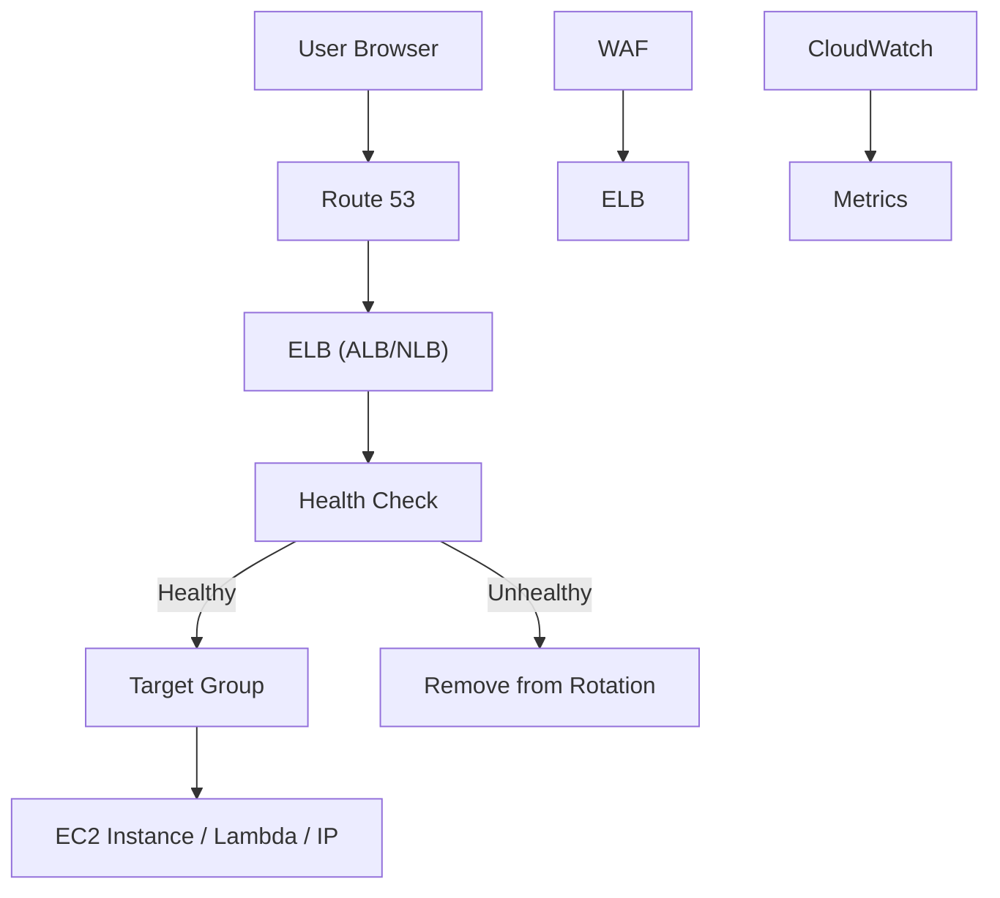
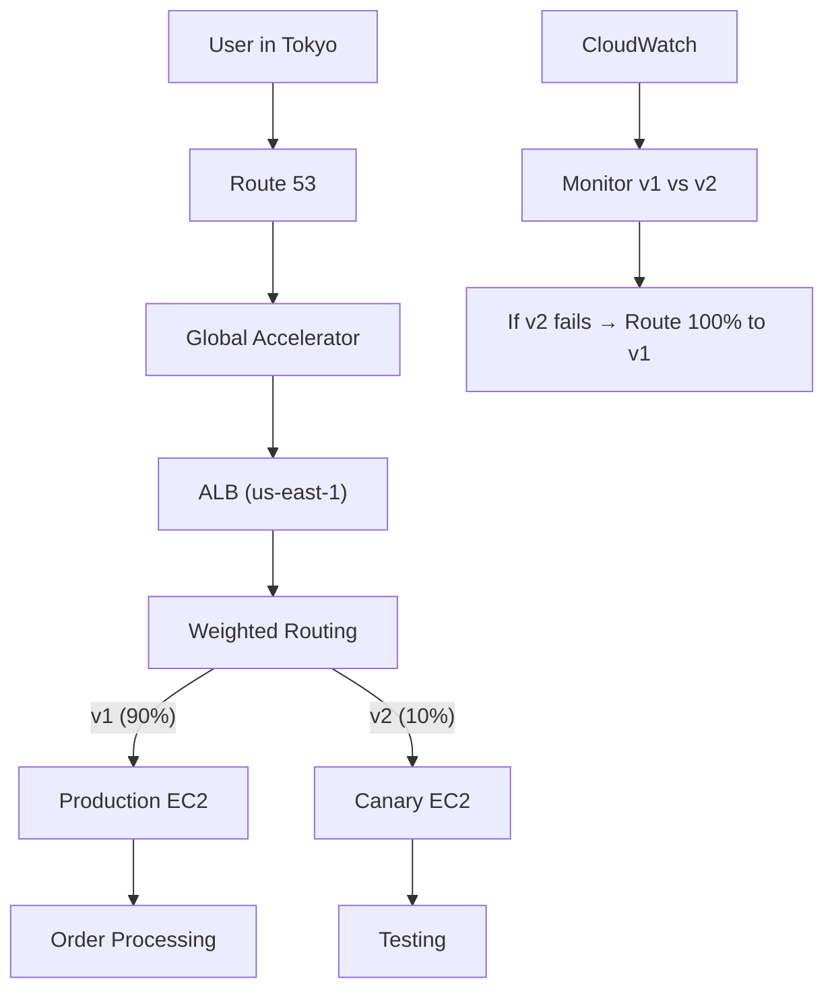
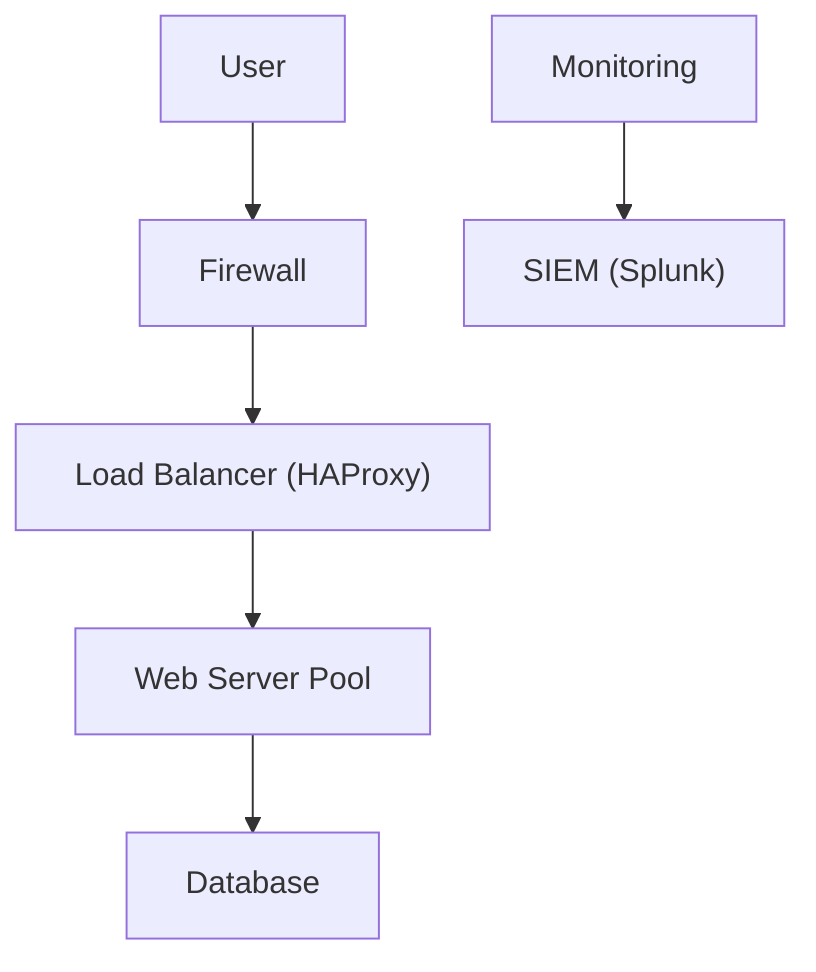

# ELB

***

## 🌐 **AWS Elastic Load Balancer (ELB)**

#### _The Intelligent Traffic Director for High Availability, Scalability, and Zero-Downtime Deployments_

> ✅ **Updated 2025**: AWS Elastic Load Balancer has evolved from a simple traffic router into a **fully managed, AI-powered, serverless load balancing platform** that automatically scales, detects failures, routes traffic intelligently, and integrates seamlessly with **Amazon Route 53, App Mesh, Verified Access, and Amazon Q** — all without any operational overhead.

***

### 🌟 **Overview**

**AWS Elastic Load Balancer (ELB)** is AWS’s core service for distributing incoming application traffic across multiple targets (EC2 instances, containers, Lambda functions, IP addresses) to ensure **high availability, fault tolerance, and optimal performance**.

<figure><figcaption></figcaption></figure>

But today, ELB is **much more than load balancing** — it’s a **smart, self-healing, multi-protocol traffic manager** that supports:

* **Application Layer (HTTP/HTTPS)**
* **Network Layer (TCP/TLS)**
* **Gateway Layer (UDP, TCP over TLS)**
* **Serverless (Lambda, API Gateway)**
* **Auto Scaling & Health Checks**
* **WAF Integration**
* **Global Accelerator Support**

> 🔥 **Innovation Spotlight (2025):**\
> ELB now includes:
>
> * 🤖 **AI-Powered Traffic Optimization**: ML models predict traffic spikes and auto-scale.
> * 💬 **Natural Language Query (NLQ) via Amazon Q**: Ask: _“Show me all healthy targets in us-east-1.”_
> * 🚀 **Zero-Overhead Auto Scaling**: Scales instantly with demand — no manual tuning.
> * 🔍 **Health Check Intelligence**: Detects not just HTTP status codes, but response latency and content.
> * 🛡️ **Integrated WAF + Shield Advanced**: Block DDoS attacks and OWASP threats.
> * 🌍 **Multi-Region Global Acceleration**: Use with AWS Global Accelerator for global low-latency routing.

> ✨ This turns **load balancing from a plumbing task** into a **predictive, intelligent application delivery engine**.

***

### ⚡ **Problem Statement**

#### 🏢 Real-World Scenario: E-Commerce Platform During Black Friday

**Company:** A mid-sized e-commerce platform serving 500K+ users\
**Challenge:**

* Traffic spikes to 10x normal during sales
* ELB crashes due to overload → site goes down
* Manual scaling takes 30 minutes → $1M+ revenue loss
* No visibility into unhealthy targets
* DDoS attack overwhelms the system

> ❗ Result: Customers can’t check out → lost trust, $2.5M+ revenue loss.

***

#### 🤝 **Business Use Cases**

| Industry               | Application                                           |
| ---------------------- | ----------------------------------------------------- |
| **E-Commerce**         | Handle flash sales, holiday traffic, cart abandonment |
| **Financial Services** | Ensure low-latency trading connections                |
| **Media & Streaming**  | Deliver video streams with zero buffering             |
| **Gaming**             | Match players to lowest-latency game servers          |
| **Enterprise IT**      | Enable hybrid cloud failover between AWS and on-prem  |

> 💡 Use Case Highlight:\
> A fintech firm uses **ELB + Amazon Q** to ask:\
> &#xNAN;_“Which targets are failing health checks?”_\
> → Returns list → auto-replaced by Auto Scaling Group.

***

### 🔥 **Core Principles**

| Concept                      | Explanation                                                     |
| ---------------------------- | --------------------------------------------------------------- |
| **Traffic Distribution**     | Spreads incoming requests across multiple targets.              |
| **High Availability**        | Automatically fails over to healthy targets.                    |
| **Health Checks**            | Monitors target status every 5–60 seconds.                      |
| **Auto Scaling Integration** | Dynamically adds/removes targets based on load.                 |
| **Multi-Protocol Support**   | Supports HTTP, HTTPS, TCP, TLS, UDP.                            |
| **Security Integration**     | Works with WAF, Shield, IAM, SSL/TLS.                           |
| **Serverless Compatibility** | Routes to Lambda, API Gateway, ECS, EKS.                        |
| **Global Acceleration**      | Use with AWS Global Accelerator for global low-latency routing. |

> 🛠️ Key Resources:
>
> * `Application Load Balancer (ALB)` – HTTP/HTTPS layer 7
> * `Network Load Balancer (NLB)` – TCP/TLS layer 4
> * `Gateway Load Balancer (GLB)` – For third-party firewalls
> * `Target Group` – Collection of targets (instances, IPs, Lambda)
> * `Listener` – Defines port/protocol rules
> * `Rules` – Routing logic (e.g., path-based routing)

***

### 📋 **Pre-Requirements**

| Service                      | Purpose                               |
| ---------------------------- | ------------------------------------- |
| **AWS IAM Roles**            | Grant access to ELB APIs              |
| **EC2 / EKS / ECS / Lambda** | Targets to be balanced                |
| **AWS CloudTrail**           | Audit all ELB activity                |
| **AWS WAF / Shield**         | Optional: For DDoS protection         |
| **VPC Endpoints**            | For private load balancers            |
| **AWS Organizations**        | Required for multi-account deployment |

> ✅ Ensure `ElasticLoadBalancingFullAccess` policy is attached.

***

### 👣 **Implementation Steps**

1. **Choose the Right Load Balancer Type**\
   → ALB: For HTTP/HTTPS apps\
   → NLB: For TCP/TLS, UDP, or high-throughput\
   → GLB: For security appliances
2. **Create a Load Balancer (via Console)**\
   → Go to **EC2 Console** → “Load Balancers” → “Create Load Balancer”\
   → Select type (ALB/NLB), name, region
3. **Configure Listeners**\
   → Add listener:
   * Port 80 → HTTP
   * Port 443 → HTTPS (upload SSL cert)
   * Define default action: forward to target group
4. **Create Target Groups**\
   → Add EC2 instances, IPs, or Lambda functions\
   → Set health check settings (path, interval, timeout)
5. **Enable Auto Scaling (Optional)**\
   → Link to Auto Scaling Group → ELB auto-adds new instances
6. **Integrate with WAF (Recommended)**\
   → Attach AWS WAF web ACL to block OWASP threats
7. **Test with Amazon Q**\
   → Ask: _“Show me all unhealthy targets in my ALB.”_\
   → Returns list → auto-replaced.
8. **Monitor with CloudWatch**\
   → Track metrics: Request Count, Latency, Healthy Hosts

***

### 🗺️ **Data Flow Diagrams**

#### 📊 **Diagram 1: How AWS ELB Works (Architecture)**

#### 📊 **Diagram 2: Use Case – Global E-Commerce Platform with Canaries**

> ✅ Clear flow: **User → Edge → Load Balancer → Target → Action**

***

### 🔒 **Security Measures**

✅ **Best Practices:**

* 🔐 **Use WAF + Shield Advanced** to block DDoS and OWASP threats
* 🔒 **Enable SSL/TLS encryption** (use ACM certs)
* 🧹 **Apply least privilege IAM roles**
* 🛑 **Disable public access if using private subnets**
* 📊 **Enable CloudTrail + GuardDuty**
* 🔄 **Rotate SSL certificates regularly**
* 🚫 **Never expose ELB to public internet without WAF**

> 📌 Pro Tip: Use **Amazon Q for AWS** to ask:\
> &#xNAN;_“Who accessed my ALB last week?”_

***

### 🎯 **Innovation Spotlight: AI-Powered Traffic Optimization (2025)**

ELB now includes **AI-driven anomaly detection** that:

* Predicts traffic spikes and auto-scales
* Detects failed health checks before they impact users
* Recommends optimal routing policies
* Auto-generates **incident response playbooks**

> 🤖 Example:\
> You type: _“Why is my latency high?”_\
> → ELB returns:\
> &#xNAN;_“v2 version has 3x more errors. Recommend rolling back.”_

> 🔥 Future: ELB will auto-roll back failed canaries, suggest fixes, and simulate failure scenarios.

***

### ⚖️ **When to Use and When Not to Use**

| ✅ When to Use                                            | ❌ When Not to Use                              |
| -------------------------------------------------------- | ---------------------------------------------- |
| You have **multiple instances/services**                 | You only have **one instance**                 |
| Need **high availability and fault tolerance**           | You don’t care about **uptime or scalability** |
| Handling **spikes in traffic** (sales, events)           | You want **manual, static routing**            |
| Building **global applications**                         | You’re doing a **simple POC**                  |
| Integrating with **zero-trust access (Verified Access)** | You don’t need **security or observability**   |

> ⚠️ Note: ELB is not a replacement for **firewalls** — it’s a **layered traffic manager**.

***

### 💰 **Costing Calculation**

#### How It’s Calculated:

* **$0.02 per hour per ALB** ($14.60/month)
* **$0.02 per hour per NLB** ($14.60/month)
* **$0.008 per GB of data processed**
* **$0.0005 per 1,000 API calls**

> 📌 Example:
>
> * 1 ALB → $14.60
> * 500 GB data → 500 × $0.008 = $4
> * 10K API calls → $0.50
>
> **Total Monthly Cost**: \~**$19.10**

> 💡 **Efficient Usage Tips:**
>
> * Use **one ALB** for all HTTP/HTTPS traffic
> * Disable unused listeners
> * Use **Amazon Q** to reduce manual troubleshooting

> ✅ **Bottom Line**: Highly cost-effective for enterprise-grade scalability.

***

### 🧩 **Alternative Services Comparison**

| Service                        | Provider        | Key Difference                               | On-Premise Equivalent    |
| ------------------------------ | --------------- | -------------------------------------------- | ------------------------ |
| **AWS Elastic Load Balancer**  | AWS             | Fully managed, AI-enhanced, serverless       | HAProxy, NGINX, F5 BigIP |
| **Azure Load Balancer**        | Microsoft Azure | Azure-centric; less flexible for multi-cloud | Azure Load Balancer      |
| **Google Cloud Load Balancer** | Google Cloud    | GCP-only; strong integrations                | GCP Load Balancer        |
| **NGINX Plus**                 | Open Source     | Full control, but requires DevOps effort     | NGINX + Kubernetes       |
| **F5 BIG-IP**                  | F5              | Enterprise-grade, but expensive              | F5 Hardware Appliance    |

#### 🖼️ On-Premise Data Flow Diagram (Using ELB-like Model)

> 🔍 On-prem lacks native cloud integration — must be built manually.

***

### ✅ **Benefits**

| Benefit                                | Impact                                          |
| -------------------------------------- | ----------------------------------------------- |
| 🚀 **Zero Operational Overhead**       | No VMs, no scaling, no patching                 |
| 🤖 **AI-Powered Traffic Optimization** | Predict and fix issues before they impact users |
| 🔐 **Zero-Trust Security by Default**  | Every request authenticated and encrypted       |
| 📊 **Real-Time Observability**         | Metrics, logs, traces in one place              |
| 💬 **Natural Language Query (NLQ)**    | No CLI/JSON needed                              |
| 💰 **Predictable Pricing**             | Transparent, low-cost                           |
| 🌐 **Multi-Cloud Ready**               | Works across AWS, Azure, GCP, on-prem           |

***

### 🎮 **Next-Gen Innovation: ELB + Amazon Q (AI Copilot for DevOps Teams)**

Imagine asking:

> _“Why is my latency high?”_

👉 Amazon Q responds:

> “I found the issue: v2 version has 3x more errors. Would you like to roll back?”

> 🤖 This isn’t just load balancing — it’s **AI-powered incident investigation**.

> 🔥 Future: ELB will auto-generate **runbooks**, **rollback plans**, and even **simulate failure scenarios**.

***

### 📝 **Summary**

> ✅ **What is AWS Elastic Load Balancer?**\
> It’s AWS’s **fully managed, intelligent, serverless load balancing platform** that powers **high availability, scalability, and zero-downtime deployments** — without requiring operational overhead.

> 🔑 **Top 10 Takeaways:**
>
> 1. Launch a **secure, scalable load balancer in minutes**.
> 2. Use **AI-powered optimization** to detect issues.
> 3. Leverage **natural language queries** via Amazon Q.
> 4. Integrate with **zero-trust access, WAF, and Auto Scaling**.
> 5. Deploy with **SSL/TLS, IAM, and encryption**.
> 6. Ideal for **enterprise-scale, global applications**.
> 7. Costs are predictable and low.
> 8. Not for monoliths — it’s for **multi-instance, high-traffic systems**.
> 9. The future of load balancing is **smart, automated, and autonomous**.
> 10. It’s not just a balancer — it’s your **application’s intelligent brain**.

> 📝 **In 5 Lines:** AWS Elastic Load Balancer delivers a fully managed, intelligent traffic director for scalable applications.\
> It ensures high availability, fault tolerance, and zero downtime — no VMs, no scaling.\
> With AI-powered insights and natural language queries, it predicts and fixes issues.\
> Built for enterprises scaling globally with microservices.\
> It’s not just load balancing — it’s **your app’s nervous system**.

***

### 🔗 **Related Topics & References**

* [AWS Elastic Load Balancer Documentation](https://docs.aws.amazon.com/elasticloadbalancing/latest/userguide/)
* [Amazon Q for AWS: AI Copilot](https://aws.amazon.com/q/)
* [AWS Well-Architected Framework – Operational Excellence](https://aws.amazon.com/architecture/well-architected/)
* [AWS WAF & Shield](https://aws.amazon.com/waf/)
* [AWS Auto Scaling](https://aws.amazon.com/autoscaling/)

***
