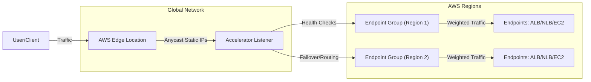
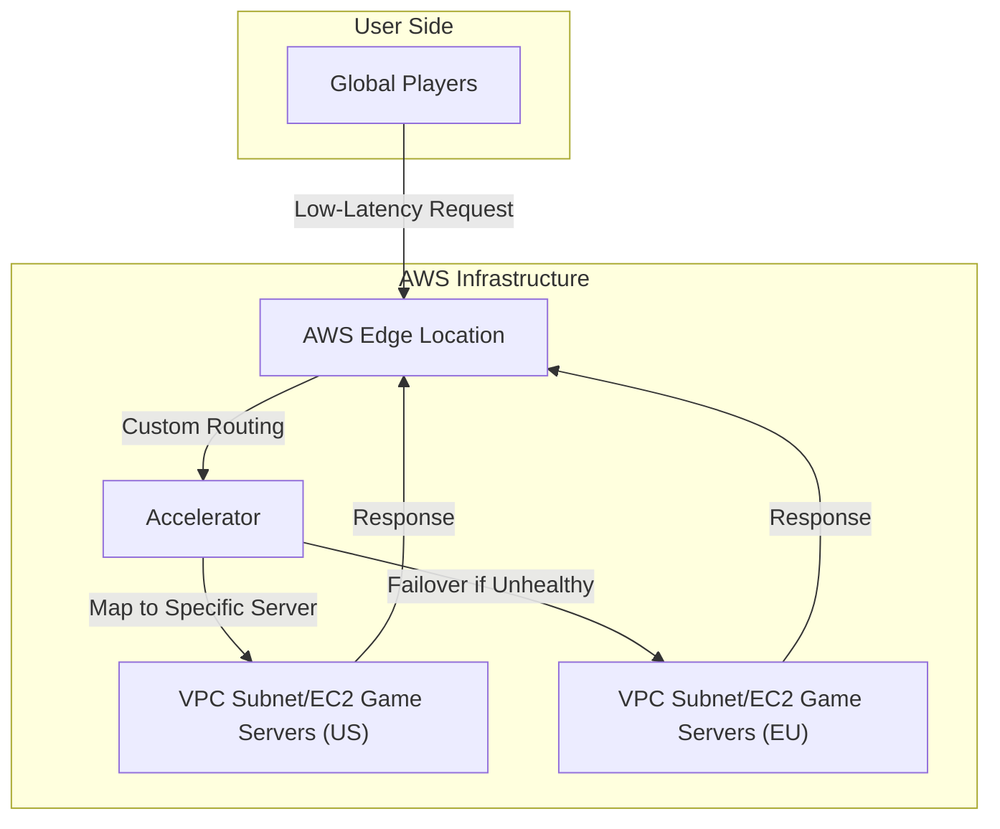
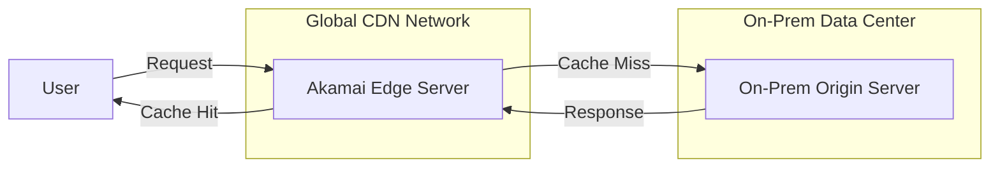

# Global Accelerator

## AWS Global Accelerator

### 🌟 Overview

AWS Global Accelerator is a networking service that enhances the availability and performance of internet-facing applications by routing user traffic through the AWS global network infrastructure. It provides static anycast IP addresses as fixed entry points to your applications hosted in one or more AWS Regions, improving latency by up to 60% compared to public internet routing. The service leverages AWS edge locations to onboard traffic closer to users, enabling faster failover, deterministic routing independent of DNS caching, and protection against DDoS attacks at the edge.&#x20;

Deep dive: It supports standard accelerators for general traffic optimization and custom routing accelerators for mapping users to specific endpoints (e.g., game servers). Key capabilities include traffic dials for weighted routing, client affinity for session stickiness, and integration with load balancers like ALB, NLB, or EC2 instances. It handles both IPv4 and IPv6, with options for Bring Your Own IP (BYOIP) addresses, and reacts instantly to endpoint health changes for high availability in multi-Region setups.

<figure><figcaption></figcaption></figure>

🤖 Innovation Spotlight: As of September 2025, a notable enhancement is the expanded support for ARC (AWS Resource Controller) traffic redirection, allowing seamless handling of zonal shifts and autoshifts for improved resilience in multi-AZ environments. Additionally, integrations with VPC Block Public Access (including ingress-only modes) provide finer-grained security for private endpoints, enabling innovative hybrid setups for edge AI applications where low-latency routing meets strict compliance needs.

### ⚡ Problem Statement

Consider a global e-commerce platform experiencing high latency and downtime during peak traffic from international users, leading to cart abandonment and lost revenue. Public internet routing causes unpredictable paths, congestion, and vulnerability to regional outages or attacks. AWS Global Accelerator addresses this by directing traffic via optimized AWS edge paths, reducing latency by 60% and ensuring sub-second failover to healthy Regions.

Industries/applications:

* **Gaming**: Multiplayer games route players to nearest servers for low-latency experiences.
* **Financial Services**: Real-time trading apps deliver secure, fast data feeds globally.
* **Media Streaming**: Video platforms minimize buffering with edge-optimized delivery.
* **IoT**: Device fleets in manufacturing sync data reliably across continents.

#### 🤝 Business Use Cases

* **Multi-Region High Availability**: A SaaS provider uses it for failover between US and EU Regions during outages.
* **Performance Optimization**: An online retailer accelerates API calls for personalized recommendations.
* **Custom Routing**: A VoIP service maps calls to specific endpoints based on user location.

### 🔥 Core Principles

AWS Global Accelerator operates on principles of global network optimization, anycast routing, and health-based traffic management. It emphasizes low-latency paths via edge locations, automatic failover, and decoupling from DNS volatility for consistent performance.

Key terms/resources explained:

* **Accelerator**: Core resource; standard type routes to optimal Regions, custom type directs to specific VPC subnets or EC2 instances.
* **Static IP Addresses**: Anycast IPs (IPv4/IPv6) as entry points; supports BYOIP for custom ranges.
* **Listeners**: Process inbound connections on specified ports/protocols (TCP/UDP).
* **Endpoint Groups**: Regional collections of endpoints (e.g., ALB, NLB, EC2, Elastic IPs); weighted for traffic distribution.
* **Traffic Dials**: Adjust routing weights between endpoint groups for A/B testing or blue/green deployments.
* **Client Affinity**: Maintains session stickiness using source IP hashing.

### 📋 Pre-Requirements

* **AWS Account**: With permissions for Global Accelerator console/API. Purpose: To create and manage accelerators.
* **Endpoints in AWS Regions**: Such as ALB, NLB, EC2 instances, or Elastic IPs. Purpose: Targets for traffic routing.
* **DNS Configuration**: Ability to update DNS records to point to accelerator IPs. Purpose: Direct user traffic.
* **Monitoring Tools**: CloudWatch for metrics/logs. Purpose: Track performance and health.

### 👣 Implementation Steps

1. **Create an Accelerator**: In AWS Console, select standard or custom type, specify protocols (TCP/UDP).
2. **Add Listeners**: Configure ports and protocols for incoming traffic.
3. **Define Endpoint Groups**: Assign to Regions, add endpoints like ALB/NLB, set weights/health checks.
4. **Configure Traffic Dials/Affinity**: Adjust weights or enable stickiness as needed.
5. **Update DNS**: Point your domain to the accelerator's static IPs.
6. **Test and Monitor**: Verify routing with tools like traceroute; set up CloudWatch alarms.
7. **Enable Security Features**: Integrate with AWS Shield for DDoS protection.

### 🗺️ Data Flow Diagram

**Diagram 1: How AWS Global Accelerator Works**

**Diagram 2: Example Use Case - Gaming Application**

### 🔒 Security Measures

* Enable AWS Shield Advanced for DDoS mitigation at the edge.
* Use IAM policies with tag-based controls to restrict accelerator modifications.
* Respect VPC Block Public Access settings to prevent unauthorized ingress.
* Implement client affinity and traffic dials for controlled access.
* Monitor with CloudTrail for API calls and VPC Flow Logs for traffic analysis.
* Encrypt traffic end-to-end with TLS on listeners/endpoints.

### 🚀 Custom Routing for AI Workloads

Custom routing accelerators now innovate by enabling precise mapping to GPU-optimized EC2 instances in VPCs, ideal for real-time AI inference at the edge, reducing latency for global ML applications like personalized content generation.

### ⚖️ When to use and when not to use

* ✅ **When to use**: For global applications needing low latency, high availability, and DDoS protection; multi-Region setups with fast failover; when DNS caching causes inconsistencies.
* ❌ **When not to use**: For purely regional traffic where Route 53 suffices; low-traffic apps where costs outweigh benefits; internal-only networks without internet exposure.

### 💰 Costing Calculation

* **How it is calculated?**: Fixed hourly fee ($0.025/hour per accelerator) + DT-Premium per GB (dominant direction, varies by Region/edge: e.g., $0.015-$0.035/GB) + standard IPv4 charges.
* **Efficient way of handling this service**: Consolidate apps into fewer accelerators; optimize dominant traffic direction; use traffic dials to balance loads and minimize inter-Region transfers.
* **Give some sample calculations**:
  * Single accelerator, 30 days: $0.025/hour x 720 hours = $18/month. Add 1 TB dominant outbound at $0.02/GB = $20.48. Total: \~$38.48/month.
  * Two accelerators, 10 TB traffic (60% outbound dominant) from NA to EU at $0.015/GB: Fixed $36 + DT $90 = $126/month.

### 🧩 Alternative services in AWS/Azure/GCP/On-Premise

| Service                           | Provider   | Key Comparison/Difference                                                                                                                                    |
| --------------------------------- | ---------- | ------------------------------------------------------------------------------------------------------------------------------------------------------------ |
| Amazon Route 53                   | AWS        | DNS-based routing; cheaper for simple latency-based traffic but lacks edge optimization and DDoS edge protection.                                            |
| Azure Front Door                  | Azure      | Similar global routing with CDN integration; better for web apps with WAF, but Azure's pricing may include more bundled features vs. AWS's modular approach. |
| Google Cloud Premium Network Tier | GCP        | Optimizes global traffic via Google's network; emphasizes ML integration, potentially lower costs in data-heavy scenarios but fewer edge locations than AWS. |
| On-Premise CDN (e.g., Akamai)     | On-Premise | Hardware/software-based content delivery; no cloud-native integration, higher upfront costs, but full control for non-cloud hybrids; lacks auto-scaling.     |

**On-Premise Alternative Data Flow Diagram (Akamai CDN Example)**

### ✅ Benefits

* **Performance Boost**: Up to 60% faster than internet routing via edge optimization.
* **High Availability**: Instant failover and health-based routing.
* **Security Enhancement**: DDoS mitigation at the edge.
* **Scalability**: Handles global traffic without infrastructure management.
* **Cost Efficiency**: Predictable pricing with premium data transfer savings.

### 🌐 - Integration with AWS Local Zones

Innovatively extend Global Accelerator to AWS Local Zones for ultra-low latency in metro areas, supporting 5G-enabled IoT and AR/VR apps by routing traffic to edge compute without full Region traversal.

### 📝 Summary

This solution optimizes global application delivery with low latency and resilience, leveraging AWS's network for seamless user experiences.

Top 7 points to keep in mind:

1. Use static IPs to avoid DNS issues.
2. Enable health checks for automatic failover.
3. Monitor DT-Premium to control costs.
4. Integrate with Shield for security.
5. Choose custom routing for precise control.
6. Support multi-protocol (TCP/UDP).
7. Check Region availability before setup.

In short: AWS Global Accelerator routes internet traffic via AWS's global network for better performance and availability; provides static IPs and failover; ideal for global apps; priced on fixed fees + data transfer; integrates with load balancers.

### 🔗 Related Topics

* AWS Global Accelerator Documentation: https://docs.aws.amazon.com/global-accelerator/latest/dg/what-is-global-accelerator.html
* Pricing Details: https://aws.amazon.com/global-accelerator/pricing/
* Getting Started Guide: https://aws.amazon.com/global-accelerator/getting-started/
* AWS Shield Integration: https://aws.amazon.com/shield/
