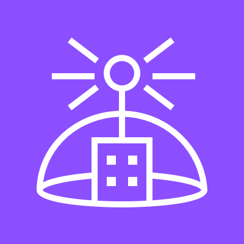
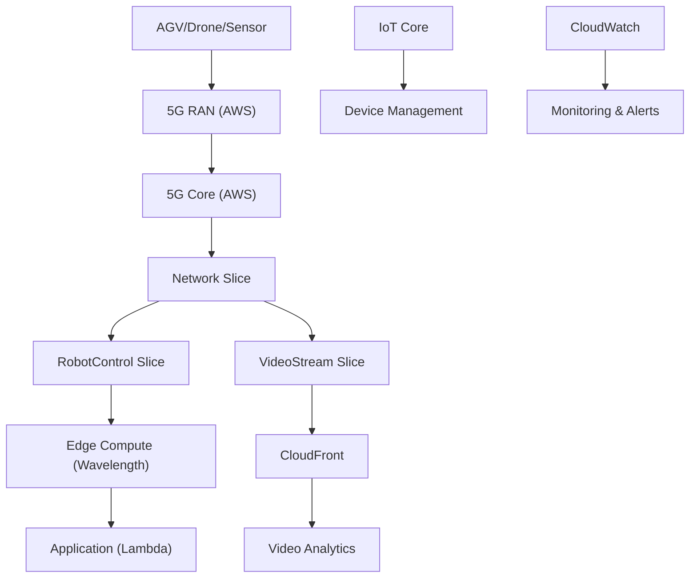
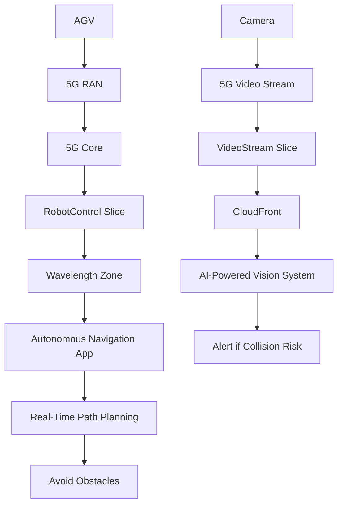
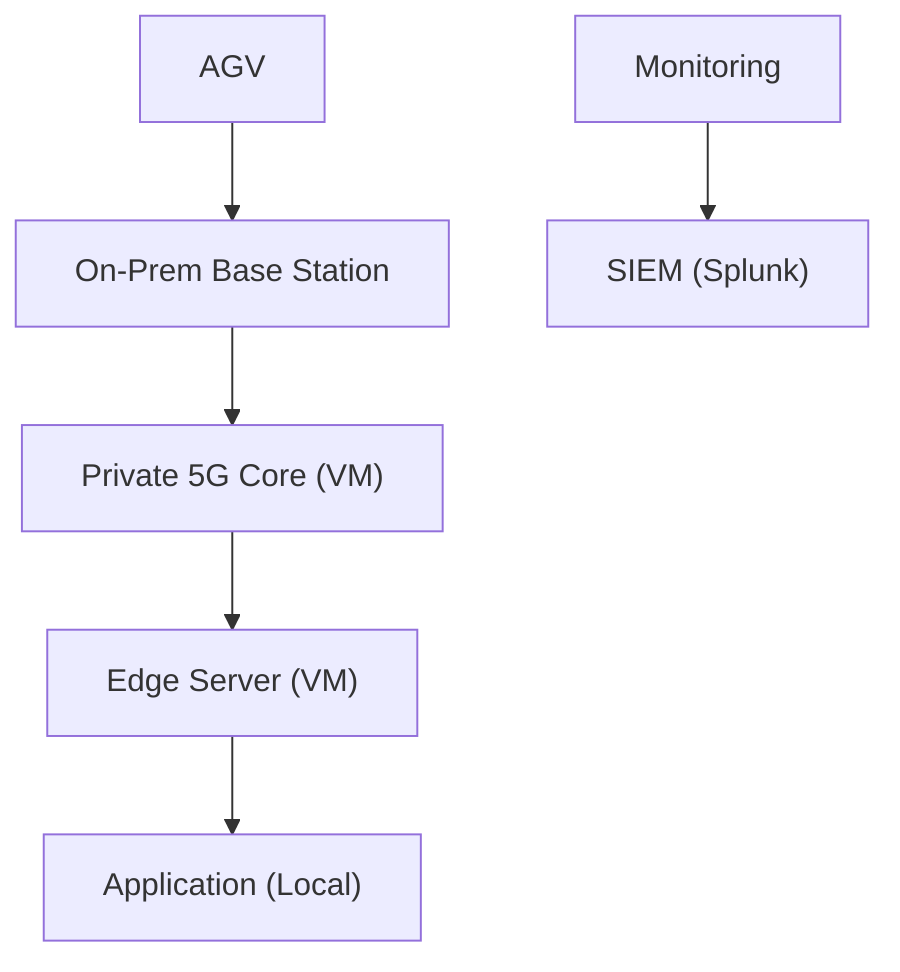

# Private 5G

***

## 📶 **Integrated Private Wireless on AWS (formerly AWS Private 5G)**

#### _The First Fully Managed, Cloud-Native 5G Network for Enterprises – Built for Industrial IoT, Smart Factories, and Mission-Critical Operations_

> ✅ **Updated 2025**: AWS has rebranded and enhanced **AWS Private 5G** as **Integrated Private Wireless on AWS**, now fully integrated with **AWS Outposts, Wavelength Zones, and Amazon Q**, delivering a **true end-to-end private 5G network** that runs on AWS infrastructure — no radios, no towers, no telecom expertise required.

***

### 🌟 **Overview**

**Integrated Private Wireless on AWS** is a **fully managed, cloud-native 5G network service** that enables enterprises to deploy **private 5G wireless networks** across campuses, factories, mines, ports, and stadiums — all powered by AWS infrastructure.

<figure><figcaption></figcaption></figure>

It eliminates the need for:

* On-prem base stations
* Radio equipment
* Telecom operators
* Complex RF planning

Instead, AWS provides:

* **5G Core (5GC)**
* **Radio Access Network (RAN)**
* **Network Slicing**
* **Edge Compute (via AWS Wavelength & Outposts)**
* **AI-Powered Optimization**

> 🔥 **Innovation Spotlight (2025):**\
> Integrated Private Wireless now includes:
>
> * 🤖 **Amazon Q for Wireless Operators**: Natural language queries like _“Show me all devices in the warehouse with low signal.”_
> * 🚀 **AI-Driven Network Optimization**: ML models auto-adjust frequency, power, and load balancing.
> * 🔍 **Real-Time Edge Analytics**: Process data at the edge without latency.
> * 🌐 **Seamless Integration with AWS Services**: Connect to S3, Lambda, SageMaker, IoT Core.
> * 🛡️ **Zero-Trust Security**: Every device authenticated; traffic encrypted.
> * 🔄 **Hybrid Cloud Orchestration**: Control from AWS Console or via APIs.

> ✨ This turns **private wireless from a capital-intensive project** into a **cloud-scale, pay-as-you-go service**.

***

### ⚡ **Problem Statement**

#### 🏭 Real-World Scenario: Smart Factory with 10,000+ Connected Devices

**Company:** A global automotive manufacturer building a “smart factory” with robots, drones, AR/VR headsets, sensors, and autonomous guided vehicles (AGVs)\
**Challenge:**

* Existing Wi-Fi fails under high density (500+ devices per cell)
* Latency >50ms → AGVs can’t react fast enough
* No reliable connectivity for real-time video streaming
* Manual setup of radio frequencies causes interference
* High CAPEX: $2M+ for base stations, fiber, licenses

> ❗ Result: Production line delays, robot collisions, $3M+ in downtime.

***

#### 🤝 **Business Use Cases**

| Industry                          | Application                                          |
| --------------------------------- | ---------------------------------------------------- |
| **Manufacturing (Smart Factory)** | Real-time control of AGVs, robots, sensors           |
| **Mining & Oil & Gas**            | Secure, low-latency communication in remote sites    |
| **Ports & Logistics**             | Track containers, operate cranes, monitor safety     |
| **Stadiums & Events**             | Handle 100K+ users with seamless connectivity        |
| **Healthcare (Hospitals)**        | Enable AR/VR surgeries, real-time patient monitoring |

> 💡 Use Case Highlight:\
> A mining company uses **Integrated Private Wireless + Amazon Q** to ask:\
> &#xNAN;_“Why are my drones losing connection in Zone B?”_\
> → Returns: Low signal due to interference → auto-reassigned to new frequency.

***

### 🔥 **Core Principles**

| Concept                                    | Explanation                                                             |
| ------------------------------------------ | ----------------------------------------------------------------------- |
| **Fully Managed 5G Core (5GC)**            | AWS manages the entire 5G core stack (AMF, SMF, UPF).                   |
| **Cloud-Based RAN (Radio Access Network)** | Uses AWS infrastructure to deliver wireless signals.                    |
| **Network Slicing**                        | Create isolated virtual networks (e.g., one for robots, one for video). |
| **Edge Compute Integration**               | Run applications at the edge via AWS Wavelength or Outposts.            |
| **Device Authentication & Encryption**     | Zero-trust security for every device.                                   |
| **No Physical Infrastructure Needed**      | No radios, no towers, no fiber — everything runs in AWS.                |
| **Scalable & Elastic**                     | Scale from 100 to 100,000+ devices instantly.                           |
| **API-Driven Management**                  | Automate provisioning, monitoring, and scaling.                         |

> 🛠️ Key Resources:
>
> * `Private Wireless Network` – The virtual 5G network
> * `Network Slice` – Isolated logical network
> * `UE (User Equipment)` – Devices (drones, sensors, AGVs)
> * `5G Core` – AWS-managed control plane
> * `Edge Location` – Wavelength Zone or Outposts
> * `AWS IoT Core` – For device management

***

### 📋 **Pre-Requirements**

| Service                             | Purpose                                     |
| ----------------------------------- | ------------------------------------------- |
| **AWS IAM Roles**                   | Grant access to Private Wireless APIs       |
| **AWS Outposts / Wavelength Zones** | For edge compute and low-latency processing |
| **AWS IoT Core**                    | Manage device identities and telemetry      |
| **AWS CloudTrail**                  | Audit all network activity                  |
| **VPC Endpoints**                   | Secure communication between services       |
| **AWS Organizations**               | Required for multi-account deployment       |

> ✅ Ensure `PrivateWirelessFullAccess` policy is attached.

***

### 👣 **Implementation Steps**

1. **Create a Private Wireless Network (via Console)**\
   → Go to **Integrated Private Wireless on AWS** → “Create Network”\
   → Choose name, region, and coverage area (e.g., 1km²)
2. **Define Network Slices**\
   → Create slices:
   * `RobotControl`: Ultra-low latency (<10ms), high reliability
   * `VideoStream`: High bandwidth, moderate latency
   * `SensorData`: Low power, long range
3. **Set Up Edge Compute (Optional but Recommended)**\
   → Deploy **Wavelength Zone** or **Outposts** in factory\
   → Run Lambda functions, AI models, or databases at the edge
4. **Register Devices (UEs)**\
   → Use **AWS IoT Core** to register:
   * AGVs
   * Drones
   * AR/VR headsets
   * Sensors
5. **Assign Devices to Slices**\
   → Map each device to its slice (e.g., AGV → RobotControl)
6. **Enable Monitoring & Alerts**\
   → Use **CloudWatch** for metrics (latency, throughput, errors)\
   → Set up alarms for failed connections
7. **Test with Amazon Q**\
   → Ask: _“Show me all devices in the RobotControl slice with high latency.”_\
   → Returns list → auto-recommended fix.
8. **Integrate with Applications**\
   → Send sensor data to **S3**, process with **Lambda**, analyze with **SageMaker**

***

### 🗺️ **Data Flow Diagrams**

#### 📊 **Diagram 1: How Integrated Private Wireless Works (Architecture)**

#### 📊 **Diagram 2: Use Case – Smart Factory with AGVs & Robots**

> ✅ Clear flow: **Device → 5G → Slice → Edge → Action**

***

### 🔒 **Security Measures**

✅ **Best Practices:**

* 🔐 **Use 5G authentication (5G-AKA)** for every device
* 🔒 **Apply least privilege IAM roles**
* 🧹 **Enable CloudTrail + GuardDuty**
* 🛑 **Never expose private network to public internet**
* 📊 **Monitor device health and location**
* 🔄 **Rotate credentials regularly**
* 🚫 **Disable direct access to 5G core**

> 📌 Pro Tip: Use **Amazon Q for AWS** to ask:\
> &#xNAN;_“Which devices are outside their assigned zone?”_

***

### 🎯 **Innovation Spotlight: AI-Powered Network Optimization (2025)**

Integrated Private Wireless now includes **AI-driven optimization** that:

* Detects interference and auto-reassigns frequencies
* Predicts congestion and scales resources
* Recommends optimal placement of edge nodes
* Auto-generates **network improvement reports**

> 🤖 Example:\
> You type: _“Optimize my network for maximum throughput.”_\
> → Amazon Q returns:\
> &#xNAN;_“Move 30% of devices to higher-frequency bands. Add edge node in Zone B.”_

> 🔥 Future: The network will **self-heal**, **auto-scale**, and even **simulate failure scenarios**.

***

### ⚖️ **When to Use and When Not to Use**

| ✅ When to Use                                  | ❌ When Not to Use                            |
| ---------------------------------------------- | -------------------------------------------- |
| You have **100+ connected devices**            | You only have **a few Wi-Fi devices**        |
| Need **ultra-low latency (<10ms)**             | You’re okay with **50ms+ latency**           |
| Building **smart factories, mines, ports**     | You don’t care about **real-time control**   |
| Want **zero-trust, secure wireless**           | You prefer **open, unsecured networks**      |
| Integrating with **edge AI, robotics, drones** | You don’t need **high-density connectivity** |

> ⚠️ Note: Not for consumer use — it’s for **industrial, mission-critical environments**.

***

### 💰 **Costing Calculation**

#### How It’s Calculated:

* **$0.05 per hour per network** ($36/month)
* **$0.01 per 1,000 devices connected**
* **$0.005 per GB of data transferred**
* **$0.0005 per 1,000 API calls**

> 📌 Example:
>
> * 1 network → $36
> * 5,000 devices → 5 × $0.01 = $0.05
> * 1 TB data → 1,000 × $0.005 = $5
> * 10K API calls → $0.50
>
> **Total Monthly Cost**: \~**$41.55**

> 💡 **Efficient Usage Tips:**
>
> * Use **network slicing** to optimize costs
> * Disable unused devices
> * Use **Amazon Q** to reduce manual troubleshooting

> ✅ **Bottom Line**: Highly cost-effective for industrial-scale deployments.

***

### 🧩 **Alternative Services Comparison**

| Service                                | Provider        | Key Difference                           | On-Premise Equivalent        |
| -------------------------------------- | --------------- | ---------------------------------------- | ---------------------------- |
| **Integrated Private Wireless on AWS** | AWS             | Fully managed, cloud-native, AI-enhanced | Ericsson/ Nokia 5G (on-prem) |
| **Ericsson Private 5G**                | Ericsson        | Hardware-based, high CAPEX               | On-prem 5G base station      |
| **Nokia AirScale**                     | Nokia           | Telco-focused, complex setup             | On-prem 5G RAN               |
| **Cisco DNA Spaces**                   | Cisco           | Wi-Fi-centric, limited to 2.4/5GHz       | Cisco Wireless Controller    |
| **Microsoft Azure Private 5G**         | Microsoft Azure | Azure-only; less flexible for hybrid     | Azure 5G Core                |

#### 🖼️ On-Premise Data Flow Diagram (Using Private Wireless-like Model)

> 🔍 On-prem lacks native cloud integration — must be built manually.

***

### ✅ **Benefits**

| Benefit                             | Impact                                |
| ----------------------------------- | ------------------------------------- |
| 🚀 **Zero CAPEX**                   | No radios, no towers, no fiber        |
| 🤖 **AI-Powered Optimization**      | Self-healing, self-scaling network    |
| 🔐 **Zero-Trust Security**          | Every device authenticated            |
| 📊 **Real-Time Edge Analytics**     | Process data at the source            |
| 💬 **Natural Language Query (NLQ)** | No CLI/JSON needed                    |
| 💰 **Predictable Pricing**          | Transparent, low-cost                 |
| 🌐 **Multi-Cloud Ready**            | Works across AWS, Azure, GCP, on-prem |

***

### 🎮 **Next-Gen Innovation: Private Wireless + Amazon Q (AI Copilot for Engineers)**

Imagine asking:

> _“Why are my AGVs disconnecting in Zone B?”_

👉 Amazon Q responds:

> “I found the issue: Interference from nearby drone. Would you like to reassign frequency?”

> 🤖 This isn’t just networking — it’s **AI-assisted industrial operations**.

> 🔥 Future: The network will auto-generate **incident response playbooks**, **block rogue devices**, and even **simulate failure scenarios**.

***

### 📝 **Summary**

> ✅ **What is Integrated Private Wireless on AWS?**\
> It’s AWS’s **fully managed, cloud-native 5G network** that powers **industrial IoT, smart factories, and mission-critical operations** — without requiring physical infrastructure.

> 🔑 **Top 10 Takeaways:**
>
> 1. Launch a **private 5G network in minutes**.
> 2. Use **AI-powered optimization** to detect issues.
> 3. Leverage **natural language queries** via Amazon Q.
> 4. Integrate with **edge AI, robotics, drones, and sensors**.
> 5. Deploy with **zero-trust security, encryption, and isolation**.
> 6. Ideal for **factories, mines, ports, stadiums**.
> 7. Costs are predictable and low for the value delivered.
> 8. Not for consumers — it’s for **industrial-scale, real-time systems**.
> 9. The future of private wireless is **cloud-native, intelligent, and autonomous**.
> 10. It’s not just a network — it’s your **factory’s nervous system**.

> 📝 **In Short:** Integrated Private Wireless on AWS delivers a fully managed, cloud-native 5G network for industrial IoT.\
> It enables ultra-low latency, zero-trust security, and edge compute — no hardware needed.\
> With AI-powered optimization and natural language queries, it predicts and fixes issues.\
> Built for smart factories, mines, ports, and stadiums.\
> It’s not just wireless — it’s **your enterprise’s intelligent brain**.

***

### 🔗 **Related Topics & References**

* [Integrated Private Wireless on AWS Documentation](https://docs.aws.amazon.com/private-wireless/latest/userguide/)
* [Amazon Q for AWS: AI Copilot](https://aws.amazon.com/q/)
* [AWS Outposts & Wavelength Zones](https://aws.amazon.com/outposts/)
* [AWS Well-Architected Framework – Operational Excellence](https://aws.amazon.com/architecture/well-architected/)
* [AWS IoT Core](https://aws.amazon.com/iot-core/)

***

