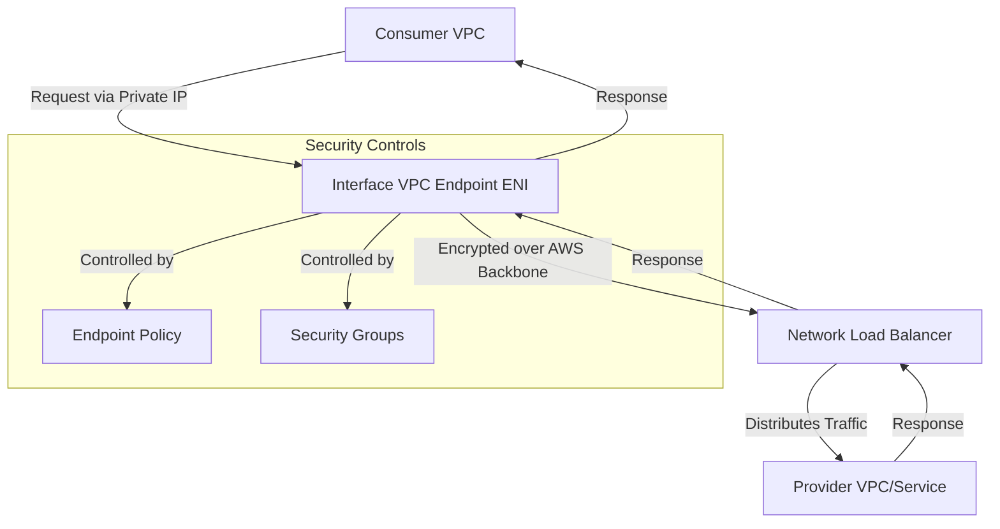
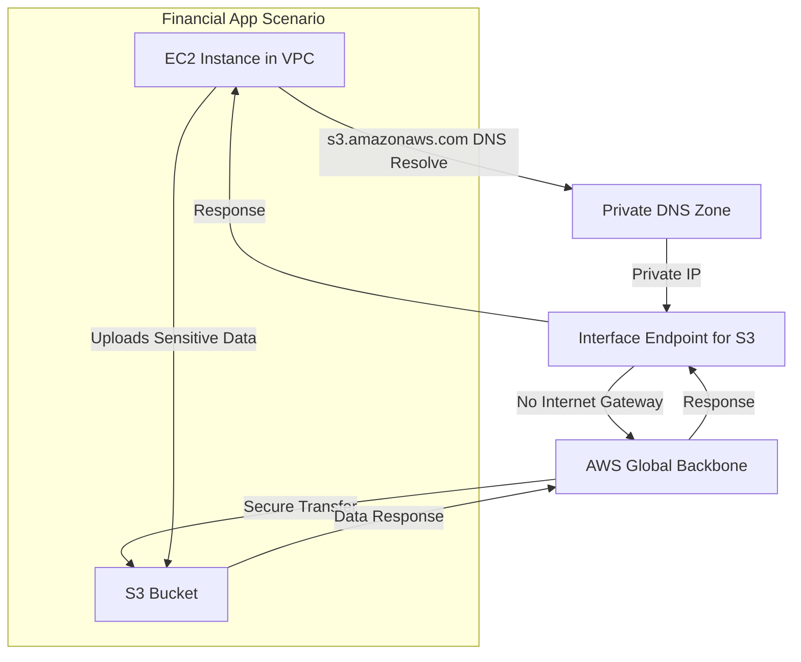
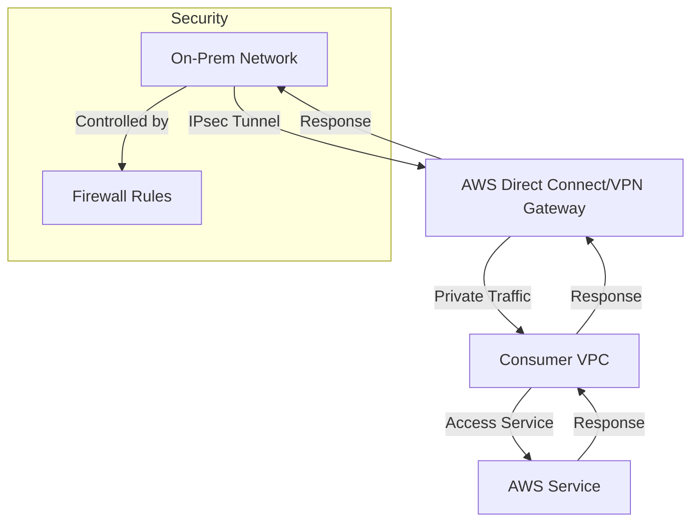

# Private Link

## AWS PrivateLink

### 🌟 Overview

AWS PrivateLink is a networking service that enables secure, private connectivity between your Amazon Virtual Private Clouds (VPCs), AWS services, third-party services hosted on AWS, and on-premises networks, without exposing traffic to the public internet. It simplifies network architecture by allowing unidirectional communication from consumer VPCs to provider services via interface endpoints or endpoint services, ensuring data stays within the AWS global backbone.

<figure><figcaption></figcaption></figure>

Deep dive: PrivateLink operates through two main components—interface VPC endpoints for accessing AWS or third-party services privately, and endpoint services for sharing your own applications with other AWS accounts. It supports cross-account and cross-region connectivity, with traffic encrypted and isolated. Key features include private DNS resolution, integration with AWS Transit Gateway for centralized management, and support for services like Amazon S3, DynamoDB, and custom SaaS applications. As of 2025, enhancements include expanded cross-region support and VPC resource sharing for SaaS extensions.

🤖 **Innovation Spotlight**: In 2025, AWS introduced cross-region PrivateLink connectivity, enabling secure global data perimeters without public IP exposure, ideal for multi-region architectures in regulated industries like finance. This builds on 2024 launches, adding VPC resource support for seamless SaaS extensions across accounts.

### ⚡ Problem Statement

In a multi-account AWS environment, a financial institution needs to securely access third-party analytics services from its VPC without routing traffic over the internet, avoiding exposure to threats like DDoS attacks or data interception. Traditional methods like VPC peering or internet gateways introduce complexity in route management, scalability issues, and increased security risks from public exposure.

Industries/applications: Financial services for secure API access; healthcare for HIPAA-compliant data sharing; e-commerce for private backend integrations; government for isolated cloud-to-on-premises connectivity. Example: A bank uses PrivateLink to connect trading apps to market data providers privately.

#### 🤝 Business Use Cases

* **Secure SaaS Integration**: Connect enterprise apps to SaaS providers like Salesforce without public endpoints.
* **Multi-Account Service Sharing**: Share internal services across AWS accounts in a multi-tenant setup.
* **On-Premises Hybrid Access**: Extend on-premises apps to AWS services via Direct Connect.
* **AI/ML Workloads**: Privately access Amazon Bedrock models from isolated VPCs.
* **Observability**: Securely send metrics to monitoring tools like Dynatrace or Splunk.

### 🔥 Core Principles

AWS PrivateLink is built on event-driven, scalable networking that eliminates internet dependencies, promoting serverless-like benefits for connectivity with high availability and fault tolerance. It ensures unidirectional traffic (consumer to provider), encryption in transit, and isolation within AWS's backbone.

Key terms:

* **Interface VPC Endpoint**: A private entry point in your VPC to access AWS or third-party services; uses elastic network interfaces (ENIs) for connectivity.
* **Endpoint Service**: Allows you to publish your service (e.g., behind a Network Load Balancer) for consumption by other VPCs/accounts.
* **Private DNS**: Automatically resolves service names to private IPs within your VPC.
* **Endpoint Policy**: IAM-like policies to control access to the endpoint.
* **Network Load Balancer (NLB)**: Required for endpoint services to distribute traffic.

### 📋 Pre-Requirements

* **VPC and Subnets**: A VPC with at least one subnet per Availability Zone for high availability; purpose: host endpoints and resources.
* **Security Groups and NACLs**: Configured to allow traffic; purpose: control inbound/outbound access.
* **IAM Roles/Permissions**: Permissions for ec2:CreateVpcEndpoint, etc.; purpose: authorize creation and management.
* **DNS Resolution**: Enable DNS hostnames and support in VPC; purpose: for private DNS.
* **Network Load Balancer (for providers)**: If sharing services; purpose: load balance traffic to backend instances.
* **AWS Account**: Active account with billing enabled; purpose: resource provisioning.

### 👣 Implementation Steps

1. **Create VPC and Subnets**: Set up a VPC with subnets in multiple AZs via AWS Console or CLI.
2. **Launch Resources**: Deploy EC2 instances or services that will use/consume the endpoint.
3. **Create Interface Endpoint**: In VPC console, select "Endpoints" > Create > Choose service (e.g., com.amazonaws.region.s3) > Select subnets and security groups.
4. **Configure Endpoint Policy**: Attach a policy to restrict actions (e.g., allow only s3:GetObject).
5. **Enable Private DNS**: Turn on private DNS names for seamless resolution.
6. **Update Route Tables/Security**: Associate route tables and update security groups to allow traffic.
7. **Test Connectivity**: Ping or access the service from your VPC resources.
8. **For Providers: Create Endpoint Service**: Set up NLB, create endpoint service, and share with consumers.

### 🗺️ Data Flow Diagram

**Diagram 1: How AWS PrivateLink Works**

**Diagram 2: Example Use Case - Private Access to Amazon S3**

### 🔒 Security Measures

* Enable endpoint policies to enforce least privilege access (e.g., restrict to specific API actions).
* Use security groups and NACLs to filter traffic at the endpoint level.
* Implement VPC flow logs and AWS Network Firewall for monitoring.
* Enforce inbound rules on NLBs for provider services.
* Centralize governance with AWS Organizations for multi-account access controls.
* Avoid public DNS; use private DNS for isolation.

### 🚀 Cross-Region Connectivity Innovations

As of 2025, PrivateLink's cross-region support allows global secure perimeters, integrating with Transit Gateway for low-latency, encrypted inter-region traffic—innovative for distributed AI workloads spanning continents without VPN overhead.

### ⚖️ When to Use and When Not to Use

* ✅ **When to Use**: For secure, private access to services in regulated environments; multi-account sharing; hybrid on-premises integrations; reducing internet exposure in high-security apps.
* ❌ **When Not to Use**: For public-facing APIs needing global anycast (use API Gateway instead); simple intra-VPC communication (use security groups); when cost of data processing exceeds benefits for low-volume traffic.

### 💰 Costing Calculation

* **How it is Calculated?**: Billed per VPC endpoint hour ($0.01–$0.013 per AZ/hour), plus data processed ($0.01/GB for first 1 PB/month). No charges for data transfer within the same AZ; cross-AZ/region adds standard fees.
* **Efficient Ways**: Centralize endpoints in shared VPCs to minimize per-account costs; use Transit Gateway for multi-VPC sharing; monitor with Cost Explorer to optimize AZ placement.
* **Sample Calculations**: For 1 endpoint in 2 AZs, 730 hours/month: (2 AZs \* 730 \* $0.01) = $14.60/hourly + 100 GB data \* $0.01/GB = $1; Total \~$15.60/month. For high-volume (1 TB): Hourly same + $10 data = \~$24.60/month.

### 🧩 Alternative Services in AWS/Azure/GCP/On-Premise

| Aspect                | AWS (PrivateLink)                    | Azure (Private Link)                          | GCP (Private Service Connect)     | On-Premise (VPN/Direct Connect)      |
| --------------------- | ------------------------------------ | --------------------------------------------- | --------------------------------- | ------------------------------------ |
| **Connectivity Type** | Private VPC-to-service via endpoints | Private VNet-to-service links                 | Private VPC-to-service publishing | Site-to-site VPN or dedicated lines  |
| **Scalability**       | Auto-scales with ENIs; cross-region  | Scales with private endpoints; global peering | High scalability; inter-project   | Limited by hardware; manual scaling  |
| **Security**          | Endpoint policies, no internet       | Resource-specific policies                    | PSC policies, no public IP        | Encryption via IPsec; firewall rules |
| **Cost Model**        | Per hour + data processed            | Per hour + ingress/egress                     | Per forwarded GB + endpoints      | Hardware + bandwidth fees            |
| **Key Difference**    | Unidirectional, NLB-based            | Bidirectional options                         | Focus on service aliases          | No cloud-native integration          |

**On-Premise Data Flow Diagram (VPN Example)**

### ✅ Benefits

* **Security**: Keeps traffic private, reducing attack surface.
* **Scalability**: Handles high throughput without gateways.
* **Cost Savings**: Avoids NAT gateway fees; pay-per-use.
* **Automation**: Integrates with IaC tools like Terraform.
* **Performance**: Low-latency over AWS backbone.

### 🌐 VPC Resource Sharing for SaaS

Innovatively, 2025 updates allow PrivateLink to extend VPC resources like subnets for SaaS, enabling seamless multi-account extensions without custom networking—perfect for scalable, secure partner ecosystems.

### 📝 Summary

This solution delivers secure, scalable private connectivity, minimizing infrastructure management while enhancing compliance.

**Top 7 Points to Keep in Mind**:

1. Always enable private DNS for seamless integration.
2. Monitor costs via data processing fees.
3. Use endpoint policies for granular control.
4. Deploy in multiple AZs for HA.
5. Integrate with Transit Gateway for centralization.
6. Test unidirectional flow to avoid misconfigurations.
7. Review cross-region for global setups.

In short: AWS PrivateLink provides private, secure access to services across VPCs and accounts via endpoints, avoiding internet exposure. It simplifies networking for hybrid and multi-cloud. Supports cross-region and VPC sharing innovations. Ideal for compliance-heavy workloads. Billed on usage for efficiency.

### 🔗 Related Topics

* AWS VPC Documentation: https://docs.aws.amazon.com/vpc/latest/userguide/what-is-amazon-vpc.html
* PrivateLink Best Practices: https://aws.amazon.com/blogs/security/governing-and-securing-aws-privatelink-service-access-at-scale-in-multi-account-environments/
* Pricing Calculator: https://calculator.aws/
* Cross-Region Guide: https://aws.amazon.com/blogs/networking-and-content-delivery/introducing-cross-region-connectivity-for-aws-privatelink/
