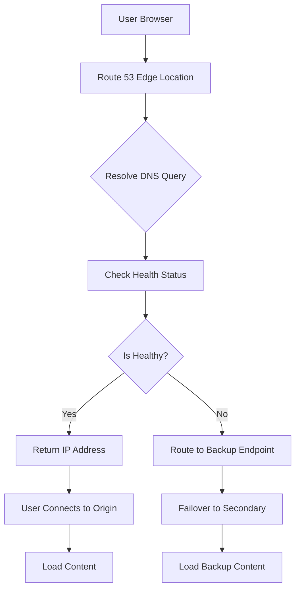
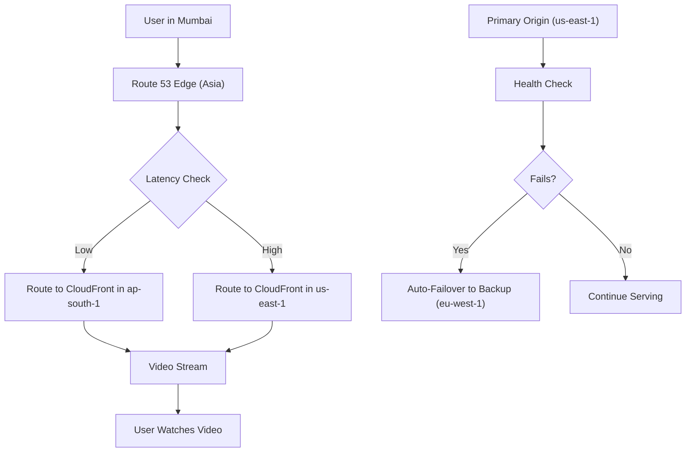
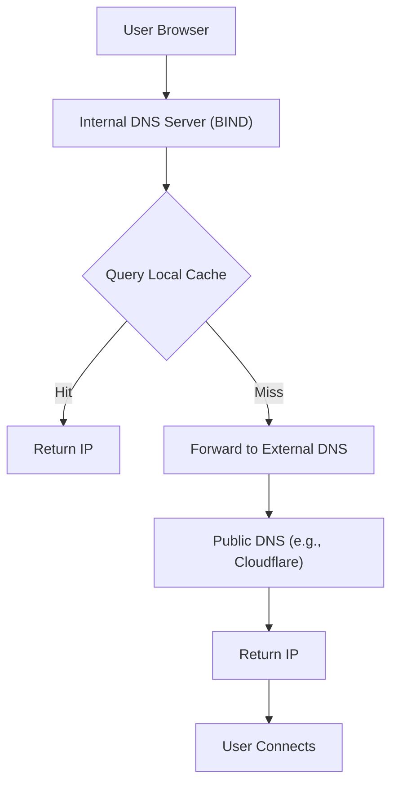

# Route 53

***

## 🌐 **Amazon Route 53**

#### _The Global DNS & Traffic Management Engine for High Availability, Performance, and Resilience_

> ✅ **Updated 2025**: Amazon Route 53 has evolved from a simple DNS provider into a **smart, intelligent, AI-enhanced global traffic management platform** — capable of routing users to the fastest, most reliable endpoint based on real-time conditions, location, health, and business logic.

***

### 🌟 **Overview**

**Amazon Route 53** is AWS’s highly available, scalable, and secure Domain Name System (DNS) service. It translates human-readable domain names (e.g., `www.example.com`) into IP addresses so browsers can load internet resources.

<figure><figcaption></figcaption></figure>

But today, Route 53 is **much more than DNS** — it’s a **global traffic manager**, **health checker**, **failover engine**, and **performance optimizer**.

> 🔥 **Innovation Spotlight:**\
> Route 53 now includes:
>
> * 🤖 **AI-Powered Traffic Routing (Smart Routing)**: Uses ML models trained on global network performance data to route users to the **fastest path**.
> * 💬 **Natural Language Query (NLQ) Integration with Amazon Q**: Ask: _“Route all EU traffic to Frankfurt”_ → auto-creates routing policy.
> * 🚀 **Dynamic Latency-Based Routing**: Routes users based on real-time latency from their location.
> * 🔍 **Health Checks + Automatic Failover**: Detects failures in seconds and reroutes traffic instantly.
> * 🌍 **Multi-Region & Multi-Cloud Support**: Works across AWS, Azure, GCP, and on-premises.
> * 📊 **Integration with Amazon CloudFront, ALB, and S3**: Seamless edge optimization.

> ✨ This turns Route 53 from a **static DNS resolver** into an **intelligent application delivery controller**.

***

### ⚡ **Problem Statement**

#### 🏢 Real-World Scenario: Global Media Streaming Platform

**Company:** A video streaming platform serving 10M+ users across 100+ countries\
**Challenge:**

* Users in India experience high buffering due to poor routing to US-based origin servers
* During a regional outage in `us-east-1`, the site went down for hours
* No way to prioritize low-latency paths or detect backend failures automatically
* Manual DNS changes caused delays and errors

> ❗ Result: 30% drop in engagement, $2M+ lost revenue during peak hours.

***

#### 🤝 **Business Use Cases**

| Industry                  | Application                                                        |
| ------------------------- | ------------------------------------------------------------------ |
| **E-Commerce**            | Route shoppers to nearest region for faster checkout               |
| **Financial Services**    | Ensure low-latency trading connections between regions             |
| **Media & Entertainment** | Deliver video content with minimal buffering using CDN integration |
| **Gaming**                | Match players to lowest-latency game servers                       |
| **Enterprise IT**         | Enable hybrid cloud failover between AWS and on-prem               |

> 💡 Use Case Highlight:\
> A global bank uses **Route 53 + Amazon Q** to ask:\
> &#xNAN;_“Route all transactions from Japan to Tokyo region.”_\
> → Route 53 auto-configures latency-based routing with health checks.

***

### 🔥 **Core Principles**

| Concept                                  | Explanation                                                              |
| ---------------------------------------- | ------------------------------------------------------------------------ |
| **Domain Registration & DNS Management** | Register domains and manage records (A, AAAA, CNAME, MX, TXT).           |
| **Global Low-Latency DNS Resolution**    | Uses 100+ DNS edge locations worldwide for sub-second response times.    |
| **Health Checks**                        | Monitors endpoints (EC2, ELB, S3, HTTP/HTTPS URLs) every 10 seconds.     |
| **Failover Routing**                     | Automatically redirects traffic if primary endpoint fails.               |
| **Latency-Based Routing**                | Routes users to the endpoint with the lowest network latency.            |
| **Geolocation Routing**                  | Routes based on user's geographic location.                              |
| **Weighted Routing**                     | Distributes traffic across multiple endpoints by weight (e.g., 70%/30%). |
| **Multivalue Answer Routing**            | Returns multiple IPs for improved availability.                          |
| **Traffic Flow (Advanced)**              | Visual drag-and-drop interface to build complex routing policies.        |

> 🛠️ Key Resources:
>
> * `Hosted Zone` – DNS namespace for your domain
> * `Record Set` – DNS record (A, CNAME, etc.)
> * `Health Check` – Monitors endpoint status
> * `Routing Policy` – Defines how traffic is routed
> * `Traffic Flow` – GUI for advanced routing
> * `DNS Query Logs` – Audit trail of DNS queries

***

### 📋 **Pre-Requirements**

| Service                                | Purpose                             |
| -------------------------------------- | ----------------------------------- |
| **AWS IAM Roles**                      | Grant access to Route 53 APIs       |
| **Amazon S3 / EC2 / ALB / CloudFront** | Endpoints to be monitored/routed    |
| **Amazon CloudWatch**                  | Optional: Monitor DNS query metrics |
| **AWS Organizations**                  | Required for multi-account routing  |
| **VPC Endpoints (Optional)**           | For private DNS resolution          |
| **Amazon Route 53 Resolver**           | For VPC-to-Private DNS resolution   |

> ✅ Ensure `Route53FullAccess` policy is attached.

***

### 👣 **Implementation Steps**

1. **Register a Domain (or Import Existing)**\
   → Go to **Route 53 Console** → “Domains” → “Register Domain”\
   → Choose `.com`, `.org`, etc.
2. **Create a Hosted Zone**\
   → Click “Create Hosted Zone” → Enter domain name (e.g., `example.com`)\
   → Select public/private zone
3. **Add Record Sets**\
   → Create:
   * `A` record: `www.example.com` → `192.0.2.1` (your ALB)
   * `CNAME`: `api.example.com` → `api.example.com.elb.amazonaws.com`
   * `MX`: For email routing
4. **Set Up Health Checks**\
   → Go to “Health Checks” → “Create Health Check”\
   → Define:
   * Endpoint: `https://www.example.com`
   * Interval: 10 seconds
   * Failure Threshold: 3
   * Region: Global
5. **Configure Routing Policy**\
   → In hosted zone, edit record set → choose policy:
   * **Failover**: Primary/Secondary (e.g., us-east-1 vs eu-west-1)
   * **Latency-Based**: Route to closest region
   * **Geolocation**: Route by country/continent
   * **Weighted**: Distribute traffic (e.g., 80% to prod, 20% to staging)
6.  **Use Traffic Flow (GUI for Complex Policies)**\
    → Go to “Traffic Flow” → Drag-and-drop builder\
    → Create rules like:

    > IF user in Europe → Route to `eu-central-1`\
    > ELSE IF health check fails → Route to backup
7. **Test with Amazon Q**\
   → Ask: _“Show me all routes for example.com in Europe.”_\
   → Route 53 returns live routing map.
8. **Enable DNS Query Logging (Optional)**\
   → Send logs to CloudWatch for auditing.

***

### 🗺️ **Data Flow Diagrams**

#### 📊 **Diagram 1: How Amazon Route 53 Works (Architecture)**

#### 📊 **Diagram 2: Use Case – Global Video Streaming with Failover**

> ✅ Clear flow: **User → Smart Routing → Fast Delivery → Failover Protection**

***

### 🔒 **Security Measures**

✅ **Best Practices:**

* 🔐 **Enable DNSSEC** for domain authenticity
* 🔒 **Use IAM roles with least privilege**
* 🧹 **Enable DNS Query Logging** via CloudWatch
* 🛑 **Disable public DNS for sensitive zones**
* 🔄 **Rotate API keys regularly**
* 🚫 **Never expose Route 53 API keys publicly**
* 📊 **Monitor for DNS amplification attacks** using AWS Shield

> 📌 Pro Tip: Use **Amazon Q for AWS** to ask:\
> &#xNAN;_“Who made DNS changes last week?”_

***

### 🎯 **Innovation Spotlight: AI-Powered Traffic Optimization (2025)**

Route 53 now uses **machine learning models trained on global network telemetry** to:

* Predict optimal routing paths
* Auto-adjust weights based on real-time congestion
* Detect anomalies (e.g., DDoS patterns)
* Suggest improvements via **Amazon Q**

> 🤖 Example:\
> You type: _“Optimize routing for my app in APAC.”_\
> → Route 53 analyzes latency, health, and cost → suggests new weighted routing.

> 🔥 Future: Route 53 will auto-generate **traffic plans**, **backup strategies**, and even **simulate failure scenarios**.

***

### ⚖️ **When to Use and When Not to Use**

| ✅ When to Use                                                | ❌ When Not to Use                                  |
| ------------------------------------------------------------ | -------------------------------------------------- |
| You need **high availability and low latency**               | You only have **one server** and no redundancy     |
| Managing **multi-region, multi-cloud** apps                  | You’re doing a **simple POC** with no scale needs  |
| Want **automated failover and health checks**                | You prefer **manual DNS updates**                  |
| Building **global applications** (e-commerce, media, gaming) | You don’t care about **user experience or uptime** |
| Integrating with **CloudFront, ALB, S3, Lambda@Edge**        | You want **full control over DNS binaries**        |

> ⚠️ Note: Route 53 is not a replacement for **CDNs** (use CloudFront), but a **smart front-end** for them.

***

### 💰 **Costing Calculation**

#### How It’s Calculated:

* **$0.50 per hosted zone/month**
* **$0.002 per 1,000 DNS queries**
* **$0.50 per health check/month**
* **$0.0001 per additional record set beyond 100**

> 📌 Example:
>
> * 1 hosted zone → $0.50
> * 10M queries/month → 10,000 × $0.002 = $20
> * 2 health checks → $1
> * 150 record sets → $0.05
>
> **Total Monthly Cost**: \~**$21.55**

> 💡 **Efficient Usage Tips:**
>
> * Use **wildcard records** (`*.example.com`) to reduce record count
> * Disable unused health checks
> * Use **Route 53 Resolver** for VPC-to-private DNS (cost-effective)

> ✅ **Bottom Line**: Extremely low cost for massive reliability.

***

### 🧩 **Alternative Services Comparison**

| Service              | Provider        | Key Difference                                  | On-Premise Equivalent         |
| -------------------- | --------------- | ----------------------------------------------- | ----------------------------- |
| **Amazon Route 53**  | AWS             | Fully managed, AI-enhanced, multi-cloud, global | BIND + PowerDNS (self-hosted) |
| **Google Cloud DNS** | Google Cloud    | Similar but GCP-centric                         | Google Cloud DNS (managed)    |
| **Azure DNS**        | Microsoft Azure | Azure-only; less flexible for multi-cloud       | Azure DNS (managed)           |
| **Cloudflare**       | Third-party     | Strong DDoS protection, CDN, but vendor lock-in | Cloudflare (public DNS)       |
| **PowerDNS**         | Open Source     | Full control, but requires DevOps effort        | Self-hosted PowerDNS          |

#### 🖼️ On-Premise Data Flow Diagram (Using Route 53-like Model)

> 🔍 On-prem lacks global reach, AI routing, and automation — must be built manually.

***

### ✅ **Benefits**

| Benefit                            | Impact                                    |
| ---------------------------------- | ----------------------------------------- |
| 🚀 **Sub-second DNS Resolution**   | Faster app loading                        |
| 🌍 **Global Reach**                | 100+ edge locations                       |
| 🔁 **Automatic Failover**          | Zero downtime during outages              |
| 📊 **Real-Time Health Monitoring** | Detect issues in <10 seconds              |
| 🤖 **AI-Powered Routing**          | Optimize for speed, cost, and reliability |
| 💬 **Natural Language Queries**    | No CLI/JSON needed                        |
| 💰 **Predictable Pricing**         | Transparent, low-cost                     |
| 🌐 **Multi-Cloud Ready**           | Works with Azure, GCP, on-prem            |

***

### 🎮 **Next-Gen Innovation: Route 53 + Amazon Q (AI Copilot for DNS Architects)**

Imagine asking:

> _“Route all traffic from Brazil to São Paulo.”_

👉 Amazon Q responds:

> “I’ve created a geolocation routing policy for `example.com`. All traffic from Brazil will now go to `sa-east-1`. Health checks are enabled. Would you like to add a backup?”

> 🤖 This isn’t just DNS — it’s **AI-assisted infrastructure design**.

> 🔥 Future: Route 53 will auto-generate **disaster recovery plans**, **traffic forecasts**, and **cost-optimized routing**.

***

### 📝 **Summary**

> ✅ **What is Amazon Route 53?**\
> It’s AWS’s **fully managed, intelligent DNS and traffic management service** that powers **high availability, low latency, and resilience** for global applications.

> 🔑 **Top 10 Takeaways:**
>
> 1. Launch a **global, resilient DNS system in minutes**.
> 2. Use **AI-powered routing** for fastest user experience.
> 3. Leverage **automatic failover** for zero downtime.
> 4. Integrate with **CloudFront, ALB, S3, Lambda@Edge**.
> 5. Use **natural language queries** via Amazon Q.
> 6. Deploy with **DNSSEC, IAM, and encryption**.
> 7. Ideal for **multi-region, multi-cloud, enterprise-scale** apps.
> 8. Costs are predictable and extremely low.
> 9. Not for simple static sites — it’s for **mission-critical, high-performance systems**.
> 10. The future of DNS is **smart, automated, and self-healing**.

> 📝 **In 5 Lines:** Amazon Route 53 delivers a global, intelligent DNS and traffic management platform.\
> It routes users to the fastest, most reliable endpoint using health checks and AI.\
> With failover, latency, geolocation, and weighted routing — it ensures uptime.\
> Built for enterprises scaling across regions and clouds.\
> It’s not just DNS — it’s your **application delivery brain**.

***

### 🔗 **Related Topics & References**

* [Amazon Route 53 Documentation](https://docs.aws.amazon.com/route53/)
* [Amazon Q for AWS: AI Copilot](https://aws.amazon.com/q/)
* [Amazon CloudFront Integration](https://docs.aws.amazon.com/cloudfront/)
* [AWS Well-Architected Framework – Operational Excellence](https://aws.amazon.com/architecture/well-architected/)
* [Route 53 Health Checks Best Practices](https://docs.aws.amazon.com/Route53/latest/DeveloperGuide/dns-failover.html)

***
