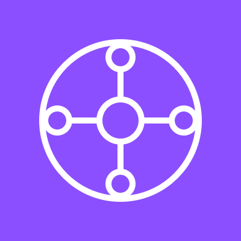
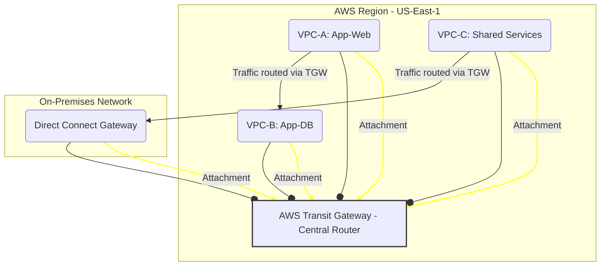
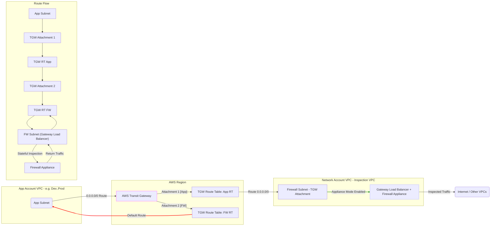
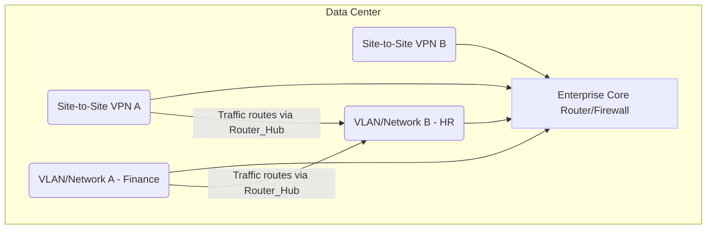

# Transit Gateway

***

## AWS Transit Gateway (TGW) 🌐

### 🌟 Overview

**AWS Transit Gateway (TGW)** is a **highly scalable, cloud-native network transit hub** that connects your Amazon Virtual Private Clouds (VPCs) and your on-premises networks through a central gateway. It simplifies your network topology by acting as a **cloud router**, eliminating the need for complex, unscalable **VPC peering mesh** connections.

<figure><figcaption></figcaption></figure>

Instead of managing numerous point-to-point connections, you connect all your networks (VPCs, AWS Site-to-Site VPNs, AWS Direct Connect) to the TGW, which then handles the routing. TGW is a **Regional service**, but it supports **Inter-Region Peering** to build a global network backbone across the AWS global infrastructure.

#### 🤖 Innovation Spotlight: Centralized Network Architectures

The most significant modern innovation with TGW is its role in enabling **Centralized Network Architectures** with security inspection and advanced routing.

* **Network Segmentation and Isolation:** TGW allows you to use multiple **Transit Gateway Route Tables** to isolate traffic for different environments (e.g., Development, Staging, Production) or business units, ensuring that a VPC in one environment cannot communicate with a VPC in another unless explicitly allowed.
* **Centralized Egress and Ingress Inspection:** By integrating TGW with services like **AWS Network Firewall** or third-party firewall appliances via the **Gateway Load Balancer (GWLB)** and **TGW Appliance Mode**, you can force all East-West (VPC-to-VPC) and North-South (VPC-to-Internet/On-Premises) traffic through a dedicated **Inspection VPC**. This ensures all traffic is subject to deep packet inspection, intrusion detection, and filtering from a single control point.
* **Transit Gateway Connect:** This feature simplifies the integration of **Software-Defined Wide Area Network (SD-WAN)** appliances, using standard protocols like **GRE (Generic Routing Encapsulation)** and **BGP (Border Gateway Protocol)**. This offers better bandwidth and dynamic routing compared to traditional IPsec VPNs alone.
* **Multicast Support:** TGW natively supports **multicast** routing, making it easier to "lift and shift" applications that rely on multicast (like financial market data feeds or video streaming) into the cloud without complex workarounds.

***

### ⚡ Problem Statement

A large multinational corporation, **"GlobalTech Inc."**, has rapidly adopted AWS, resulting in **50+ VPCs** across **3 AWS Regions** (US-East-1, EU-Central-1, AP-Southeast-2). They have separate VPCs for each application team (CRM, ERP, Data Lake), security tools (central logging, firewall), and connectivity to their global headquarters via **AWS Direct Connect**.

The current architecture relies on a tangled web of **VPC Peering connections**. To allow the CRM team in VPC-A to access the Data Lake in VPC-B, they need a peering connection. To allow VPC-A to reach the central DNS in VPC-C, they need another peering connection, and so on.

The number of required peering connections ($N$) quickly becomes unmanageable: $N \* (N-1) / 2$. With 50 VPCs, this would require $50 \times 49 / 2 = \mathbf{1,225}$ peering connections, all of which require meticulous route table management. This complexity is slowing down innovation, increasing operational overhead, and making it difficult to enforce a consistent security policy across the enterprise.

#### 🤝 Business Use Cases

| Industry/Application        | Use Case                            | Example                                                                                                                                                                        |
| --------------------------- | ----------------------------------- | ------------------------------------------------------------------------------------------------------------------------------------------------------------------------------ |
| **Enterprise IT**           | **Centralized Network Backbone**    | Connecting hundreds of VPCs across multiple accounts and regions to a single hub for streamlined internal communication and hybrid cloud connectivity.                         |
| **Finance/Trading**         | **Multicast Routing**               | Migrating latency-sensitive financial market data distribution systems (which rely on multicast) to the cloud.                                                                 |
| **Retail/E-commerce**       | **Centralized Security Inspection** | Forcing all outbound traffic from various application VPCs (web, inventory, payments) through a central Security VPC hosting a firewall for policy enforcement and compliance. |
| **Telco/Service Providers** | **SD-WAN Integration**              | Seamlessly extending their customer’s on-premises SD-WAN infrastructure into AWS for high-bandwidth, resilient cloud access.                                                   |

***

### 🔥 Core Principles

AWS Transit Gateway is built on the **Hub-and-Spoke** architecture principle:

1. **Hub:** The **AWS Transit Gateway** itself, which serves as the central point.
2. **Spokes:** The networks connected to the TGW, called **Attachments**.

#### Core Resources and Terms:

| Resource/Term                            | Explanation                                                                                                                                                                                                                                                                                                                                |
| ---------------------------------------- | ------------------------------------------------------------------------------------------------------------------------------------------------------------------------------------------------------------------------------------------------------------------------------------------------------------------------------------------ |
| **Transit Gateway (TGW)**                | The regional, highly available, and scalable cloud router. It is the central component that all other networks attach to.                                                                                                                                                                                                                  |
| **Attachment**                           | The logical connection of a network resource to the TGW. Types include: **VPC Attachment**, **VPN Attachment** (Site-to-Site), **Direct Connect Gateway Attachment**, **Peering Attachment** (Inter-Region), and **Connect Attachment** (for SD-WAN).                                                                                      |
| **Transit Gateway Route Table (TGW-RT)** | Determines the next hop for traffic coming into the TGW from an associated attachment. It contains static and/or dynamically propagated routes. A TGW can have multiple route tables for network segmentation.                                                                                                                             |
| **Association**                          | An **Attachment** is associated with exactly **one** TGW Route Table. This TGW-RT is used to determine the _outbound_ route for traffic coming _from_ that attachment.                                                                                                                                                                     |
| **Propagation**                          | A network (**Attachment**) can dynamically advertise (propagate) its routes (e.g., VPC CIDRs) into one or more TGW Route Tables. This makes the connected network visible to other attachments.                                                                                                                                            |
| **Inter-Region Peering**                 | A connection that links two Transit Gateways in different AWS Regions, enabling VPCs in one region to communicate with VPCs in another, utilizing the highly reliable AWS Global Infrastructure.                                                                                                                                           |
| **Appliance Mode**                       | A setting on a TGW **VPC Attachment** that ensures the TGW uses a single network interface (and thus a single Availability Zone) for a particular traffic flow's lifetime. This is crucial for stateful inspection appliances (like firewalls) that need all traffic for a session to go through the same appliance instance for symmetry. |

***

### 📋 Pre-Requirements

| Service/Tool                              | Purpose                                                                                                                                                                    |
| ----------------------------------------- | -------------------------------------------------------------------------------------------------------------------------------------------------------------------------- |
| **AWS Account(s) & IAM**                  | To create and manage the TGW and its attachments. A dedicated **Networking Account** is best practice.                                                                     |
| **AWS Resource Access Manager (RAM)**     | To share the TGW from the central Networking Account with other application VPCs/accounts.                                                                                 |
| **VPCs and Subnets**                      | The networks you intend to connect. For TGW attachments, you need at least one small subnet (e.g., `/28`) in each **Availability Zone (AZ)** where the TGW will be active. |
| **AWS Site-to-Site VPN / Direct Connect** | Required if you need to connect your on-premises data center to the TGW.                                                                                                   |
| **VPC Route Tables**                      | To configure the VPC to send inter-VPC or hybrid traffic to the TGW attachment.                                                                                            |

***

### 👣 Implementation Steps

Here are the steps to set up a TGW and connect two VPCs in different accounts, leveraging **AWS RAM**:

1. **Create the Transit Gateway:**
   * Navigate to the **VPC** console (under Transit Gateways).
   * Click **Create Transit Gateway**.
   * Specify a name, description, and select the **Auto accept shared attachments** option if you wish, though manual acceptance is generally more secure.
   * _Optional:_ Enable **Default route table association/propagation** for simplest hub-and-spoke (though multiple TGW-RTs is the best practice for segmentation).
2. **Share the TGW (using AWS RAM):**
   * Go to the **AWS RAM** console in the Networking Account.
   * Create a **Resource Share** for the newly created TGW, sharing it with the target Application Accounts (either by Account ID or Organizational Unit).
3. **Create VPC Attachments (in the Application Accounts):**
   * In an Application Account, go to the **VPC** console and select **Transit Gateway Attachments**.
   * Click **Create Transit Gateway Attachment**. The shared TGW will appear as an available option.
   * Select the VPC and at least one subnet in each AZ where you want the TGW to operate.
4. **Configure TGW Route Tables (in the Networking Account):**
   * Navigate back to the TGW console.
   * Create a dedicated **TGW Route Table** (e.g., `RT-APP-VPCs`).
   * **Associate:** Associate the newly created VPC attachments with `RT-APP-VPCs`.
   * **Propagate:** Propagate the routes from all associated VPC attachments (so they can talk to each other).
5. **Update VPC Route Tables (in the Application Accounts):**
   * In the Application VPCs, update the route tables for the subnets to send traffic destined for other VPCs (e.g., `10.0.0.0/8`) to the **Transit Gateway Attachment ID** as the target.
   * _Note: Routes from on-premises networks will be dynamically propagated to the TGW-RT if using BGP with VPN/Direct Connect._

***

### 🗺️ Data Flow Diagram

#### Diagram 1: How AWS Transit Gateway Works (Hub-and-Spoke)

This diagram illustrates the centralized routing nature of TGW, replacing the need for direct VPC-to-VPC peering connections.

#### Diagram 2: Centralized Egress/Security Inspection Use Case

This diagram demonstrates using TGW's multiple Route Tables for network segmentation and forcing all inter-VPC and internet-bound traffic through a dedicated Security VPC with a firewall appliance.

***

### 🔒 Security Measures

* **Least Privilege IAM:** Use **IAM Roles** to control which accounts can create/manage the TGW and which can only share/accept attachments. The central Networking account should have full control over the TGW.
* **AWS Resource Access Manager (RAM):** Use RAM to share the TGW selectively. Only share it with the minimum necessary accounts/Organizational Units.
* **TGW Route Tables for Segmentation:** Implement a **zero-trust** model by default. Create separate TGW Route Tables for different environments (e.g., `Dev`, `Prod`, `Shared-Services`) and only allow propagation and association between them where communication is _explicitly_ required.
  * Use a **Blackhole** route in a TGW-RT to explicitly block certain CIDR ranges.
* **VPC Security Groups and NACLs:** TGW connections do not bypass the regular VPC-level security. Ensure your **Security Groups** and **Network Access Control Lists (NACLs)** on the attached subnets are correctly configured to allow traffic to/from the TGW attachment network interfaces.
* **Centralized Inspection (Appliance Mode):** As discussed, enforce security policy by routing all inter-VPC and hybrid traffic through a dedicated inspection VPC using **TGW Appliance Mode** and a stateful firewall.
* **Flow Logs:** **Enable TGW Flow Logs** to monitor and audit all IP traffic routed through the TGW. Publish these logs to Amazon S3 or Amazon CloudWatch Logs for analysis and compliance.

### 🚀 Transit Gateway Network Manager

This service provides a central management console to visualize your global network topology (TGWs, VPCs, VPNs, Direct Connects, and Connect Peers), monitor network performance, and receive events/alerts. It's the central nervous system for your TGW-based global network.

***

### ⚖️ When to use and when not to use

| Feature        | ✅ When to Use AWS Transit Gateway                                                                                                             | ❌ When Not to Use AWS Transit Gateway                                                                                                                               |
| -------------- | --------------------------------------------------------------------------------------------------------------------------------------------- | ------------------------------------------------------------------------------------------------------------------------------------------------------------------- |
| **Complexity** | You have **5 or more VPCs** that need to communicate with each other or share connectivity with an on-premises network.                       | You only have **2-3 VPCs** with simple, static communication requirements; **VPC Peering** is simpler and cheaper.                                                  |
| **Scale**      | Your organization spans multiple AWS accounts and/or regions, requiring a scalable, centralized network backbone.                             | You only have resources in a single VPC and a single AWS account.                                                                                                   |
| **Security**   | You need robust network segmentation, centralized security, and the ability to route traffic through middle-box appliances (e.g., firewalls). | You need low-latency, high-bandwidth communication that **MUST** remain within a single Availability Zone (though TGW's Inter-AZ traffic is generally low latency). |
| **Advanced**   | You need to support **multicast** traffic in the cloud or integrate with modern **SD-WAN** solutions.                                         | Your architectural constraint requires you to use the maximum **9001-byte Jumbo MTU** (TGW MTU is **8500** bytes).                                                  |

***

### 💰 Costing Calculation

TGW costs are generally composed of two main components: **Hourly Attachment Charges** and **Data Processing Charges**.

#### How it is calculated?

1. **Hourly Attachment Charge:** A flat hourly rate for each active attachment (VPC, VPN, DX Gateway, Peering, Connect). This is a fixed, predictable cost.
   * _Charged to the attachment owner's account (e.g., VPC account owner)._
2. **Data Processing Charge:** A charge per Gigabyte (GB) of data processed by the TGW. This applies to data **sent** from an attachment to the TGW.
   * _Charged to the account that sends the data to the TGW._
3. **Inter-Region Data Transfer Charge:** Standard cross-region data transfer costs apply for traffic sent over a TGW **Peering Attachment**.

#### Efficient Way of Handling this Service

* **Consolidate VPCs:** Only use TGW attachments for VPCs that _must_ communicate or share a common path. Decommission idle VPCs.
* **Optimize Data Flow:** Use **VPC Endpoints (Gateway/Interface)** for communicating with services like S3, DynamoDB, or other private services to keep that traffic off the TGW and avoid data processing charges.
* **Use TGW Flow Logs for Optimization:** Analyze flow logs to identify high-volume traffic flows. If two VPCs have extremely high, persistent, and unsegmented traffic (East-West), you might consider if a direct VPC peering connection is more cost-effective for that specific, high-volume path _before_ going through the TGW.

#### Sample Calculation (Example Region: US East/N. Virginia)

Assume:

* TGW Hourly Attachment Charge: **$0.05/hour**
* TGW Data Processing Charge: **$0.02/GB**
* Month Duration: **730 hours**

| Component                                                                | Quantity           | Calculation                              | Monthly Cost |
| ------------------------------------------------------------------------ | ------------------ | ---------------------------------------- | ------------ |
| **VPC Attachments**                                                      | 10 VPCs            | $10 \times $0.05/hour \times 730 hours$  | **$365.00**  |
| **VPN Attachments**                                                      | 2 VPNs             | $2 \times $0.05/hour \times 730 hours$   | **$73.00**   |
| **Data Processing**                                                      | 5,000 GB processed | $5,000\text{ GB} \times $0.02/\text{GB}$ | **$100.00**  |
| **Total Estimated Monthly Cost**                                         | -                  | -                                        | **$538.00**  |
| _Note: This excludes standard Site-to-Site VPN or Direct Connect costs._ |                    |                                          |              |

***

### 🧩 Alternative services in AWS/Azure/GCP/On-Premise

| Platform       | Alternative Service                   | Key Comparison/Difference                                                                                                                                                        |
| -------------- | ------------------------------------- | -------------------------------------------------------------------------------------------------------------------------------------------------------------------------------- |
| **AWS**        | **VPC Peering**                       | Not scalable for large mesh networks (N\*(N-1)/2 connections). No transitive routing. Cheaper for 2-3 VPCs.                                                                      |
| **AWS**        | **AWS Cloud WAN**                     | Higher-level, global network service that manages multiple TGWs and integrates with third-party SD-WAN, offering centralized policy management. Better for extreme global scale. |
| **Azure**      | **Azure Virtual WAN**                 | Microsoft's hub-and-spoke networking service. Fully managed global network connectivity. Similar core concept to TGW.                                                            |
| **GCP**        | **Cloud VPN and VPC Network Peering** | GCP's native tools. VPC Peering is also not transitive. Cloud VPN is for hybrid. GCP's philosophy often leans towards a single, global VPC.                                      |
| **On-Premise** | **Hardware Router/Firewall (Hub)**    | Requires physical/virtual appliance provisioning, management, maintenance, patching, capacity planning, and is generally not "pay-as-you-go."                                    |

#### Alternative On-Premise Data Flow (Hardware Router/Firewall Hub)

***

### ✅ Benefits

* **Scalability:** Replaces thousands of complex peering relationships with a single, scalable hub that can attach to up to 5,000 VPCs per region.
* **Operational Simplicity:** Reduces the operational overhead of managing numerous point-to-point connections and thousands of route table entries. Each new network only connects once to the TGW.
* **Transitive Routing:** Automatically enables any attached spoke network to communicate with any other attached spoke network (if allowed by the TGW Route Table).
* **Centralized Control:** Allows for network segmentation and centralized security policy enforcement via multiple TGW Route Tables and integration with network appliances.
* **Global Reach:** Inter-Region Peering allows the creation of a high-speed, reliable, global network backbone over the AWS Global Infrastructure.

### 🔀 - Simplified Hybrid/Multi-Account Network Segmentation

The ability to use multiple TGW Route Tables (TGW-RTs) for different segments is a game-changer. For example:

* **Shared Services RT:** Associated with all application VPCs, and propagates routes from centralized services like DNS, AD, or monitoring tools.
* **Production RT:** Only associated with Production VPCs and allows only specific, audited communication paths.
* **Egress RT:** Forces all 0.0.0.0/0 traffic to a Security VPC for inspection.

This provides granular, large-scale network segmentation using the same central TGW resource, drastically improving security and compliance posture.

***

### 📝 Summary

**AWS Transit Gateway (TGW)** is a fully managed cloud service that acts as a **central routing hub** for your entire AWS and hybrid cloud network. It solves the scalability and complexity problems of managing many-to-many **VPC peering connections** by consolidating all network connections (VPCs, VPNs, Direct Connects) into a single, highly available resource. It enables **hub-and-spoke architectures**, network segmentation via multiple **Route Tables**, and advanced security by facilitating centralized traffic inspection.

**Top 5 Takeaways:**

1. **Hub-and-Spoke:** Replaces complex VPC peering meshes with a single central router (the TGW).
2. **Scalability:** Essential for environments with 5+ VPCs or those spanning multiple AWS accounts/regions.
3. **Segmentation:** Use **Multiple TGW Route Tables** to enforce granular network isolation and security boundaries.
4. **Centralized Security:** Leverage **Appliance Mode** and integration with GWLB/Network Firewall for centralized traffic inspection and policy enforcement.
5. **Cost:** Cost is based on **Hourly Attachment** fees and **Data Processing** fees for traffic _entering_ the TGW.

### 🔗 Related Topics

* [AWS Transit Gateway Deep Dive and Best Practices (AWS re:Invent 2024)](https://www.youtube.com/watch?v=2tHMnbTj4pw)
* AWS Resource Access Manager (RAM)
* AWS Direct Connect
* AWS Site-to-Site VPN
* AWS Network Firewall and Gateway Load Balancer
* [AWS Cloud WAN Documentation](https://aws.amazon.com/cloud-wan/)
