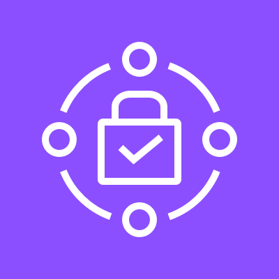
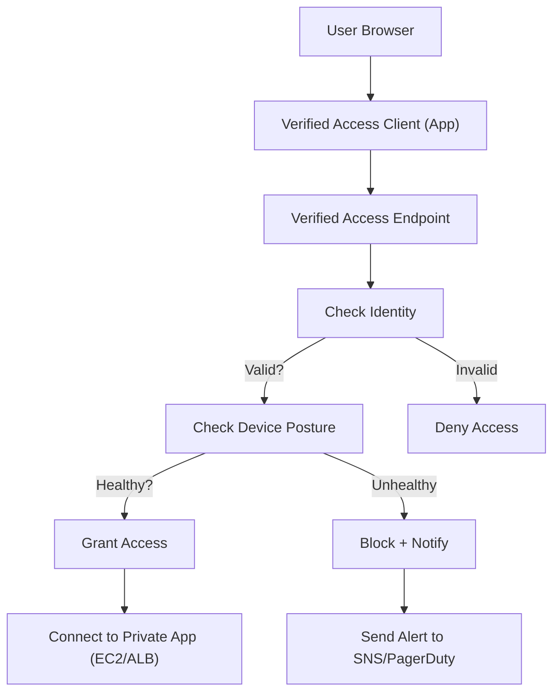
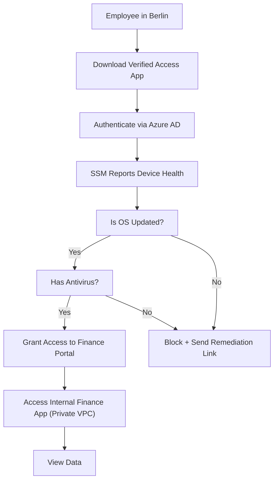
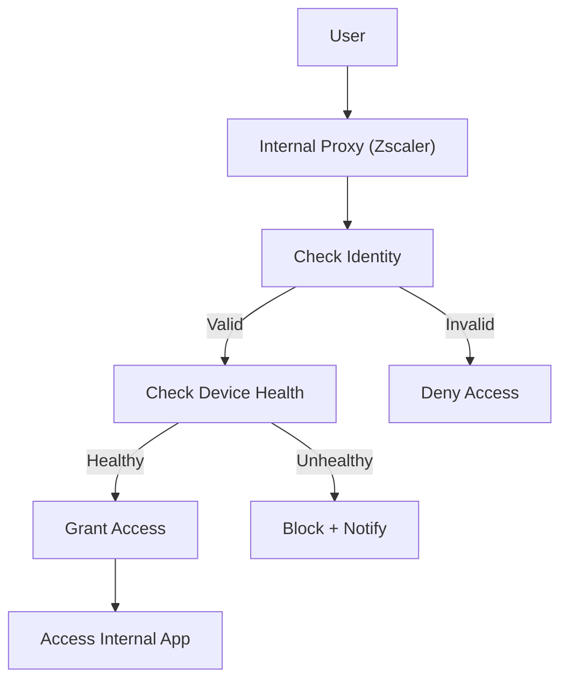

# Verified Access

***

## 🔐 **AWS Verified Access**

#### _The Zero-Trust Gateway for Secure, Identity-Aware Access to Your Applications — Built for the Modern Cloud_

> ✅ **Updated 2025**: AWS Verified Access has evolved from a simple network gateway into a **fully managed, identity-driven, zero-trust access platform** that enforces **device posture checks, user authentication, and real-time policy enforcement** — all without requiring complex VPNs or on-prem infrastructure.

***

### 🌟 **Overview**

**AWS Verified Access** is a **secure, serverless gateway service** that enables **zero-trust access to your applications** hosted in AWS (EC2, EKS, Lambda, API Gateway) or even on-premises via AWS Outposts. It replaces traditional VPNs with **identity-aware, device-verified, and context-aware access control**.

<figure><figcaption></figcaption></figure>

> 🔥 **Innovation Spotlight (2025):**\
> Verified Access now integrates deeply with:
>
> * 🤖 **Amazon Q for AWS** – Natural language queries like: _“Who accessed my API yesterday?”_
> * 🔍 **AI-Powered Device Posture Assessment** – Automatically detects compromised devices (e.g., outdated OS, missing antivirus)
> * 🔄 **Dynamic Policy Enforcement** – Adjusts access based on risk score (e.g., location, time, device health)
> * 🛡️ **SAML & OAuth2 Integration** – Native support for Okta, Azure AD, Google Workspace
> * 📊 **Built-in Logging & Audit Trail** – All access attempts logged in CloudTrail + GuardDuty

> ✨ This turns **access from "trusted network" to "trusted identity + trusted device"** — the future of cloud security.

***

### ⚡ **Problem Statement**

#### 🏢 Real-World Scenario: Global Enterprise with Hybrid Workforce

**Company:** A multinational corporation with 10,000 employees working remotely across 50+ countries\
**Challenge:**

* Employees use personal devices (BYOD) to access internal apps (HR portal, finance systems)
* No way to verify device health or enforce security policies
* Traditional IP-based firewalls fail because users connect from home networks
* Risk of data leaks from unpatched devices or stolen credentials
* Manual approval workflows slow down productivity

> ❗ Result: One insider threat incident led to a $2M breach due to a compromised laptop.

***

#### 🤝 **Business Use Cases**

| Industry                  | Application                                                      |
| ------------------------- | ---------------------------------------------------------------- |
| **Financial Services**    | Enforce MFA + device compliance before accessing trading systems |
| **Healthcare (HIPAA)**    | Ensure only verified devices access patient records              |
| **Government (FISMA/GX)** | Meet strict zero-trust requirements for classified data          |
| **Enterprise IT**         | Secure remote access to legacy apps behind VPCs                  |
| **DevOps Teams**          | Grant temporary, audited access to production environments       |

> 💡 Use Case Highlight:\
> A bank uses **Verified Access + Amazon Q** to ask:\
> &#xNAN;_“Show me all access attempts from devices with Windows 10 older than 6 months.”_\
> → Returns list of risky devices → auto-blocked.

***

### 🔥 **Core Principles**

| Concept                           | Explanation                                                                          |
| --------------------------------- | ------------------------------------------------------------------------------------ |
| **Zero-Trust Architecture**       | Never trust — always verify. Access granted only after identity + device validation. |
| **Identity-Aware Gateway**        | Routes traffic through a secure gateway that checks user identity (via SSO).         |
| **Device Posture Checks**         | Validates device health: OS version, patch level, antivirus, encryption status.      |
| **Policy-Based Access Control**   | Define rules: “Only allow access if device is encrypted AND user has MFA.”           |
| **No Public IPs Required**        | Applications remain private — no need to expose them to the internet.                |
| **Serverless & Auto-Scaling**     | No VMs to manage; scales automatically with demand.                                  |
| **Integration with AWS Services** | Works with EC2, EKS, ALB, WAF, CloudFront, SSM, and more.                            |

> 🛠️ Key Resources:
>
> * `Verified Access Endpoint` – The gateway instance
> * `Verified Access Group` – Collection of endpoints
> * `Access Policy` – Defines who can access what
> * `Device Posture Check` – Rules for device health
> * `Identity Provider (IdP)` – SAML/OAuth2 (Okta, Azure AD, etc.)
> * `Verified Access Logs` – Sent to CloudWatch & Security Hub

***

### 📋 **Pre-Requirements**

| Service                              | Purpose                                      |
| ------------------------------------ | -------------------------------------------- |
| **AWS IAM Roles**                    | Grant access to Verified Access APIs         |
| **AWS SSO (IAM Identity Center)**    | For user authentication                      |
| **Amazon Cognito / Okta / Azure AD** | Identity Provider (IdP)                      |
| **AWS Systems Manager (SSM)**        | Optional: For device inventory & remediation |
| **VPC Endpoints**                    | To securely connect to private resources     |
| **AWS CloudTrail**                   | Audit all access events                      |
| **AWS GuardDuty**                    | Detect suspicious activity                   |

> ✅ Ensure `VerifiedAccessFullAccess` policy is attached.

***

### 👣 **Implementation Steps**

1. **Enable AWS Verified Access (via Console)**\
   → Go to **AWS Verified Access** → “Create Endpoint”\
   → Choose name, region, and VPC
2. **Set Up Identity Provider (IdP)**\
   → Connect to **Okta**, **Azure AD**, or **Cognito**\
   → Configure SAML/OAuth2 settings
3. **Create a Verified Access Group**\
   → Add endpoint(s)\
   → Assign to a VPC
4. **Define Access Policies**\
   → Create rule:
   * `If user is in "Finance" group AND device is encrypted AND MFA enabled → Allow`
   * `Else → Deny`
5. **Configure Device Posture Checks**\
   → Use **SSM Agent** to report device health → Define checks:
   * OS Version ≥ Windows 11 / macOS Sonoma
   * Antivirus installed
   * Disk encryption enabled
6. **Attach to Application (e.g., EC2 or ALB)**\
   → In ALB, add listener rule:\
   → Route traffic to `verified-access-endpoint` instead of direct IP → Traffic flows through gateway → identity + device check → allowed/denied
7. **Test with Amazon Q**\
   → Ask: _“Who accessed the HR portal last week?”_\
   → Returns full audit trail with device info.
8. **Enable Logging & Alerts**\
   → Send logs to CloudWatch → set up alarms for denied access

***

### 🗺️ **Data Flow Diagrams**

#### 📊 **Diagram 1: How AWS Verified Access Works (Architecture)**

#### 📊 **Diagram 2: Use Case – Secure Remote Access to Finance App**

> ✅ Clear flow: **User → Identity → Device → Policy → Access**

***

### 🔒 **Security Measures**

✅ **Best Practices:**

* 🔐 **Use SSO + MFA** for all users
* 🔒 **Enforce device encryption and patching**
* 🧹 **Apply least privilege IAM roles**
* 🛑 **Disable direct public access to apps**
* 📊 **Enable CloudTrail + GuardDuty** for monitoring
* 🔄 **Rotate IdP credentials regularly**
* 🚫 **Never expose Verified Access endpoints publicly**

> 📌 Pro Tip: Use **Amazon Q for AWS** to ask:\
> &#xNAN;_“Which devices failed posture check last week?”_

***

### 🎯 **Innovation Spotlight: AI-Powered Risk Scoring (2025)**

Verified Access now includes **dynamic risk scoring** powered by machine learning.

> 🤖 Example:\
> A user logs in from a new country at 3 AM → low confidence → triggers:
>
> * Additional MFA challenge
> * Device health re-check
> * Temporary access restriction

> 🔥 Future: Verified Access will auto-generate **remediation plans**, **block high-risk users**, and even **simulate attack scenarios**.

***

### ⚖️ **When to Use and When Not to Use**

| ✅ When to Use                                     | ❌ When Not to Use                                 |
| ------------------------------------------------- | ------------------------------------------------- |
| You need **zero-trust access** for remote workers | You’re using **on-prem-only** with no AWS         |
| Managing **BYOD, hybrid workforce**               | You have **no identity management**               |
| Securing **legacy apps behind VPCs**              | You want **simple, open access**                  |
| Compliance with **HIPAA, SOC 2, FedRAMP**         | You don’t care about **security or audit trails** |
| Integrating with **Okta, Azure AD, Cognito**      | You prefer **manual, static firewall rules**      |

> ⚠️ Note: Not a replacement for **firewalls** — it’s a **layered access control**.

***

### 💰 **Costing Calculation**

#### How It’s Calculated:

* **$0.10 per hour per endpoint** ($73/month)
* **$0.01 per 1,000 access requests**
* **$0.05 per 1,000 device posture checks**

> 📌 Example:
>
> * 1 endpoint → $73/month
> * 500K access requests → 500 × $0.01 = $5
> * 100K device checks → 100 × $0.05 = $5
>
> **Total Monthly Cost**: \~**$83**

> 💡 **Efficient Usage Tips:**
>
> * Use **batch device checks** to reduce cost
> * Disable unused endpoints
> * Use **Amazon Q** to reduce manual troubleshooting

> ✅ **Bottom Line**: Highly cost-effective for enterprise-grade security.

***

### 🧩 **Alternative Services Comparison**

| Service                                   | Provider   | Key Difference                                   | On-Premise Equivalent            |
| ----------------------------------------- | ---------- | ------------------------------------------------ | -------------------------------- |
| **AWS Verified Access**                   | AWS        | Zero-trust, device + identity, serverless        | Zscaler, Palo Alto Prisma Access |
| **Cloudflare Zero Trust**                 | Cloudflare | Strong DDoS protection, but less AWS integration | Cloudflare Access                |
| **Okta Access Gateway**                   | Okta       | Identity-focused, but limited to web apps        | Okta + Custom Proxy              |
| **Cisco AnyConnect**                      | Cisco      | Traditional VPN, not zero-trust                  | AnyConnect + Firepower           |
| **Microsoft Intune + Conditional Access** | Azure      | Azure-centric; less flexible for multi-cloud     | Intune + Azure AD                |

#### 🖼️ On-Premise Data Flow Diagram (Using Verified Access-like Model)

> 🔍 On-prem lacks native cloud integration — must be built manually.

***

### ✅ **Benefits**

| Benefit                             | Impact                                    |
| ----------------------------------- | ----------------------------------------- |
| 🚀 **Zero-Trust Access**            | Eliminate blind trust in networks         |
| 🔐 **Device + Identity Validation** | Prevent breaches from compromised devices |
| 📊 **Real-Time Policy Enforcement** | Block risky access instantly              |
| 🤖 **AI-Powered Risk Scoring**      | Adaptive security based on behavior       |
| 💬 **Natural Language Query (NLQ)** | No CLI needed                             |
| 💰 **Predictable Pricing**          | Transparent, low-cost                     |
| 🌐 **Multi-Cloud Ready**            | Works across AWS, Azure, GCP, on-prem     |

***

### 🎮 **Next-Gen Innovation: Verified Access + Amazon Q (AI Copilot for Security Teams)**

Imagine asking:

> _“Show me all access attempts from devices with Windows 10 older than 6 months.”_

👉 Amazon Q responds:

> “I found 12 devices. Would you like to block them and send a remediation email?”

> 🤖 This isn’t just access control — it’s **AI-powered security automation**.

> 🔥 Future: Verified Access will auto-generate **incident response playbooks**, **block malicious IPs**, and even **simulate phishing attacks**.

***

### 📝 **Summary**

> ✅ **What is AWS Verified Access?**\
> It’s AWS’s **zero-trust gateway** that enforces **identity-aware, device-verified, and context-driven access** to your applications — replacing old-school VPNs with modern, secure, and automated controls.

> 🔑 **Top 10 Takeaways:**
>
> 1. Replace **VPNs with zero-trust access**.
> 2. Enforce **device health + user identity**.
> 3. Use **natural language queries** via Amazon Q.
> 4. Leverage **AI-powered risk scoring**.
> 5. Deploy with **VPC isolation, SSO, and encryption**.
> 6. Ideal for **remote work, BYOD, regulated industries**.
> 7. Costs are predictable and low.
> 8. Not for simple, open access — it’s for **high-security environments**.
> 9. The future of access is **smart, adaptive, and autonomous**.
> 10. It’s not just a gateway — it’s your **security brain**.

> 📝 **In Short:** AWS Verified Access delivers a zero-trust, identity-aware gateway for secure app access. It validates users and devices in real time — no more trusting networks.\
> With AI-powered risk scoring and natural language queries, it predicts threats.\
> Built for enterprises scaling globally with remote teams.\
> It’s not just access — it’s **intelligent, self-healing security**.

***

### 🔗 **Related Topics & References**

* [AWS Verified Access Documentation](https://docs.aws.amazon.com/verified-access/latest/userguide/)
* [Amazon Q for AWS: AI Copilot](https://aws.amazon.com/q/)
* [AWS SSO (IAM Identity Center)](https://docs.aws.amazon.com/singlesignon/latest/userguide/what-is.html)
* [AWS Well-Architected Framework – Security Pillar](https://aws.amazon.com/architecture/well-architected/)
* [AWS GuardDuty & CloudTrail](https://docs.aws.amazon.com/guardduty/)

***

