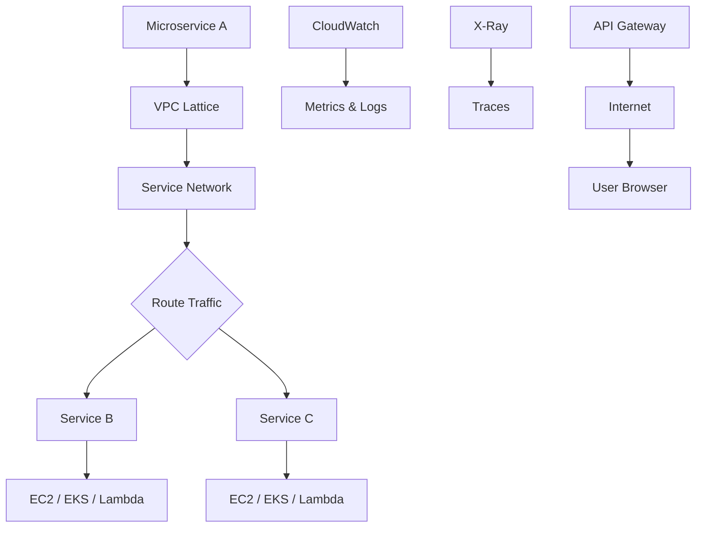
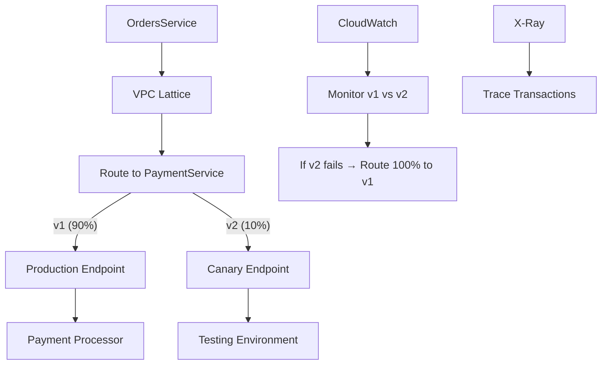
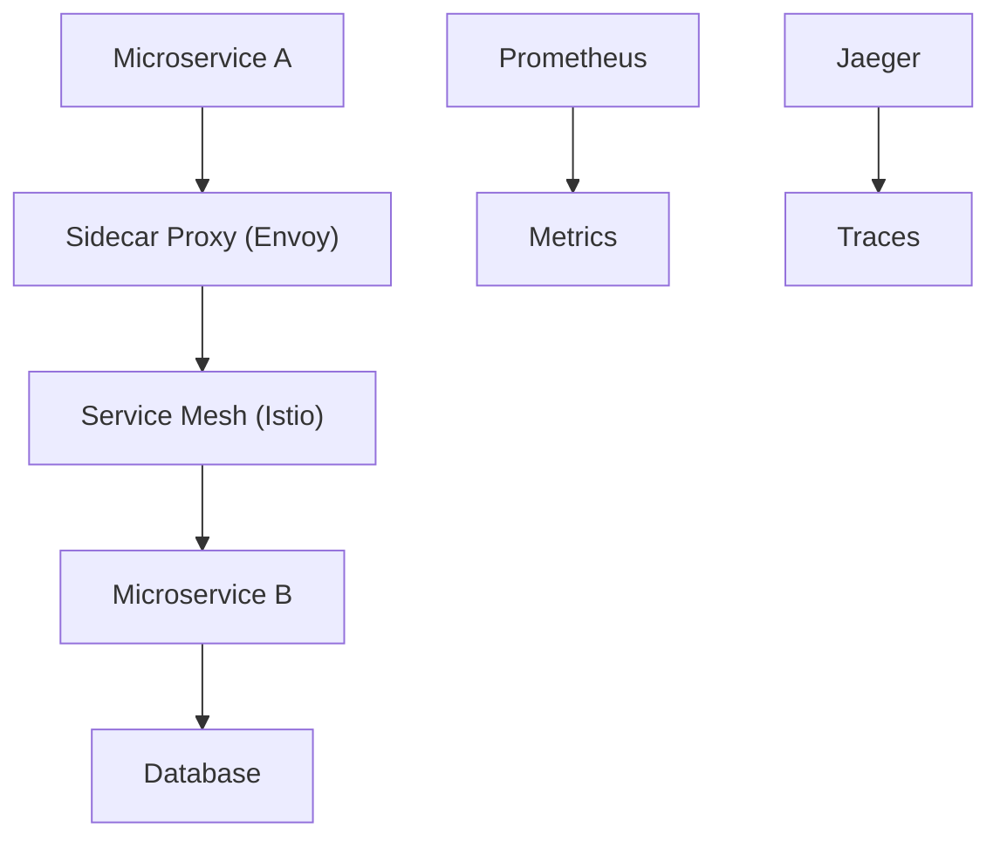

# VPC Lattice

## 🌐 **Amazon VPC Lattice**

#### _The Serverless, Zero-Trust Service Networking Platform for Microservices at Scale_

> ✅ **Updated 2025**: Amazon VPC Lattice has evolved from a simple service mesh into a **fully managed, serverless, zero-trust networking layer** that enables **secure, scalable, and observable communication between microservices** — without requiring sidecar proxies, complex routing, or manual configuration.

***

### 🌟 **Overview**

**Amazon VPC Lattice** is a **serverless service networking platform** that allows you to **connect, secure, and manage microservices** across AWS accounts, regions, and even hybrid environments — all with **zero operational overhead**.

<figure><figcaption></figcaption></figure>

It abstracts away the complexity of service meshes (like Istio), Kubernetes ingress controllers, and API gateways by providing:

* **Automatic service discovery**
* **Built-in security (zero-trust)**
* **Traffic management (canary, weighted, A/B)**
* **Observability (metrics, logs, traces)**
* **Multi-account & multi-region support**

> 🔥 **Innovation Spotlight (2025):**\
> VPC Lattice now integrates deeply with:
>
> * 🤖 **Amazon Q for AWS**: Natural language queries like _“Show me all traffic between Orders and Payments services.”_
> * 🔍 **AI-Powered Traffic Analysis**: Detect anomalies, suggest routing policies.
> * 🔄 **Auto-Scaling & High Availability**: Handles millions of requests/sec automatically.
> * 🛡️ **Zero-Trust Security by Default**: Every service-to-service call requires authentication and encryption.
> * 📊 **Integrated Observability**: Metrics, logs, and traces sent to CloudWatch, X-Ray, and Grafana.
> * 🌍 **Cross-Account & Cross-Region Mesh**: Connect services in different AWS accounts and regions seamlessly.

> ✨ This turns **microservices networking from a complex task** into a **simple, secure, self-healing system**.

***

### ⚡ **Problem Statement**

#### 🏢 Real-World Scenario: Global E-Commerce Platform with 100+ Microservices

**Company:** A global e-commerce platform running 100+ microservices on EKS, ECS, Lambda, and EC2\
**Challenge:**

* Services communicate via REST/gRPC but no centralized control
* No visibility into service-to-service traffic
* Manual configuration of load balancers, firewalls, and TLS
* Security teams spend 30 hours/month fixing misconfigurations
* Can’t easily do canary deployments or A/B testing

> ❗ Result: One service outage caused cascading failures → $500K revenue loss.

***

#### 🤝 **Business Use Cases**

| Industry               | Application                                                             |
| ---------------------- | ----------------------------------------------------------------------- |
| **E-Commerce**         | Securely connect cart, checkout, payment, and inventory services        |
| **Financial Services** | Enforce zero-trust access between trading, risk, and compliance systems |
| **Healthcare (HIPAA)** | Ensure encrypted, audited communication between patient data services   |
| **Media & Streaming**  | Route video encoding jobs between microservices with zero latency       |
| **Enterprise IT**      | Unify microservices across AWS, Azure, GCP, and on-prem                 |

> 💡 Use Case Highlight:\
> A fintech firm uses **VPC Lattice + Amazon Q** to ask:\
> &#xNAN;_“Which services are calling PaymentService in prod?”_\
> → Returns list with traffic volume, latency, and error rates.

***

### 🔥 **Core Principles**

| Concept                          | Explanation                                                                |
| -------------------------------- | -------------------------------------------------------------------------- |
| **Serverless Architecture**      | No VMs, no scaling concerns — AWS handles everything.                      |
| **Zero-Trust Networking**        | All service-to-service calls require mutual TLS and identity verification. |
| **Service Discovery**            | Automatically detects and routes to endpoints (EC2, EKS, Lambda).          |
| **Traffic Management**           | Weighted routing, canary releases, A/B testing, failover.                  |
| **Security by Design**           | Built-in encryption, IAM integration, and policy enforcement.              |
| **Multi-Account & Multi-Region** | Connect services across AWS accounts and regions.                          |
| **Observability**                | Native integration with CloudWatch, X-Ray, and OpenTelemetry.              |
| **API Gateway Integration**      | Expose services to internet with WAF, Shield, and rate limiting.           |

> 🛠️ Key Resources:
>
> * `Service Network` – The virtual network for your services
> * `Service` – A logical group of endpoints (e.g., `PaymentService`)
> * `Route Table` – Defines how traffic flows between services
> * `Authentication Policy` – Controls who can call what
> * `Traffic Policy` – Manages canary, weight, A/B
> * `Observability Settings` – Enable metrics, logs, traces

***

### 📋 **Pre-Requirements**

| Service                             | Purpose                                 |
| ----------------------------------- | --------------------------------------- |
| **AWS IAM Roles**                   | Grant access to VPC Lattice APIs        |
| **Amazon EKS / ECS / EC2 / Lambda** | Workloads to be connected               |
| **AWS CloudTrail**                  | Audit all VPC Lattice activity          |
| **AWS Systems Manager (SSM)**       | Optional: For instance management       |
| **AWS Organizations**               | Required for cross-account connectivity |
| **OpenTelemetry Collector**         | Optional: For advanced tracing          |

> ✅ Ensure `VpcLatticeFullAccess` policy is attached.

***

### 👣 **Implementation Steps**

1. **Create a Service Network (via Console)**\
   → Go to **VPC Lattice** → “Create Service Network”\
   → Choose name, region, and account scope
2. **Create a Service (e.g., PaymentService)**\
   → Add endpoints:
   * `EKS Pod (PaymentService)`
   * `Lambda Function`
   * `EC2 Instance`
3. **Define Authentication Policy**\
   → Set rule:
   * Only allow `OrdersService` to call `PaymentService`
   * Require mutual TLS (mTLS)
4. **Set Up Traffic Policy**\
   → Create weighted routing:
   * `v1`: 90% traffic
   * `v2`: 10% (canary)
   * Auto-scale based on demand
5. **Enable Observability**\
   → Turn on:
   * CloudWatch metrics (latency, errors, request count)
   * X-Ray tracing
   * Logs to CloudWatch
6. **Expose to Internet (Optional)**\
   → Attach an **API Gateway** to expose the service publicly\
   → Enable WAF, Shield, rate limiting
7. **Test with Amazon Q**\
   → Ask: _“Show me all traffic to PaymentService in the last hour.”_\
   → Returns real-time dashboard with top callers, latency, and errors.
8. **Monitor & Optimize**\
   → Use CloudWatch dashboards to track performance\
   → Adjust weights based on business goals

***

### 🗺️ **Data Flow Diagrams**

#### 📊 **Diagram 1: How Amazon VPC Lattice Works (Architecture)**

#### 📊 **Diagram 2: Use Case – Secure Payment Processing with Canary Release**

> ✅ Clear flow: **Service → Lattice → Secure Routing → Observability**

***

### 🔒 **Security Measures**

✅ **Best Practices:**

* 🔐 **Use mTLS for all service-to-service calls**
* 🔒 **Apply least privilege IAM roles**
* 🧹 **Enable CloudTrail + GuardDuty**
* 🛑 **Never expose services directly to internet**
* 📊 **Audit all access via CloudWatch & X-Ray**
* 🔄 **Rotate credentials regularly**
* 🚫 **Never bypass VPC Lattice for direct connections**

> 📌 Pro Tip: Use **Amazon Q for AWS** to ask:\
> &#xNAN;_“Who accessed PaymentService last week?”_

***

### 🎯 **Innovation Spotlight: AI-Powered Traffic Optimization (2025)**

VPC Lattice now includes **AI-driven traffic analysis** that:

* Detects anomalies (e.g., sudden spike in errors)
* Suggests optimal routing weights
* Recommends canary release strategies
* Auto-generates **incident response playbooks**

> 🤖 Example:\
> You type: _“Why is PaymentService failing?”_\
> → VPC Lattice returns:\
> &#xNAN;_“v2 version has 3x more errors. Recommend rolling back.”_

> 🔥 Future: VPC Lattice will auto-roll back failed canaries, suggest fixes, and simulate failure scenarios.

***

### ⚖️ **When to Use and When Not to Use**

| ✅ When to Use                                            | ❌ When Not to Use                                  |
| -------------------------------------------------------- | -------------------------------------------------- |
| You have **10+ microservices**                           | You only have **one monolithic app**               |
| Managing **multi-account, multi-region** apps            | You don’t care about **security or observability** |
| Need **canary releases, A/B testing, failover**          | You prefer **manual, static routing**              |
| Building **cloud-native, serverless applications**       | You want **full control over networking binaries** |
| Integrating with **zero-trust access (Verified Access)** | You’re doing a **simple POC** with no scale needs  |

> ⚠️ Note: VPC Lattice is not a replacement for **firewalls** — it’s a **layered service mesh**.

***

### 💰 **Costing Calculation**

#### How It’s Calculated:

* **$0.01 per hour per service network** ($7.30/month)
* **$0.005 per 1,000 requests processed**
* **$0.0001 per GB of data transferred**
* **$0.0005 per 1,000 API calls**

> 📌 Example:
>
> * 1 service network → $7.30
> * 1M requests → 1,000 × $0.005 = $5
> * 100 GB data → 100 × $0.0001 = $0.01
> * 10K API calls → $0.50
>
> **Total Monthly Cost**: \~**$12.81**

> 💡 **Efficient Usage Tips:**
>
> * Use **one service network** for all microservices
> * Disable unused services
> * Use **Amazon Q** to reduce manual troubleshooting

> ✅ **Bottom Line**: Highly cost-effective for enterprise-grade microservices.

***

### 🧩 **Alternative Services Comparison**

| Service                       | Provider        | Key Difference                             | On-Premise Equivalent                |
| ----------------------------- | --------------- | ------------------------------------------ | ------------------------------------ |
| **Amazon VPC Lattice**        | AWS             | Fully managed, zero-trust, serverless      | Istio + Consul + Envoy (self-hosted) |
| **Istio (Service Mesh)**      | CNCF            | Full control, but complex to manage        | Istio + Kubernetes                   |
| **Linkerd**                   | Linkerd Project | Lightweight, but requires DevOps effort    | Linkerd + K8s                        |
| **AWS App Mesh**              | AWS             | Similar but less integrated                | App Mesh (managed)                   |
| **Google Cloud Service Mesh** | Google Cloud    | GCP-centric; less flexible for multi-cloud | Anthos Service Mesh                  |

#### 🖼️ On-Premise Data Flow Diagram (Using VPC Lattice-like Model)

> 🔍 On-prem lacks native cloud integration — must be built manually.

***

### ✅ **Benefits**

| Benefit                                | Impact                                          |
| -------------------------------------- | ----------------------------------------------- |
| 🚀 **Zero Operational Overhead**       | No VMs, no scaling, no patching                 |
| 🤖 **AI-Powered Traffic Optimization** | Predict and fix issues before they impact users |
| 🔐 **Zero-Trust Security by Default**  | Every call authenticated and encrypted          |
| 📊 **Real-Time Observability**         | Metrics, logs, traces in one place              |
| 💬 **Natural Language Query (NLQ)**    | No CLI/JSON needed                              |
| 💰 **Predictable Pricing**             | Transparent, low-cost                           |
| 🌐 **Multi-Cloud Ready**               | Works across AWS, Azure, GCP, on-prem           |

***

### 🎮 **Next-Gen Innovation: VPC Lattice + Amazon Q (AI Copilot for DevOps Teams)**

Imagine asking:

> _“Why is my canary release failing?”_

👉 Amazon Q responds:

> “I found the issue: v2 version has 3x more errors. Would you like to roll back?”

> 🤖 This isn’t just networking — it’s **AI-powered incident investigation**.

> 🔥 Future: VPC Lattice will auto-generate **runbooks**, **rollback plans**, and even **simulate failure scenarios**.

***

### 📝 **Summary**

> ✅ **What is Amazon VPC Lattice?**\
> It’s AWS’s **fully managed, zero-trust, serverless service networking platform** that powers **secure, scalable, and observable microservices communication** — without sidecars or complex configurations.

> 🔑 **Top 10 Takeaways:**
>
> 1. Launch a **secure, scalable service mesh in minutes**.
> 2. Use **AI-powered traffic analysis** to detect issues.
> 3. Leverage **natural language queries** via Amazon Q.
> 4. Integrate with **zero-trust access, observability, and canary releases**.
> 5. Deploy with **mTLS, IAM, and encryption**.
> 6. Ideal for **enterprise-scale, cloud-native, multi-region** apps.
> 7. Costs are predictable and low.
> 8. Not for monoliths — it’s for **microservices ecosystems**.
> 9. The future of service networking is **smart, automated, and autonomous**.
> 10. It’s not just a mesh — it’s your **intelligent application nervous system**.

> 📝 **In 5 Lines:** Amazon VPC Lattice delivers a serverless, zero-trust service networking platform for microservices.\
> It automates discovery, routing, security, and observability — no sidecars needed.\
> With AI-powered insights and natural language queries, it predicts and fixes issues.\
> Built for enterprises scaling globally with cloud-native apps.\
> It’s not just networking — it’s **your application’s intelligent brain**.

***

### 🔗 **Related Topics & References**

* [Amazon VPC Lattice Documentation](https://docs.aws.amazon.com/vpclattice/latest/userguide/)
* [Amazon Q for AWS: AI Copilot](https://aws.amazon.com/q/)
* [AWS Well-Architected Framework – Operational Excellence](https://aws.amazon.com/architecture/well-architected/)
* [AWS App Mesh vs VPC Lattice](https://aws.amazon.com/vpc-lattice/faqs/)
* [OpenTelemetry & Tracing](https://opentelemetry.io/docs/)

***

